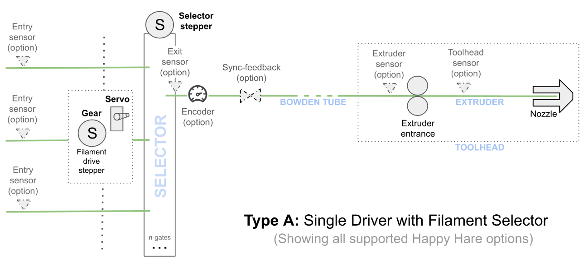
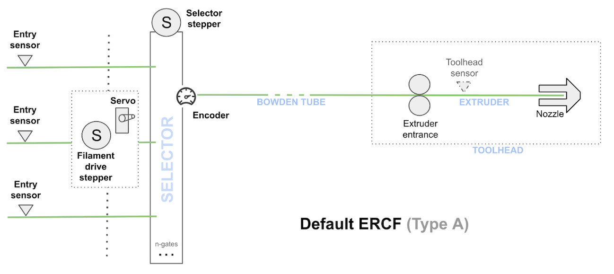
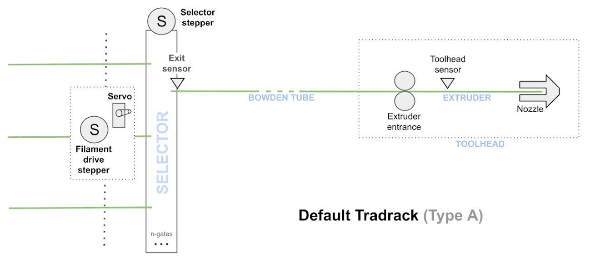
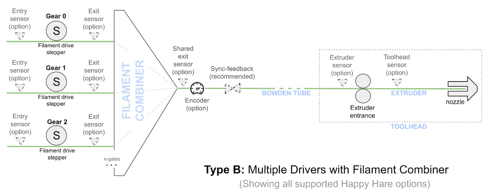
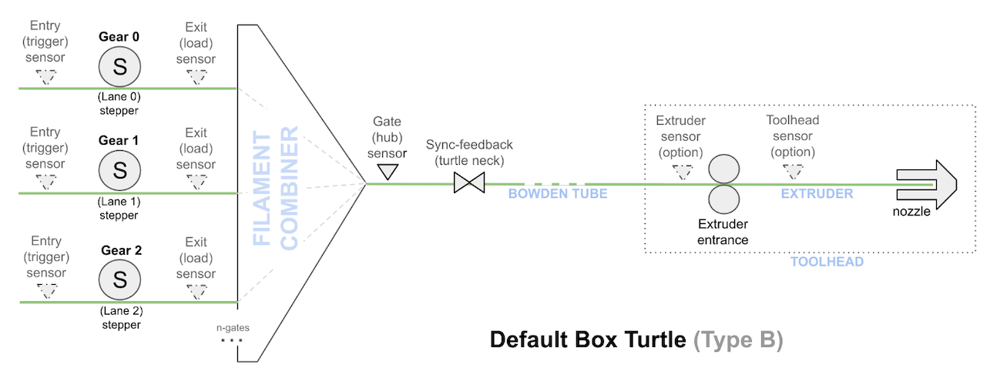
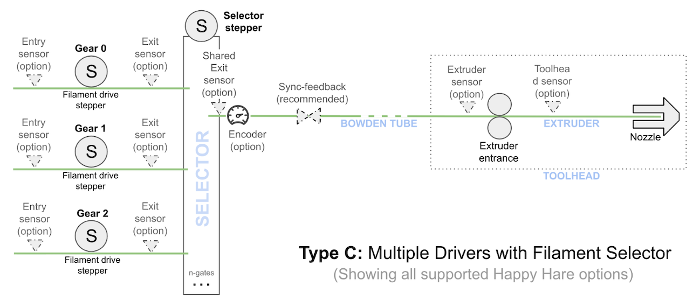

# Conceptual: What is an MMU?

## Terminology

**MMU** - "Multi-Material Unit", a term first coined by Prusa Research, used
generically for any extension to a 3D printer that allows a single extruder
to print with more than one filament. Other names for the same idea exist -
`AFC` (Automatic Filament Changer), `AMS` (Automatic Material System) - Happy
Hare uses MMU throughout regardless of what a given vendor calls their design.

**Gate** - often called a **"Lane"** or **"Slot"**, a gate is where one filament
sits when it isn't loaded into the printer. Happy Hare numbers gates from 0.

**Gear stepper** - sometimes called the **"filament drive stepper"** or
**"MMU extruder stepper"**, this is whichever stepper(s) that actually push or
pull filament through the MMU. Once filament reaches the extruder, the gear stepper
is typically synced to the extruder stepper to double the driving force and
overcome the extra friction the MMU's filament path adds.

**Selector** - the mechanism that brings a chosen gate's filament in line with
the gear stepper (or the gear stepper in line with a chosen gate, depending on
the design). See [Selector mechanisms](#selector-mechanisms) below - this is
the one piece of hardware that genuinely varies between MMU families. It is
important to note that Type-B designs have multiple Gear steppers and so "select"
by simply switching with gear stepper is driven.

**Filament (catchment) buffer** - a mechanism that catches and manages the
loose filament ejected by the MMU when it unloads, so it can be reloaded
again (often at higher speed) without tangling. Takes many physical forms: a
loop-catchment slot, a coiling wheel, a passive spool-rewinding device, or an
active DC-motor-driven eSpooler. See the
[eSpooler feature page](Feature-Espooler.md) for the active variant.

**Combiner / Splitter** aka "Hub" - on gear-per-gate designs, the physical manifold
that merges every gate's individual bowden into the one tube feeding the
toolhead. Used interchangeably with "splitter" even though nothing is
actually being split. This is purely a description of physical hardware -
Happy Hare has no software concept of a combiner, and doesn't do anything
special to coordinate access to one. Note that multiple MMU units can
be connected to the same printer with additional splitters in the bowden path.

**Sync-feedback buffer**—sometimes incorporated within a splitter and called a
"Hub" or just a **”Buffer”** casually, which can be a bit confusing: this is a 
sensor that detects tension or compression across the filament path and is used
to keep the gear and extruder steppers synchronized so they don't fight each other. 
Sensor designs typically incorporate a few millimeters of filament slack which
is where the “buffer” nickname / term comes from. However, it's job is to sense 
tension/compression, not buffering or catching loose filament. Happy Hare exposes
this as `sync_feedback_state` (`compressed`/`expanded`/`neutral`/`disabled`)
in [Printer Variables](Reference-Printer-Variables.md#printermmu) and reuses it to
drive [FlowGuard](Feature-FlowGuard.md) and tangle-prevention. 
Recent advancements have seen new sensors introduced that use an analog 
interface (ADC) to provide proportional, real-time positional telemetry to
_actively_ manage filament tension and compression. These are the **ultimate**
sensor design and are fully supported by Happy Hare.

## Selector mechanisms

Every MMU needs *some* way to engage filament and the gear stepper for a gate. 
How that's achieved splits designs into a few families. Happy
Hare introduced and uses informal shorthand for the three main types - "Type-A",
"Type-B", "Type-C" - which the community has embraced:

!!! tip
    The diagrams below show every optional sensor a design *could* have, not
    what any one build necessarily does.

### Shared gear stepper, moving selector ("Type-A")

One gear stepper is shared across every gate, and a separate selector mechanism
moves to line up with the chosen gate. This is the most common approach today,
because it scales to a large number of gates cheaply - ERCF and Annex
Tradrack both work this way. The actual moving mechanism varies by design: a
linear carriage, one index switch per gate, a rotary carriage, or a
servo-driven arm.

  

**Trade-offs:** cost-effective for a large number of gates, straightforward
bypass support, scales well - but the moving selector itself needs a
higher-quality build and tends to require more tuning/troubleshooting than a
gear-per-gate design.

**Examples:**

  
  

ERCF relies on the encoder exclusively for gate homing and move validation;
Tradrack uses a shared exit sensor as it's reference point instead, with an encoder
as an optional add-on.

### Gear-per-gate, no moving selector ("Type-B")

Every gate has it's own dedicated gear stepper, so there's no mechanism to
move at all - popularized by Bambu Lab's AMS, with open-source designs like
Box Turtle, Night Owl, Angry Beaver, 3MS, Quattro Box, KMS and EMU all working
the same way. The trade-off is efficiency for scale: adding gates means
adding motors and drivers, so these designs are usually capped around 4
gates per unit before the electronics get unwieldy. A physical combiner
merges every gate's bowden into one feed to the toolhead (see
[Terminology](#terminology) above).

  

**Trade-offs:** easy to build, needs less tuning - but a more costly build
per gate, generally capped at a handful of gates, and bypass support is
harder to arrange than on a Type-A design. Multiple Type-B units can still be
combined into one Happy Hare machine to get past the per-unit gate cap - see
[Multi-unit machines](#multi-unit-machines) below - Happy Hare just doesn't
coordinate two *combiners* on the same bowden path, since that's not
something it models.

**Example:**

  

### Gear-per-gate *and* a moving selector ("Type-C")

A hybrid: every gate has it's own gear stepper (as in Type-B), *and* there's
still a physical carriage that moves to line the selected gate up with the
extruder path (as in Type-A).

  

No vendor defaults to this yet, but it's available as a manual selection for
a custom MMU, and would in principle combine Type-B's per-gate driving force
with Type-A's more forgiving gate-count scaling, at the cost of needing both
a selector *and* a full set of gear motors.

### Fully custom, no built-in mechanism

A design can also skip Happy Hare's built-in selector mechanisms entirely and
implement gate selection with it's own gcode macros - for hardware that
doesn't fit any of the patterns above.

### Which vendors use which mechanism

| Vendor / type | Mechanism family | Informal type |
|---|---|---|
| ERCF | Shared gear stepper, moving carriage + servo grip | Type-A |
| Tradrack | Shared gear stepper, moving carriage + servo grip | Type-A |
| BTT ViViD | Shared gear stepper, one index switch per gate | Type-A |
| 3D Chameleon | Shared gear stepper, rotary carriage | Type-A |
| MMX / PicoMMU | Shared gear stepper, servo-driven selection | Type-A |
| MMX6 / Low Rider | Shared gear stepper, rotary carriage | Type-A |
| HTLF | Shared gear stepper, rotary cam selector | Type-A |
| Box Turtle, Night Owl, Angry Beaver, 3MS, Quattro Box, KMS, EMU | Gear-per-gate, no moving selector | Type-B |
| *(custom MMU only)* | Gear-per-gate + moving carriage | Type-C |
| *(custom MMU only)* | Fully custom, gcode-macro-driven | - |

See [Code Layout](Dev-Code-Layout.md#selector-hierarchy) for the exact class
each of these maps to in the code, if you're extending Happy Hare rather than
just choosing a vendor in menuconfig.

## Multi-unit machines

A **Unit** is one physical MMU device - one Box Turtle, one ERCF, and so on.
A **Machine** is the logical combination of one or more units, managed by
Happy Hare as a single MMU.

Units in one machine don't have to match - Happy Hare ships a real tested
configuration combining an ERCF unit (9 gates, moving-carriage selector) with
a BTT ViViD unit (4 gates, indexed-switch selector) on the same printer, 13
gates in total. Gates are numbered contiguously across every unit in the
machine (the ERCF unit owns gates 0-8, the ViViD unit owns gates 9-12 in that
example) rather than restarting per unit, and a single logical tool (`T0`,
`T1`, ...) can map to a gate on *any* unit - crossing from one unit to
another mid-toolchange is a normal, handled case, not a special one. The one
real constraint across units: at most one unit in a machine may expose a
selectable bypass gate. Of course no selectable bypass is required - it can
simple be an alternative filament feed path and in this case selection is
simply the disabling to MMU filament movement.

## Supported sensors

Every sensor below is optional - every design needs as a minimum, a way to
establish a homing point near the gate (for parking) and another near or in
the extruder (for accurate loading). Which specific sensors provide that
varies by design and budget.

!!! tip
    If you're coming from the older wiki: the "pre-gate" sensor is now
    called the **entry** sensor, and the "gate"/"post-gear" sensor is now
    called the **exit** sensor. Same purpose, new names.

| Sensor | Purpose |
|---|---|
| Entry sensor (per gate) | Detects filament arriving at/leaving each gate. Drives filament autoload (selector moves to a gate as soon as filament is inserted), keeps the gate-availability map current, and can act as an early runout trigger. |
| Exit sensor (per gate) | Sits after the gear stepper on each gate. It provides a homing point close to the MMU once a gate is selected. It can also trigger runout on that gate. |
| Shared Exit sensor | Sits after combiner (shared, one per unit) typically on the exit of the "Hub". Provides a homing point close to the MMU once a gate is selected and driving, and can also trigger runout. |
| Encoder | Measures filament movement for move validation and clog detection, and can substitute for (or combine with) the exit sensor as a homing reference. Some designs (ERCF) rely on it exclusively; others (Tradrack) treat it as optional extra reliability on top of a shared exit sensor. |
| Sync-feedback sensors (compression / tension / proportional) | Inline in the bowden between the MMU and printer. Commonly called a "Buffer". The sensor(s) detect the gear stepper and extruder pulling against each other, for stepper syncing. The compression sensor can also serve as an extruder-entry homing point and simplify bowden-length calibration. A modern proportional (analog) design alleviates the need for extruder entry and even toolhead sensors as well allowing filament tension/compression management and [FlowGuard](Feature-FlowGuard.md) - **Highly recommended** |
| Extruder entry sensor | Sits just before the extruder gears. Provides a homing point at the end of the bowden move, can trigger automatic bypass loading, and gives a reliable "cleared  extruder" reference point before a fast unload. |
| Toolhead sensor | Sits after the extruder entrance, before the hotend - arguably the single most useful sensor: the most reliable way to know filament is actually loaded (especially after a restart), the most accurate homing point near the nozzle, and what toolhead calibration uses to measure residual filament. |
| Stallguard-based virtual sensors | If the relevant stepper has TMC stallguard configured, Happy Hare can detect a mechanical stall as a virtual endstop with no extra wiring: on the gear stepper (an alternative way to detect hitting the extruder entrance), or on the extruder stepper itself (experimental nozzle-collision detection). |
| Selector sensors | A physical switch for selector homing, plus an optional stallguard-based selector endstop used for touch-positioning, blocked-gate recovery, and travel-limit detection during calibration. |
| NFC/RFID reader (per gate) | Reads a tag on the spool and can also act as a "tag detected" homing endstop during a gear move. |

!!! note
    Virtual versions of some of these sensors can be setup when using hall-effect sensors such as filament diameter monitor on the extruder entrance for Qidi printers. Notes on the setup of these are present in the config files but it is often easier to sk on the [Happy Hare Discord](https://discord.gg/98TYYUf6f2) forum.

## EndlessSpool

If a gate runs out of filament (detected by an entry sensor, exit sensor, or the
encoder), and EndlessSpool is enabled, Happy Hare unloads, remaps the current
tool to another gate in the same configured group, reloads, and resumes the
print automatically - the potentially-kinked filament at the spool end never
has to pass back through the MMU's own mechanisms, which is what makes this
more reliable than reacting to a `nozzle-side` runout.

!!! warning "Important"
    EndlessSpool does nothing until you actually configure
    `endless_spool_groups` - left at it's default, every gate is it's own
    group of one, so there's never an alternative gate to fall back to and
    a runout always ends in an error instead. Group gates loaded with the
    same filament together, e.g. two gates both holding black PLA.

## What would the ideal MMU look like?

Speculating a little: the strongest design hasn't been built yet, and would
probably be a Type-C hybrid - a dedicated, direct-drive gear stepper per gate
for speed, a small-travel linear selector (a few mm per gate, no servo) so
gate count isn't limited by selector complexity, sync-feedback and an exit
sensor built into the selector itself, and a passive (not active-DC) filament
buffer for simplicity. Add a shared spool-identification reader (RFID/NFC or
QR), pre-gate sensors on every gate for automatic loading, a bypass gate with
no gear stepper for manual/"+1" use, and a toolhead purpose-built for MMU
printing - integrated cutter and toolhead sensor, easy unclogging. Skip
post-gear sensors, encoders, active DC-rewinders and selector servos
entirely - each is a maintenance/reliability cost that the rest of the design
above doesn't need.

Happy Hare already has [FlowGuard](Feature-FlowGuard.md) and
tangle-prevention built on top of sync-feedback, which covers a good part of
what this wishlist needs from an integrated sensor - the mechanical side (a
hybrid Type-C build with a small selector and passive buffer) is still the
part nobody's shipped yet. When someone does, Happy Hare is already ready
to support it.

## See also

- [Feature: eSpooler](Feature-Espooler.md) - the active filament-buffer variant
- [Feature: FlowGuard](Feature-FlowGuard.md)
- [Printer Variables](Reference-Printer-Variables.md#printermmu) - `sync_feedback_state`,
  FlowGuard and tangle-prevention fields
- [Printer Variables: `printer.mmu_machine`](Reference-Printer-Variables.md#printermmu_machine) -
  the multi-unit aggregation object
- [Code Layout: Selector hierarchy](Dev-Code-Layout.md#selector-hierarchy) -
  the real class hierarchy behind this page's mechanism families
- [Getting Started: Box Turtle](GettingStarted-BoxTurtle.md) - a concrete
  Type-B setup walkthrough

---
