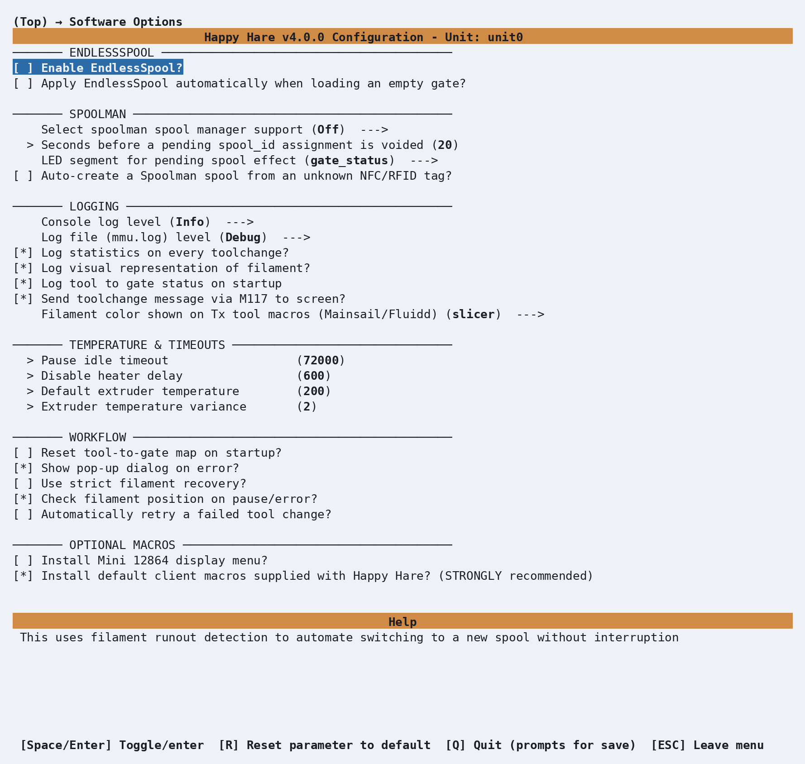

# Feature: EndlessSpool & Runout Detection

## Concept

A "runout" is Happy Hare noticing that filament has stopped where it's
expected to be present - detected by whichever switch sensors sit along the
filament path (a gate or entry sensor going from triggered to open), and/or
an encoder if one is fitted. Before doing anything about it, Happy Hare
settles a genuinely important question: is the filament actually *gone*
(a runout), or still physically present but stuck (a **clog** or
**tangle**)? If the switch sensors alone can't answer that - no entry sensor
fitted, for example - and an encoder is available, Happy Hare gives the gear
motor a brief, gentle nudge and watches whether the encoder sees any
movement before concluding either way.

That distinction decides what happens next:

- **Clog or tangle** - always pauses the print for manual intervention.
  EndlessSpool has nothing to do with this case; a stuck filament isn't
  something swapping to a different gate can fix.
- **Genuine runout, EndlessSpool off** (the default) - also pauses, exactly
  like a clog. You replace or splice the filament and resume by hand.
- **Genuine runout, EndlessSpool on** - Happy Hare marks the empty gate as
  such, finds another gate in the same **group** that isn't already known to
  be empty, remaps the current tool to it, and continues printing
  automatically. No pause at all.

A "group" is just every gate loaded with the same filament (typically the
same color and material, on separate spools) - EndlessSpool cycles through
a group's gates in order, skipping any it already knows are empty, and gives
up (falling back to a pause) only once every gate in the group has been
tried. The same mechanism can also apply at the *start* of a load rather than
mid-print: with **apply automatically when loading an empty gate** enabled,
asking for a tool on a gate Happy Hare already knows is empty triggers the
same group lookup immediately, instead of erroring.

## Hardware Setup

Nothing to wire specifically for this feature - it's built entirely on
sensors your MMU design already provides (gate or entry sensors) and/or an
encoder, both covered on their own pages. Use
[`MMU_SENSORS`](Reference-Commands.md#mmu_sensors) to check what's currently
fitted and active.

## Parameter Setup

Two checkboxes live under **Software Options** in menuconfig:

<p align="center">
  
</p>

Both default **off**. They set two plain settings in `mmu.cfg`, alongside two
more that only a hand-edit reaches:

```ini
endless_spool_enabled    : 0    # 0 = disable, 1 = enable EndlessSpool
endless_spool_on_load    : 0    # 0 = don't apply on load, 1 = run EndlessSpool if the gate is empty
endless_spool_eject_gate : -1   # Which gate to eject filament remains to. -1 = current gate
endless_spool_groups     :      # Group membership per gate, comma-separated (blank = no groups defined)
```

`endless_spool_groups` is easier to manage from the console than by hand -
see [Commands](#commands) below. `endless_spool_eject_gate` lets a design
with a moving selector send the leftover filament fragment somewhere other
than back through the gate it just came from - useful if your buffer design
tends to let that fragment drift into a neighboring gate's buffer and
tangle it. Set it to the gate number you want to use (it must be `1` or
higher - `0` isn't accepted here, so gate 0 can't be the designated waste
gate). Two things worth knowing before turning it on:

!!! warning "Important"
    Selecting a waste gate this way disables entry-sensor runout detection
    for that specific gate, because the filament fragment now needs to pass
    *completely* through the gate before the selector is free to move away
    from it - an entry sensor watching that gate would otherwise never see
    it clear. This trade-off is scoped to the waste gate itself, not every
    gate.

It also assumes a selector that can be commanded to visit an arbitrary gate
on demand - a design with no moving selector, or one where reaching a
specific gate independent of the print isn't practical, generally won't
benefit from this option.

## Commands

Full parameter reference: [`MMU_ENDLESS_SPOOL`](Reference-Commands.md#mmu_endless_spool).

```text
MMU_ENDLESS_SPOOL                     # Report current status and groups
MMU_ENDLESS_SPOOL GROUPS=1,1,2,2      # Gates 0+1 share a group, gates 2+3 share another
MMU_ENDLESS_SPOOL RESET=1             # Back to the default grouping (normally one gate per group)
MMU_ENDLESS_SPOOL ENABLE=0 QUIET=1    # Turn EndlessSpool off without any console/log output
```

```{.text .console-command}
MMU_ENDLESS_SPOOL
```

```{.text .console-output}
EndlessSpool is enabled
EndlessSpool Groups:
Group A: Gates: 0, 3, 6
Group B: Gates: 1, 4, 7
Group C: Gates: 2, 5, 8
```

Groups are numbered when you set them (`GROUPS=0,1,2,1,...`) but reported
back lettered (`Group A`, `Group B`, ...) - group `0` is `A`, group `1` is
`B`, and so on. `GROUPS=` must list exactly one entry per gate; anything
else is rejected with an error rather than partially applied.

**A worked cycle**: with the `Group A: Gates: 0, 3, 6` grouping above, `T0`
mapped to gate 0, and gate 3 already known empty from an earlier runout,
gate 0 running dry mid-print produces:

```{.text .console-output}
Gate 0 is empty! Checking for alternative gates for T0 in EndlessSpool Group A (checked gates: 3,6)
Remapping T0 to gate 6
```

The search always starts from the gate that just ran out and walks forward
through the rest of the group, wrapping around - gate 3 is skipped because
it's already marked empty, and gate 6 is the first one found that isn't. If
every other gate in the group is also empty, the print pauses instead
(same as EndlessSpool being off):

```{.text .console-output}
Gate 0 is empty!
No alternatives gates available after checking for T0 in EndlessSpool Group A (checked gates: 3,6)
```

To rehearse the whole thing without an actual runout, use
[`MMU_TEST_RUNOUT`](Reference-Commands.md#mmu_test_runout):

```text
MMU_TEST_RUNOUT            # Simulate a runout - triggers EndlessSpool if enabled
MMU_TEST_RUNOUT TYPE=clog  # Simulate a clog/tangle instead - always pauses
```

## Printer variables exposed

| Variable | Meaning |
|---|---|
| [`endless_spool_enabled`](Reference-Printer-Variables.md#gate-and-tool-maps) | `0` off, `1` on |
| [`endless_spool_groups`](Reference-Printer-Variables.md#gate-and-tool-maps) | Group membership per gate |
| [`gate_status`](Reference-Printer-Variables.md#gate-and-tool-maps) | Per-gate empty/available state - what a runout actually updates |

The deprecated `endless_spool` variable (under the gate-map group) still
works for now since KlipperScreen and the Mainsail/Fluidd interfaces still
read it, but new macros should use `endless_spool_enabled` instead.

## Tuning

- **Set up groups before you need them, not during a print.** Work out which
  gates share the same filament (color and material) and assign them the
  same group number with `MMU_ENDLESS_SPOOL GROUPS=...` - a gate with no
  match of its own should get a group number no other gate shares.
- **Rehearse with `MMU_TEST_RUNOUT` first.** It exercises the exact same
  group lookup and gate remap a real runout would, without needing to
  actually run a spool dry - a good way to confirm your groups are set up the
  way you think they are.
- **Consider `endless_spool_on_load` alongside the mid-print behavior.**
  It's the same mechanism applied to a manual or macro-driven tool change
  onto a gate you already know is empty, so the two settings are usually
  worth enabling together.
- **Only reach for a designated waste gate if you have a real tangling
  problem.** It's a fix for a specific buffer-crowding symptom, not a
  default-on best practice - the trade-off in the warning above applies
  permanently to whichever gate you pick.

## Troubleshooting

- **A runout pauses instead of continuing, even with EndlessSpool on** - most
  likely every other gate in that group is already marked empty (check
  [`gate_status`](Reference-Printer-Variables.md#gate-and-tool-maps) or `MMU_GATE_MAP`),
  or the gate that ran out isn't actually assigned to a group with any other
  member. A group of one gate can never have an alternative to fall back to.
- **A stuck-filament situation isn't being handled by EndlessSpool** - this
  is expected. Clogs and tangles always pause for manual intervention;
  EndlessSpool only ever acts on a confirmed runout.
- **Runout isn't detected at all** - check
  [`MMU_SENSORS`](Reference-Commands.md#mmu_sensors) to confirm the relevant
  sensor is actually active, not disabled. Conversely, a sensor that's
  become flaky and is firing false runouts can be disabled on its own
  without losing runout detection everywhere else - see
  [Feature: Sensors](Feature-Sensors.md#tuning).
- **`GROUPS=` was rejected** - it needs exactly one comma-separated,
  non-negative integer per gate; a mismatched count or a stray character
  fails the whole command rather than applying part of it.

## See also

- [Command Reference: `MMU_ENDLESS_SPOOL`](Reference-Commands.md#mmu_endless_spool)
- [Command Reference: `MMU_TEST_RUNOUT`](Reference-Commands.md#mmu_test_runout)
- [Command Reference: `MMU_SENSORS`](Reference-Commands.md#mmu_sensors)
- [Printer Variables: gate and tool maps](Reference-Printer-Variables.md#gate-and-tool-maps)
- [Feature: Sensors](Feature-Sensors.md) - naming/addressing, querying, and enabling/disabling any sensor at runtime

---
