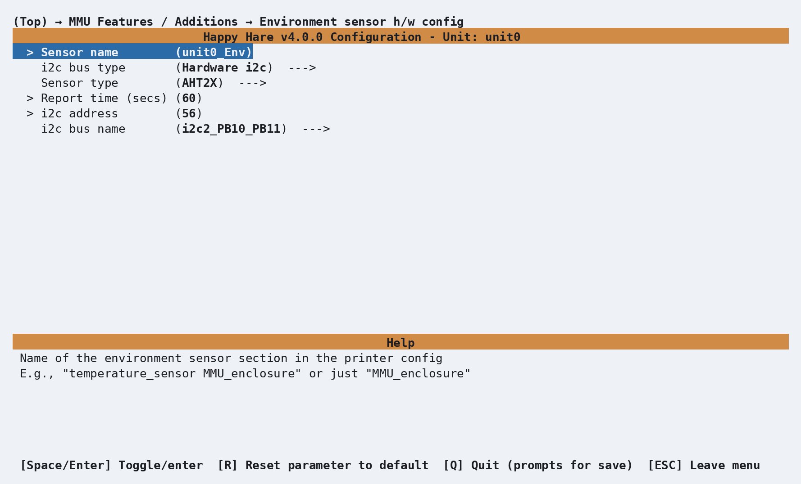
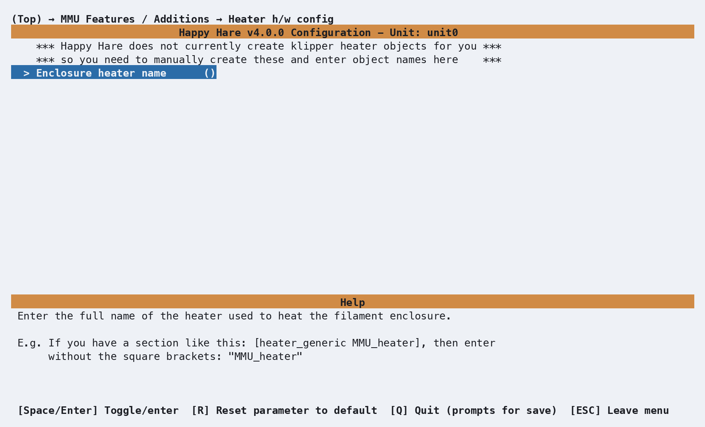

# Feature: Environment Manager

## Concept

The Environment Manager turns an enclosed MMU into a filament dryer. It pairs
a humidity/temperature sensor with one or more heaters and runs a managed
**drying cycle**: pick a target temperature and time (or let Happy Hare
recommend both from the filament types already loaded), and it heats,
tracks progress, and shuts itself off - optionally venting warm humid air
partway through, and gently rotating spools if an eSpooler is fitted so a
respooled filament end doesn't just sit against one hot side of the spool
the whole time.

Two hardware layouts are supported:

- **Single heater / shared enclosure** - one heater and one environment
  sensor for the whole enclosure. This is the common case, and everything on
  this page defaults to it.
- **Per-gate heaters** - each gate has its own heater and sensor (for
  example, the modular EMU design, where every gate is its own small
  enclosure). A basic power-management queue limits how many heaters run
  simultaneously so you don't trip a PSU. Configuring both a single
  heater/sensor and per-gate lists at the same time is a config error - pick
  one.

!!! warning
    A drying cycle can keep a heater powered for hours. Build and wire the
    enclosure with that in mind, and don't leave it unattended for the first
    few cycles until you're confident nothing is misbehaving.

## Hardware Setup

Both pieces are enabled under **MMU Features / Additions**, and each gets its
own config submenu once switched on.

### Environment sensor

<p align="center">
  
</p>

| Setting | Purpose |
|---|---|
| `Sensor name` | Klipper object name - defaults to `<unit>_Env` |
| `i2c bus type` | Hardware i2c (recommended) or software i2c |
| `Sensor type` | AHT1X / AHT2X / AHT3X (humidity + temperature) or BME280 (humidity + temperature + pressure) |
| `i2c bus name` | Which hardware i2c bus to use, if hardware i2c is selected |
| `i2c address` | Defaults to `56` (`0x38`) for AHT sensors, `118` (`0x76`) for BME280 |
| SCL/SDA pins | Only shown for software i2c |

Produces, inside the unit's `[mmu_unit ...]` section in `mmu_hardware.cfg`:

```ini
environment_sensor : temperature_sensor unit0_Env
```

A per-gate design (`MMU_HAS_PER_GATE_ENV_SENSORS`, only available on
hardware with a per-gate MCU) repeats the same prompts once per gate instead,
and produces a comma-separated list:

```ini
environment_sensors : temperature_sensor unit0_Env0, temperature_sensor unit0_Env1, ...
```

### Heater(s)

<p align="center">
  
</p>

| Setting | Purpose |
|---|---|
| `Per-gate Heaters?` | Switches to the per-gate layout described above |
| `Enclosure heater name` | Klipper object name for the single shared heater |
| `List of enclosure heaters` | Comma-separated heater names, per-gate layout only |
| `Maximum concurrent heaters` | Power-management cap, per-gate layout only |

Produces, alongside the sensor key in the same `[mmu_unit ...]` section:

```ini
filament_heater : heater_generic unit0_heater
```

or, per-gate:

```ini
filament_heaters       : heater_generic unit0_heater0, heater_generic unit0_heater1, ...
max_concurrent_heaters : 1
```

!!! warning "Important"
    Configure only a single heater/sensor pair, or a per-gate list - not
    both. Configuring both is a config error.

## Parameter Setup

The heater controller's own tuning constants live in `mmu_parameters.cfg`,
alongside the drying-recipe table:

```ini
heater_max_temp             : 65     # Absolute ceiling; drying never targets above this regardless of drying_data
heater_default_dry_temp     : 45     # Fallback drying temperature for an unrecognized or empty gate
heater_default_dry_time     : 300    # Fallback drying time in minutes
heater_default_dry_humidity : 25     # Default humidity % goal - drying ends early if reached
heater_vent_macro           : _MMU_VENT  # Name of a macro to call periodically during drying (see Tuning below)
heater_vent_interval        : 0      # Minutes between vent-macro calls, 0 = disabled
heater_rotate_interval      : 5      # Minutes between spool-rotation bursts, requires eSpooler and explicit GATES

drying_data : { 'pla': (45, 300), 'pla+': (55, 300), 'petg': (60, 300), 'tpu': (55, 300), 'abs': (70, 300),
                'abs+': (75, 300), 'asa': (65, 300), 'nylon': (75, 600), 'pc': (75, 600), 'pva': (75, 600),
                'hips': (75, 600) }
```

`drying_data` maps a material name (matched case-insensitively) to
`(temperature_C, time_minutes)`. Starting a drying cycle without an explicit
`TEMP`/`TIMER` looks up each selected gate's assigned material here and uses
the lowest recommended temperature and longest recommended time across them,
capped at `heater_max_temp`; a gate with no material assigned, or that's
empty, falls back to `heater_default_dry_temp`/`heater_default_dry_time`.
Extend the table with your own materials freely - it's a plain dict, and
`MMU_HEATER DRYING_DATA=1` dumps whatever is currently configured. A
smaller, illustrative table showing just the shape of it:

```ini
drying_data: "{'PLA': (45, 240), 'PETG': (55, 300), 'NYLON': (65, 480)}"
```

- Values are `(temperature_C, time_minutes)`.
- A material missing from the table falls back to `heater_default_dry_temp`
  and `heater_default_dry_time`, same as an unrecognized material would.

## Commands

```text
MMU_HEATER                                     # Status report - heater state, or drying cycle progress
MMU_HEATER TEMP=50                             # Set/adjust heater temperature directly
MMU_HEATER DRY=1                               # Start a drying cycle, temp/time recommended from drying_data
MMU_HEATER DRY=1 TEMP=50 TIMER=240 HUMIDITY=12  # ...or override any of them
MMU_HEATER STOP=1                              # Stop the current drying cycle (or turn the heater off)
MMU_HEATER DRYING_DATA=1                       # List the configured drying-data table
```

Full parameter reference: [`MMU_HEATER`](Reference-Commands.md#mmu_heater).

!!! warning "Important"
    `MMU_HEATER TEMP=50` outside a drying cycle sets the heater directly and
    has no automatic timeout - it stays at that temperature until you turn it
    off yourself with `MMU_HEATER TEMP=0` or `MMU_HEATER STOP=1`. Prefer
    `DRY=1` for anything you intend to walk away from.

With per-gate heaters, everything above takes a `GATES=` list (defaulting to
all non-empty gates if omitted):

```text
MMU_HEATER DRY=1 GATES=0,2,3       # Dry only these gates (subject to the concurrency cap)
MMU_HEATER TEMP=45 GATES=0,1       # Raw heater control for specific gates
MMU_HEATER STOP=1 GATES=1,3        # Cancel only these gates, leaving the rest of the cycle running
```

If more gates are selected than `max_concurrent_heaters` allows, the extra
gates queue and start automatically as active ones finish - the overall
cycle can take longer than any single gate's own timer as a result.
`TEMP=` on a gate behaves according to that gate's current state: queued -
only the stored target changes, the heater doesn't turn on yet; active - the
heater updates immediately; not part of the current cycle - it's just set
immediately, same as raw single-heater control.

`MMU_HEATER STOP=1 GATES=1,3` cancelling only some gates behaves according
to each gate's current state too: an **active** gate has its heater turned
off immediately and is marked done; a **queued** gate is simply removed
from the queue and marked done, without ever having its heater turned on.
If cancelling leaves no gates still running or queued, the overall drying
cycle ends automatically.

A plain `MMU_HEATER` with no drying cycle running just reports that:

```{.text .console-command}
MMU_HEATER
```

```{.text .console-output}
Not in drying cycle and heater is off
```

A status report while drying looks like this (single-heater mode):

```{.text .console-output}
MMU is in filament drying cycle:
Drying filaments in gates: 1,2,6,7
Cycle time: 4 hours (remaining: 3 hours 46 minutes)
Target humidity: 25.0% (current: 63.6%)
Drying temp: 55.0°C (current: 48.3°C)
Venting operational (running macro _MMU_VENT every 15 minutes, next in 11 minutes)
Spool rotation enabled (running every 5 minutes, next in <1 minute)
```

or, per-gate:

```{.text .console-output}
MMU is in filament drying cycle:
Drying filaments in gates: 1,2,5,6,7,8
Per-gate dryer mode (max concurrent heaters: 3). Humidty target 25.0%
Gate 1: (timer complete, final humidity: 22.3%)
Gate 2: Drying ABS 27.3°C (target 65.0°C), humidity 62.9%, 1 hour 1 minute remaining
Gate 5: Drying PLA 27.3°C (target 45.0°C), humidity 63.1%, 1 hour 1 minute remaining
Gate 6: Drying PETG 27.3°C (target 55.0°C), humidity 63.6%, 13 minutes remaining
Gate 7: (queued waiting for heater slot, target 45.0°C)
Gate 8: (queued waiting for heater slot, target 65.0°C)
```

## Printer variables exposed

`drying_state` - a per-gate list of `''` \| `queued` \| `active` \| `complete`
\| `canceled`. See
[Per-gate arrays merged across every unit](Reference-Printer-Variables.md#per-gate-arrays-merged-across-every-unit)
in the printer variable reference.

## Tuning

### Venting

A vent macro runs periodically **only while a drying cycle is active**, to
flush warm humid air from the enclosure and speed up drying. Many designs
have a passive vent; some use a servo-actuated flap and an extraction fan -
the macro is entirely up to you. Set `heater_vent_macro` and
`heater_vent_interval` (minutes, `0` disables it), or override the interval
for a single cycle with `MMU_HEATER DRY=1 VENT_INTERVAL=10`. The macro should
open the vent and queue its own delayed close rather than blocking with
`M400` - a ready-to-adapt skeleton using `delayed_gcode` for exactly that
ships as `_MMU_VENT` in `config/macros/mmu_heater_vent.cfg`. In per-gate
mode, the macro is called with `GATES=<currently active gates>`; in
single-heater mode it's called with no arguments. The shipped skeleton looks
like this:

```ini
[gcode_macro _MMU_VENT]
description: Simple reference MMU enclosure venting control

gcode:
    

    

        MMU_LOG MSG="Opening MMU vent..."
        # Add logic to operate servo to open vent here, perhaps also turn on/up extraction fan

    

        MMU_LOG MSG="Opening MMU vent to dry filaments in gates: {", ".join(gates)}..."
        
            # Open vent servo_{gate}
        

    

    # Close the vent after 10 seconds
    UPDATE_DELAYED_GCODE ID=_MMU_VENT_CLOSE DURATION=10


[delayed_gcode _MMU_VENT_CLOSE]
gcode:
    MMU_LOG MSG="Closing MMU vent..."
    # Add logic to operate servo to close vent here, perhaps also turn off/down extraction fan
```

The `delayed_gcode`/`UPDATE_DELAYED_GCODE` pairing is the point of the
example: it lets the macro return immediately after opening the vent
instead of blocking the toolhead with `M400` while it waits to close again.

### Spool rotation

If an eSpooler is fitted, a drying cycle can periodically nudge each spool a
short distance in the rewind direction - just enough to stop a respooled
filament end from baking against one point of contact for hours. Start it
with `MMU_HEATER DRY=1 ROTATE=1 GATES=1,3` - `GATES` must be given explicitly
whenever `ROTATE=1` is used. Rotation only actually happens for gates that
are genuinely **empty** at the moment the timer fires (filament removed from
the MMU inlet and secured to the spool) - Happy Hare re-checks this every
`heater_rotate_interval` minutes rather than only once at the start, so you
can safely unload a gate and secure it mid-cycle. If a gate passed to
`GATES=` isn't empty yet when the cycle starts, Happy Hare warns about it
immediately rather than staying silent until the first rotation tick -
drying still proceeds normally, since a loaded gate simply can't rotate
until it's cleared. It uses exactly the same
power and duration as an ordinary
[rewind burst](Feature-Espooler.md#in-print-bursts-two-independent-trigger-sources)
(`espooler_rewind_burst_power`/`espooler_rewind_burst_duration`) - there's no
separate "rotate" setting to tune.

### Choosing a temperature/time by hand

If your slicer's filament isn't in `drying_data`, either add an entry (it's
a plain dict you can extend) or pass `TEMP=`/`TIMER=` explicitly for that
cycle. `HUMIDITY=` ends a cycle as soon as the sensor reports at or below the
target, which is usually a better stopping point than a fixed timer if your
sensor supports humidity at all.

## Troubleshooting

- **Humidity always reports as missing** - the sensor chip may not support
  humidity (some report temperature only), or the humidity reading isn't
  recognized. Drying still runs on the timer; humidity-based early
  termination just won't trigger.
- **Venting never runs** - `heater_vent_macro` is blank, or
  `heater_vent_interval` is `0`. If it's configured and still not firing,
  check the console and log for macro errors.
- **Drying takes longer than expected in per-gate mode** - gates queue when
  `max_concurrent_heaters` is smaller than the number of gates you asked for;
  total wall-clock time is the sum of each queued gate's own timer, not the
  longest one.
- **Rotation never happens** - eSpooler isn't fitted, `ROTATE=1` wasn't
  specified, or the gate genuinely wasn't empty (filament end secured to the
  spool) at the moment a rotation was due.
- **`No MMU heater configured` error** - `filament_heater`/`filament_heaters`
  is empty; the manager needs at least one heater object configured before
  `MMU_HEATER` will do anything.

## See also

- [Command Reference: `MMU_HEATER`](Reference-Commands.md#mmu_heater)
- [Feature: eSpooler](Feature-Espooler.md) - the mechanism spool rotation
  reuses
- [Printer Variables: per-gate arrays](Reference-Printer-Variables.md#per-gate-arrays-merged-across-every-unit)
  for the `drying_state` field

---
