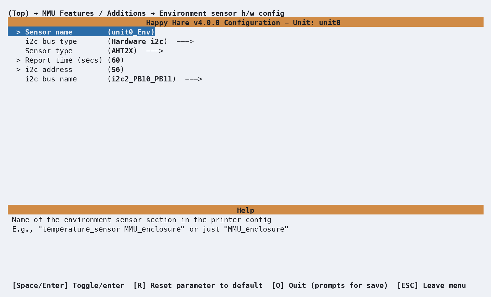
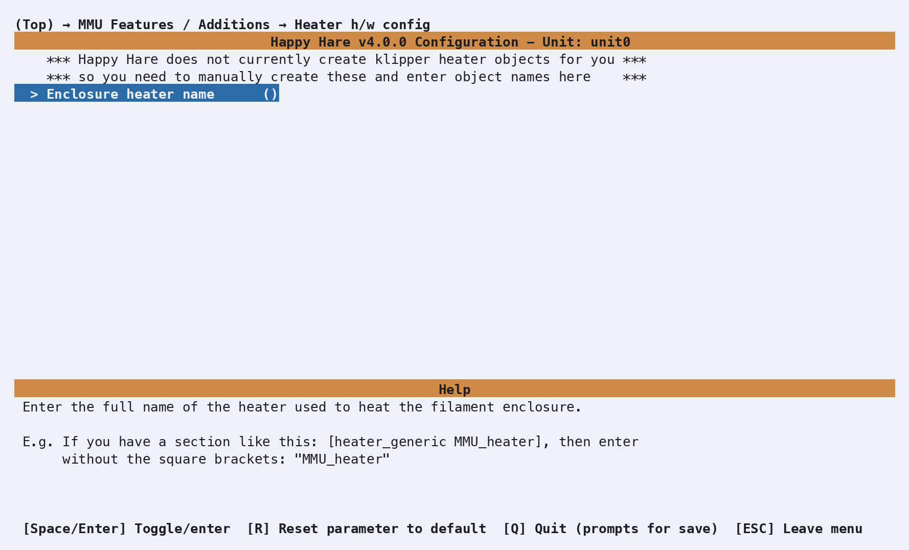
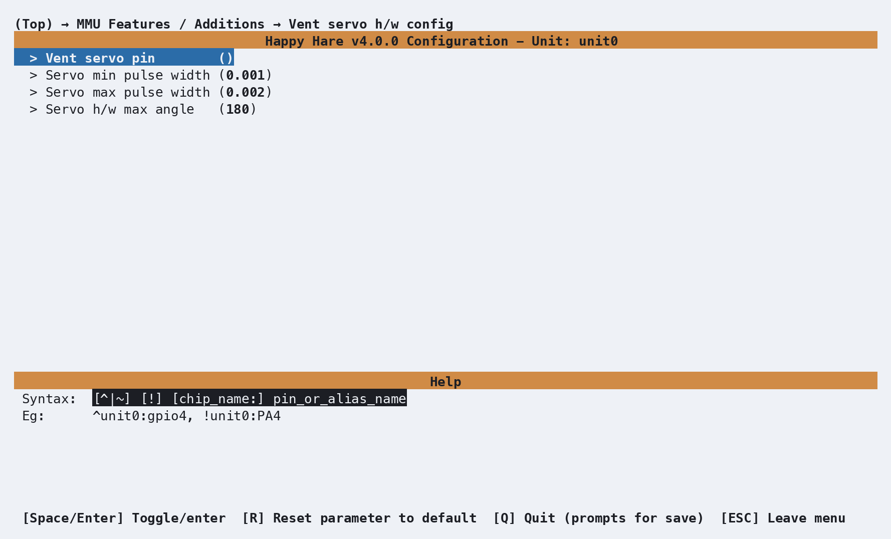
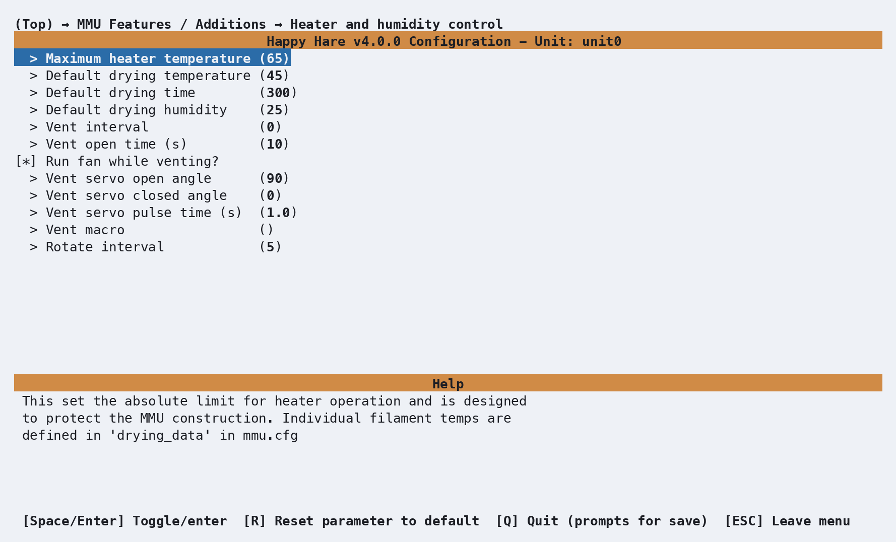

# Feature: Heater & Environment Manager

## Concept

An environment sensor lets you monitor an unheated filament enclosure. Add
a heater to use the enclosure as a filament dryer. Happy Hare pairs
a humidity/temperature sensor with one or more heaters and runs a managed
**drying cycle**: pick a target temperature and time (or let Happy Hare
recommend both from the filament types already loaded), and it heats,
tracks progress, and shuts itself off - optionally venting warm humid air
partway through, and gently rotating spools if an eSpooler is fitted so a
respooled filament end doesn't just sit against one hot side of the spool
the whole time.

Two hardware layouts are supported:

- **Single heater / shared enclosure** - one heater and one environment
  sensor for the whole enclosure. This is the common case, and everything on
  this page defaults to it.
- **Per-gate heaters** - each gate has its own heater and sensor (for
  example, the modular EMU design, where every gate is its own small
  enclosure). Each feature's hardware menu lists its gates, so you can configure
  the sensor, heater, fans and vent for each fitted compartment. A basic power-management queue limits how many
  heaters run simultaneously so you don't trip a PSU.

!!! warning
    A drying cycle can keep a heater powered for hours. Build and wire the
    enclosure with that in mind, and don't leave it unattended for the first
    few cycles until you're confident nothing is misbehaving.

## Hardware Setup

Examples below use the default unit name `unit0`. Substitute your configured
[Klipper object name](Installation.md#naming-an-mmu-unit) in unit-specific
sections, object references and pin prefixes.

Enable sensors under **MMU Features / Additions → Has environment sensors?**.
The **Heated Chamber** group contains **Has enclosure heater(s)?**, heater
fans and the optional vent servo. Shared layouts configure one enclosure;
per-gate layouts list gates inside each feature's hardware menu.

A drying cycle requires an environment sensor, even when using only a timer.
Its temperature reading measures enclosure air; the heater's own sensor
controls the heater. A humidity-capable environment sensor also enables
humidity-based completion. Raw heater control with `MMU_HEATER TEMP=` does
not require an environment sensor.

For whole-system examples, start with
[Fans & Airflow](Feature-Fan-Control.md#example-setups).

### Environment sensor

<p align="center">
  
</p>

| Setting | Purpose |
|---|---|
| `Sensor name` | Klipper object name - defaults to `<unit>_Env` |
| `i2c bus type` | Hardware i2c (recommended) or software i2c |
| `Sensor type` | Match the installed chip: AHT, BME/BMP, HTU21D family, SHT3X or LM75; humidity availability depends on the chip |
| `i2c bus name` | Which hardware i2c bus to use, if hardware i2c is selected |
| `i2c address` | Choose the address for the chip and its wiring; defaults include `56` (`0x38`) for AHT and `118` (`0x76`) for BME280 |
| `Report time (secs)` | Sensor reading interval where supported; `0` uses the Klipper driver default |
| SCL/SDA pins | Only shown for software i2c |

Choose AHT10 for older firmware where the newer AHT names are unavailable;
menuconfig's sensor help describes compatibility. BME280/BME680 can report
humidity; BMP chips and LM75 cannot. HTU21D-family sensors also offer
resolution and hold-master options. Keep their defaults unless your sensor
requires otherwise.

For example, the sensor association in the unit's `[mmu_unit ...]` section
of `mmu_hardware.cfg` can use the full Klipper object name:

```ini
environment_sensor : temperature_sensor unit0_Env
```

A per-gate design lists **Gate N sensor** entries in **Environment sensor
h/w config** and produces a gate-aligned list. It can use one MCU for the whole unit or
one MCU per gate; those choices are independent.

```ini
environment_sensors : temperature_sensor unit0_Env0, temperature_sensor unit0_Env1, ...
```

### Heater(s)

<p align="center">
  
</p>

The generic heater setup associates an existing Klipper heater with the
MMU. Define its `[heater_generic]` section, heater pin, sensor and PID or
watermark control first. Some board profiles supply their own heater
configuration; follow the hardware-file hint shown by menuconfig for those.
For a shared enclosure, enter the existing
`[heater_generic]` object's name under **Heater h/w config**. In a per-gate
layout, open **Heater h/w config**, enable **Gate N heater**, and enter
that gate's object name.

| Setting | Purpose |
|---|---|
| `Enclosure heater name` | Existing Klipper heater object for a shared enclosure |
| `Gate N heater` | Per-gate switch that associates a heater with that gate |
| `Heater name` | Existing Klipper heater object for that gate |

Produces, alongside the sensor key in the same `[mmu_unit ...]` section:

```ini
filament_heater : heater_generic unit0_heater
```

or, per-gate:

```ini
filament_heaters       : heater_generic unit0_heater0, heater_generic unit0_heater1, ...
max_concurrent_heaters : 1
```

Optional heater fans follow their associated heater, including cooldown.
Their hardware settings, controller fans for electronics cooling, and
managed exhaust fans are covered in
[Fans & Airflow](Feature-Fan-Control.md#hardware-setup).

### Vent servo

With the heater enabled, select **Has enclosure vent servo? → Vent servo
h/w config**. A heater fan is not required. Set the servo pin and PWM range
for the fitted servo; opening/closing angles and drive time are separate
settings under **Heater and humidity control**.

<p align="center">
  
</p>

The default pulse range is `0.001`–`0.002` seconds with a hardware maximum
angle of `180` degrees. Per-gate layouts expose these settings separately
under **Gate N vent servo**, so different gates can use different servos.
Disable gates without a vent or leave their pin blank.

A shared vent generates an `[mmu_servo unit0_vent_servo]` object and this
association in `[mmu_unit unit0]`:

```ini
vent_servo : unit0_vent_servo
```

Per-gate vents preserve empty positions in their association list:

```ini
vent_servos : unit0_vent_servo0, , unit0_vent_servo2
```

A managed exhaust fan or optional macro can also provide venting without a
servo. The [venting recipe](#venting) explains how they work together.

## Parameter Setup

The **Heater and humidity control** submenu contains the drying limits and
defaults. A per-gate layout also shows **Maximum concurrent heaters** here.

<p align="center">
  
</p>

The heater controller's own tuning constants live in `mmu_parameters.cfg`;
the drying-recipe table ships in `mmu.cfg` in the same `[mmu_parameters]`
section:

```ini
heater_max_temp             : 65     # Absolute ceiling; drying never targets above this regardless of drying_data
heater_default_dry_temp     : 45     # Fallback drying temperature for an unrecognized or empty gate
heater_default_dry_time     : 300    # Fallback drying time in minutes
heater_default_dry_humidity : 25     # Default humidity % goal - drying ends early if reached
heater_rotate_interval      : 5      # Minutes between spool-rotation bursts, requires eSpooler and explicit GATES

drying_data : { 'pla': (45, 300), 'pla+': (55, 300), 'petg': (60, 300), 'tpu': (55, 300), 'abs': (70, 300),
                'abs+': (75, 300), 'asa': (65, 300), 'nylon': (75, 600), 'pc': (75, 600), 'pva': (75, 600),
                'hips': (75, 600) }
```

Venting settings also live in `mmu_parameters.cfg`:

| Setting | Default | Purpose |
|---|---|---|
| `heater_vent_interval` | `0` min | Minutes between openings during drying; `0` disables venting |
| `heater_vent_duration` | `10` s | How long the vent remains open |
| `heater_vent_run_fan` | `1` | Temporarily force managed fans on while open, then restore their modes |
| `heater_vent_open_angle` | `90`° | Servo angle when open |
| `heater_vent_close_angle` | `0`° | Servo angle when closed |
| `heater_vent_servo_duration` | `1.0` s | How long to drive the servo for each move; `0` keeps it powered |
| `heater_vent_macro` | Empty with a vent servo, otherwise `_MMU_VENT` | Optional callback for additional vent hardware |

The servo angle and drive-time prompts appear when a vent servo is enabled.
With per-gate servos, these operating angles and timings are shared across
the unit; each servo's hardware PWM range is configured separately.

`drying_data` maps a material name (matched case-insensitively) to
`(temperature_C, time_minutes)`. Starting a drying cycle without an explicit
`TEMP`/`TIMER` looks up each selected gate's assigned material here. A shared
heater uses the lowest recommended temperature and longest recommended time
across those gates; per-gate heaters use each gate's own recipe. Temperatures
are capped at `heater_max_temp`. A gate with no material assigned, or one
that is empty, falls back to `heater_default_dry_temp` and
`heater_default_dry_time`.
Extend the table with your own materials freely - it's a plain dict, and
`MMU_HEATER DRYING_DATA=1` dumps whatever is currently configured. A
smaller, illustrative table showing just the shape of it:

```ini
drying_data: {'PLA': (45, 240), 'PETG': (55, 300), 'NYLON': (65, 480)}
```

- Values are `(temperature_C, time_minutes)`.
- A material missing from the table falls back to `heater_default_dry_temp`
  and `heater_default_dry_time`, same as an unrecognized material would.

## Commands

```text
MMU_HEATER                                     # Status report - heater state, or drying cycle progress
MMU_HEATER TEMP=50                             # Set/adjust heater temperature directly
MMU_HEATER DRY=1                               # Start a drying cycle, temp/time recommended from drying_data
MMU_HEATER DRY=1 TEMP=50 TIMER=240 HUMIDITY=12  # ...or override any of them
MMU_HEATER DRY=1 VENT_INTERVAL=10              # Open the vent every 10 minutes during drying
MMU_HEATER STOP=1                              # Stop the current drying cycle (or turn the heater off)
MMU_HEATER DRYING_DATA=1                       # List the configured drying-data table
```

Full parameter reference: [`MMU_HEATER`](Reference-Commands.md#mmu_heater).

!!! warning "Important"
    `MMU_HEATER TEMP=50` outside a drying cycle sets the heater directly and
    has no automatic timeout - it stays at that temperature until you turn it
    off yourself with `MMU_HEATER TEMP=0` or `MMU_HEATER STOP=1`. Prefer
    `DRY=1` for anything you intend to walk away from.

With per-gate heaters, use `GATES=` to select gates for drying, raw targets
or partial cancellation. Drying without rotation and raw temperature
control default to the selected unit's non-empty gates. `STOP=1` without
`GATES=` stops the whole unit's cycle and turns off its heaters:

```text
MMU_HEATER DRY=1 GATES=0,2,3       # Dry only these gates (subject to the concurrency cap)
MMU_HEATER TEMP=45 GATES=0,1       # Raw heater control for specific gates
MMU_HEATER STOP=1 GATES=1,3        # Cancel only these gates, leaving the rest of the cycle running
```

If more gates are selected than `max_concurrent_heaters` allows, the extra
gates queue and start automatically as active ones finish - the overall
cycle can take longer than any single gate's own timer as a result.
`TEMP=` on a gate behaves according to that gate's current state: queued -
only the stored target changes, the heater doesn't turn on yet; active - the
heater updates immediately; not part of the current cycle - it's just set
immediately, same as raw single-heater control.

`MMU_HEATER STOP=1 GATES=1,3` cancelling only some gates behaves according
to each gate's current state too: an **active** gate has its heater turned
off immediately and is marked done; a **queued** gate is simply removed
from the queue and marked done, without ever having its heater turned on.
If cancelling leaves no gates still running or queued, the overall drying
cycle ends automatically.

With no drying cycle running and the shared heater off, `MMU_HEATER` reports:

```{.text .console-command}
MMU_HEATER
```

```{.text .console-output}
Not in drying cycle and heater is off
```

An illustrative status report while drying in single-heater mode with a
servo and managed exhaust fan looks like this:

```{.text .console-output}
MMU is in filament drying cycle:
Drying filaments in gates: 1,2,6,7
Cycle time: 4 hours (remaining: 3 hours 46 minutes)
Target humidity: 25.0% (current: 63.6%)
Drying temp: 55.0°C (current: 48.3°C)
Venting operational (opening for 10s every 15 minutes, next in 11 minutes; vent servo, managed fan)
Spool rotation enabled (running every 5 minutes, next in <1 minute)
```

or, per-gate:

```{.text .console-output}
MMU is in filament drying cycle:
Drying filaments in gates: 1,2,5,6,7,8
Per-gate dryer mode (max concurrent heaters: 3). Humidity target 25.0%
Gate 1: (timer complete, final humidity: 22.3%)
Gate 2: Drying ABS 27.3°C (target 65.0°C), humidity 62.9%, 1 hour 1 minute remaining
Gate 5: Drying PLA 27.3°C (target 45.0°C), humidity 63.1%, 1 hour 1 minute remaining
Gate 6: Drying PETG 27.3°C (target 55.0°C), humidity 63.6%, 13 minutes remaining
Gate 7: (queued waiting for heater slot, target 45.0°C)
Gate 8: (queued waiting for heater slot, target 65.0°C)
```

## Printer variables exposed

`printer.mmu_machine.unit_N.vent_servos` lists the configured vent servo
objects: one element for a shared vent, or a gate-aligned list for per-gate
vents. It describes hardware, not whether the vent is currently open.

`drying_state` - a per-gate list of `''` \| `queued` \| `active` \| `complete`
\| `canceled`. See
[Per-gate arrays merged across every unit](Reference-Printer-Variables.md#per-gate-arrays-merged-across-every-unit)
in the printer variable reference.

### UI

The heater and environment sensor remain Klipper objects; their names are
listed in the unit metadata in
[Printer Variables](Reference-Printer-Variables.md#printermmu_machine).
Use `MMU_HEATER` for drying progress and venting status. Fan visibility is
configured separately under each fan type's hardware menu; see
[Fans & Airflow](Feature-Fan-Control.md#mainsail-fluidd).

## Tuning

### Venting

Heating drives moisture from the filament into the enclosure air. Periodic
venting exchanges that humid air for fresh air. It operates only during a
drying cycle, not while holding a raw heater target with `MMU_HEATER TEMP=`.
An unheated desiccant box generally benefits from staying sealed.

1. Configure the heater, environment sensor, and any vent servo or managed
   exhaust fan. Check the servo's travel before attaching a linkage that
   could bind at the configured angles.
2. Set `heater_vent_open_angle` and `heater_vent_close_angle` for the flap.
   Set `heater_vent_servo_duration` long enough to complete the move. Use `0`
   only if the vent needs continuous holding force; the servo can buzz or
   run warm when driven continuously.
3. For an exhaust fan, select managed fan OFF mode (`fan_forced: 0`) and
   keep `heater_vent_run_fan: 1`. This avoids continuously exhausting heat
   when an AUTO threshold is reached.
4. Set a nonzero `heater_vent_interval` and an appropriate
   `heater_vent_duration`, or override the interval for one drying cycle.
5. Run a short cycle with a temperature appropriate for the enclosure and
   filament, and check opening, airflow, closing and fan-mode restoration:

    ```text
    MMU_HEATER DRY=1 TEMP=45 TIMER=10 VENT_INTERVAL=1
    MMU_HEATER
    MMU_HEATER STOP=1
    ```

The drying controller checks the interval every 30 seconds. At an opening,
it moves the servo, forces the relevant managed fans on if enabled, and
calls any configured vent macro. After the open duration it closes the
servo, restores the previous fan modes, and calls the macro again.
Heater fans continue following their heaters independently.

```text
Drying:       ---------------------------------------------------->
              <--- interval (minutes) ---> <--- open time --->
Vent:         closed                       OPEN               closed
Servo:                                     open angle         close angle
Managed fan:  previous mode                 ON                 restore mode
Macro:                                     OPEN=1             OPEN=0
```

With per-gate heaters, venting targets the **actively heating** gates;
queued gates wait. Per-gate vents and fans follow those targets. A shared
vent or shared managed fan still serves the whole enclosure. Every
configured vent servo closes at Klipper startup; an open vent also closes
when drying ends or the MMU is disabled.

There is no dedicated manual vent command. Use the short drying cycle above
to test the complete sequence. A humidity goal may finish it before the
first vent opening, so check the reported cycle state as well as the flap.

#### Optional vent macro

Happy Hare already moves configured vent servos and runs managed fans.
Use `heater_vent_macro` only for extra hardware, such as another flap or a
relay. It receives:

| Parameter | Meaning |
|---|---|
| `UNIT` | Unit name |
| `OPEN` | `1` to open, `0` to close |
| `GATES` | Actively heated gates, supplied only with per-gate heaters |

The supplied `_MMU_VENT` is a logging-only example. Copy it to your own
configuration file, rename it, add the hardware actions to its open and
close branches, and set `heater_vent_macro` to that name. This example shows
the callback shape; its comments must be replaced with your hardware commands:

```ini
[gcode_macro MY_MMU_VENT]
gcode:
    
    
    
    MMU_LOG MSG="Vent callback: unit={unit}, open={opening}, gates={gates}"
    
        # Operate additional hardware to open the vent
    
        # Operate additional hardware to close the vent
    
```

The controller schedules closing; the macro does not need a delayed-close
timer. Callbacks can run during a print, so do not add delays or `M400`.
Leave `heater_vent_macro` empty when configured servos and fans provide all
the required venting.

### Spool rotation

With an eSpooler, or a design whose gear motor can rotate the spool such as
ViViD, a drying cycle can periodically nudge each spool a
short distance in the rewind direction - just enough to stop a respooled
filament end from baking against one point of contact for hours. Start it
with `MMU_HEATER DRY=1 ROTATE=1 GATES=1,3` - `GATES` must be given explicitly
whenever `ROTATE=1` is used. Rotation only actually happens for gates that
are genuinely **empty** at the moment the timer fires (filament removed from
the MMU inlet and secured to the spool) - Happy Hare re-checks this every
`heater_rotate_interval` minutes rather than only once at the start, so you
can safely unload a gate and secure it mid-cycle. If a gate passed to
`GATES=` isn't empty yet when the cycle starts, Happy Hare warns about it
immediately rather than staying silent until the first rotation tick -
drying still proceeds normally, since a loaded gate simply can't rotate
until it's cleared. For an eSpooler, it uses the same
power and duration as an ordinary
[rewind burst](Feature-Espooler.md#in-print-bursts-two-independent-trigger-sources)
(`espooler_rewind_burst_power`/`espooler_rewind_burst_duration`) - there's no
separate "rotate" setting to tune. ViViD uses its gear motor for rotation
only while the printer is not printing.

### Choosing a temperature/time by hand

If your slicer's filament isn't in `drying_data`, either add an entry (it's
a plain dict you can extend) or pass `TEMP=`/`TIMER=` explicitly for that
cycle. `HUMIDITY=` ends a cycle as soon as the sensor reports at or below the
target, which is usually a better stopping point than a fixed timer if your
sensor supports humidity at all.

## Troubleshooting

- **Humidity always reports as missing** - the sensor chip may not support
  humidity (some report temperature only), or the humidity reading isn't
  recognized. Drying still runs on the timer; humidity-based early
  termination just won't trigger.
- **Venting never runs** - confirm a drying cycle is active and
  `heater_vent_interval` is greater than `0`. Configure a servo, managed fan
  override or hardware macro; an empty macro is valid when the built-in
  hardware supplies venting. Check the status report and console for errors.
- **Vent options are missing** - enable **Has enclosure heater(s)?** first.
- **The servo moves but the flap does not stay open** - check the linkage,
  angles and drive duration; continuous drive may be needed for a flap that
  cannot hold its position without power.
- **Drying takes longer than expected in per-gate mode** - gates queue when
  `max_concurrent_heaters` is smaller than the number of gates you asked for;
  gates run in batches up to that limit, so total wall-clock time can
  exceed the longest individual timer.
- **Rotation never happens** - no supported spool-rotation mechanism is
  fitted, `ROTATE=1` wasn't
  specified, or the gate genuinely wasn't empty (filament end secured to the
  spool) at the moment a rotation was due.
- **`No MMU heater configured` error** - `filament_heater`/`filament_heaters`
  is empty; the manager needs at least one heater object configured before
  `MMU_HEATER` will do anything.

## See also

- [Fans & Airflow](Feature-Fan-Control.md) - fan selection and example setups
- [EMU](GettingStarted-EMU.md) - per-gate hardware menus
- [Parameters](Reference-Parameters.md#heater-environment-management) - drying and vent defaults
- [Command Reference: `MMU_HEATER`](Reference-Commands.md#mmu_heater)
- [Feature: eSpooler](Feature-Espooler.md) - the mechanism spool rotation
  reuses
- [Printer Variables: per-gate arrays](Reference-Printer-Variables.md#per-gate-arrays-merged-across-every-unit)
  for the `drying_state` field

---
