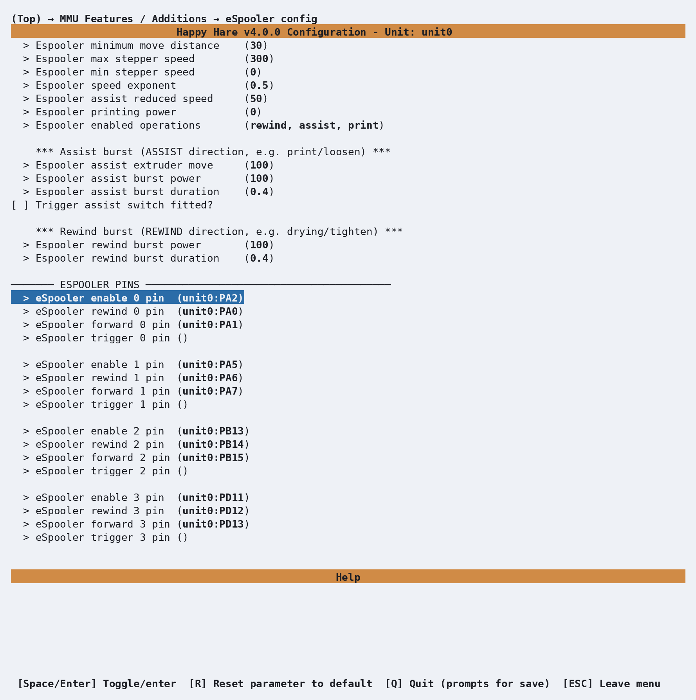

# Feature: eSpooler

## Concept

<p align="center">
  
</p>

An eSpooler is a small DC motor (typically an N20 gearmotor) mounted so it can
drive a filament spool directly, one per gate. Its primary job is respooling
filament as it unloads so it doesn't tangle, but it can also assist loading or
even relieve spool drag during a print. Happy Hare drives it in one of four
modes, tracked independently per gate:

- **`rewind`** - runs during an *unload* move (filament traveling back
  towards the spool) to take up slack as it comes off the buffer/bowden, so it
  doesn't pile up loosely and tangle.
- **`assist`** - runs during a *load* move (filament being drawn off the
  spool towards the extruder) to overcome the spool's own rotational inertia
  and friction, so the gear stepper isn't fighting the spool's mass every
  toolchange.
- **`print`** - a *sticky* per-gate mode, not a continuous drive: Happy Hare
  arms it automatically once filament is loaded into the extruder, and it
  stays armed for whichever gate is currently in use, for as long as printing
  continues. While armed, the motor itself is idle at 0% until something
  triggers a short **burst** in the assist direction (see below) - the intent
  is to periodically relieve spool tension during a print without ever
  letting the DC motor spin fast enough to overrun and dump loose filament.
- **`off`** - motor stopped. Always reachable regardless of current mode,
  including interrupting an in-progress burst.

Only one gate at a time can hold "print assist" mode; selecting a different
gate cancels it for the previous one. See
[Printer variables exposed](#printer-variables-exposed) below for how the UI
screenshot above is driven.

### Continuous operation: gear speed drives PWM

During an ordinary load/unload move, `rewind`/`assist` aren't fixed-power -
the motor's power tracks the *gear stepper's speed* for that move, so the
espooler naturally spins faster for a fast bowden move and throttles down for
a slow calibration move:

```text
power = (gear_speed / espooler_max_stepper_speed) ^ espooler_speed_exponent
```

capped at 100% once `gear_speed` reaches `espooler_max_stepper_speed`, and
skipped entirely (no motor signal at all) if the move is shorter than
`espooler_min_distance` or slower than `espooler_min_stepper_speed`. `assist`
additionally scales that result down by `espooler_assist_reduced_speed` (a %
of the `rewind` curve) - deliberately, since over-driving assist can unspool
faster than the gear stepper is pulling and dump loose filament, whereas
over-driving rewind just means the motor is idle sooner. This happens
automatically on every qualifying load/unload move - there's nothing to
trigger manually. See [`espooler_speed_exponent`](#espooler_speed_exponent)
below for a worked example of the curve's shape.

### In-print bursts: two independent trigger sources

With `print` mode armed and `espooler_printing_power: 0` (the default), the
motor stays at 0% until a burst is triggered by exactly one of:

1. **Extruder movement** (default) - an extruder-movement monitor fires a
   burst every `espooler_assist_extruder_move_length` mm of extruder
   movement.
2. **A physical tension-switch trigger pin** (`espooler_assist_burst_trigger:
   1`) - a switch on `assist_trigger_pin_<gate>` fires a burst when it
   closes, and again on every re-trigger while it stays closed, up to
   `espooler_assist_burst_trigger_max` back-to-back bursts (a safety cap -
   Happy Hare logs an error and stops if the sensor looks stuck closed). This
   is the more reliable option where the hardware supports it - closed-loop
   feedback on actual filament tension, rather than a fixed schedule that
   fires whether or not the spool has actually drifted loose.

Either way, the burst runs the motor at `espooler_assist_burst_power`% for
`espooler_assist_burst_duration`s and then automatically returns to `print`
mode (or `off`, if print mode was cancelled in the meantime). A burst already
in progress for a gate blocks a second one from starting on that same gate.

Filament drying (`MMU_HEATER ... ROTATE=1`, see the Environment Manager
feature) uses the same burst mechanism, just in the `rewind` direction, to
periodically rotate a spool a fraction of a turn while it dries - unrelated to
printing but sharing the same `espooler_rewind_burst_*` settings.

## Hardware Setup

Each gate needs up to four pins on the eSpooler unit, all optional
independently - a gate with only a rewind pin gets rewind-only behavior, for
example:

| Pin | Purpose |
|---|---|
| `respool_motor_pin_<gate>` | Drives the motor in the rewind (respool) direction |
| `assist_motor_pin_<gate>` | Drives the motor in the forward/assist direction |
| `enable_motor_pin_<gate>` | Separate digital enable line, only needed on boards that require one (e.g. AFC Lite) |
| `assist_trigger_pin_<gate>` | Optional tension-switch input for the sensor-based in-print burst trigger |

Enable this in menuconfig with `Has eSpooler?` under **MMU Features /
Additions** (Box Turtle ships with it fixed on already, since it's an
eSpooler design by default), which then opens an **eSpooler config** menu -
the tuning knobs from [Parameter Setup](#parameter-setup) first, then a pin
row per gate at the bottom:

<p align="center">
  
</p>

That produces one `[mmu_espooler <unit_name>]` section in `mmu_hardware.cfg`
per unit with the feature enabled, with the pins you chose filled straight
in:

```ini
[mmu_espooler unit0]
pwm                  : 1        # 1=PWM control (typical), 0=digital on/off control
hardware_pwm         : 0        # See klipper doc
cycle_time           : 0.1      # See klipper doc
scale                : 1        # Scales the PWM output range
value                : 0        # See klipper doc
shutdown_value       : 0        # See klipper doc

respool_motor_pin_0  : unit0:PA0
assist_motor_pin_0   : unit0:PA1
enable_motor_pin_0   : unit0:PA2   # only on boards that need a separate enable line
assist_trigger_pin_0 :
# ...repeated per gate
```

`pwm`/`hardware_pwm`/`cycle_time`/`scale`/`value`/`shutdown_value` apply to
*every* gate on the unit at once - Happy Hare assumes all of a unit's motor
drivers are wired the same way, so there's no per-gate override for these.
An empty pin is simply omitted from that gate's capability (no rewind pin
configured means `rewind` silently does nothing for that gate, it isn't an
error).

The owning `[mmu_unit <name>]` section gets an `espooler:` key pointing at the
`[mmu_espooler ...]` section above - each physical MMU in a multi-unit machine
can have its own independently-named and independently-configured eSpooler:

```ini
[mmu_unit unit0]
espooler : unit0     # Name of [mmu_espooler unit0] above
```

!!! tip
    If you're converting a printer that used a manual, macro-driven
    respooler before adopting this feature, remove the old macros and pin
    assignments first - Happy Hare's own eSpooler pins will conflict if both
    try to drive the same physical pin.

An eSpooler and a filament (catchment) buffer both exist to solve the same
"manage slack in the filament path" problem in different ways, so most designs
only fit one or the other in practice.

## Parameter Setup

Per-unit tuning in `mmu_parameters.cfg`, only shown by menuconfig/`MMU_TEST_CONFIG`
on units that have the feature enabled - the same **eSpooler config** screen
shown under [Hardware Setup](#hardware-setup) above, before its pin rows:

```ini
espooler_min_distance: 50                    # Individual stepper movements less than this distance will not activate espooler
espooler_max_stepper_speed: 300              # Gear stepper speed at which espooler will be at maximum power
espooler_min_stepper_speed: 0                # Gear stepper speed at which espooler will become inactive (useful for non-PWM control)
espooler_speed_exponent: 0.5                 # Controls non-linear espooler power relative to stepper speed (see below)
espooler_assist_reduced_speed: 50            # % of the "rewind" speed applied to assisting load (rewind should be faster than assist)
espooler_printing_power: 0                   # If >0, fixes the % of PWM power while printing; 0 enables burst-mode assist instead
espooler_operations: rewind, assist, print   # Which operations are permitted at all, independent of what's wired

espooler_assist_extruder_move_length: 100    # Distance (mm) extruder needs to move between each assist burst
espooler_assist_burst_power: 50              # % power of the assist burst move
espooler_assist_burst_duration: 0.4          # Duration (s) of the assist burst move
espooler_assist_burst_trigger: 0             # 0=extruder-movement trigger, 1=tension-switch trigger
espooler_assist_burst_trigger_max: 3         # Max back-to-back bursts before assuming the trigger sensor is stuck

espooler_rewind_burst_power: 50              # % power of the rewind burst move (drying rotation, TIGHTEN)
espooler_rewind_burst_duration: 0.4          # Duration (s) of the rewind burst move
```

The supplied defaults are a good starting point, and unused settings are
harmless to leave in place - for example if no `assist_motor_pin` is wired,
`assist`/`print` in `espooler_operations` simply never has anything to do.
That makes `espooler_operations` most useful as a way to explicitly turn a
mode **off** even though the hardware for it exists.

#### `espooler_speed_exponent`

This shapes how power ramps up as the gear stepper speeds up, not the overall
power ceiling. With `espooler_max_stepper_speed: 300` (the default):

```text
  espooler_speed_exponent: 1 (linear):
    gear speed 300 mm/s -> power 100%   (300/300)^1
    gear speed 150 mm/s -> power 50%    (150/300)^1

  espooler_speed_exponent: 0.5 (the default, non-linear):
    gear speed 300 mm/s -> power 100%   (300/300)^0.5
    gear speed 150 mm/s -> power 71%    (150/300)^0.5
```

A value below `1` front-loads power at low speed and flattens out approaching
`espooler_max_stepper_speed` - useful because DC gearmotors often need more
than a linear share of power to overcome static friction before they'll turn
at all. The power range is further scaled by the hardware `scale` setting in
`[mmu_espooler]`, if set.

#### `espooler_min_stepper_speed`

The gear speed below which the espooler stays off entirely. Most useful for a
non-PWM (digital on/off) motor, where there's no ramp to taper into - set this
as the effective on/off threshold instead.

#### `espooler_assist_reduced_speed`

A % of the calculated `rewind` power for that same gear speed. You want the
espooler to keep tension tight on rewind, but you don't want it to *over*-feed
on assist and get ahead of the gear stepper - the default `50` runs assist at
half of what rewind would do at the same speed. This never drops below the
`print`-mode power floor.

#### `espooler_printing_power`

A fixed % of power applied to the motor for as long as printing continues -
just enough to "release the braking effort" of the spool's own resistance,
not enough to spin it on its own. Recommended starting point is `0`
(burst-mode assist instead, see below); if you do use a fixed value, keep it
low and confirm it isn't dragging filament off the spool uncontrolled.

!!! tip
    As with most `mmu_parameters`, every setting on this page can be changed
    live with `MMU_TEST_CONFIG <var>=<value>` - no Klipper restart needed.
    Changes made this way are only in effect until the next restart.

## Commands

Full parameter reference: [`MMU_ESPOOLER`](Reference-Commands.md#mmu_espooler).

```text
MMU_ESPOOLER                          # status of every gate's espooler
MMU_ESPOOLER GATE=0 OPERATION=rewind  # continuous rewind at default power
MMU_ESPOOLER GATE=0 OPERATION=off     # stop
MMU_ESPOOLER GATE=0 TIGHTEN=1         # one rewind burst (take up slack by hand)
MMU_ESPOOLER GATE=0 LOOSEN=1          # one assist burst (loosen by hand)
MMU_ESPOOLER GATE=0 OPERATION=assist BURST=1 POWER=50  # manual burst, explicit power
```

`BURST=1` combined with `OPERATION=assist` or `OPERATION=rewind` jogs the
motor for one burst using that operation's configured (or overridden) power
and duration, then returns to whatever mode the gate was already in - `off`
or `print` are both valid starting states for this, so you don't strictly
need to arm print mode first just to test a burst. `TIGHTEN=1`/`LOOSEN=1` are
shorthand for exactly that combination at the gate's configured rewind/assist
burst power and duration. `OPERATION=print` arms in-print assist manually on
a gate - mostly useful for testing burst behavior outside of an actual print,
since Happy Hare arms it automatically once filament reaches the extruder.
`TRIGGER=1` fires a burst exactly as the real trigger source would, for
testing without extruder movement or a physical switch. `RESET=1` clears
in-print assist mode for the unit's current gate.

!!! tip
    `MMU_ESPOOLER ALLOFF=1` is the quickest way to force every gate's
    espooler off at once, regardless of what mode each one is currently in.

## Printer variables exposed

See [`espooler`](Reference-Printer-Variables.md#per-gate-arrays-merged-across-every-unit)
in the printer variable reference - a per-gate list of
`''`/`off`/`rewind`/`assist`/`print` (empty string for a gate on a unit with
no espooler). The deprecated `espooler_active` variable predates the `print`
and `off` states and should not be used in new macros.

### Espooler UI

Mainsail and Fluidd render this status directly as a directional arrow
overlay on each gate's spool icon in their MMU panel - no separate
configuration needed:

<table>
  <tr>
    <td align="center">
      <br>
      Assisting gate/lane 0 (load and in-print)
    </td>
    <td align="center">
      <br>
      Rewinding gate/lane 4 (respooling)
    </td>
  </tr>
</table>

The same information is available as text from the console (remember Klipper
can't run another command until the current one finishes):

```{.text .console-command}
MMU_ESPOOLER
```

```{.text .console-output}
0 : off     (0%)
1 : print   (0%) [assist for 0.4s at 50% power on trigger, max 3 bursts]
2 : off     (0%)
3 : off     (0%)
```

## Tuning

- **Start with rewind only.** Configure the rewind pin and tune
  `espooler_min_distance`, `espooler_max_stepper_speed`,
  `espooler_min_stepper_speed`, and `espooler_speed_exponent` against real
  unload moves before touching assist or print - rewind has no failure mode
  worse than "spool spins a bit more than needed," while assist run too hard
  can overrun and dump loose filament off the spool.
- **Leave `print` out of `espooler_operations` initially** and add it back
  once rewind/assist are confirmed working - it's the mode most likely to
  need per-printer tuning of burst power/duration.
- **Prefer the trigger-pin burst source over extruder-movement** if you have
  the hardware for it (see [In-print bursts](#in-print-bursts-two-independent-trigger-sources)
  above).

### Setting up each mode

!!! warning "Important"
    Test each mode with the motor disconnected from a real spool the first
    few times, or with a scrap spool - an overpowered assist/rewind can dump
    loose filament off a spool fast enough to tangle before you can react.

**Rewind (respool):**

1. Wire `respool_motor_pin_<gate>` (and `enable_motor_pin_<gate>` if your
   board needs one).
2. Tune `espooler_min_distance`, `espooler_max_stepper_speed`,
   `espooler_min_stepper_speed`, `espooler_speed_exponent`.
3. Confirm `rewind` is in `espooler_operations`.
4. Test: `MMU_ESPOOLER GATE=0 OPERATION=rewind` then `MMU_ESPOOLER GATE=0
   OPERATION=off`.

**Forward (load assist):**

1. Wire `assist_motor_pin_<gate>` (and `enable_motor_pin_<gate>` if needed).
2. With rewind already tuned, set `espooler_assist_reduced_speed` (% of the
   rewind curve to use for assist).
3. Confirm `assist` is in `espooler_operations`.
4. Test: `MMU_ESPOOLER GATE=0 OPERATION=assist` then `MMU_ESPOOLER GATE=0
   OPERATION=off`.

**Basic in-print assist:**

1. Wire the assist pin as above.
2. Set `espooler_printing_power` to a small % - just enough to release the
   spool's own braking effort, not enough to let it spin freely.
3. Confirm `print` is in `espooler_operations`.
4. Test: `MMU_ESPOOLER GATE=0 OPERATION=print` then `MMU_ESPOOLER GATE=0
   OPERATION=off`.

**Intelli-assist, extruder-movement trigger:**

1. Complete basic in-print assist above, then set `espooler_printing_power:
   0` to switch from a fixed power to burst mode.
2. Set `espooler_assist_burst_power`/`espooler_assist_burst_duration` for the
   jog itself.
3. Test: `MMU_ESPOOLER GATE=0 OPERATION=print POWER=0` to arm, then
   `MMU_ESPOOLER GATE=0 OPERATION=assist BURST=1` to fire a burst by hand -
   you should see it jump to burst power/duration and settle back to 0%.

**Intelli-assist, tension-switch trigger:**

1. Complete the extruder-movement version above (same burst power/duration).
2. Wire `assist_trigger_pin_<gate>`, an ordinary switch input.
3. Set `espooler_assist_burst_trigger: 1` and
   `espooler_assist_burst_trigger_max` (back-to-back burst safety cap).
4. Test the same way, or trigger the physical switch and watch it burst; use
   `MMU_ESPOOLER ALLOFF=1` to reset out of intelli-assist mode.

## Troubleshooting

- **`MMU_ESPOOLER` reports `not fitted` for a gate you expect to have one** -
  the gate's unit either has no `[mmu_espooler <name>]` section, or that
  gate's rewind/assist pins are both empty. Check `mmu_hardware.cfg` and that
  the owning `[mmu_unit]`'s `espooler:` key points at the right section name.
- **Espooler never engages during a load/unload move** - check
  `espooler_min_distance` (move too short) and `espooler_min_stepper_speed`
  (move too slow) first; both silently suppress activation rather than
  erroring.
- **Repeated "temporarily suspended" errors during printing** - the trigger
  pin is reporting more than `espooler_assist_burst_trigger_max` consecutive
  triggers with no gap, which usually means the tension switch is
  mechanically stuck closed rather than a software problem. `MMU_ESPOOLER
  RESET=1` clears the suspended state once the switch is freed.
- **Spool overspins and dumps loose filament** - `assist` (or `rewind`) is
  running too fast for the mechanism; reduce `espooler_max_stepper_speed` or
  `espooler_assist_reduced_speed` rather than the burst power settings, since
  the continuous curve is almost always the one actually driving normal
  load/unload moves.

## See also

- [Command Reference: `MMU_ESPOOLER`](Reference-Commands.md#mmu_espooler)
- [Feature: Environment Manager](Feature-Environment-Manager.md) - its
  `MMU_HEATER DRY=1 ROTATE=1` drying option reuses the espooler's rewind
  burst mechanism
- [Printer Variables: per-gate arrays](Reference-Printer-Variables.md#per-gate-arrays-merged-across-every-unit)
  for the `espooler` status field

---
