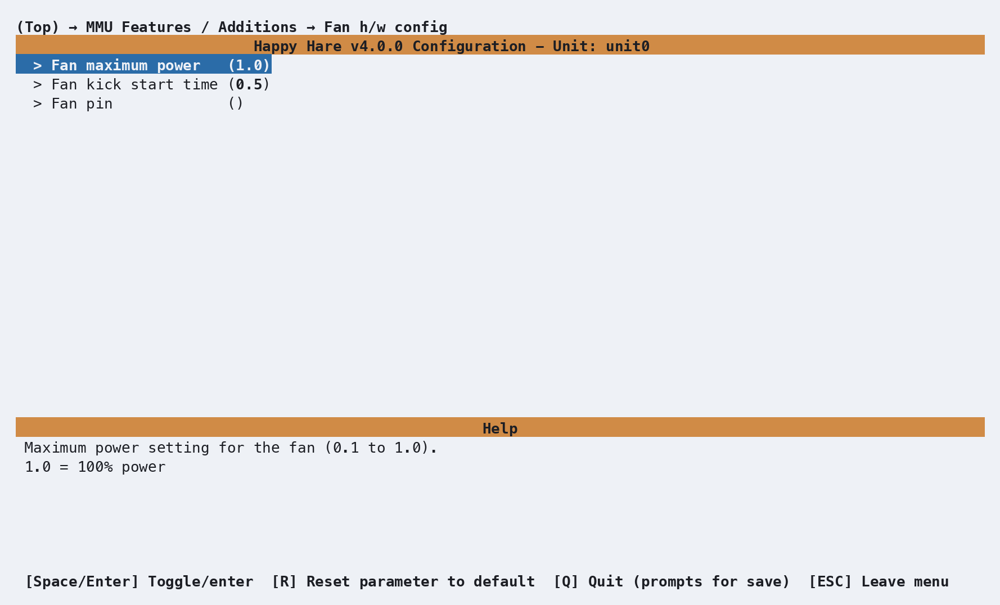
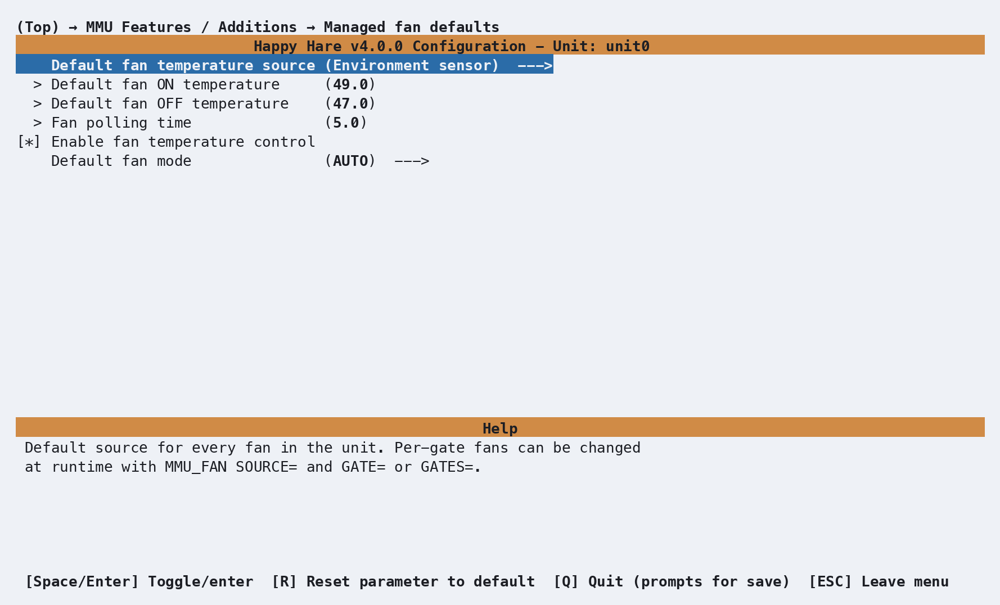

# Feature: Fan Control

## Concept

Automatic, hysteresis-based control for cooling fans fitted to the MMU
unit itself - motors and electronics, not the printer's part-cooling fan.
Each fan is paired with a temperature sensor; `MMU_FAN` polls the sensor
on an interval and switches the fan on above a threshold, off below a
lower one, so it isn't chattering on and off right at the boundary.

**This feature requires [Feature: Environment
Manager](Feature-Environment-Manager.md)'s sensor to also be enabled** -
Fan Control reuses the same humidity/temperature sensor(s), and its
config block simply doesn't exist in the generated `mmu_macro_vars.cfg`
unless both are switched on together. If you only want a fan running off
a fixed schedule or manual control, `FAN_FORCED=` (below) covers that
without needing a sensor at all - but the feature itself still can't be
configured without one enabled.

Two hardware layouts, matching Environment Manager's own split:

- **Single fan / shared sensor** - one fan for the whole enclosure,
  paired with the one shared environment sensor. The common case.
- **Per-gate fans** - one fan per gate, on hardware with a per-gate MCU,
  paired with that gate's own sensor.

!!! warning "Important"
    The installer's automatic pairing of sensors to fans doesn't
    currently work reliably - confirmed directly by rendering the real
    config template, not assumed. After enabling this feature, check
    `variable_fan_sensors`/`variable_fans` in `_MMU_FAN_VARS`
    (`mmu_macro_vars.cfg`) actually name your real sensor/fan sections
    before relying on automatic control - see [Parameter
    Setup](#parameter-setup) below for what to set them to.

## Hardware Setup

Enabled under **MMU Features / Additions** → **Has cooling fans?**,
alongside **Has environment sensor(s)?** from Environment Manager.

<p align="center">
  
</p>

| Setting | Purpose |
|---|---|
| `Fan maximum power` | Cap on PWM power, `0.1`-`1.0` (default `1.0` = 100%) |
| `Fan kick start time` | Seconds to run at full power before settling to target speed - helps a fan that struggles to start from a low duty cycle (default `0.5`) |
| `Fan pin` | Single shared fan - blank disables it |

A per-gate MCU design shows a **Fan pins** submenu instead, one pin prompt
per gate - blank for any gate without a fan fitted.

Produces, in `mmu_hardware.cfg`:

```ini
[fan_generic _mmu_fan]
pin             : PB5
max_power       : 1.0
kick_start_time : 0.5
```

or, per-gate:

```ini
[fan_generic _unit0_fan0]
pin             : PB5
max_power       : 1.0
kick_start_time : 0.5
```

(one `[fan_generic _<unit>_fan<N>]` section per gate with a pin configured).

## Parameter Setup

<p align="center">
  
</p>

Software tuning lives in `mmu_macro_vars.cfg`'s `_MMU_FAN_VARS` block:

```ini
variable_fan_on_temp      : 49.0    # °C - turn fans on above this
variable_fan_off_temp     : 47.0    # °C - turn fans off below this
variable_fan_polling_time : 5.0     # Seconds between temperature checks
variable_fan_control_enabled : True # Automatic control on/off
variable_fan_forced       : 2       # 0=all OFF, 1=all ON, 2=AUTO (per-sensor hysteresis)
variable_fan_sensors      : "unit0_Env"  # Comma-separated temperature_sensor names
variable_fans             : ""           # Comma-separated fan_generic names
```

`fan_on_temp` is deliberately higher than `fan_off_temp` - that gap is the
hysteresis band, so a temperature sitting right at the boundary doesn't
flip the fan on and off repeatedly.

`fan_sensors`/`fans` are meant to be paired lists, index for index - the
first sensor drives the first fan, and so on. In practice, check both by
hand against what actually got generated:

- **Single fan/sensor**: `fan_sensors` correctly picks up your
  environment sensor's name (e.g. `unit0_Env`), but `fans` was found to
  render blank - set it to match the fan section from Hardware Setup
  above, e.g. `variable_fans: "_mmu_fan"`.
- **Per-gate**: neither list gets populated automatically - set both by
  hand, e.g. `variable_fan_sensors: "unit0_Env0, unit0_Env1"` and
  `variable_fans: "_unit0_fan0, _unit0_fan1"`, matching whichever gates
  actually have both a sensor and a fan fitted.

## Commands

```{.text .console-output}
MMU_FAN                          # Status report
MMU_FAN ENABLE=1                 # Turn on automatic monitoring
MMU_FAN ENABLE=0                 # Turn off monitoring and all fans
MMU_FAN FAN_FORCED=1             # Force every fan on, bypassing sensors
MMU_FAN FAN_FORCED=0             # Force every fan off, bypassing sensors
MMU_FAN FAN_FORCED=2             # Back to automatic per-sensor control
```

A bare call with no arguments reports current status:

```{.text .console-command}
MMU_FAN
```

```{.text .console-output}
Status           : Enabled
Fan polling freq : 5secs
Fan on temp      : 49°C
Fan off temp     : 47°C
Fan forced       : AUTO
```

## Troubleshooting

- **A fan never turns on** - confirm `fan_sensors`/`fans` in
  `_MMU_FAN_VARS` actually name real, existing `temperature_sensor`/
  `fan_generic` sections (see the warning above - these are not reliably
  auto-populated by the installer). Also confirm `ENABLE=1` and that
  `FAN_FORCED` is `2` (AUTO), not left at `0`.
- **A fan runs constantly, or never settles** - check `fan_on_temp` is
  genuinely above `fan_off_temp`; if they're equal or inverted the
  hysteresis band collapses and the fan chatters at the boundary.

## See also

- [Feature: Environment Manager](Feature-Environment-Manager.md) - the sensor this feature requires
- [Macro Variables: Fan control](Reference-Macro-Vars.md) - every `_MMU_FAN_VARS` setting in full
