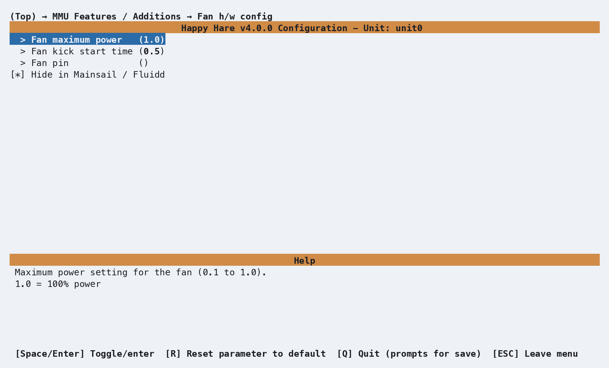
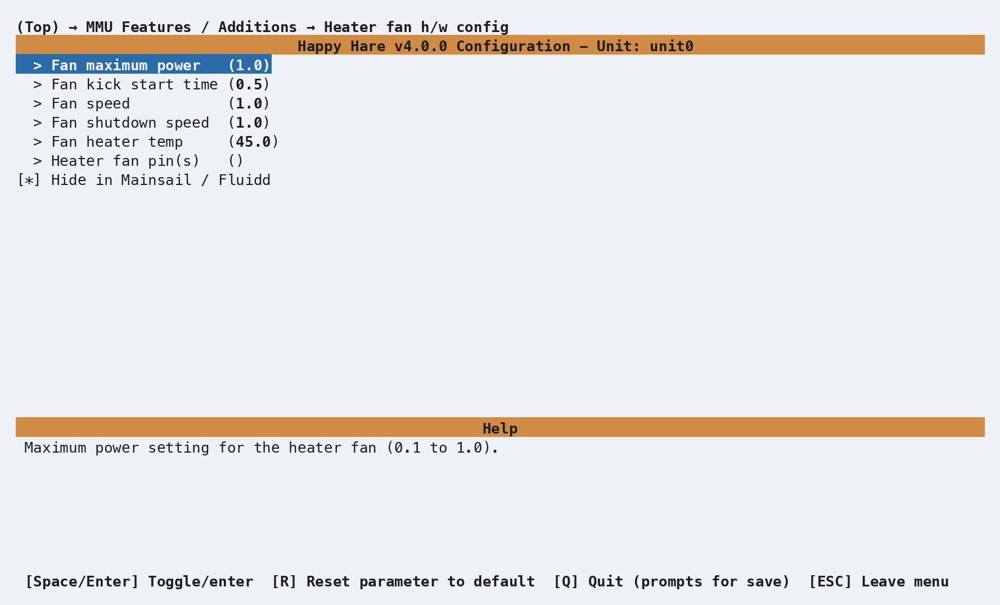
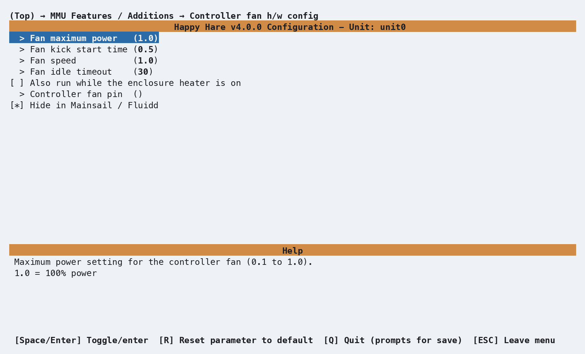
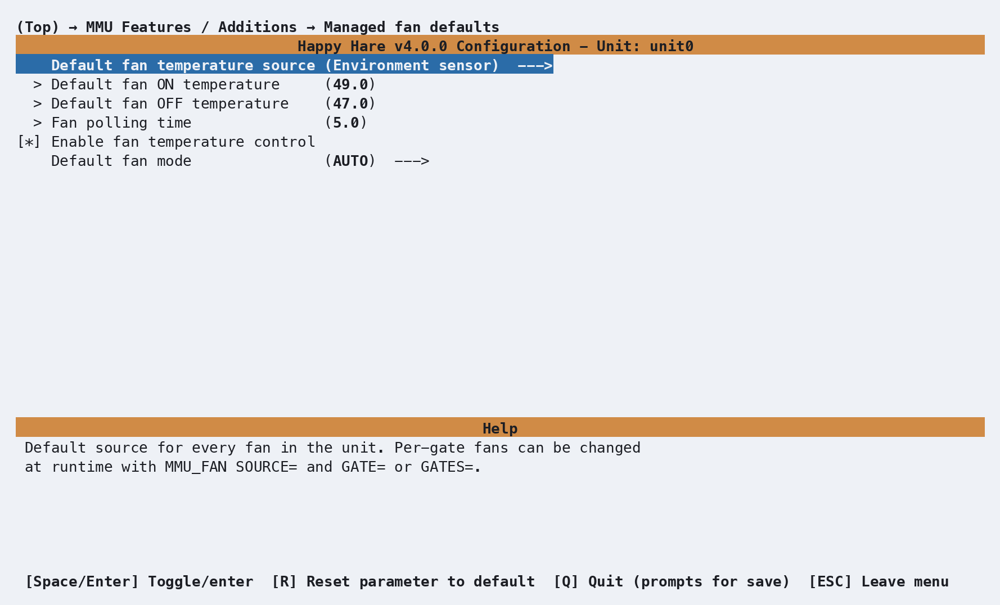

# Feature: Fans & Airflow

## Concept

Happy Hare can help heat, cool and exchange the air around your filament.
The right fan setup depends on what each fan is there to do: spread heater
warmth, cool the electronics, or circulate and exhaust enclosure air.
A fan's role is determined by what controls it, not by which fan header it
uses. These are MMU fans, separate from the printer's part-cooling fan.

### The building blocks

| Component | Klipper object | What controls it | Typical job |
|---|---|---|---|
| Heater | `[heater_generic]` | Happy Hare, through `MMU_HEATER` | Heat filament for drying |
| Heater fan | `[heater_fan]` | Klipper, while the heater has a target or remains above its cooldown threshold | Move air across the heater and spread its heat |
| Controller fan | `[controller_fan]` | Klipper, while the unit's steppers are enabled, plus an idle timeout; optionally also with the enclosure heater | Cool the MCU and stepper drivers |
| Managed fan | `[fan_generic]` | Happy Hare, through temperature-based AUTO control, `MMU_FAN`, or a drying vent override | Circulate, cool or exhaust enclosure air |
| Vent | `[mmu_servo]` and/or an optional macro | Happy Hare, during a drying cycle | Exchange damp enclosure air for fresh air |

A managed fan needs an environment or MCU temperature sensor configured to
be offered in menuconfig. A drying cycle requires an environment sensor
and heater; a humidity reading enables early completion at a humidity goal.
Venting needs a heater, but does not require a heater fan.
See [Heater & Environment Manager](Feature-Environment-Manager.md) for
heater, sensor and vent setup.

### Which fan type fits?

| Your situation | Use | Example |
|---|---|---|
| The fan blows across the heater or spreads its warmth | **Heater fan** | KMS, ViViD and QIDI Box heater airflow |
| An exhaust fan should run only while the vent is open | **Managed fan**, OFF with `heater_vent_run_fan: 1` | QuattroBox v2, alongside its heater fans |
| The fan cools electronics while the MMU is active | **Controller fan** | QIDI Box and ViViD board cooling |
| A fan circulates air in an unheated filament compartment | **Managed fan**, AUTO or ON | EMU's per-gate fans |
| Board cooling should follow temperature rather than stepper activity | **Managed fan**, AUTO with MCU source | Temperature-driven electronics cooling |
| An unheated enclosure gets warm beside the printer | **Managed fan**, AUTO with environment source | Enclosure cooling |
| An unheated box is sealed with desiccant | **No fan required** | Simple dry storage |

### Example setups


In the drawings: `(O)` is a spool, `[####]` a heater, `(@)` a fan, `{T/H}` a temperature/humidity sensor and `[MCU]` the MMU's board.

#### 1. Unheated dry box

```text
   ┌──────────────────────────────────┐
   │   (O)     (O)     (O)     (O)    │
   │                                  │
   │   desiccant          {T/H}       │
   └──────────────────────────────────┘
          sealed, no heater, no fan
```

- **Environment sensor:** yes, to watch humidity.
- **Fans:** none needed. Add a **managed fan** (AUTO, source environment) only if the box can get too warm, for example next to a heated printer chamber.
- **Vent:** not available without a heater, and you wouldn't want one: opening a desiccant box only lets damp room air in.

#### 2. Heated dryer with a heater fan (the most common design)

```text
   ┌──────────────────────────────────┐
   │   (O)     (O)     (O)     (O)    │
   │      ^       ^       ^       ^   │
   │      └─── warm air circulates ┘  │
   │   (@)──►[####]           {T/H}   │
   │ heater fan  heater               │
   └──────────────────────────────────┘
```

- **Heater:** an existing `[heater_generic]`, named in menuconfig (or provided by your board's supplied hardware configuration).
- **Heater fan:** on the fan that blows across the element. It runs for the whole drying cycle at any drying temperature, and keeps running until the element has cooled.
- **Two heater fans on one heater?** Enter both pins, separated by a comma. They're driven together.
- **Passive heater with no fan?** That's fine: leave the heater fan off.

#### 3. Heated dryer with an exhaust vent (e.g. QuattroBox v2)

```text
                                         vent flap    exhaust fan
                                         (servo)      (managed fan)
   ┌──────────────────────────────────┐    │           ┌─────┐
   │   (O)     (O)     (O)     (O)    ├────┤  ──────►  │ (@) ├──► out
   │                                  │    │           └─────┘
   │   (@)──►[####]           {T/H}   │
   │ heater fan  heater               │
   └──────────────────────────────────┘
```

- **Heater and heater fan:** as in example 2.
- **Vent servo:** opens the flap every `heater_vent_interval` minutes while drying.
- **Exhaust fan as a managed fan, with `fan_forced: 0` (OFF) and `heater_vent_run_fan: 1`:** it's off the rest of the time and runs only while the vent is open.

!!! warning "Exhaust fan mode"
    Don't leave a drying exhaust fan on AUTO. While drying, the enclosure can
    pass the AUTO switch-on temperature (49 °C by default). The fan then
    blows heat out continuously, slowing drying. Use OFF with vent control.

#### 4. Board inside the heated enclosure

```text
   ┌──────────────────────────────────┐
   │   (O)     (O)     (O)     (O)    │
   │                                  │
   │   (@)──►[####]           {T/H}   │
   │                                  │
   │   [MCU]◄──(@) controller fan     │
   └──────────────────────────────────┘
```

- **Controller fan** on the board fan.
- **Turn on "Also run while the enclosure heater is on".** During a drying cycle the steppers are usually idle, so without this the board fan stays off while the board sits in a hot box.

#### 5. A separate enclosure per filament (e.g. EMU)

```text
   ┌────────────┐ ┌────────────┐ ┌────────────┐ ┌────────────┐
   │    (O)     │ │    (O)     │ │    (O)     │ │    (O)     │
   │   ~ (@)    │ │   ~ (@)    │ │   ~ (@)    │ │   ~ (@)    │
   │   {T/H}    │ │   {T/H}    │ │   {T/H}    │ │   {T/H}    │
   │  [MCU]     │ │  [MCU]     │ │  [MCU]     │ │  [MCU]     │
   └────────────┘ └────────────┘ └────────────┘ └────────────┘
      gate 0         gate 1         gate 2         gate 3
           each spool has its own enclosure, sensor and board
```

- **Per-gate configuration:** each feature's hardware menu lists its gates. Configure the sensor, fans, heater and vent for each fitted compartment there.
- **Circulation fan per gate:** EMU's per-gate fans circulate the air in that one filament's enclosure. With no heater involved they're **managed fans**, one per gate. EMU defaults their AUTO source to the gate's MCU temperature. Control them one gate at a time, e.g. `MMU_FAN FAN_FORCED=1 GATE=2`.
- **Adding heaters (optional):** each gate gets its own heater. If a gate's fan is there to spread that heater's warmth, make it the gate's heater fan instead.
- **Heater limit:** `max_concurrent_heaters` limits how many gates heat at once, to protect your power supply. Other gates queue.
- **Drying selected gates:** `MMU_HEATER DRY=1 GATES=0,2`. With per-gate vents and managed fans, venting operates only on actively heating gates; queued gates wait for a heater slot.


## Hardware Setup

Examples use the default unit name `unit0`. Substitute your configured
[Klipper object name](Installation.md#naming-an-mmu-unit) and actual
MCU-and-pin names. Configure each fan's voltage and wiring to suit its board
and hardware.

All three fan types are under **MMU Features / Additions**. Heater fans
appear in the **Heated Chamber** group after enabling a heater. Some board
profiles supply fixed hardware in a separate configuration file: follow
the dimmed hardware-file hint where menuconfig does not offer editable pins.

### Managed fan

Enable **Enable managed fan(s)?**, then open **Fan h/w config**. The enable
option is available with **Has environment sensors?** or **Create MCU CPU
sensors?** enabled.

<p align="center">
  
</p>

| Setting | Default | Purpose |
|---|---|---|
| Fan maximum power | `1.0` | PWM power cap, from `0.1` to `1.0` |
| Fan kick start time | `0.5` s | Full-power startup before settling to the requested speed |
| Fan pin | Empty unless supplied by the board | Output pin; blank means no fan is created |

A shared fan produces this association in `mmu_hardware.cfg`. The pin below
is illustrative; use your board's actual output:

```ini
[mmu_unit unit0]
fan             : _unit0_fan

[fan_generic _unit0_fan]
pin             : unit0:PB5
max_power       : 1.0
kick_start_time : 0.5
```

For a per-gate design, **Fan h/w config** lists **Gate 0 fan**, **Gate 1 fan**,
and so on. Each gate has its own pin, power and kick-start settings. Disable
entries for gates without that hardware. Blank list positions keep the
association aligned with gate numbers:

```ini
[mmu_unit unit0]
fans : _unit0_fan0, _unit0_fan1, , _unit0_fan3
```

See the [EMU walkthrough](GettingStarted-EMU.md#mmu-features-additions) for
real per-gate menu examples.

### Heater fan

Enable **Has enclosure heater(s)?**, associate the heater under **Heater
h/w config**, then use **Configure heater fan(s)? → Heater fan h/w config**
for a shared enclosure. In a per-gate design, **Heater fan h/w config** lists
each gate's heater fan directly.

<p align="center">
  
</p>

| Setting | Default | Purpose |
|---|---|---|
| Heater fan pin(s) | Empty unless supplied by the board | Shared heater fans can use comma-separated pins, driven together |
| Fan speed | `1.0` | Speed while the heater is on or cooling |
| Fan heater temp | `45` °C | Keep the fan running until the heater falls below this temperature |
| Fan shutdown speed | `1.0` | Fan output on Klipper shutdown; full speed preserves airflow across a hot element |
| Fan maximum power / kick start time | `1.0` / `0.5` s | Electrical power limit and startup behavior |

Klipper starts a heater fan whenever the heater has a nonzero target,
even when drying below **Fan heater temp**, and keeps it running during
cooldown. Happy Hare does not switch it with `MMU_FAN` or vent control.
A passive heater can be configured without a heater fan.

### Controller fan

Enable **Enable controller fan?**, then open **Controller fan h/w config**.
It follows this unit's gear and selector steppers. In a per-gate layout,
each gate's controller fan follows that gate's gear stepper.

<p align="center">
  
</p>

Set the output pin, maximum power, kick-start time, fan speed and idle
timeout. Defaults are full speed, maximum power `1.0`, a `0.5` second kick
start and a `30` second idle timeout after the steppers are disabled.

If the electronics sit inside the heated enclosure, enable **Also run while
the enclosure heater is on**. Per-gate configuration calls this **Also run
while the gate's heater is on** and associates each fan with its own heater.
This provides cooling during drying when the motors may be idle. The
printer's extruder heater is not used to trigger these generated fans.

### Pins and board defaults

Any suitable fan output can serve any fan role. Board profiles pre-fill
known roles; **Spare fan pin(s)** in the generated configuration records
unused headers for reference, without creating extra fans.

!!! warning "One job per pin"
    Assign each output to only one fan type. Reusing a pin in two fan
    sections causes Klipper's `pin ... used multiple times in config` error.

## Parameter Setup

<p align="center">
  
</p>

The **Managed fan defaults** menu writes these settings to
`mmu_parameters.cfg`:

```ini
default_fan_temperature_source : environment  # environment or mcu
default_fan_on_temp            : 49.0         # °C - switch on at or above this
default_fan_off_temp           : 47.0         # °C - switch off at or below this
fan_polling_time               : 5.0          # Seconds between checks
fan_control_enabled            : 1            # 1=enabled, 0=disabled and fans off
fan_forced                     : 2            # 0=OFF, 1=ON, 2=AUTO
```

`default_fan_on_temp` must be greater than or equal to
`default_fan_off_temp`. The gap between them is the hysteresis band. Every
fan begins with these defaults; per-gate source and threshold changes made
with `MMU_FAN` remain independent until Happy Hare restarts.


The default source is the environment sensor when available, otherwise MCU
temperature; EMU selects MCU temperature by default. The modes are:

| Mode | `fan_forced` | Behavior |
|---|---|---|
| OFF | `0` | Off except when drying vent control temporarily forces it on |
| ON | `1` | Run continuously |
| AUTO | `2` | On at the upper threshold, off at or below the lower threshold |

!!! warning "AUTO does not follow drying"
    AUTO is a thermostat. It does not know whether a drying cycle is running.
    Use a heater fan for heater airflow, or OFF with `heater_vent_run_fan: 1`
    for an exhaust fan that should run only during venting.

Heater and controller fan settings live in `mmu_hardware.cfg`, rather than
in the managed fan defaults above.


## Commands

```text
MMU_FAN                                      # Status for the current unit
MMU_FAN UNIT=unit1                           # Status for another unit
MMU_FAN ENABLE=1                             # Enable automatic management
MMU_FAN ENABLE=0                             # Disable management and turn all unit fans off
MMU_FAN FAN_FORCED=1                         # Force all managed fans on
MMU_FAN FAN_FORCED=0 GATE=2                  # Force gate 2's fan off
MMU_FAN FAN_FORCED=2 GATES=1,2               # Return gates 1 and 2 to AUTO
MMU_FAN SOURCE=mcu GATE=2                    # Use gate 2's MCU temperature
MMU_FAN SOURCE=default GATE=2                # Restore gate 2's configured source
MMU_FAN ON_TEMP=60 OFF_TEMP=58 GATE=2        # Change gate 2's AUTO range
```

`GATE=` and `GATES=` are only valid for a per-gate fan layout. Without either,
an action applies to every managed fan on the selected unit. Runtime changes
are not written back to the config files, so a restart restores the
menuconfig defaults.

Full parameter reference: [`MMU_FAN`](Reference-Commands.md#mmu_fan).

A bare call reports the controller state, effective AUTO range and each fan's
mode, speed, source and current temperature:

```{.text .console-command}
MMU_FAN
```

```{.text .console-output}
MMU fan control for unit0: ENABLED
AUTO range in force: OFF <= 47.0°C, ON >= 49.0°C; polling 5.0s
Fan (_unit0_fan): AUTO, 0%, source environment: 31.4°C
```


`MMU_FAN` controls managed fans only. Use
[`MMU_HEATER`](Reference-Commands.md#mmu_heater) to start a drying cycle;
its vent control can temporarily override the managed fan mode.


## Printer variables exposed

The unit metadata exposes `fan` or the gate-aligned `fans` list. See
[printer.mmu_machine](Reference-Printer-Variables.md#printermmu_machine).
The underlying Klipper fan objects expose their current `speed`.

### Mainsail / Fluidd

Each generated fan type has a **Hide in Mainsail / Fluidd** option in its
hardware menu, enabled by default. Disable it to show that fan in the UI.
For a per-gate layout, one switch applies to all gates of that fan type.
The hardware screenshots above show the actual option.

| Fan type | Hidden shared name | Visible shared name |
|---|---|---|
| Managed | `_unit0_fan` | `unit0_fan` |
| Heater | `_unit0_heater_fan` | `unit0_heater_fan` |
| Controller | `_unit0_controller_fan` | `unit0_controller_fan` |

Per-gate names append the gate index, for example `_unit0_fan2` or
`unit0_fan2`. Visibility changes the generated name, not the control logic.
After regenerating and restarting Klipper, update any custom macros that
refer to the old object name. Board-supplied custom fan sections may have
their own names; follow the indicated hardware file.

## Tuning

### Temperature-driven cooling

1. Choose the source that represents what the fan protects: environment
   temperature for enclosure cooling, MCU temperature for board cooling.
2. Start with ON at `49°C`, OFF at `47°C`, and a polling interval of several
   seconds.
3. Check the source temperature and fan mode with `MMU_FAN`.
4. If the fan cycles too often, lower the OFF threshold to widen the
   hysteresis band. Keep ON greater than or equal to OFF.

### Drying exhaust

1. Configure the exhaust as a managed fan, separate from heater airflow.
2. Set `fan_forced: 0` and leave `heater_vent_run_fan: 1` enabled.
3. Configure and test the [drying vent](Feature-Environment-Manager.md#venting).
   The fan runs while the vent is open, then returns to its previous mode.

## Troubleshooting

- **`No manageable fans on this unit`** - confirm a fan pin is configured,
  select the intended `UNIT=`, and restart Klipper after regenerating the
  configuration.
- **A requested source is unavailable** - enable and configure that
  environment or MCU sensor for the same unit or gate, then restart Klipper.
- **A fan never turns on in AUTO** - confirm `ENABLE=1`, return it to AUTO
  with `FAN_FORCED=2`, check the reported source temperature, and verify the
  ON threshold is reachable.
- **A fan cycles too often** - widen the hysteresis band by lowering the OFF
  threshold. Keep ON greater than or equal to OFF; inverted values are
  rejected.
- **`GATE=` or `GATES=` is rejected** - those selectors require a per-gate
  fan layout. A shared fan always applies to its entire unit.

- **A fan stays off when drying at 45 °C** - a managed fan on AUTO waits
  for its ON threshold (49 °C by default). If it serves the heater,
  configure it as a heater fan.
- **An exhaust fan runs throughout drying** - change its managed mode to
  OFF and enable the vent fan override instead of using AUTO.
- **A board fan stays off during drying** - enable its heater association
  if it needs to run when the steppers are idle.
- **A fan is absent from the UI** - check its **Hide in Mainsail / Fluidd**
  setting and whether the board provides it through a custom hardware file.
- **A pin is used twice** - give the output one role; a heater fan cannot
  also be a managed fan on the same pin.


## See also

- [Heater & Environment Manager](Feature-Environment-Manager.md) - sensors, drying and vents
- [EMU](GettingStarted-EMU.md) - per-gate hardware setup
- [Parameters](Reference-Parameters.md#fan-management) - managed fan defaults
- [Mainsail / Fluidd](Mainsail-Fluidd-Integration.md#fan-and-mcu-sensor-visibility) - visibility settings
- [`MMU_FAN` command reference](Reference-Commands.md#mmu_fan)

---
