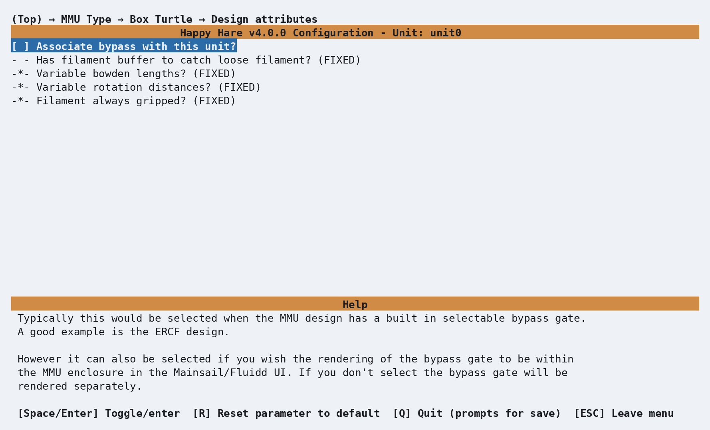

# Feature: Filament Bypass

## Concept

The bypass lets you feed an ad hoc spool straight to the extruder, through
the MMU's own filament path, without going through a gate at all -
effectively printing as if the MMU wasn't there for that one spool. It's the
easy way to do a single-color print without loading anything into the MMU.
The alternative - physically disconnecting the MMU's bowden tube and running
`MMU ENABLE=0` to turn Happy Hare off entirely, then feeding filament down
an alternative path straight to the extruder - still works too, but the
bypass avoids the disconnect/reconnect round trip for something you might
want to do for just one print.

Whether a design can actually *move* to a bypass position depends entirely
on its [selector mechanism](Conceptual-MMU.md#selector-mechanisms): a
design with a moving carriage (ERCF-style) or a selector servo can be
commanded to a genuine bypass position, calibrated once. A design with no
moving selector at all (gear-per-gate designs like Box Turtle) has nothing
to physically move to a bypass position - bypass there is pure software
state, tracking that you're feeding filament in by hand alongside the
normal gates, rather than commanding any hardware.

Bypass mode also narrows which sensors Happy Hare watches for clog/runout
detection down to just the extruder-entry and toolhead sensors (no
MMU-side gate sensors or encoder are in the loop for an ad hoc spool) - so
having at least one of those fitted is what makes runout detection on the
bypass useful at all, not a given.

!!! note
    Only one unit on a multi-unit machine can show a bypass gate.

## Hardware Setup

**Associate bypass with this unit?**, under your MMU type's own **Design
attributes** submenu (**MMU Type → `<your type>` → Design attributes**),
controls something more specific than it sounds - it's a **UI rendering
choice**, not "does this unit have a bypass":

<p align="center">
  
</p>

<table>
  <tr>
    <td align="center">
      <br>
      Enabled - bypass shares the unit's own panel
    </td>
    <td align="center">
      <br>
      Disabled (default) - bypass renders as its own separate panel
    </td>
  </tr>
</table>

For a design with a physical bypass position (a moving-carriage or servo
selector), calibrate it once - carefully align the selector using a
fragment of filament as a guide, remove it, then run:

```text
MMU_CALIBRATE_SELECTOR BYPASS=1       # Moving-carriage designs (e.g. ERCF)
MMU_CALIBRATE_SERVO_SELECTOR BYPASS=1 # Servo-driven selector designs
```

The result is stored per-unit in `mmu_vars.cfg`, and doesn't need repeating
after that - see [State Persistence](Feature-State-Persistence.md). ERCF
v1.1's separate physical bypass-block hardware has its own dedicated
calibration path, `MMU_CALIBRATE_SELECTOR BYPASS_BLOCK=<1-3>`, distinct from
the newer built-in bypass calibration above.

!!! warning
    `mmu_vars.cfg` can be hand-edited directly if you need to adjust the
    stored position without recalibrating - restart Klipper afterward for
    it to take effect - but be careful; corrupting this file can leave Happy
    Hare unable to start.

!!! tip
    On a gear-per-gate design, selecting the bypass is also a convenient way
    to fully disengage every gear motor at once - handy during toolhead
    calibration if you're seeing noise/grinding as the toolhead explores its
    movement limits and want everything released without reducing motor
    current.

## Commands

```text
MMU_SELECT_BYPASS         # Select the bypass (shorthand for MMU_SELECT BYPASS=1)
MMU_SELECT BYPASS=1       # Same thing, explicit form
MMU_LOAD                  # Load the manually-inserted filament to the nozzle
MMU_UNLOAD                # Unload it again
```

Full parameter reference: [`MMU_SELECT_BYPASS`](Reference-Commands.md#mmu_select_bypass),
[`MMU_SELECT`](Reference-Commands.md#mmu_select). Insert filament through
the bypass all the way to the extruder entrance before `MMU_LOAD`, and pull
it back out by hand after `MMU_UNLOAD` before selecting a normal gate again.
`MMU_LOAD`/`MMU_UNLOAD`/`MMU_EJECT` all automatically behave as
`EXTRUDER_ONLY=1` while the bypass is selected - there's no MMU-side move to
make for an ad hoc spool.

An extruder-entry sensor makes this a little less hands-on:
`bypass_autoload: 1` in `mmu.cfg` starts the load automatically as soon as
filament trips that sensor, so you don't need to issue `MMU_LOAD` yourself.

If you also use [Spoolman](Feature-Spoolman.md) or the plain [gate
map](Feature-Gate-TTG-Maps.md), the bypass slot can carry the same
attributes any gate can:

```text
MMU_GATE_MAP BYPASS=1 MATERIAL=PETG COLOR=orange
```

## Printer variables exposed

`printer.mmu.tool`/`.gate` both read `-2` while bypass is selected. See
[Printer Variables: core state](Reference-Printer-Variables.md#core-state), and the
per-unit `has_bypass` field under
[`printer.mmu_machine`](Reference-Printer-Variables.md) for whether a given unit is
configured to show one at all. (A deprecated top-level
`printer.mmu.has_bypass` also exists, always `True` now - kept only for
older macros, see the deprecation note on that same page.)

## Troubleshooting

- **Bypass doesn't do anything on my gear-per-gate MMU** - expected; a
  design with no moving selector has nothing to physically move to a
  bypass position. Bypass there is state-only, for tracking that you're
  feeding filament in by hand - insert filament through the same physical
  path you'd normally use and issue the commands above as usual.
- **Stuck believing bypass is selected when it isn't (or vice versa)** -
  `MMU_RECOVER BYPASS=1` forces the recorded state back to bypass; Happy
  Hare also has some automatic detection for this via the toolhead/
  extruder-entry sensors on startup or resume.
- **Runout/clog detection isn't triggering on the bypass** - it depends
  specifically on an extruder-entry and/or toolhead sensor being fitted;
  neither the encoder nor any MMU-side gate sensor is watched while bypass
  is selected.
- **Two units both show a bypass gate** - not supported; only one unit on a
  multi-unit machine may have "Associate bypass with this unit?" enabled.

## See also

- [Command Reference: `MMU_SELECT_BYPASS`](Reference-Commands.md#mmu_select_bypass)
- [Command Reference: `MMU_SELECT`](Reference-Commands.md#mmu_select)
- [Command Reference: `MMU_CALIBRATE_SELECTOR`](Reference-Commands.md#mmu_calibrate_selector)
- [Command Reference: `MMU_RECOVER`](Reference-Commands.md#mmu_recover)
- [Conceptual: What Is an MMU?](Conceptual-MMU.md) - selector mechanisms and which ones support a physical bypass
- [Feature: Gate/TTG Maps](Feature-Gate-TTG-Maps.md)
- [Feature: Spoolman / Filament Hub](Feature-Spoolman.md)

---
