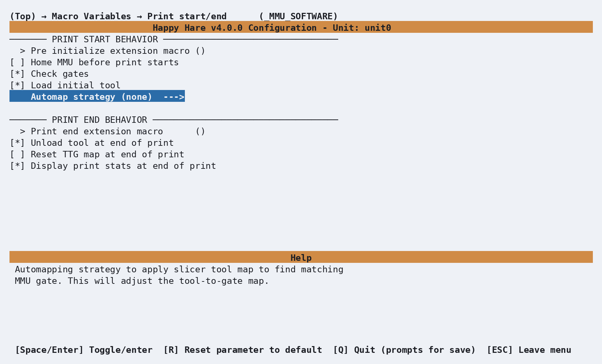

# Feature: Gate/TTG Maps

## Concept

Happy Hare tracks filament using a handful of "maps," exposed as printer
variables so your own macros can use them too:

- **Gate map** - what's actually loaded in each gate right now: material,
  color, temperature, availability, and (if you use it)
  [Spoolman](Feature-Spoolman.md)'s spool ID.
- **Slicer tool map** - what the *slicer* expects for each tool in the
  current print, read from the g-code file. Only valid for the print
  currently loaded - each new print replaces it.
- **Tool-to-Gate (TTG) map** - which gate answers each `Tx` tool change.
  Defaults to a straight pass-through (`T0` → gate 0, `T1` → gate 1, ...) but
  can be remapped freely.

The TTG map is the layer that makes the other two useful together: it's how
a print sliced for 4 colors can pull from whichever 4 gates you actually
loaded, in whatever order, without re-slicing or reloading anything.
[EndlessSpool](Feature-Endless-Spool-Runout.md) groups build on the same
map - grouped gates are just alternative TTG targets Happy Hare can swap to
automatically when one runs out.

## Commands

### Gate map

<p align="center">
  
</p>

```text
MMU_GATE_MAP                                              # Display the current map
MMU_GATE_MAP GATE=8 MATERIAL=PLA COLOR=ff0000 TEMP=205 AVAILABLE=1
MMU_GATE_MAP GATE=8 AVAILABLE=1                           # Just mark it available again (e.g. after reloading from spool)
MMU_GATE_MAP GATES=0,1,2,3,4,5,6,7,8 AVAILABLE=-1         # Bulk reset every gate's availability to "unknown"
```

Full parameter reference: [`MMU_GATE_MAP`](Reference-Commands.md#mmu_gate_map)
- also takes `VENDOR=`, `NAME=`, `SPOOLID=`, `RFID=`, `SPEED=`, and
`BYPASS=1` to set the same attributes for the bypass "gate." `COLOR=` takes
a [w3c color name](https://www.w3schools.com/tags/ref_colornames.asp) or an
`RRGGBB`(`aa`) hex value - no `#`, since Klipper's config parser doesn't
like it there.

!!! note
    Material names aren't enforced or validated against a fixed list -
    whatever you type in `MATERIAL=` is what shows up everywhere else. Short,
    all-caps names like `PLA`, `ABS+`, `TPU95`, `PETG` read best in the
    limited space a gate-map display gives each entry.

A plain (no Spoolman) map looks like this:

```{.text .console-command}
MMU_GATE_MAP
```

```{.text .console-output}
Gates / Filaments:
0: On spool; TPU     | 225C | orange | Orange Pie
1: Unknown;  PETG    | 220C | red    | eMarble
2: Buffered; PLA     | 210C | 8cdfac | Matte Green
3: Empty;    Unknown | n/a  | n/a    | Unknown
```

If you've enabled [Spoolman](Feature-Spoolman.md), the same command gains an
`Id:` field and everything else about it works identically - it's the same
command and the same map either way, just with one extra column. See that
page for the Spoolman-specific console format and sync behavior.

!!! tip
    The initial map (and the defaults `MMU_GATE_MAP RESET=1` restores) come
    from a `default_gate_*` block in `mmu.cfg` - `default_gate_status`,
    `default_gate_material`, `default_gate_color`, `default_gate_temperature`,
    `default_gate_spool_id`, `default_gate_speed_override`, and so on, each a
    comma-separated list the length of your gate count. Commented out by
    default, meaning gates reset to empty/unknown attributes. Filled in for a
    9-gate MMU, it would look something like this:

    ```ini
    default_gate_status:         1,      0,      1,      2,      2,     -1,     -1,      0,      1
    default_gate_filament_name:  one,    two,    three,  four,   five,   six,    seven,  eight,  nine
    default_gate_material:       PLA,    ABS,    ABS,    ABS+,   PLA,    PLA,    PETG,   TPU,    ABS
    default_gate_color:          red,    black,  yellow, green,  blue,   indigo, ffffff, grey,   black
    default_gate_temperature:    210,    240,    235,    245,    210,    200,    215,    240,    240
    default_gate_spool_id:       3,      2,      1,      4,      5,      6,      7,      -1,     9
    default_gate_speed_override: 100,    100,    100,    100,    100,    100,    100,    50,     100
    ```

Happy Hare also exposes filament color as ready-to-use RGB triples
(`printer.mmu.gate_color_rgb`) for driving LEDs or anything else that wants a
plain `(r, g, b)` tuple instead of a color name - see
[Feature: LEDs](Feature-LEDs.md) for how Happy Hare's own LED segments use
it. If you'd rather drive your own separate LED strip - one Happy Hare
doesn't manage as part of its own LED effects - a macro can read the triple
for a given gate directly and hand it to Klipper's own `SET_LED`:

```text


SET_LED LED=my_led INDEX={GATE + 1} RED={rgb[0]} GREEN={rgb[1]} BLUE={rgb[2]} TRANSMIT=1
```

Any color format `MMU_GATE_MAP COLOR=...` accepts (a name or a hex code)
converts to this triple automatically, so the macro never needs to parse
color strings itself.

### Slicer tool map

**Printer variable:** `printer.mmu.slicer_tool_map`

Set up automatically by the recommended print-start macro (see the g-code
preprocessing that fills it in) - you shouldn't normally need to touch this
by hand. The underlying printer variable looks roughly like this, per tool
actually used in the print:

```ini
printer.mmu.slicer_tool_map:
  initial_tool: 0                  # Tool expected to be loaded at the start of the print
  referenced_tools: [0, 3]         # Every tool referenced anywhere in the print (T0 and T3 here)
  tools.0.color: ff0000            # RRGGBB color for T0
  tools.0.material: ABS            # Material for T0
  tools.0.temp: 240                # Extruder temperature for T0
  tools.0.name: eSun ABS Red       # Filament name for T0
  tools.0.in_use: 1                # T0 is actually used in this print
  tools.3.color: 00e410
  tools.3.material: ASA
  tools.3.temp: 245
  tools.3.name: eSun ABS+ Lt Green
  tools.3.in_use: 1
  purge_volumes: [[...], [...]]    # N x N purge-volume matrix, tool X to tool Y
```

To see what's currently loaded for the print in progress:

```{.text .console-command}
MMU_SLICER_TOOL_MAP
```

```{.text .console-output}
--------- Slicer MMU Tool Summary ---------
2 color print (Purge volume map loaded)
T0 (gate 0, ABS, ff0000, 240°C)
T3 (gate 3, ASA, 00e410, 245°C)
Initial Tool: T0
-------------------------------------------
```

Full parameter reference: [`MMU_SLICER_TOOL_MAP`](Reference-Commands.md#mmu_slicer_tool_map).
The purge-volume matrix this command can also show is its own topic -
covered on the Tip Forming and Purging feature page.

### Tool-to-Gate (TTG) map

```{.text .console-command}
MMU_TTG_MAP
```

```{.text .console-output}
TTG Map:
T0 -> Gate 0
T1 -> Gate 1 [SELECTED]
T2 -> Gate 2
T3 -> Gate 3
```

Add `DETAIL=1` to also see EndlessSpool grouping:

```{.text .console-command}
MMU_TTG_MAP DETAIL=1
```

```{.text .console-output}
TTG Map & EndlessSpool Groups:
T0 -> Gate 0
T1 -> Gate 1 Group A: 1> 4> 7 [SELECTED]
T2 -> Gate 2
```

A more tangled example, with EndlessSpool disabled, showing what a map can
look like once tools have been remapped and swapped by hand:

```{.text .console-output}
T0 -> Gate 0 (S)
T1 -> Gate 1 (B) [SELECTED on gate 1]
T2 -> Gate 2 (B)
T3 -> Gate 3 (S)
T4 -> Gate 3 (S)
T5 -> Gate 3 (S)
T6 -> Gate 8 (S)
T7 -> Gate 7 ( )
T8 -> Gate 6 (S)
```

T0, T1, T2 and T7 are still mapped straight through to their own-numbered
gate; T3, T4 and T5 have all been mapped onto gate 3 - handy for a print
that calls for three tools but where you've only loaded one matching spool;
T6 and T8 have had their gates swapped entirely. The `(S)`/`(B)` markers
show gates 0 and 3 are loading fresh from spool while gates 1 and 2 are
loading from buffer (faster); gate 7's `( )` marks it empty/unavailable -
selecting T7 mid-print would pause rather than load.

Remap a tool to a different gate:

```text
MMU_TTG_MAP TOOL=0 GATE=8               # T0 now pulls from gate 8 (and T8 now pulls from gate 0 - they swap)
MMU_TTG_MAP TOOL=1 GATE=1 AVAILABLE=1   # Remap and mark the gate available in one go
MMU_TTG_MAP MAP=8,7,6,5,4,3,2,1,0       # Replace the whole map in one command (index = tool number)
```

Full parameter reference: [`MMU_TTG_MAP`](Reference-Commands.md#mmu_ttg_map).
A few real uses for this: your slicer expects filament in a different order
than you actually loaded it; some tools in the g-code don't have filament
loaded and you'd rather remap them than have the print pause; or turning a
multi-color print monochrome by remapping every tool to one gate.

Some GUIs make this visual rather than command-driven - [KlipperScreen
(Happy Hare edition)](https://github.com/moggieuk/KlipperScreen-Happy-Hare-Edition)
and Mainsail/Fluidd both have a TTG editor:

<table>
  <tr>
    <td align="center">
      
    </td>
    <td align="center">
      
    </td>
  </tr>
</table>

!!! tip
    The default TTG map (and EndlessSpool groups) can also be preset in
    `mmu.cfg`'s `default_ttg_map`/`default_endless_spool_groups` -
    restored by `MMU_TTG_MAP RESET=1`/`MMU_ENDLESS_SPOOL RESET=1`
    respectively. See [Feature: EndlessSpool &
    Runout Detection](Feature-Endless-Spool-Runout.md) for how groups
    actually behave during a runout - this page only shows them as they
    appear in the TTG map above.

## Tuning

### Automatic TTG mapping

<p align="center">
  
</p>

Rather than remap tools by hand every time, Happy Hare can do it
automatically once the slicer tool map is loaded, based on a strategy set in
`mmu_macro_vars.cfg` ([`automap_strategy`](Reference-Macro-Vars.md#print-startend-_mmu_software_vars)
in the `_MMU_SOFTWARE_VARS` macro, also reachable from **Macro Variables →
Print start/end (\_MMU_SOFTWARE)** in menuconfig):

- `none` - no automapping (the default).
- `filament_name` - match the tool's expected filament name to a gate.
- `material` - match by material only, ignoring color - useful if you have
  several spools of the same color in different materials.
- `color` - match a gate whose material matches and whose color matches
  exactly.
- `closest_color` - match the *closest* available color rather than an
  exact one, and reports how close the match was.
- `spool_id` - not yet implemented; reserved for slicers that pass a spool
  ID directly.

If more than one gate matches, Happy Hare uses the last match found and logs
a warning rather than guessing - it does not create an EndlessSpool group
automatically, so if you want gate 3 and gate 7's matching PLA to act as one
EndlessSpool pair, set that group up yourself.

You can also trigger a single tool's automap by hand, after the slicer tool
map is loaded:

```text
MMU_SLICER_TOOL_MAP TOOL=1 AUTOMAP=filament_name
MMU_SLICER_TOOL_MAP TOOL=6 AUTOMAP=closest_color
```

The companion **Reset TTG map at end of print** setting
(`variable_reset_ttg`, same macro section) clears any remapping back to
pass-through once a print finishes, so automap starts fresh next time
instead of compounding.

## Troubleshooting

- **A gate's material/color looks wrong after a print** - check whether
  `variable_reset_ttg`/automap remapped things at the end of the last print;
  the gate map itself doesn't change on its own, but which gate a tool
  points at can.
- **Automap picked a gate you didn't expect** - if more than one gate
  matched the strategy, the last match wins; narrow the ambiguity (unique
  names, or a tighter `closest_color` set) or just remap that one tool by
  hand afterward.
- **`MMU_TTG_MAP MAP=...` didn't do what you expected** - the list is
  positional (index = tool number, value = gate), and its length must match
  your gate count - double check you didn't transpose it with a
  `MMU_GATE_MAP GATES=...` list, which is index = gate number instead.

## See also

- [Command Reference: `MMU_GATE_MAP`](Reference-Commands.md#mmu_gate_map)
- [Command Reference: `MMU_TTG_MAP`](Reference-Commands.md#mmu_ttg_map)
- [Command Reference: `MMU_SLICER_TOOL_MAP`](Reference-Commands.md#mmu_slicer_tool_map)
- [Printer Variables: gate and tool maps](Reference-Printer-Variables.md#gate-and-tool-maps)
- [Feature: Spoolman / Filament Hub](Feature-Spoolman.md)
- [Feature: EndlessSpool & Runout Detection](Feature-Endless-Spool-Runout.md)
- [Feature: LEDs](Feature-LEDs.md)

---
