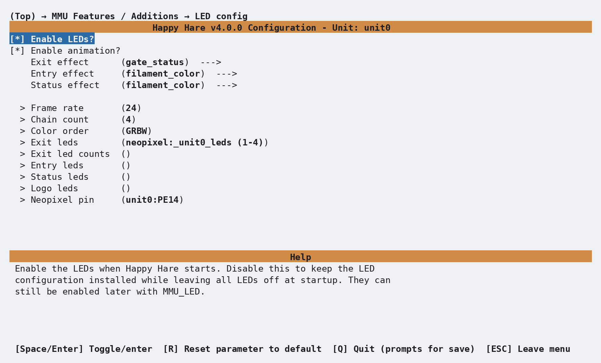
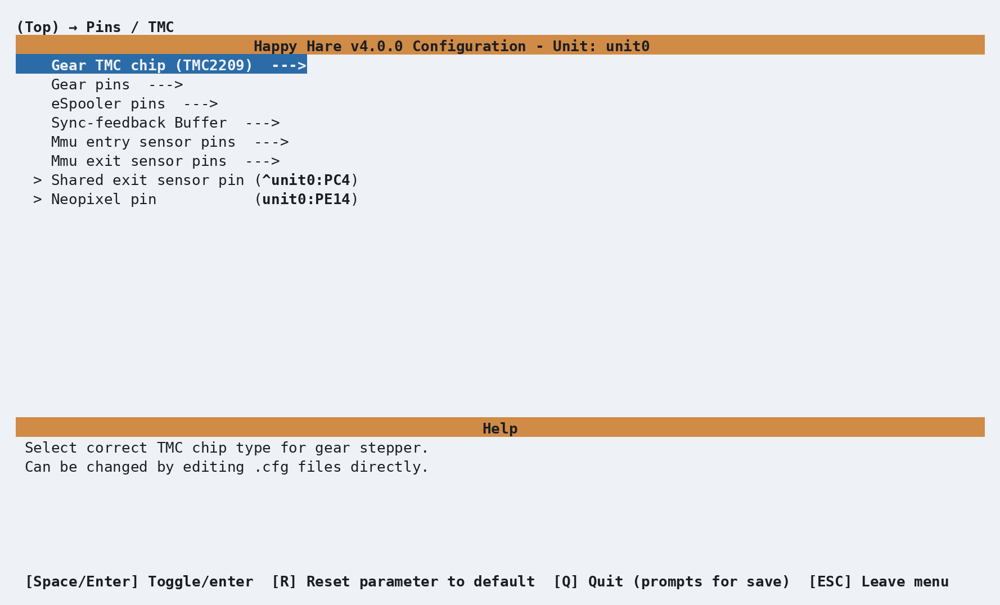

# Feature: LEDs

## Concept

Happy Hare can drive NeoPixel/WS2812 LEDs on the MMU for functional
feedback - which gate is selected, whether it's empty, what color the
loaded filament is - as well as a bit of "bling." Wiring is flexible: one
continuous strip, several separate strips on different pins, or a mix of
both, all combined into a single logical arrangement Happy Hare controls as
one:

<p align="center">
  
</p>

Physical LEDs are grouped into up to four logical **segments**, each
optional:

- **`exit`** - one (or more) per gate, typically mounted where filament
  leaves the MMU towards the bowden tube.
- **`entry`** - one (or more) per gate, typically mounted where filament
  enters the MMU. Having both entry and exit lets one show gate status while
  the other shows filament color, for example.
- **`status`** - represents the MMU/selected-filament as a whole; more than
  one status LED is fine.
- **`logo`** - purely decorative, doesn't change during operation.

LEDs are indexed `1..N` along a chain, and a segment's range can run forward
or backward (`(1-4)` vs `(4-1)`), or even stitch together indexes and whole
chains from more than one physical strip - the only rule is that a segment
representing gates must be contiguous, ascending or descending. Physical
LEDs can even be wired in parallel to share one index - two LEDs, one
number, both driven identically - if you want two physical points lit for
what Happy Hare treats as a single logical position. Animated
effects need the separate [LED Effects for
Klipper](https://github.com/julianschill/klipper-led_effect) plugin
installed; without it, LEDs still work, just as static colors instead of
animations.

## Hardware Setup

Enable under **MMU Features / Additions**:

<p align="center">
  
</p>

| Setting | Purpose |
|---|---|
| `Enable LEDs?` | Master on/off - default on |
| `Enable animation?` | Default on; turn off to save a little load and run static colors only |
| `Frame rate` | 6-32, default 24 |
| `Chain count` | Number of physical LEDs on the main chain - defaults to the gate count |
| `Color order` | Default `GRBW`; use a comma-separated list if mixing LED types on one chain |
| `Exit / Entry / Status / Logo LEDs` | The virtual-chain range for each segment (see Concept above) - blank means that segment isn't fitted |
| `Neopixel pin` | The physical pin driving the main chain - also reachable from the top-level **Pins / TMC** screen alongside every other MMU pin |

<p align="center">
  
</p>

Together these produce, in `mmu_hardware.cfg`:

```ini
[neopixel _unit0_leds]
pin           : unit0:PA0
chain_count   : 4
color_order   : GRBW

[mmu_leds unit0]
entry_leds    :
exit_leds     : neopixel:_unit0_leds (1-4)
status_leds   :
logo_leds     :
frame_rate    : 24
```

Only `exit_leds` is populated by default - `entry`/`status`/`logo` are blank
until you fit and wire them yourself. Mixing multiple physical strips into
one virtual segment looks like this (two Box Turtles, one wired in reverse,
combined into a single 8-LED `exit` segment):

```ini
exit_leds: neopixel:bt_1 (4-1)
           neopixel:bt_2a
           neopixel:bt_2b
           neopixel:bt_2c
           neopixel:bt_2d
```

!!! warning "Important"
    `entry`/`exit` segment length must equal the gate count, or a whole
    multiple of it. BTT ViViD, for example, uses 7 LEDs per gate (28 total
    for 4 gates) - with more than one LED per gate, Happy Hare uses the
    extra LEDs to animate loading/unloading across that gate's own little
    strip rather than just switching a single LED.

## Parameter Setup

The rest of `[mmu_leds unit0]` in `mmu_hardware.cfg` controls what each
segment shows by default, and the colors used for a few special cases:

```ini
enabled                 : True    # LEDs enabled at startup (MMU_LED can still toggle this)
animation                : True    # Use animated effects; False = static colors only
exit_effect             : gate_status      # off|gate_status|filament_color|slicer_color|r,g,b|<effect name>
entry_effect            : filament_color    # off|gate_status|filament_color|slicer_color|r,g,b|<effect name>
status_effect           : filament_color    # on|off|filament_color|slicer_color|r,g,b|<effect name>
logo_effect             : (0, 0, 0.3)       # off|r,g,b|<effect name>
white_light             : (1, 1, 1)         # RGB used for a filament with no color set
black_light             : (.01, 0, .02)     # RGB used for a filament color of pure black
empty_light             : (0, 0, 0)         # RGB used for an empty gate
filament_color_intensity: 0.5               # 0.0-1.0, dims the filament/slicer-color segments
```

- **`gate_status`** shows [`printer.mmu.gate_status`](Reference-Printer-Variables.md#gate-and-tool-maps)
  as a color (empty/available/unknown/buffered).
- **`filament_color`** shows the loaded filament's actual color
  ([`printer.mmu.gate_color_rgb`](Reference-Printer-Variables.md#gate-and-tool-maps)),
  falling back to `white_light`/`black_light`/`empty_light` as appropriate -
  there's no separate fixed color for "filament loaded."
- **`slicer_color`** shows the color the slicer expects for that gate's tool
  ([`printer.mmu.slicer_color_rgb`](Reference-Printer-Variables.md#gate-and-tool-maps)),
  set by `MMU_SLICER_TOOL_MAP COLOR=...` (normally done for you by the
  print-start macro) - empty until a print sets it.
- Any of the four `*_effect` settings also accepts a plain `r,g,b` value, or
  the name of a defined effect (see below) - useful for `logo_effect`
  especially, which is usually just a fixed color.

Every state Happy Hare drives automatically has its own effect setting,
each paired with a static RGB fallback used when animation is off:

```ini
effect_loading                 : mmu_blue_clockwise_slow,   (0, 0, 0.4)
effect_loading_extruder        : mmu_blue_clockwise_fast,   (0, 0, 1)
effect_unloading                : mmu_blue_anticlock_slow,   (0, 0, 0.4)
effect_unloading_extruder      : mmu_blue_anticlock_fast,   (0, 0, 1)
effect_heating                  : mmu_breathing_red_slow,    (0.3, 0, 0)
effect_selecting                : mmu_breathing_white_fast,  (0.2, 0.2, 0.2)
effect_checking                 : mmu_breathing_cyan_fast,   (0, 0.4, 0.5)
effect_preloading                : mmu_breathing_cyan_fast,  (0, 0.4, 0.5)
effect_initialized              : mmu_rainbow,               (0.5, 0.2, 0),   8
effect_error                    : mmu_red_strobe,            (1, 0, 0),       10
effect_complete                 : mmu_sparkle,               (0.3, 0.3, 0.3), 10
effect_gate_selected            : mmu_static_blue,           (0, 0, 1)
effect_gate_available            : mmu_static_green,          (0, 0.5, 0)
effect_gate_available_sel       : mmu_ready_green,            (0, 0.75, 0)
effect_gate_unknown              : mmu_static_orange,         (0.5, 0.2, 0)
effect_gate_unknown_sel          : mmu_ready_orange,           (0.75, 0.3, 0)
effect_gate_empty                : mmu_static_black,          (0, 0, 0)
effect_gate_empty_sel            : mmu_ready_orange2,          (0.1, 0.04, 0)
```

An optional third field on any `effect_*` line overrides how long that
effect plays before reverting to default - `effect_initialized`,
`effect_error` and `effect_complete` use it above (8s/10s/10s). The named
effects themselves (`mmu_blue_clockwise_slow`, `mmu_rainbow`, and so on) are
defined once in `mmu.cfg`, each able to apply to a whole segment or to an
individual gate's own LEDs - browse `mmu.cfg` for the full list if you want
to point a setting at a different built-in effect, or define your own
alongside them.

Two more segments overlay briefly on top of whatever's already showing, and
are configured on the pages that own those features rather than here:
[Spoolman's](Feature-Spoolman.md) pending-spool-ID prompt
(`effect_pending_spoolid`/`effect_pending_spoolid_expiring`, governed by
`spoolman_led_segment` in `mmu.cfg`) and [NFC's](Feature-NFC.md) scan
feedback (`effect_nfc_read`/`effect_nfc_deep_read`/`effect_nfc_fail`,
governed by `nfc_led_segment` in `mmu_parameters.cfg`).

## Commands

```text
MMU_LED                             # Status report
MMU_LED ENTRY_EFFECT=gate_status     # Change a segment's default effect
MMU_LED ANIMATION=0                  # Static colors only, for this unit
MMU_LED ENABLE=0                     # Turn LEDs off entirely
```

Full parameter reference: [`MMU_LED`](Reference-Commands.md#mmu_led). A
status report looks like this:

```{.text .console-output}
Unit 0 LEDs (enabled)
  Animation: enabled
  Exit effect: 'gate_status'
  Entry effect: unavailable
  Status effect: 'filament_color'
  Logo effect: '(0.0, 0.0, 0.3)'
```

(`unavailable` means that segment has no LEDs configured.) Changes made
this way behave like `MMU_TEST_CONFIG` - live immediately, but not
persisted; edit `mmu_hardware.cfg` for a permanent change.

`MMU_SET_LED` is the other LED command, but for a different job: a
temporary, raw override rather than a persistent default. It can target a
single gate and/or auto-revert after a set time:

```text
MMU_SET_LED EXIT_EFFECT=mmu_ready_orange GATE=2 DURATION=5
```

Full parameter reference: [`MMU_SET_LED`](Reference-Commands.md#mmu_set_led).
Reach for `MMU_LED` for "this is how gate 2 should normally look"; reach for
`MMU_SET_LED` for "flash this one gate right now."

## Printer variables exposed

See [`printer['mmu_leds <unit_name>']`](Reference-Printer-Variables.md#directly-registered-per-object-status) for the
directly-registered per-object status (LED counts per segment, current
effects, animation state).

Mainsail, Fluidd, and KlipperScreen (Happy Hare edition) all have a button
to toggle the default gate effect between `gate_status` and `filament_color`
without editing config.

## Tuning

Beyond the functional colors above, most MMU operations step through their
own effect automatically - useful as a diagnostic even without watching the
console. `entry` only ever changes on the print-state rows below; during an
in-progress load/unload/select it's left showing whatever its own default is.
Loaded filament also has its own baseline regardless of print state: with no
print running at all, a loaded gate's status LED sits at a dim blue rather
than fully off, so a glance at the MMU shows whether it's sitting loaded
between prints.

| Print state | Exit / Status LEDs | What it looks like |
|---|---|---|
| `standby` (MMU disabled) | Off (entry and logo too) | Dark |
| `initialized` (startup) | `initialized` effect for ~8s, then default | A brief "shooting stars" sparkle |
| `ready` / `printing` / `cancelled` | Default (whichever effect each segment is configured for) | Default color; status dims to blue if a gate is loaded |
| `pause_locked` (MMU-paused) | `error` effect, all gates | Strobing |
| `paused` (unlocked, resumable) | `error` effect, current gate only | Strobing, current gate only |
| `complete` | Exit: `complete` effect for ~10s; Status: back to default immediately | A brief sparkle |
| `error` | Exit: `error` effect for ~10s; Status: back to default immediately | Strobing |

| Action | Exit / Status LEDs (current gate) | What it looks like |
|---|---|---|
| Loading (gear moving towards extruder) | `loading` effect | Slow pulsing white, forward motion |
| Loading into the extruder | `loading_extruder` effect | Fast pulsing white, forward motion |
| Unloading (retracting away from extruder) | `unloading` / `unloading_extruder` effect | Slow/fast pulsing white, reverse motion |
| Forming or cutting a tip | `unloading_extruder` effect | Fast pulsing white |
| Heating (drying, or a toolhead heater step) | `heating` effect | Pulsing red |
| Selecting/homing a gate | Status only: `selecting` effect | Fast pulsing white |
| Checking or preloading a gate | Status only: `checking`/`preloading` effect | Fast pulsing white |
| Idle | Default | Default color |

The "what it looks like" column describes the shipped default effect's
motion, not a separate setting - swap any of these for another effect name
(or a plain `r,g,b`) the same way as the functional defaults above.

To reduce load if it matters on your setup, `animation: False` (or
`MMU_LED ANIMATION=0`) keeps every functional color but drops the animated
motion.

!!! tip
    Mainsail and Fluidd have their own filament-color swatches next to the
    per-extruder `T0`/`T1`/`T2`/... buttons - not LEDs, but color data
    driven from the same source as the `filament_color`/`slicer_color`
    effects above. This page doesn't cover setting those swatches up; check
    Mainsail's or Fluidd's own documentation.

## Troubleshooting

- **A segment reports `unavailable` on `MMU_LED`'s status report** - that
  segment's `*_leds` key is blank; nothing is wired to it.
- **LEDs are static instead of animated** - either `animation` is off (by
  choice or via `MMU_LED ANIMATION=0`), or the [LED Effects for
  Klipper](https://github.com/julianschill/klipper-led_effect) plugin isn't
  installed - functional colors still work either way, just without motion.
- **Only part of a chain lights up, or gates map to the wrong LEDs** - check
  the segment's range direction (`(1-4)` vs `(4-1)`) matches your physical
  wiring order, and that `chain_count` covers every LED actually on that
  pin.
- **Filament color never shows on entry/exit/status** - `filament_color`
  needs a color set for that gate, either directly
  ([`MMU_GATE_MAP COLOR=...`](Reference-Commands.md#mmu_gate_map)) or via
  [Spoolman](Feature-Spoolman.md).

## See also

- [Command Reference: `MMU_LED`](Reference-Commands.md#mmu_led)
- [Command Reference: `MMU_SET_LED`](Reference-Commands.md#mmu_set_led)
- [Feature: Spoolman / Filament Hub](Feature-Spoolman.md) - the pending-spool-ID
  LED overlay
- [Feature: NFC/RFID Reading](Feature-NFC.md) - the scan-feedback LED overlay
- [Feature: Gate/TTG Maps](Feature-Gate-TTG-Maps.md) - `gate_color_rgb` and
  the rest of the gate map data this page's effects read from, plus a
  worked example for driving your own separate LED strip with it

---
