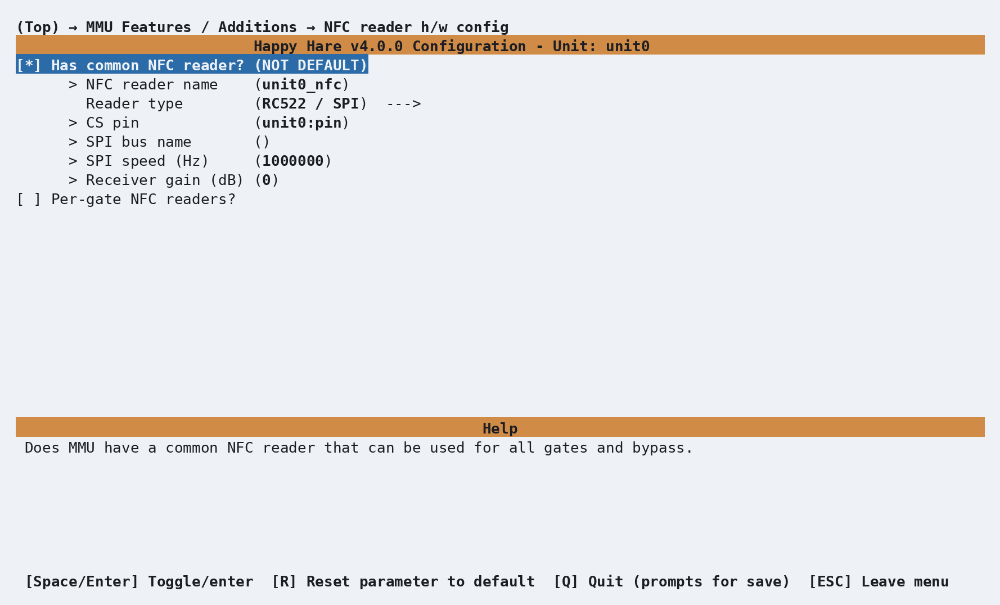

# Feature: NFC/RFID Reading

## Concept

An NFC/RFID reader scans the tag on a filament spool and reports its UID -
a fixed identifier unique to that tag. On its own, a UID is just a string;
what makes it useful is [Spoolman](Feature-Spoolman.md), which resolves that
UID to a spool record and, from there, to filament attributes and gate
assignment. **This page covers the readers and the scan itself; what
happens with a resolved spool is [Feature: Spoolman / Filament Hub](Feature-Spoolman.md).**
The two pages cross-reference constantly - if you're setting this up for
the first time, read both.

Happy Hare supports two reader arrangements, and a unit can have either or
both at once:

- **A shared reader.** One reader, presented with a spool by hand - not
  built into any particular gate. It polls automatically once configured;
  present a tag and Happy Hare resolves it in the background. The result is
  held as a **pending spool ID** until the next filament is loaded or
  preloaded, at which point it's applied to that gate - the same "pending"
  mechanism [`MMU_GATE_MAP NEXT_SPOOLID=`](Feature-Spoolman.md#tuning) uses,
  and governed by the same `spoolman_pending_id_timeout`.
- **Per-gate readers.** One reader per gate, positioned to see the tag on
  whatever spool is loaded into that specific gate. These aren't polled
  continuously - see [Per-gate readers](#per-gate-readers-automatic-reads-during-preload)
  below for exactly when they're read.

A read can be shallow or deep:

- **UID-only** - just the tag's identifier. Enough to resolve a spool that's
  already registered in Spoolman.
- **Deep read** (`nfc_deep_read`, on by default) - also parses the tag's
  own stored data, when the tag carries any. Several third-party tag
  formats are recognized (Bambu, Creality, and the plain NDEF format used by
  OpenSpool/OpenTag-style tags and printable QR/NFC combo tags), giving
  material, color, vendor and temperature straight from the tag - useful
  on its own, and it's *also* what feeds
  [Spoolman auto-create](Feature-Spoolman.md#parameter-setup) for a tag
  Spoolman has never seen before. A tag in a format Happy Hare doesn't
  recognize still yields its UID; it just won't have parsed metadata.

## Hardware Setup

Enable this in menuconfig with **Has NFC reader(s) for RFID tag?** under
**_RFID (BETA)**, which opens an **NFC reader config** menu:

**Shared reader** (toggle **Has common NFC reader?**):

!!! example "Reader settings by type"

    === "RC522 (SPI)"

        | Setting | Purpose |
        |---|---|
        | `NFC reader name` | Klipper object name - defaults to `<unit>_nfc` |
        | `Reader type` | Select **RC522 / SPI** |
        | `CS pin` | Required chip-select pin |
        | `SPI bus name` | Optional hardware SPI bus; blank uses the MCU's default bus |
        | `SPI speed` | Defaults to 1MHz; RC522 supports up to 10MHz |
        | `Receiver gain` | `0` keeps the chip default (33dB); selectable values are 18, 23, 33, 38, 43, or 48dB |

    === "PN5180 (SPI)"

        | Setting | Purpose |
        |---|---|
        | `NFC reader name` | Klipper object name - defaults to `<unit>_nfc` |
        | `Reader type` | Select **PN5180 / SPI** |
        | `CS pin` | Required chip-select pin |
        | `SPI bus name` | Optional hardware SPI bus; blank uses the MCU's default bus |
        | `SPI speed` | Defaults to 1MHz; PN5180 supports up to 7MHz |
        | `BUSY pin` | Required; signals when a command has completed |
        | `RST pin` | Required; lets the driver recover an unresponsive reader |
        | `Receiver gain` | `0` keeps the chip default (50dB); selectable values are 33, 40, 50, or 57dB |

    === "PN532 (I2C)"

        | Setting | Purpose |
        |---|---|
        | `NFC reader name` | Klipper object name - defaults to `<unit>_nfc` |
        | `Reader type` | Select **PN532 / I2C** |
        | `I2C MCU name` | MCU that owns the I2C bus |
        | `I2C address` | Fixed at `0x24` |
        | `I2C bus type` | Hardware I2C, or software I2C on a dedicated GPIO pair |
        | *(hardware)* `I2C bus name` | Optional hardware I2C bus; blank uses the MCU's default bus |
        | *(software)* `SCL pin`, `SDA pin` | Required bit-banged bus pins; give each PN532 on the same MCU its own pair |
        | `I2C speed` | Defaults to 100kHz |
        | `Receiver gain` | `0` keeps the chip default (33dB); selectable values are 18, 23, 33, 38, 43, or 48dB |

    === "PN532 (UART)"

        | Setting | Purpose |
        |---|---|
        | `NFC reader name` | Klipper object name - defaults to `<unit>_nfc` |
        | `Reader type` | Select **PN532 / UART** |
        | `Serial device path` | Stable `/dev/serial/by-id/` path for the reader's host USB-serial adapter |
        | `Baud rate` | Defaults to 115200; one reader requires one adapter |
        | `Receiver gain` | `0` keeps the chip default (33dB); selectable values are 18, 23, 33, 38, 43, or 48dB |

    === "PN532 (SPI)"

        | Setting | Purpose |
        |---|---|
        | `NFC reader name` | Klipper object name - defaults to `<unit>_nfc` |
        | `Reader type` | Select **PN532 / SPI** |
        | `CS pin` | Required chip-select pin |
        | `SPI bus name` | Optional hardware SPI bus; blank uses the MCU's default bus |
        | `SPI speed` | Defaults to 1MHz |
        | `Receiver gain` | `0` keeps the chip default (33dB); selectable values are 18, 23, 33, 38, 43, or 48dB |

    === "PN7160 (I2C)"

        | Setting | Purpose |
        |---|---|
        | `NFC reader name` | Klipper object name - defaults to `<unit>_nfc` |
        | `Reader type` | Select **PN7160 / I2C** |
        | `I2C MCU name` | MCU that owns the I2C bus |
        | `I2C address` | Defaults to `0x28`; selectable range is `0x28`-`0x2B` |
        | `I2C bus type` | Hardware I2C, or software I2C on any GPIO pair |
        | *(hardware)* `I2C bus name` | Optional hardware I2C bus; blank uses the MCU's default bus |
        | *(software)* `SCL pin`, `SDA pin` | Required bit-banged bus pins |
        | `I2C speed` | Defaults to 100kHz |
        | `VEN pin` | Optional reader-enable pin |
        | `IRQ pin` | Optional but recommended; lets the presence probe check the line directly |
        | `Receiver gain` | `0` keeps the protocol-profile defaults (53dB for NFC-A, 51dB for ISO15693); selectable values are 18, 26, 32, 39, 44, 51, 53, or 60dB |

<p align="center">
  
</p>

A single shared reader - one physical reader a spool is presented to by
hand, not built into any gate - fits a moving-carriage design like ERCF
above particularly well, since there's naturally only one place on the
machine to put it. Per-gate readers (below) are available on any MMU
type regardless of selector design - it's purely a choice of how much
reader hardware you want to build, not something ERCF's mechanism
precludes.

**Per-gate readers** (toggle **Per-gate NFC readers?**): the same setting
group repeats per gate, each independently pointed at its own reader -
useful for the software-I2C case above, where every gate gets its own bus
and the shared `0x24`/`0x28` address stops being a conflict.

That produces one `[mmu_nfc_reader <name>]` section per reader in
`mmu_hardware.cfg`. A shared RC522 over SPI:

```ini
[mmu_nfc_reader unit0_nfc]
reader_type : rc522
cs_pin      : unit0:PA4
spi_speed   : 1000000
debug       : 0
```

A per-gate PN532, wired for software I2C so each gate gets an independent
bus at the shared `0x24` address:

```ini
[mmu_nfc_reader unit0_nfc0]
reader_type          : pn532
i2c_mcu              : unit0
i2c_address          : 36
i2c_software_scl_pin : unit0:PB8
i2c_software_sda_pin : unit0:PB9
i2c_speed            : 100000
debug                : 0
```

A per-gate PN532 wired for UART (HSU) instead - the only reader type that
doesn't connect to an MCU at all:

```ini
[mmu_nfc_reader unit0_nfc0]
reader_type : pn532
interface   : uart
serial      : /dev/serial/by-id/usb-1a86_USB_Serial-if00-port0
baud        : 115200
debug       : 0
```

!!! tip "PN532 over UART (HSU)"
    This reader plugs into a USB-serial adapter on the **host**, not into any
    MCU - Klipper opens the serial port itself, so there are no pins to set
    beyond the reader's own serial lines (`serial`, and optionally `baud`,
    which defaults to 115200). Set the breakout board's mode pads to
    `SEL0=0`, `SEL1=1` (SPI mode uses `SEL0=0`, `SEL1=0` instead - easy to
    mix up), then wire adapter TX→PN532 RX, RX→TX, plus GND and power. Use
    the `/dev/serial/by-id/` path (list them with `ls /dev/serial/by-id/`)
    rather than `/dev/ttyUSB0` - the latter isn't stable across reboots or
    replugs and can silently point at a different device afterwards. One
    reader per adapter, exclusively - for more than one reader, use software
    I2C instead (above).

    An unplugged or disconnected adapter doesn't stop Klipper from starting -
    the reader just comes up reporting `alive=0`. Reconnect it and run
    `MMU_RFID_INIT` (or `MMU_NFC ... INIT=1`) to bring it back without a
    restart.

The owning `[mmu_unit]` in the same file then names the reader(s) it uses -
`nfc_reader` for a shared reader, or `nfc_readers` (one name per gate, blank
for a gate with none) for per-gate:

```ini
nfc_reader  : unit0_nfc               # Shared reader
nfc_readers : unit0_nfc0, unit0_nfc1  # Per-gate, one per gate slot
```

!!! tip
    A single unit can mix both: a shared reader for spools you present by
    hand, plus per-gate readers on the gates that have room for one.

## Parameter Setup

In `mmu_parameters.cfg` (per unit):

```ini
nfc_deep_read               : 1        # Parse full tag contents, not just the UID
nfc_gate_jog_scan_window    : -50, 50  # Max retract/extrude (mm) when jogging to find a tag during MMU_NFC_SCAN. "0, 0" disables jogging
nfc_preload_jog_scan_window : -50, 50  # Same, but for the compound NFC/gate home MMU_PRELOAD runs (see Tuning). Defaults to nfc_gate_jog_scan_window's value
nfc_neighbor_check          : 0        # Refuse a tag identified as a neighboring gate's own, instead of misattributing it (see Tuning). 0 = off (default)
nfc_field_probe_reads       : 3        # How many times to probe a gate's reader for "anything in this field?" - only used with nfc_neighbor_check/_evict_distance
nfc_neighbor_evict_distance : 0        # Also jog a neighbor's filament out of the field before reading (mm, signed - see Tuning). 0 = off (default)
nfc_led_segment             : auto     # auto | status | exit | entry - which LED segment shows read/fail feedback
```

`nfc_deep_read` gates everything metadata-related: with it off, readers
still resolve tags to spools by UID, but never parse tag contents, never
populate the gate map from tag data directly, and never feed Spoolman
auto-create. `nfc_gate_jog_scan_window` and `nfc_preload_jog_scan_window`
only matter for per-gate readers - each is the range a different operation
will jog the filament while hunting for a tag that isn't already sitting on
the reader: [`MMU_NFC_SCAN`](#commands) uses the former,
`MMU_PRELOAD`'s automatic reader/endstop race (see [Tuning](#tuning)) uses
the latter. They're independently tunable because preload frequently homes
against a different endstop (the gate's own entry sensor) than a normal gate
load does, making the two moves' safe jogging range not always the same -
but `nfc_preload_jog_scan_window` defaults to whatever
`nfc_gate_jog_scan_window` is set to, so most setups never need to touch it
separately. Keep both inside your gate's safe travel, and size them
generously (480mm+) if you want a full spool rotation's worth of reach.
`nfc_led_segment: auto` follows the reader type - `status` for a
shared/bypass reader, `exit` for a per-gate one. `nfc_neighbor_check` and
`nfc_neighbor_evict_distance` only matter with per-gate readers spaced close
enough that one gate's field can reach a spool parked at the gate next door
- see [Noisy neighbors](#noisy-neighbors) below for when to turn them on.
`nfc_field_probe_reads` only affects those two: a tag right at the edge of a
field reads intermittently, so it controls how many probes it takes before
deciding "nothing there" is really nothing there.

Spoolman's side of this - `spoolman_nfc_auto_create` (create an unknown tag
as a new spool) and `spoolman_pending_id_timeout` (how long a shared read
stays pending) - live in `mmu.cfg` and are documented on
[Feature: Spoolman / Filament Hub](Feature-Spoolman.md#parameter-setup).

## Commands

Full parameter reference: [`MMU_NFC`](Reference-Commands.md#mmu_nfc),
[`MMU_NFC_SCAN`](Reference-Commands.md#mmu_nfc_scan),
[`MMU_GATE_MAP`](Reference-Commands.md#mmu_gate_map), and
[`MMU_SPOOLMAN_TAG`](Reference-Commands.md#mmu_spoolman_tag).

`MMU_NFC` is the day-to-day status/control command, addressing either the
shared reader, one gate, or several:

```text
MMU_NFC                        # Status of every configured reader
MMU_NFC DETAILS=1              # As above, but show the actual cached UIDs
MMU_NFC GATE=3 READ=1          # Read the reader on gate 3 once, report the result
MMU_NFC SHARED=1 READ=1 DEEP=1 # Read the shared reader and report parsed tag metadata
MMU_NFC SHARED=1 REGISTER=1    # Read + resolve/auto-create in Spoolman, report only (no gate map change)
MMU_NFC GATE=2 REGISTER=1      # Read on gate 2 and apply to the gate map, as if auto-scanned
MMU_NFC GATE=2 REGISTER=1 APPEND=1  # Read a 2nd tag on gate 2 and bind it onto the spool already assigned there
MMU_NFC GATE=2 ENABLE=0        # Hard-disable the reader on gate 2 (a disabled reader is never read)
MMU_NFC GATE=2 INIT=1          # (Re)initialize a reader that isn't responding
MMU_NFC INIT_ALL=1             # (Re)initialize every reader on every unit
```

```{.text .console-command}
MMU_NFC DETAILS=1
```

```{.text .console-output}
MMU NFC readers:
shared:  enabled=1 active=1 alive=1 tag=none
gate 0:  enabled=1 active=1 alive=1 tag=E2003412
gate 1:  enabled=1 active=0 alive=1 tag=none
```

`MMU_NFC_SCAN` re-reads the tag on a gate that's already parked - useful if
you swapped the spool without unloading/reloading, or a reader missed the
tag the first time. It jogs the filament within
`nfc_gate_jog_scan_window` until the tag reaches the reader, reads it, then
re-parks:

```text
MMU_NFC_SCAN        # Scan the current gate
MMU_NFC_SCAN GATE=2 # Scan a specific gate
```

### Managing stored RFID UIDs

Happy Hare keeps two related values: the **gate RFID**, which is the single
UID physically observed at a gate, and the **Spoolman RFIDs**, which are all
UIDs registered to a spool.

Successful NFC reads update the gate RFID automatically. A shared-reader UID
is applied when its gate is loaded or preloaded. You can also set or clear the
value manually:

```text
MMU_GATE_MAP GATE=2 RFID=AABBCCDD # Set the UID observed at gate 2
MMU_GATE_MAP GATE=2 RFID=''       # Clear it
```

The value must be one even-length hexadecimal UID. It is normalized to
uppercase; comma-separated or otherwise invalid values are ignored. Resetting
a gate or marking it empty also clears its gate RFID. Spoolman synchronization
never replaces this value, so it continues to identify the tag the printer
actually observed.

Use `MMU_SPOOLMAN_TAG` to manage the complete set of UIDs stored against a
Spoolman spool. Identify the spool directly with `SPOOLID=`, or use `GATE=`
to target the spool currently assigned to a gate:

```text
MMU_SPOOLMAN_TAG SPOOLID=45 RFID=AABBCCDD          # Replace the spool's UID set
MMU_SPOOLMAN_TAG SPOOLID=45 RFID=AABBCCDD,EEFF0011 # Replace it with multiple UIDs
MMU_SPOOLMAN_TAG GATE=2 RFID=AABBCCDD              # Replace by assigned gate instead
MMU_SPOOLMAN_TAG GATE=2 RFID=EEFF0011 APPEND=1     # Add a UID without removing the others
MMU_SPOOLMAN_TAG GATE=2 RFID=''                    # Clear every UID from the spool
```

UIDs are normalized and duplicates removed. To register a gate's already
observed UID against an existing spool, use `REGISTER=1`; add `APPEND=1` to
preserve that spool's other UIDs:

```text
MMU_SPOOLMAN_TAG GATE=2 SPOOLID=45 REGISTER=1
MMU_SPOOLMAN_TAG GATE=2 SPOOLID=45 REGISTER=1 APPEND=1
```

Alternatively, read and resolve a tag directly through the gate's NFC reader:

```text
MMU_NFC GATE=2 REGISTER=1          # Resolve the UID, or auto-create a spool from its metadata
MMU_NFC GATE=2 REGISTER=1 APPEND=1 # Attach a second tag to the gate's assigned spool
```

`APPEND=1` on an NFC read only makes sense when the addressed per-gate reader
already has a spool assigned (from an earlier scan, or set manually with
[`MMU_GATE_MAP`](Feature-Spoolman.md#commands)/[`MMU_SPOOLMAN`](Feature-Spoolman.md#commands)).
The newly read tag is bound directly onto that spool instead of being
resolved or auto-created as an unknown tag. Two cases fall back instead of
binding:

- **`SHARED=1 REGISTER=1 APPEND=1`** - the shared reader has no gate
  assignment to bind onto, so this is rejected; use [`MMU_SPOOLMAN_TAG
  SPOOLID=<id> RFID=<uid> APPEND=1`](Feature-Spoolman.md#mmu_spoolman_tag-registering-a-tag-uid)
  directly instead, naming the spool explicitly.
- **The addressed gate has no spool assigned yet** - `APPEND=1` is ignored
  (logged, not an error) and the read falls back to normal resolve/
  auto-create, the same as without `APPEND=1`.

See [Registering an unresolved tag](#registering-an-unresolved-tag-after-the-fact)
for a complete after-the-fact workflow, and
[Feature: Spoolman / Filament Hub](Feature-Spoolman.md#mmu_spoolman_tag-registering-a-tag-uid)
for Spoolman support-mode restrictions and assignment details.

### Advanced: raw per-reader commands

Each `[mmu_nfc_reader <name>]` also answers three low-level commands that
talk to that one reader chip directly, bypassing Happy Hare's gate map,
Spoolman lookup, and enabled/active guards entirely - useful for bench-
testing a reader in isolation, less useful for normal operation (prefer
`MMU_NFC` for that): `MMU_RFID_INIT`, `MMU_RFID_READ [TIMEOUT=0.5]`,
`MMU_RFID_RELEASE`. All three take `NAME=<reader>`, only required if more
than one reader is configured.

## Printer variables exposed

`printer.mmu.nfc` is a list of per-unit dicts, present only when at least
one unit has a reader configured:

```{.text .console-output}
{'unit': 'unit0', 'polling': True,
 'shared': {'enabled': True, 'active': True, 'alive': True, 'present': False, 'uid': None},
 'gates': {0: {'enabled': True, 'active': True, 'alive': True, 'present': True, 'uid': 'E2003412'}}}
```

`gate_spool_rfid` (per-gate list, on `printer.mmu`) holds the same cached
UID, indexed by global gate number instead of nested by unit - the more
convenient form for a macro that only cares about one gate. Full reference:
[Printer Variables: NFC](Reference-Printer-Variables.md#nfc).

If LEDs are configured, reads and failures get a brief flash on the segment
`nfc_led_segment` selects - there's no separate persistent NFC indicator
beyond that transient effect.

## Tuning

### Shared reader workflow

1. Present the spool's tag to the reader.
2. Happy Hare resolves it via Spoolman in the background - nothing to run
   manually. If it resolves to a known spool, configured LEDs (see
   [Feature: LEDs](Feature-LEDs.md#parameter-setup)) pulse a slow purple
   breathing effect (`effect_pending_spoolid`) to show a spool ID is
   waiting to be claimed - the same overlay [`MMU_GATE_MAP
   NEXT_SPOOLID=`](Feature-Spoolman.md#tuning) uses, since it's the same
   underlying pending mechanism either way.
3. The pulse speeds up (`effect_pending_spoolid_expiring`) a few seconds
   before `spoolman_pending_id_timeout` runs out, as a last warning before
   the assignment is voided and the tag would need to be re-presented.
4. Load or preload filament as normal (`MMU_PRELOAD`, or just load into the
   gate if you have entry sensors) before the timeout expires. The resolved
   spool ID is applied to whichever gate that operation targets, and the
   pulsing overlay stops.

This is the same underlying mechanism as
[Spoolman's generic external-reader workflow](Feature-Spoolman.md#auto-setting-from-a-qr-code-or-any-external-reader) -
a shared NFC reader is simply one source that can produce a pending spool
ID; a QR code scanned by hand is another.

### Per-gate readers: automatic reads during preload

A gate with its own reader doesn't need a separate scan step in the normal
case: running `MMU_PRELOAD` on that gate automatically homes against
*whichever comes first* of the gate's physical endstop and its reader. The
console banner changes to confirm it - "Preloading gate N with NFC
scan...". Two outcomes:

- The **reader** triggers first (tag was between the park position and the
  endstop): the tag is read immediately, then homing continues on to the
  physical endstop as normal.
- The **endstop** triggers first (tag is further in): Happy Hare sweeps
  forward through `nfc_preload_jog_scan_window` looking for the tag, then
  re-homes back to the endstop before parking.

Use [`MMU_NFC_SCAN`](#commands) instead when the gate is already parked and
you want to (re-)read its tag without a full unload/preload cycle - e.g.
you physically swapped spools without telling Happy Hare.

### Auto-creating spools from unknown tags

To have an unregistered tag mint a new Spoolman spool automatically instead
of just failing to resolve:

1. `nfc_deep_read: 1` on the unit (default) - auto-create needs the parsed
   tag data, not just a UID.
2. `spoolman_nfc_auto_create: 1` in `mmu.cfg`.
3. `spoolman_support: push` or `pull` in `mmu.cfg` - `off`/`readonly` never
   write to Spoolman, so auto-create is suppressed regardless of this
   setting in those modes.

With all three set, scanning a brand-new tag that carries recognizable
filament data (see [Concept](#concept)) creates the spool in Spoolman and
registers the tag against it in the same step - the next scan of that same
tag resolves normally.

### Registering an unresolved tag after the fact

Auto-create needs a tag that actually carries usable filament data - a
blank tag, or one in a format Happy Hare can't parse, has nothing for
auto-create to work from and just won't resolve, even with everything above
enabled. That's fine - the UID is still recorded on the gate regardless of
whether it resolved (see [Concept](#concept)), so nothing about the scan
needs to be redone once a matching spool exists. A typical sequence for a
per-gate reader:

1. Remove the old spool, unbox the new filament, and stick a blank (or
   otherwise unregistered) tag on it.
2. `MMU_PRELOAD` it into the gate as normal. The console confirms the scan
   happened ("Preloading gate N with NFC scan...", or "tag ... recorded for
   gate N (no usable filament data)" for a blank tag) - but with no match
   in Spoolman and no metadata to auto-create from, nothing resolves.
3. Create the spool in Spoolman by hand, away from the printer - often
   easiest with the new filament's box in front of you to copy its
   parameters across.
4. Back at the printer:
   [`MMU_SPOOLMAN_TAG GATE=LAST SPOOLID=456
   REGISTER=1`](Feature-Spoolman.md#mmu_spoolman_tag-registering-a-tag-uid) -
   `GATE=LAST` picks up whichever gate was just preloaded, so there's
   nothing to look up. Happy Hare binds the gate's already-cached UID onto
   spool 456, and the gate map updates as a result, no re-scan needed.

See [Feature: Spoolman / Filament Hub: `MMU_SPOOLMAN_TAG`](Feature-Spoolman.md#mmu_spoolman_tag-registering-a-tag-uid)
for the command in full, including why `REGISTER=1` needs
`spoolman_support: readonly` or `push` specifically.

### Registering a second tag on the same spool

A spool can carry more than one physical tag - e.g. one stuck on each side,
so it resolves correctly no matter which way round it gets loaded. Reading
a second, previously-unseen UID normally treats it as an entirely different,
unregistered tag; it has to be bound onto the existing spool explicitly
instead. Two equivalent ways to do that:

1. **Scan it in** - load (or preload) the gate that already has the first
   tag's spool assigned, present the second tag to that gate's reader, then
   `MMU_NFC GATE=<n> REGISTER=1 APPEND=1` binds whatever it reads onto that
   gate's already-assigned spool.
2. **Type it in** - if both UIDs are already known, skip the reader
   entirely: `MMU_SPOOLMAN_TAG SPOOLID=<id> RFID=<new-uid> APPEND=1`.

Either path ends up calling the same underlying Spoolman write, so the
result is identical - pick whichever is more convenient at the time. A UID
that turns out to already be registered against a *different* spool is
moved over automatically either way (and the move is logged), rather than
silently leaving both spools claiming it - useful if a tag was bound to the
wrong spool by mistake earlier.

### Multiple same-address readers

PN532 is fixed at I2C address `0x24` and PN7160 at `0x28`-`0x2B` - two
PN532s (e.g. one per gate) can't share a hardware I2C bus. Give each its
own software I2C pin pair instead (see [Hardware Setup](#hardware-setup))
and the fixed address stops mattering, since each is now its own private
bus. Each software bus needs its own pull-up resistors on both lines -
unlike a hardware I2C bus, which gets pull-ups built into the MCU/board, a
bit-banged pin pair has none, and without them reads fail or come back
garbled intermittently rather than with a clean error.

### Noisy neighbors

With per-gate readers spaced closely, a spool parked at a neighboring gate
can sit inside *this* gate's own RF field. Since most spools carry a tag on
both faces, that neighbor's tag can trigger this gate's preload NFC endstop
or an `MMU_NFC_SCAN` before the filament has moved at all, misattributing
the neighbor's spool to this gate. Two independent settings address it,
both off by default so a stock setup pays no extra reader I/O:

- **`nfc_neighbor_check: 1`** - before trusting a read, check the tag's UID
  against the gate map first. A tag that's unregistered, or already
  registered to *this* gate, is read normally; a tag registered to a
  *different* gate is refused rather than attributed - the read fails
  cleanly instead of silently assigning the wrong spool.
  `nfc_field_probe_reads` (default 3) controls how many times the reader is
  probed when asking "is anything in this field at all?" before deciding -
  a tag right at the edge of the field reads intermittently, so a single
  probe can miss it.
- **`nfc_neighbor_evict_distance`** - adds motion on top of the check
  above: instead of just refusing a neighbor's tag, temporarily load that
  neighbor gate and jog its filament this far (mm) off its park position
  until the field clears, then re-park it - even if the eviction attempt
  fails. Signed: positive jogs the neighbor *forward* of its own gate,
  negative *behind* it. Must fit inside the matching half of that gate's
  `nfc_gate_jog_scan_window`. **A forward jog is only safe when
  `gate_homing_endstop` is the per-gate `mmu_exit` sensor** - on a shared
  exit path, jogging a neighbor forward would push its filament into the
  very gate you're trying to read rather than clearing it, so use a
  negative (backward) distance there instead. 0 disables eviction (the
  default) - reducing reader gain is *not* an equivalent fix, since a
  neighbor's tag can simply be physically closer than your own gate's tag
  ever gets.

!!! tip
    Both settings only ever engage on a per-gate reader whose gate is about
    to preload or `MMU_NFC_SCAN` - the shared-reader workflow has no
    "neighbor" concept, since nothing else is ever near a spool presented by
    hand.

## Troubleshooting

- **Reader reports `alive=0`** - check wiring and the pin/address settings
  match the physical board; try `MMU_NFC ... INIT=1` (or `INIT_ALL=1`)
  after fixing anything, since a reader that came up dead at boot isn't
  retried automatically. On a PN532/UART reader this is also the normal
  symptom of an unplugged or not-yet-connected USB-serial adapter - Klipper
  still starts fine either way; just reconnect and re-run `INIT=1`.
- **Reads report `enabled=0`** - the reader was explicitly disabled
  (`MMU_NFC ... ENABLE=0`, or it starts that way); re-enable with
  `ENABLE=1`, which also re-initializes it.
- **A deep read returns the UID but no metadata** - the tag isn't in one of
  the recognized formats (see [Concept](#concept)), or it's genuinely
  blank. UID-only resolution still works if the tag is already registered
  in Spoolman.
- **`MMU_NFC_SCAN` errors "gate is empty"** - it homes filament to find the
  tag, so there has to be filament in the gate first; preload it
  (`MMU_PRELOAD`) or, if that's wrong, mark the gate available with
  `MMU_GATE_MAP GATE=<n> AVAILABLE=1`.
- **A shared-reader tag never resolves** - confirm Spoolman is reachable and
  at a compatible version (see
  [Feature: Spoolman / Filament Hub troubleshooting](Feature-Spoolman.md#troubleshooting));
  an unresolved tag also won't retry on its own until it's removed and
  re-presented.
- **A scan logs "tag ... was registered to spool X - moving it to spool
  Y"** - informational, not an error: the tag was already bound to a
  different spool and Happy Hare re-pointed it to the one just scanned (see
  [Registering a second tag on the same spool](#registering-a-second-tag-on-the-same-spool)).
  Expected after re-tagging a spool or fixing a mistyped UID; worth
  double-checking the spool IDs named in the message if it appears
  unexpectedly.
- **A per-gate reader occasionally picks up a neighboring gate's spool** -
  see [Noisy neighbors](#noisy-neighbors) under Tuning; turn on
  `nfc_neighbor_check` (and, if that alone isn't enough,
  `nfc_neighbor_evict_distance`) rather than trying to fix it by lowering
  reader gain.

## See also

- [Feature: Spoolman / Filament Hub](Feature-Spoolman.md) - what a resolved
  tag actually does: activation, attributes, auto-create
- [Command Reference: `MMU_NFC`](Reference-Commands.md#mmu_nfc)
- [Command Reference: `MMU_NFC_SCAN`](Reference-Commands.md#mmu_nfc_scan)
- [Command Reference: `MMU_SPOOLMAN`](Reference-Commands.md#mmu_spoolman)
- [Command Reference: `MMU_SPOOLMAN_TAG`](Reference-Commands.md#mmu_spoolman_tag)
- [Command Reference: `MMU_GATE_MAP`](Reference-Commands.md#mmu_gate_map)
- [Printer Variables: NFC](Reference-Printer-Variables.md#nfc)

---
