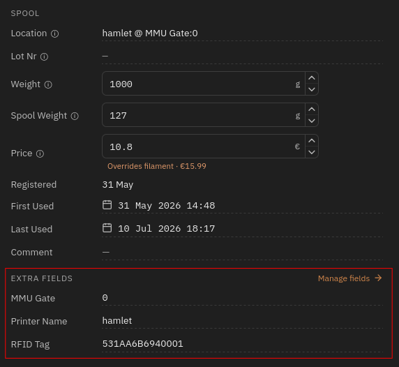
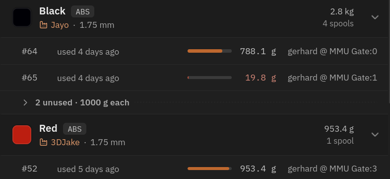
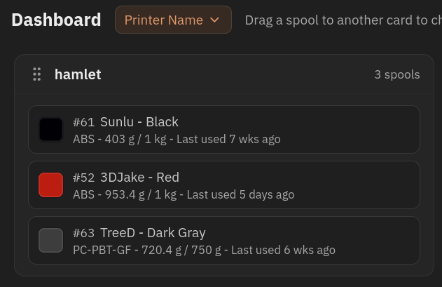
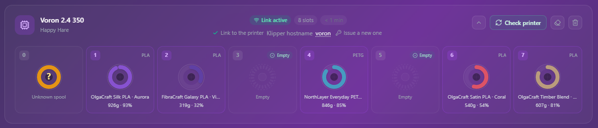

# Feature: Spoolman / Filament Hub

## Concept

[Spoolman](https://github.com/Donkie/Spoolman) is a self-hosted database for
tracking a filament spool collection - typically run alongside Moonraker on
the same Raspberry Pi. Happy Hare integrates with it in two independent ways:

- **Usage tracking and activation.** When Happy Hare selects a gate's
  filament, it tells Spoolman (via Moonraker) which spool is now active, so
  usage is logged against the right spool and the previous one is
  deactivated.
- **Filament attributes.** Spoolman can supply material, color and other
  attributes for a gate directly, instead of (or overriding) whatever is set
  locally - this is also refreshed in bulk whenever the MMU initializes.

Both depend on a `SpoolId` being associated with a gate. How that association
is set - and who "wins" when the local gate map and the Spoolman database
disagree - is controlled by `spoolman_support`, a single setting with four
modes:

| `spoolman_support` | Activates/deactivates spool? | Fetches attributes from spool_id? | Gate assignment shown in Spoolman? | Gate assignment pulled from Spoolman? |
|---|---|---|---|---|
| `off` | no | no | no | no |
| `readonly` | yes | yes | no | no |
| `push` | yes | yes | yes | no |
| `pull` | yes | yes | yes | yes |

`off` and `readonly` never write gate assignments to Spoolman - the local
gate map (persisted in `mmu_vars.cfg`) is the only copy that exists. `push`
also writes the local gate map to Spoolman, purely so it's visible there;
the local copy is still the source of truth. `pull` reverses that: Spoolman
becomes the source of truth, useful for a print farm managing several
printers' gate assignments centrally, and the local gate map is kept in sync
with it rather than the other way round.

Each gate's entry in the local gate map carries (at minimum) a filament
availability status, material, color, a load/unload speed override, and -
if Spoolman is enabled - a `SpoolId`. `MMU_GATE_MAP` reports it:

```{.text .console-output}
Gates / Filaments:
0 : On spool;  Id: 3    TPU  | 210C | DC6834 | Filamentum Industrial Flexifill TPU 98A Grey | RFID
1 : Buffered;  Id: 2    PETG | 220C | DCDA34 | n/a
2 : Empty;     Id: 1    PLA  | 200C | 8CDFAC | n/a
3 : Unknown             ABS  | 240C | n/a    | n/a [Speed:50%]
```

(The real console output also prefixes each line with a small color swatch
and any tools mapped to that gate - simplified here for readability.) A
gate showing `| RFID` has a tag UID cached locally from a scan - see
[NFC/RFID Reading](Feature-NFC.md), which covers the readers that populate
gates automatically instead of by hand.

If a gate has a `SpoolId` set, Spoolman's attributes for that spool
overwrite whatever material/color/name were set locally - so once a
`SpoolId` is current, keeping it up to date as spools are swapped is enough;
everything else follows automatically. That's also true of LEDs, if
configured, which reflect the spool's color.

## Moonraker Setup

Happy Hare's Moonraker extension (`mmu_server`) needs a few settings in
`moonraker.conf`:

```ini
[mmu_server]
enable_file_preprocessor: True
enable_toolchange_next_pos: True
update_spoolman_location: True
```

!!! warning "Important"
    Having this `[mmu_server]` section present is what matters - the exact
    set of options shown may differ from a fresh install. `update_spoolman_location`
    controls whether Spoolman's own "Location" field is overwritten with a
    printer/gate summary; set it `False` if you use that field for something
    else, and use the extra columns below instead.

Any `spoolman_support` mode other than `off` requires **Spoolman 0.18.1 or
later** - Happy Hare checks the connected version at startup and won't
activate itself against an older one (you'll see an "Incompatible Spoolman
version" message on the console). Once connected, it adds three extra
fields to Spoolman's spool records: `Printer Name`, `MMU Gate`, and `RFID`
(the tag UID(s) bound to that spool - a spool can carry more than one, e.g.
a tag stuck on each side, see [NFC/RFID Reading](Feature-NFC.md)).
They show up below the spool's main data in the details view in Spoolman:

<p align="center">
  
</p>

An alternative to showing these columns is Spoolman's own "Location" field,
which `update_spoolman_location` (above) keeps set to a `<printer> @ MMU
Gate:<n>` summary - useful with multiple printers/MMUs and less cluttered
than the extra columns.

## Parameter Setup

In `mmu.cfg`:

```ini
spoolman_support            : off   # off | readonly | push | pull
spoolman_pending_id_timeout : 20    # Seconds before a pending spool_id assignment is voided
spoolman_led_segment        : gate_status   # gate_status | status | both
spoolman_nfc_auto_create    : 0     # Auto-create a Spoolman spool from an unknown scanned tag - see Feature-NFC.md
```

`spoolman_pending_id_timeout` governs how long a "pending" `SpoolId` (set
with `NEXT_SPOOLID`, see [Tuning](#tuning) below, or by a shared NFC/RFID
scan) stays valid waiting for the next spool to be loaded, before it's
forgotten. `spoolman_led_segment` picks which LED segment(s) show the
pending-assignment overlay, if LEDs are fitted. `spoolman_nfc_auto_create`
only has any effect on a unit with an NFC/RFID reader and `nfc_deep_read`
enabled, and only in `push`/`pull` mode (auto-creating a spool is a write,
so `off`/`readonly` never do it regardless of this setting) - full detail on
[NFC/RFID Reading](Feature-NFC.md).

!!! tip
    Like other `mmu`/`mmu_parameters` settings, `spoolman_support` can be
    changed live with `MMU_TEST_CONFIG spoolman_support=xxx` to try out a
    mode without a Klipper restart - watch the Spoolman web UI update as you
    switch.

## Commands

Full parameter reference: [`MMU_SPOOLMAN`](Reference-Commands.md#mmu_spoolman),
[`MMU_GATE_MAP`](Reference-Commands.md#mmu_gate_map).

Day-to-day gate assignment normally goes through `MMU_GATE_MAP`, which
updates the local gate map first and then syncs to Spoolman if enabled:

```text
MMU_GATE_MAP GATE=0 SPOOLID=5          # Assign spool 5 to gate 0
MMU_GATE_MAP GATE=0 SPOOLID=-1         # Unset gate 0's spool (other attributes can still be set manually)
MMU_GATE_MAP NEXT_SPOOLID=45           # Auto-assign spool 45 to whichever gate is loaded/preloaded next (0 cancels)
```

`NEXT_SPOOLID` isn't available in `pull` mode - Spoolman already owns the
gate assignment there, so a locally-pending one has nothing to attach to;
Happy Hare rejects it with an error naming `push`/`readonly` as the modes
that support it.

`MMU_SPOOLMAN` manages the Spoolman side directly - useful for `pull` mode
(where `MMU_GATE_MAP` alone can't reach the remote assignment) and for
maintenance:

```text
MMU_SPOOLMAN                            # Show this printer's gate/spool assignments in Spoolman
MMU_SPOOLMAN GATE=1 SPOOLID=5           # Remotely associate gate 1 with spool 5 (any existing gate for spool 5 is cleared)
MMU_SPOOLMAN GATE=1                     # Unassign whatever spool is on gate 1
MMU_SPOOLMAN SPOOLINFO=1                # Show usage/remaining weight for spool 1 (0 or -1 = current active spool)
MMU_SPOOLMAN SYNC=1                     # Force a re-sync between local and remote gate maps
MMU_SPOOLMAN REFRESH=1                  # Rebuild the Moonraker/Spoolman cache, then re-sync
MMU_SPOOLMAN REFRESH=1 FIX=1            # As above, and clear any gate with more than one spool assigned to it
MMU_SPOOLMAN CLEAR=1                    # Clear every gate assignment for this printer in Spoolman
```

```{.text .console-command}
MMU_SPOOLMAN SPOOLINFO=1
```

```{.text .console-output}
Spool is: Matte Green (id: 1)
- Material: n/a
- Used: 56 g
- Remaining: 943 g
```

Operations combine in one call - e.g. to clear the database, fix any
inconsistencies, then assign spool 6 to gate 0:

```text
MMU_SPOOLMAN CLEAR=1 REFRESH=1 FIX=1 GATE=0 SPOOLID=6
```

Add `QUIET=1` to suppress console output.

### `MMU_SPOOLMAN_TAG` - registering a tag UID

`MMU_SPOOLMAN` (above) only ever assigns an *existing* Spoolman spool to a
gate - it has nothing to do with the physical NFC/RFID tag stuck on a spool.
Binding a tag's UID onto a spool record is a separate command,
`MMU_SPOOLMAN_TAG`, kept deliberately distinct so `SPOOLID=`/`GATE=` mean
one thing in each command rather than overloading them with two unrelated
jobs. See [Feature: NFC/RFID Reading](Feature-NFC.md) for the reader
hardware and the scanning side of this; this section is purely the
Spoolman-record-writing side.

Full parameter reference:
[`MMU_SPOOLMAN_TAG`](Reference-Commands.md#mmu_spoolman_tag).

There are two independent ways to end up with a tag bound to a spool,
depending on which one you have in hand first:

- **`RFID=`** - you already know the UID (typed in, copied from a scan, or
  printed on the spool's packaging) and the spool record already exists in
  Spoolman; write the UID directly onto it.
- **`REGISTER=1`** - the opposite order: a tag was already scanned onto a
  gate (so Happy Hare has its UID cached) but it didn't resolve to any
  spool at the time - a blank tag, or one Spoolman had never seen before.
  Once a matching spool exists (created by hand, or by some other means),
  bind the two together without re-scanning the tag.

**`RFID=`** writes a UID onto a spool record that already exists in
Spoolman - the case where a spool is registered but its tag isn't bound
yet (e.g. sticking a blank tag on it):

```text
MMU_SPOOLMAN_TAG SPOOLID=45 RFID=E2003412            # Bind tag UID E2003412 to spool 45 (replaces any existing tag(s))
MMU_SPOOLMAN_TAG SPOOLID=45 RFID=E2003499 APPEND=1   # Register a second tag on the same spool (e.g. one on each side), keeping E2003412
MMU_SPOOLMAN_TAG SPOOLID=45 RFID=''                  # Clear all tags registered against spool 45
MMU_SPOOLMAN_TAG GATE=0 RFID=E2003412                # Same, for whichever spool is currently assigned to gate 0
```

By default, `RFID=` **replaces** whatever tag(s) are currently registered
against the spool - `RFID=''` (empty) clears them entirely, the supported
way to unregister every tag from a spool. Add `APPEND=1` to add the given
tag *without* losing the one(s) already there instead - the case for a
spool with a tag stuck on each side, so either side scans to the same spool.
`APPEND=1` with an empty `RFID=` is rejected (nothing to add); use plain
`RFID=''` to clear instead. If the UID being written is currently
registered against a *different* spool, Happy Hare moves it over (logging
the move) and strips it from that other spool's record, rather than leaving
two spools claiming the same tag.

The same "second tag on one spool" case is also available from a live scan,
without retyping the UID by hand: [`MMU_NFC GATE=<n> REGISTER=1
APPEND=1`](Feature-NFC.md#commands) reads a newly-presented tag and binds it
straight onto whichever spool is already assigned to that gate. A reader
that scans an *unknown* tag and resolves or auto-creates a spool for it
automatically is that same page's `MMU_NFC ... REGISTER=1` without
`APPEND=1` - the opposite direction from everything on this page, which
only ever writes onto a spool that already exists.

**`REGISTER=1`** covers the case auto-create can't: a tag that never
resolved (wrong/no metadata, auto-create disabled, or Spoolman genuinely
never having seen it) and a spool for it that only came to exist
afterwards, created by hand. A typical sequence, for a per-gate reader:

1. Remove the old spool, unbox the new filament, and stick a (blank, or
   otherwise unregistered) tag on it.
2. `MMU_PRELOAD` the new spool into its gate as normal - the reader scans
   the tag on the way in, but with nothing in Spoolman to match it against,
   nothing resolves. The UID is still recorded on the gate either way (see
   [Feature: NFC/RFID Reading](Feature-NFC.md#per-gate-readers-automatic-reads-during-preload)) -
   this is what makes the next step possible without a re-scan.
3. Create the spool in Spoolman by hand (often easiest with the new
   filament's box in front of you, to copy its parameters across).
4. Back at the printer: `MMU_SPOOLMAN_TAG GATE=LAST SPOOLID=456
   REGISTER=1` - `GATE=LAST` resolves to whichever gate was most recently
   preloaded, so there's no need to remember or look up its number.
   Happy Hare takes the UID already cached on that gate and binds it onto
   spool 456 - the gate map updates as a result of that write actually
   succeeding (via the same Moonraker callback a live scan uses), not
   optimistically ahead of it.

`GATE=` defaults to the currently-selected gate if omitted (not `LAST`) -
useful right after preloading without needing `GATE=` at all, but `GATE=LAST`
is the more reliable choice if anything else has run in between.
`REGISTER=1` needs `spoolman_support` to be `readonly` or `push` - in
`pull` mode Spoolman already owns gate assignment, so use `RFID=` directly
or re-scan the tag once the spool exists instead.

## Printer variables exposed

| Variable | Type | Meaning |
|---|---|---|
| `spoolman_support` | string | `off` \| `readonly` \| `push` \| `pull` |
| `pending_spool_id` | int | Spoolman spool ID that will auto-assign to the next filament inserted, `-1` if none pending |
| `gate_spool_id` | list[int] | Spoolman spool ID per gate |
| `gate_spool_rfid` | list | Per-gate RFID/NFC tag UID, if read |
| `active_filament` | dict | `filament_name`, `material`, `vendor`, `color`, `spool_id`, `temperature` for the currently selected gate |

Full reference: [Printer Variables](Reference-Printer-Variables.md#core-state).

### UI (Mainsail/Fluidd/KlipperScreen/Spoolman)

On toolchange, Happy Hare deactivates the previous spool and activates the
new one - Mainsail and Fluidd's own Spoolman panel reflects this:

<p align="center">
  
</p>

[KlipperScreen Happy Hare Edition](https://github.com/moggieuk/KlipperScreen-Happy-Hare-Edition)
visualizes the gate map with Spoolman data (material, color, remaining
weight) alongside each gate, and lets you edit a gate's `SpoolId` directly:

<p align="center">
  
</p>

And in Spoolman's own web UI, every spool's row in the library view shows which
printer and gate it's currently assigned to:

<p align="center">
  
</p>

You can also group the dashboard by printer name:

<p align="center">
  
</p>

## Tuning

### Setting up each mode

Each diagram below shows what actually happens on the wire for that mode -
useful mainly for the `push`/`pull` cases, where it's not obvious up front
which side ends up authoritative for what.

#### `off`

Nothing to configure beyond the setting itself. Local material/color
attributes are used as-is; a `SpoolId` in the gate map isn't shown or used.
[Automatic tool-to-gate mapping](Reference-Commands.md#mmu_ttg_map) still
works but without Spoolman-sourced attributes to key off.

<pre class="hh-mermaid">
sequenceDiagram
    autonumber
    participant L as Local gate map
    participant K as Klipper

    K->>L: read gate map at startup
    L-->>K: gate map (no Spoolman involved)
</pre>

#### `readonly`

Set a `SpoolId` per gate with `MMU_GATE_MAP GATE=<n> SPOOLID=<id>`; Happy
Hare fetches and applies that spool's material/color from Spoolman
immediately, and again in bulk at every startup. Nothing is ever written
back to Spoolman in this mode.

<pre class="hh-mermaid">
sequenceDiagram
    autonumber
    participant L as Local gate map
    participant K as Klipper
    participant M as Moonraker
    participant S as Spoolman

    K->>L: read gate map at startup
    L-->>K: gate map (with any SpoolIds)
    K->>M: request filament attributes for each SpoolId
    M->>S: look up spool details
    S-->>M: material, color, ...
    M->>K: MMU_GATE_MAP MAP={filament details}
    K->>L: update local attributes
</pre>

#### `push`

Same day-to-day commands as `readonly`, but every assignment is also
pushed to Spoolman so it shows up there (see [Commands](#commands) above),
and the full gate map is pushed once at startup too. The local
`mmu_vars.cfg` copy stays authoritative throughout.

<pre class="hh-mermaid">
sequenceDiagram
    autonumber
    participant L as Local gate map
    participant K as Klipper
    participant M as Moonraker
    participant S as Spoolman

    K->>L: read gate map at startup
    L-->>K: gate map
    K->>M: push gate/SpoolId assignments
    M->>S: write printer + gate association
    M->>S: read filament attributes
    S-->>M: material, color, ...
    M->>K: MMU_GATE_MAP MAP={filament details}
    K->>L: update local attributes
</pre>

Updating a gate assignment afterwards (`MMU_GATE_MAP GATE=3 SPOOLID=74`)
runs the same round-trip on demand instead of only at startup:

<pre class="hh-mermaid">
sequenceDiagram
    autonumber
    participant MF as Mainsail/Fluidd
    participant L as Local gate map
    participant K as Klipper
    participant M as Moonraker
    participant S as Spoolman

    MF->>K: MMU_GATE_MAP GATE=3 SPOOLID=74
    K->>L: write local gate map
    K->>M: push the change
    M->>S: write gate/SpoolId association
    M->>S: read filament attributes
    S-->>M: material, color, ...
    M->>K: MMU_GATE_MAP MAP={filament details}
    K->>L: update local attributes
</pre>

#### `pull`

Manage assignments with `MMU_SPOOLMAN` instead of `MMU_GATE_MAP` (see
[Commands](#commands)); Spoolman is authoritative and the local gate map
is overwritten to match, both at startup and whenever you push a change. A
gate with no `SpoolId` assigned shows only its bare status
(`Empty`/`Unknown`) since there's no local attribute data to fall back on.

<pre class="hh-mermaid">
sequenceDiagram
    autonumber
    participant L as Local gate map
    participant K as Klipper
    participant M as Moonraker
    participant S as Spoolman

    K->>L: read gate map at startup
    L-->>K: (stale) gate map
    K->>M: pull remote gate map + filament attributes
    M->>S: read gate/SpoolId assignments + attributes
    S-->>M: gate map + attributes
    M->>K: MMU_GATE_MAP MAP={remote gate map}
    K->>L: overwrite local gate map
</pre>

Updating a gate assignment goes through `MMU_SPOOLMAN` instead of
`MMU_GATE_MAP`, since Spoolman - not the local copy - is what needs to
change:

<pre class="hh-mermaid">
sequenceDiagram
    autonumber
    participant MF as Mainsail/Fluidd
    participant K as Klipper
    participant M as Moonraker
    participant S as Spoolman
    participant L as Local gate map

    MF->>K: MMU_SPOOLMAN GATE=3 SPOOLID=74
    K->>M: update remote gate map
    M->>S: write gate/SpoolId association
    M->>S: read filament attributes
    S-->>M: gate map + attributes
    M->>K: MMU_GATE_MAP MAP={remote gate map}
    K->>L: update local gate map
</pre>

### Working with a remote gate map (`pull`)

Useful when a fleet of printers shares one Spoolman database and gate
assignments are managed centrally rather than per-printer. `MMU_SPOOLMAN`
with no parameters lists this printer's own gate assignments; add
`PRINTER=<name>` to check another printer sharing the same database:

```{.text .console-command}
MMU_SPOOLMAN PRINTER=BigRed
```

```{.text .console-output}
Spoolman gate assignment for printer: BigRed
Gate | SpoolId
-----+--------
0    | 1
1    | 23
2    |
3    | 41
```

Changing the *local* gate map in this mode doesn't stick - the next sync
overwrites it from Spoolman. Use `MMU_SPOOLMAN GATE=<n> SPOOLID=<id>` to
change the assignment remotely instead, which then propagates back down.

### Re-syncing / recovering

Happy Hare re-syncs on its own when it needs to, but if the local and
remote gate maps ever look out of step:

```text
MMU_SPOOLMAN SYNC=1              # Re-sync local <-> remote in the direction spoolman_support implies
MMU_SPOOLMAN REFRESH=1           # Rebuild the Moonraker cache first, then sync
MMU_SPOOLMAN REFRESH=1 FIX=1     # ...and clear any gate with more than one spool assigned to it
```

Avoid running `REFRESH=1` against a large Spoolman database mid-print - it's
a full cache rebuild, not a quick lookup.

### Auto-setting from a QR code (or any external reader)

Happy Hare's own [NFC/RFID readers](Feature-NFC.md) resolve a scanned tag
automatically, but the same mechanism is available to *any* external
source that can hand Happy Hare a spool ID - a QR code printed by Spoolman
and read by a phone/webcam, or a project like
[nfc2klipper](https://github.com/bofh69/nfc2klipper) driving its own
reader. Whatever the source, the workflow is the same:

1. Look up the spool ID (however your reader/scanner does it).
2. Call `MMU_GATE_MAP NEXT_SPOOLID=<id>` with it.
3. Insert the filament - either run `MMU_PRELOAD` to load and park it, or,
   with entry sensors fitted, just feed it into the back of the gate (this
   can even be done mid-print).

The gate that ends up loaded gets that `SpoolId`, with material/color
pulled from Spoolman - governed by the same `spoolman_pending_id_timeout`
that bounds a shared NFC/RFID scan.

## FilamentHub

[FilamentHub](https://filamenthub.ru/) is a filament and spool manager with a
Spoolman-compatible API. It can be used as an alternative backend for Happy
Hare's existing Spoolman integration, while Happy Hare continues to use
Moonraker's normal `[spoolman]` component and the same synchronization workflow.

To let FilamentHub manage the remote gate map:

1. On FilamentHub's **My Filaments** page, select the physical printer and
   create a **Happy Hare** material system. When opened inside FilamentHub's
   OrcaSlicer plugin, the setup can use the Moonraker connection already stored
   in the selected OrcaSlicer printer profile.
2. Set [`spoolman_support: pull`](#working-with-a-remote-gate-map-pull) in
   `mmu.cfg`. FilamentHub also recommends `t_macro_color: gatemap` for the
   displayed tool colors; see [Extruder/Filament Color](Mainsail-Fluidd-Integration.md#extruderfilament-color)
   for what that option changes.
3. Copy the generated block into `moonraker.conf`:

    ```ini
    [spoolman]
    server: https://filamenthub.ru/api/v1/spool_compat/<device-key>
    sync_rate: 5
    ```

    `sync_rate: 5` uses Moonraker's default. It isn't a FilamentHub requirement;
    choose another interval if appropriate for the installation. See
    [Moonraker's `[spoolman]` configuration](https://moonraker.readthedocs.io/en/latest/configuration/#spoolman)
    for the option's definition.

    !!! warning "Keep the connection URL private"
        The generated URL contains a device key. Treat the complete URL like a
        credential rather than sharing it as an ordinary server address.

4. Restart Moonraker, then use **Check printer** in the FilamentHub OrcaSlicer
   plugin. This reads the real gate count, state, and spool assignments through
   OrcaSlicer's local Moonraker connection without changing either map.
5. Assign spools to gates in FilamentHub. They arrive through the normal Happy
   Hare sync; use **Sync Spoolman** in the panel, or the
   [re-sync commands](#re-syncing-recovering), when an immediate refresh is
   needed.

### Comparing the two gate maps

**Check printer** always starts with a read-only comparison: the actual Happy
Hare map is shown separately from the assignments saved in FilamentHub. Nothing
changes until a direction is selected and confirmed:

- **Use Happy Hare map** accepts recognized printer assignments in
  FilamentHub.
- **Restore the link** can re-associate an unambiguous spool that FilamentHub
  previously knew in that same gate when Happy Hare still sees filament but has
  lost the spool ID.
- **Apply to printer** sends the saved FilamentHub assignments to Happy Hare.
  This is available only with `spoolman_support: pull` and while the printer is
  idle; the plugin runs the normal refresh and reads the map again to verify it.

Unknown, unavailable, duplicate, or conflicting spools are never replaced
automatically. They remain unresolved for the user to review.

Gate state and spool identity also remain independent. A `spool_id` of `-1`
means that the spool hasn't been identified - it does not make the gate empty.
In the real eight-gate setup below, gate 0 contains buffered filament from an
unknown spool, while gates 3 and 5 are the gates Happy Hare reported as empty.

<p align="center">
  
</p>

## Troubleshooting

- **"Couldn't connect to Spoolman"** - Moonraker's `[spoolman]` component
  isn't configured/running, or hasn't finished starting yet. Run
  `MMU_SPOOLMAN REFRESH=1` to force a retry once it's up.
- **"Incompatible Spoolman version for this feature"** - your Spoolman
  instance is older than 0.18.1; every `spoolman_support` mode above `off`
  needs at least that version (it's what adds the `Printer Name`/`MMU
  Gate`/`RFID` fields Happy Hare relies on). Upgrade Spoolman.
- **A boot-time console line like this appears, unprompted:**

    <p align="center">
      
    </p>

    This is the normal startup sync writing the fetched gate map back
    locally - it doesn't always appear, because it can run before the
    console is attached, but seeing it occasionally just confirms
    everything is connected.
- **Gate assignments don't match what you expect in `pull` mode** - remember
  local edits don't stick; use `MMU_SPOOLMAN`, not `MMU_GATE_MAP`, to change
  anything, or the next sync will overwrite it.
- **"Cannot use NEXT_SPOOLID feature with spoolman_support: pull"** - expected
  in `pull` mode; use `MMU_SPOOLMAN GATE=<n> SPOOLID=<id>` instead (see
  [Working with a remote gate map](#working-with-a-remote-gate-map-pull)).
- **Checking another printer's assignments shows "Error: Can only have a
  single spool assigned"** - the same spool is currently assigned to more
  than one gate for that printer in Spoolman; run `MMU_SPOOLMAN REFRESH=1
  FIX=1` to clear all but the first.
- **"GATE=LAST needs a gate to have been preloaded first"** -
  `MMU_SPOOLMAN_TAG GATE=LAST` has nothing to resolve to until `MMU_PRELOAD`
  has actually run at least once since Klipper started; use an explicit
  `GATE=<n>` instead if you're not sure a preload happened.
- **"Gate N has no NFC/RFID tag UID recorded yet"** (on `REGISTER=1`) -
  the gate has to have a cached UID from an earlier scan (even an
  unresolved one) before there's anything to bind - scan the tag first
  (preload the gate, or [`MMU_NFC_SCAN`](Feature-NFC.md#commands) if it's
  already parked), or supply the UID directly with `RFID=` instead.
- **"REGISTER=1 is not applicable with spoolman_support=pull"** - `pull`
  mode already treats Spoolman as authoritative for gate assignment, so use
  `RFID=<uid>` directly, or just re-scan the tag once the spool exists in
  Spoolman.

## See also

- [Command Reference: `MMU_SPOOLMAN`](Reference-Commands.md#mmu_spoolman)
- [Command Reference: `MMU_SPOOLMAN_TAG`](Reference-Commands.md#mmu_spoolman_tag)
- [Command Reference: `MMU_GATE_MAP`](Reference-Commands.md#mmu_gate_map)
- [Printer Variables](Reference-Printer-Variables.md#core-state)
- [Feature: NFC/RFID Reading](Feature-NFC.md) - automatic tag-to-spool
  resolution, auto-create, and the hardware readers themselves

---
