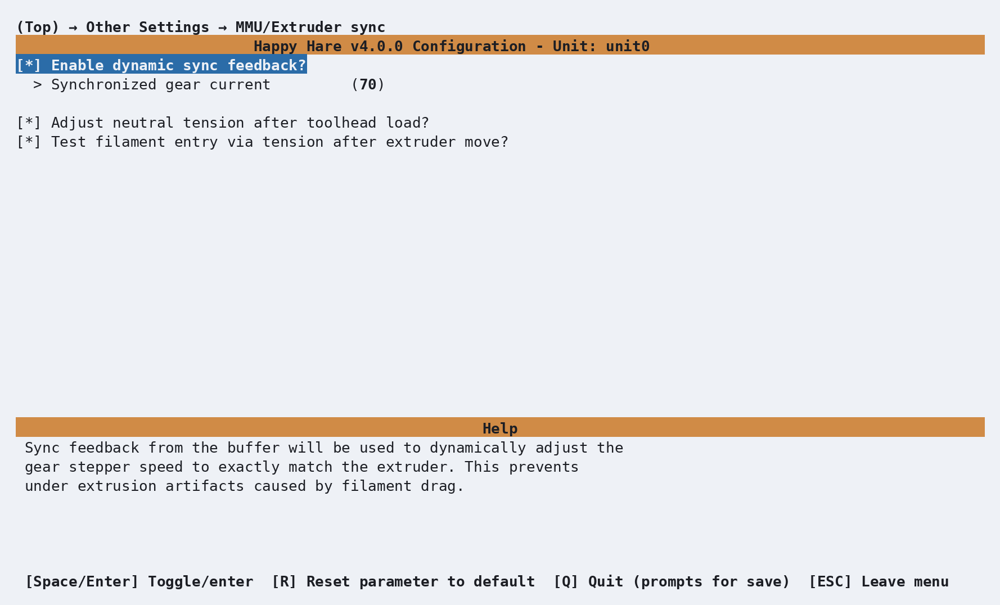

# Feature: Sync-Feedback Buffer

## Concept

During a print, Happy Hare generally keeps the gear stepper synchronized to
the extruder - moving together rather than the extruder doing all the
pulling. This spreads the load and reduces under-extrusion caused by
friction, but it depends on the gear stepper's calibrated rotation distance
staying accurate. Even a well-calibrated system drifts a little over a long
print: purging, high flow rates, drag along the filament path, and the
inertia of a heavy spool can all cause small amounts of slippage, almost
always in the gear stepper rather than the extruder. Left uncorrected, that
drift accumulates into missed steps or under/over-extrusion.

A **sync-feedback sensor** - often called a "buffer" - sits in the bowden
path between the MMU and the extruder and reports whether the filament there
is under tension, under compression, or neutral. Happy Hare uses that signal
to continuously correct the gear stepper's effective rotation distance, a
process this documentation calls **AutoTune**. Four sensor styles are
supported:

<p align="center">
  
</p>

- **Tension-only (TO)** - a single switch that trips when the filament is
  under tension.
- **Compression-only (CO)** - a single switch that trips when the filament
  is under compression.
- **Dual (D)** - two switches, giving independent tension and compression
  signals with a neutral band between them.
- **Proportional (P)** - a single analog sensor reporting continuous
  position, including how far into tension or compression the buffer
  currently sits.

Which sensor style you have decides how AutoTune corrects things, and which
of two algorithms it runs:

- **Two-level** (switch sensors - TO/CO/D): the gear speed is continuously
  nudged a fixed % above or below the current rotation-distance estimate,
  and which way the switches respond decides which direction is correct.
  This means a switch sensor's gear speed is *always* oscillating in a
  small, deliberate back-and-forth motion, even once AutoTune has converged -
  that oscillation is how it keeps checking the estimate is still right, not a
  fault. `sync_feedback_speed_multiplier`/`_boost_multiplier` (see
  [Parameter Setup](#parameter-setup) below) control how wide that
  back-and-forth motion is.
- **EKF** (Extended Kalman Filter - proportional sensors only): a
  statistical model correlates the sensor's continuous position reading
  with extruder motion to estimate rotation distance directly, with no need
  to hunt for a switch trip point at all - smoother, and generally more
  accurate once converged.

<p align="center">
  
</p>

The gear's rotation distance (heavy blue line) starts off `20`, but the
extruder's real value is `20.5` - visible as wide, fast oscillation at the
start that narrows as AutoTune homes in on the correct value. [The
equivalent plot for a Type-D
sensor](Feature-Sync-Feedback-Buffer/type-d-simulation.png) looks similar.
EKF mode converges the same way, just without the oscillation:

<p align="center">
  
</p>

A sync-feedback sensor isn't only useful for AutoTune - a compression switch
or a proportional sensor's threshold can also stand in as the extruder
homing endstop, and either sensor type feeds [FlowGuard's](Feature-FlowGuard.md)
clog/tangle detection and its tangle-prevention current boost. Those two
capabilities are covered on their own, since they're shared with other
detection sources and have a fair amount of tuning of their own; this page
covers the sensor itself, synchronizing gear to extruder, and AutoTune.

## Hardware Setup

Enable this under **MMU Features / Additions**, in a **Buffer config**
submenu that only appears once **Has sync-feedback buffer?** is selected:

<p align="center">
  
</p>

| Setting | Purpose |
|---|---|
| `Sync feedback buffer name` | Klipper object name - defaults to the unit name, or shared with another unit's buffer on a multi-unit machine |
| `Sync feedback buffer sensor range` | Travel between the compression and tension trip points (or between one switch and the buffer's end, for a single-switch design) |
| `Sync feedback buffer max range` | Total end-to-end travel the buffer mechanism allows |
| `Buffer resting spring state` | If the buffer is sprung and reliably rests in one position (tension, compression, or neutral) when unloaded, set it here to help filament-presence detection - `n/a` if it has no reliable rest position |
| Compression / tension switch pins | One or both, depending on your sensor - leave either blank if not fitted |
| Analog (proportional) pin and tuning values | Only for a type-P sensor - see [Tuning](#tuning) below for calibrating these |
| `Register buffer sensors` | Whether the sensors also show up as filament switch sensors in Mainsail/Fluidd - purely a UI visibility toggle |

That produces one `[mmu_buffer <unit_name>]` section in `mmu_hardware.cfg`:

```ini
[mmu_buffer unit0]
buffer_range            : 8              # Travel between compression/tension (or one switch and the end)
buffer_maxrange         : 12             # Absolute end-to-end travel
tension_pin              : ^unit0:PE13
compression_pin          : ^unit0:PE12
buffer_spring_state     : tension        # none|tension|neutral|compression

# Proportional sensor configuration - leave blank if using switches instead
#analog_pin              : pin
#analog_max_compression  : 1
#analog_max_tension      : 0
#analog_neutral_point    : 0.5
#analog_gamma            : 1
#analog_sensor_threshold : 0.9

register_buffer_sensors : 1
```

An empty switch pin simply means that half of the sensor isn't fitted - a
tension-only or compression-only design works fine with the other pin left
blank. Use [`MMU_SENSORS`](Reference-Commands.md#mmu_sensors) while manually
triggering the buffer by hand to confirm the orientation is wired the way
you expect - a squeezed buffer commonly means tension, an expanded one
compression, but it depends entirely on your specific mechanism.

The same **Buffer config** screen also has a **Feedback Tuning** section
below the sensors - that's the `sync_feedback_*` software tuning covered
under [Parameter Setup](#parameter-setup) next, not more hardware wiring.

### Setting `buffer_range`/`buffer_maxrange`

Both are physical measurements of the buffer mechanism itself, used to
validate movement and optimize AutoTune - `buffer_maxrange` is the buffer's
total end-to-end travel, `buffer_range` is the distance specifically
between the trip points (or between one switch and the buffer's end, for a
single-switch design):

```text
Possible buffer setups (dual-switch, compression-only, tension-only):

  <------maxrange------>       <------maxrange------>       <------maxrange------>
       <--range--->                  <----range----->       <----range----->
  |====================|       |====================|       |====================|
       ^          ^                  ^                                     ^
  compression   tension        compression-only                      tension-only
```

For a type-P (proportional) sensor, `buffer_range` is the distance over
which the raw ADC value actually changes - typically the same as
`buffer_maxrange`:

```text
  <------maxrange------>
     <----range---->
  |====================|
  ^                    ^
compression        tension
```

## Parameter Setup

Whether the gear stepper synchronizes to the extruder at all is a separate
setting from the buffer itself, under **Other Settings → MMU/Extruder
sync**:

<p align="center">
  
</p>

```ini
sync_to_extruder   : 1     # Gear motor synchronized to extruder during print
sync_gear_current  : 100   # % of gear_stepper current to use while synced
sync_form_tip      : 0     # Also synchronize during standalone tip forming
sync_purge         : 0     # Also synchronize during standalone purging

sync_feedback_enabled           : 1   # Use the buffer even though it's fitted (for temporarily disabling it)
sync_feedback_speed_multiplier  : 5   # % gear speed delta used to keep filament neutral (switch sensors)
sync_feedback_boost_multiplier  : 3   # % extra speed boost while first finding neutral (switch sensors)
sync_feedback_extrude_threshold : 5   # mm of extruder movement between AutoTune checks
sync_feedback_debug_log         : 0   # 1 = write a telemetry log for tuning (see Tuning)

toolhead_post_load_tension_adjust : 1  # Relax bowden tension to neutral right after loading (see below)
toolhead_entry_tension_test       : 1  # Check for neutral tension as filament passes the extruder entry (see below)
```

`toolhead_post_load_tension_adjust` is what actually drives the automatic
`ADJUST_TENSION=1` call described under [Commands](#commands) below - on by
default, and only fires when synced to the extruder (or `sync_purge`) with a
tension/compression/proportional sensor active. `toolhead_entry_tension_test`
is a separate check, using a compression sensor differently: while synced
and loading without a toolhead sensor fitted, it checks for neutral tension
right as the filament passes the extruder entry, to catch a failed grip at
that specific transition early rather than discovering it further
downstream. It's ignored outright on any design with a toolhead sensor,
since that sensor already gives a more direct check.

Whether `sync_to_extruder` is a real choice or fixed on depends on your MMU
design: a design that can release its own grip on the filament (typically
one with a moving selector and a servo) can print without any
synchronization at all, so the setting shows as a genuine toggle. A
gear-per-gate design that always grips the filament has nothing to
choose - Happy Hare forces it on, and the toggle doesn't appear (the
screenshot above, from a gear-per-gate design, shows exactly that - the
sync toggle itself is missing, but the current and tension settings are
still present).

If you normally run the gear stepper near its maximum current,
`sync_gear_current` is worth lowering - it only applies while actually
synced during a print, and full power is restored automatically for
loading/unloading moves. Running a TMC-driven gear stepper at full current
for an entire long print is a common way to make it noticeably hot.

`sync_feedback_speed_multiplier`/`sync_feedback_boost_multiplier` only
matter for switch-based sensors (TO/CO/D) - a proportional sensor's
correction doesn't work by oscillating between two speeds, so these have no
effect with one fitted.

!!! tip
    As with most `mmu_parameters`, every setting here can be changed live
    with `MMU_TEST_CONFIG <var>=<value>` - no Klipper restart needed.

## Commands

```text
MMU_SYNC_FEEDBACK                    # Report sync-feedback controller status
MMU_SYNC_FEEDBACK ENABLE=0           # Temporarily stop using the buffer
MMU_SYNC_FEEDBACK RESET=1            # Reset the controller, restoring the last known-good rotation distance
MMU_SYNC_FEEDBACK ADJUST_TENSION=1   # Nudge the buffer back towards neutral right now
```

Full parameter reference: [`MMU_SYNC_FEEDBACK`](Reference-Commands.md#mmu_sync_feedback).
Happy Hare calls the equivalent of `ADJUST_TENSION=1` automatically after a
filament load and again after purging, so this is mainly useful for
checking status or recovering manually. That automatic post-load call is
gated by `toolhead_post_load_tension_adjust`, covered together with the
related `toolhead_entry_tension_test` under [Parameter
Setup](#parameter-setup) above.

```text
MMU_SYNC_GEAR_MOTOR          # Force sync on right now (SYNC defaults to 1)
MMU_SYNC_GEAR_MOTOR SYNC=0   # Force sync off and release the servo, on designs that have one
```

Full parameter reference: [`MMU_SYNC_GEAR_MOTOR`](Reference-Commands.md#mmu_sync_gear_motor).
Happy Hare manages this automatically during normal operation - reach for it
directly if you're operating the MMU by hand during a pause and want the
gear synced (or not) for what you're about to do. You can still move the
gear stepper on its own with
[`MMU_TEST_MOVE`](Reference-Commands.md#mmu_test_move) or
[`MMU_TEST_HOMING_MOVE`](Reference-Commands.md#mmu_test_homing_move)
regardless of the current sync state.

## Printer variables exposed

See [sync feedback, FlowGuard and tangle prevention](Reference-Printer-Variables.md#sync-feedback-flowguard-and-tangle-prevention)
in the printer variable reference - `sync_feedback_state`,
`sync_feedback_enabled`, `sync_feedback_bias_raw`/`_modelled`, and
`sync_feedback_flow_rate` (proportional sensors only).

### Sync-feedback meter (Mainsail/Fluidd)

<p align="center">
  
</p>

Extreme tension or compression is called out directly on the gate icon too,
for a quick glance without opening the meter:

<table>
  <tr>
    <td align="center">
      <br>
      Switch sensor at an extreme (compression shown)
    </td>
    <td align="center">
      <br>
      Proportional sensor's live position (<code>0.25</code> here)
    </td>
  </tr>
</table>

## Tuning

- **Switch sensors need no calibration** beyond the physical
  `buffer_range`/`buffer_maxrange` measurements in Hardware Setup - AutoTune
  starts oscillating and correcting as soon as the sensor is wired correctly.
- **Proportional sensors need a one-time calibration pass** - see below.
- **Enabling `autotune_rotation_distance` in `mmu_parameters.cfg`** persists
  AutoTune's live estimate as the calibrated rotation distance, so it's
  remembered across restarts instead of being re-learned from scratch every
  time - worth turning on alongside this feature.
- **If AutoTune oscillates or triggers false clogs/tangles**, the usual
  culprit is "play" in the filament path - a large-ID bowden tube or a long
  run lets filament coil up inside it, which looks like more movement than
  the sensor should be seeing. `sync_feedback_debug_log: 1` writes a
  per-gate telemetry file for closer analysis - see [Feature: FlowGuard:
  Tuning with telemetry](Feature-FlowGuard.md#tuning-with-telemetry) for how
  to read one.

### Calibrating a proportional sensor

With `analog_pin` set in `mmu_hardware.cfg` and Klipper restarted, confirm
the wiring works at all before trusting the automatic calibration below.
Load filament, then move the buffer shuttle by hand to each extreme and
check the raw value with [`MMU_SENSORS`](Reference-Commands.md#mmu_sensors):

```{.text .console-command}
MMU_SENSORS
```

```{.text .console-output}
unit0:filament_proportional --> 0.02 (raw: 0.0064)
```

The raw value should approach `0` at one extreme and `1` at the other - if
it barely moves, the pin isn't actually ADC-capable (double check it's not
a plain digital/endstop pin, the kind normally used for a thermistor or
if it's an unused diag pin with the jumper still installed).

Once wiring is confirmed, load filament through to the extruder and run
[`MMU_CALIBRATE_PSENSOR`](Reference-Commands.md#mmu_calibrate_psensor) to
automatically calibrate the sensor by moving the gear stepper in small
increments in both directions until readings plateau at each extreme.
You need to enter the reported values into `mmu_hardware.cfg`:

```{.text .console-command}
MMU_CALIBRATE_PSENSOR
```

```{.text .console-output}
Finding compression limit stepping up to 28.00mm
Seeking ... ADC compressed limit: 0.2311
Seeking ... ADC compressed limit: 0.6419
Seeking ... ADC compressed limit: 0.9831
Sensor saturated at 0.9839 — limit found
Backing off compressed limit
Finding tension limit stepping up to 28.00mm
Seeking ... ADC tension limit: 0.0623
Seeking ... ADC tension limit: 0.0078
Sensor saturated at 0.0064 — limit found
Backing off tension limit
Calibration Results:
As wired, recommended settings (in mmu_hardware_*.cfg) are:
[mmu_buffer unit0]
analog_max_compression: 0.9839
analog_max_tension:     0.0064
analog_neutral_point:   0.4952
After updating, don't forget to restart klipper!
```

Copy the three reported values into `mmu_hardware.cfg`'s `[mmu_buffer
<unit_name>]` section and restart. The default search range is
`buffer_maxrange`; for a buffer with a lot of travel, widen it with
`MMU_CALIBRATE_PSENSOR MOVE=<mm>` if calibration doesn't find a clean
plateau at either end.

## Troubleshooting

- **`MMU_SENSORS` reports the wrong switch for tension/compression** - this
  is a wiring/orientation issue, not a bug; swap which physical switch is
  assigned to `tension_pin` vs `compression_pin` rather than trying to fix
  it in software.
- **`MMU_CALIBRATE_PSENSOR` readings barely change during the sweep** -
  confirm the pin is wired to an ADC-capable GPIO (the kind normally used for
  a thermistor), not a standard digital/endstop pin - a proportional sensor
  simply won't produce useful data on the wrong kind of pin. If the pin is a
  unused stepper diag pin, ensure the jumper is removed.
- **`MMU_CALIBRATE_PSENSOR` doesn't automatically find the extremes** -
  Check that filament is loaded, the bowden ECAS fittings are tight, and the
  filament has enough preload not to slip. If that still fails, hold the
  shuttle at each extreme and use the `RAW` values from `MMU_SENSORS` to
  calibrate manually: the MMU-side value is `analog_max_compression`, the
  other is `analog_max_tension`. Add the two values and divide by 2 to get
  `analog_neutral_point`.
- **The gear stepper runs noticeably hot during long prints** - lower
  `sync_gear_current`; it only applies while synced during printing, and
  full current returns automatically for loading and unloading.
- **AutoTune seems to "hunt" continuously between two speeds** - for a
  switch-based sensor (TO/CO/D) this is expected, by design, and not a
  fault - the whole mechanism works by continuously seeking the correct
  rotation distance. It doesn't affect print quality; if it's actually causing
  problems, see the Tuning notes above on filament "play" first.
- **A faulty buffer switch is causing false triggers mid-print** - disable
  just that sensor rather than living with it or stopping to rewire -
  see [Feature: Sensors](Feature-Sensors.md#tuning).

## See also

- [Command Reference: `MMU_SYNC_FEEDBACK`](Reference-Commands.md#mmu_sync_feedback)
- [Command Reference: `MMU_SYNC_GEAR_MOTOR`](Reference-Commands.md#mmu_sync_gear_motor)
- [Command Reference: `MMU_CALIBRATE_PSENSOR`](Reference-Commands.md#mmu_calibrate_psensor)
- [Command Reference: `MMU_SENSORS`](Reference-Commands.md#mmu_sensors)
- [Printer Variables: sync feedback, FlowGuard and tangle prevention](Reference-Printer-Variables.md#sync-feedback-flowguard-and-tangle-prevention)
- [Feature: FlowGuard](Feature-FlowGuard.md) - the clog/tangle detection and tangle-prevention current boost this sensor feeds
- [Feature: FlowGuard: Tuning with telemetry](Feature-FlowGuard.md#tuning-with-telemetry) - reading a `sync_feedback_debug_log` telemetry file, including these AutoTune simulation plots' real-print counterparts
- [Feature: Sensors](Feature-Sensors.md) - naming/addressing, querying, and enabling/disabling any sensor at runtime

---
