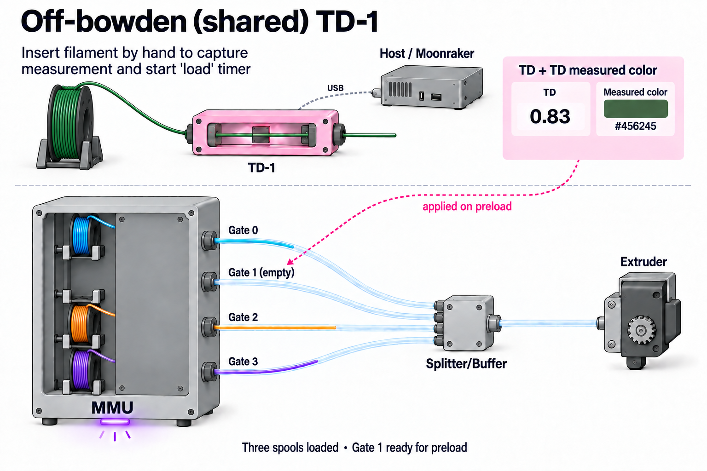
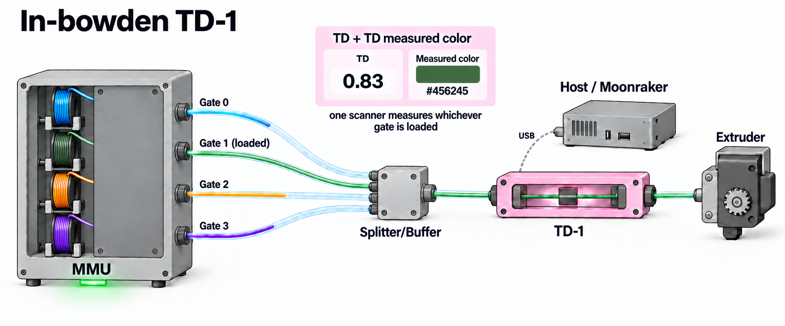
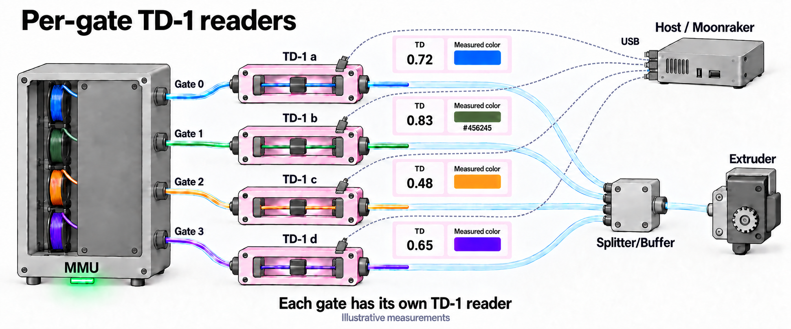
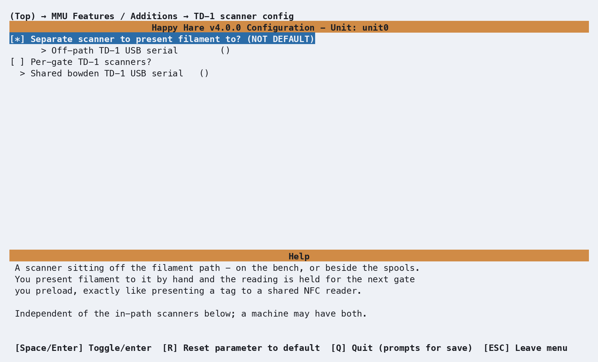
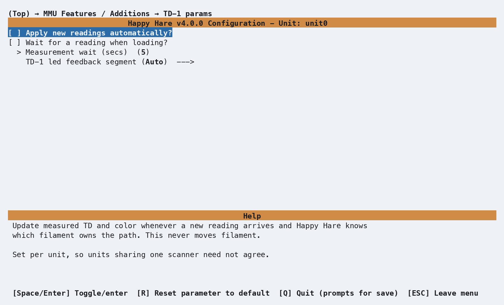

# Feature: TD-1 Filament Measurement

!!! info "Available in v4.1"

## Concept

A TD-1 scanner adds two measured attributes to the filament at a gate:
**transmission distance (TD)** and **TD color**. TD describes how far light
penetrates the filament: low values mean more opaque filament, high values
mean more transparent filament. TD color is the scanner's measured color,
stored separately from the gate's ordinary filament color. Happy Hare
stores these attributes as `gate_td` and `gate_td1_color`.

Both attributes work independently of RFID tags and spool IDs. No NFC
reader, Spoolman record or spool assignment is required. The measured color
can also supply the ordinary filament color used by displays and LEDs,
subject to the [color rules below](#color-and-led-feedback).

AJAX/BIQU TD-1 scanners connect to the printer host over USB and are managed
by Moonraker's `[td1]` component. They support two arrangements,
independently or together:

- **In-path scanners** (`td1_devices`) measure filament as it travels toward
  the extruder. Use one per gate, or one in a shared bowden path with its
  serial repeated for every gate it serves. Gates without a scanner can be
  left blank.
- **An off-path scanner** (`td1_device`) sits on the bench or beside the
  spools. Present filament by hand; its measurement is held as **pending**
  for the next gate you load or preload. That action determines which gate
  receives the TD and TD color. No scan distance is needed for this scanner.

### Three example setups

These illustrations show scanner placement schematically for some possible
configurations. Note that variations and combinations are also possible.

**Off-path (shared) "bench" reader:** present filament at the bench, then load or
preload the intended gate to apply its TD and TD color. The reader is
separate from the printing path and is configured with `td1_device`.
Here the MMU has four spool positions: three are loaded with different
colors, and Gate 1 is empty, ready for the filament being measured.
The example bench reading is TD **0.83** and measured color **#456245**.
Each spool feed exits through a gate into its own bowden tube; the four tubes meet at a splitter, with one
common tube continuing to the extruder. A gate names a spool feed, rather
than a separate device outside the MMU.

<p align="center">
  
</p>

**One in-path reader serving every gate:** place the reader in the common
bowden path, after the Splitter/Buffer. Every selected filament passes
through it. Here Gate 1's green filament is loaded through the TD-1 to the
extruder, while the other gates' filaments remain parked. Repeat the
reader's serial for every gate in `td1_devices`.

<p align="center">
  
</p>

**Per-gate readers:** each gate has a reader on its own filament path,
as the bowden exits the MMU and before the Splitter/Buffer. Each reader
connects to the host by USB; list their serials in gate order in
`td1_devices`. Here each filament has passed just beyond its reader, with
an individual TD and measured-color window. The readings are illustrative.

<p align="center">
  
</p>


## Hardware Setup

### Moonraker and USB

Connect the scanner to a USB port on the **printer host**, then enable its
component in `moonraker.conf` and restart Moonraker:

```ini
[td1]
```

Happy Hare's `[mmu_server]` Moonraker integration must also be installed and
up to date. It transfers readings while Happy Hare is running commands;
there is no MCU wiring, pin assignment, or `[mmu_td1_reader]` section to add.

Use a Moonraker version that provides the TD-1 data and reboot endpoints.
Read the USB serials from `/machine/td1/data` on your Moonraker server, or
run `MMU_TD1 READ=1` to discover the scanners Moonraker reports. Copy the
serial exactly; the examples below use placeholder serials.

### Assigning scanners

In menuconfig, open **MMU Features / Additions → TD-1**, enable
**Has TD-1 scanner(s)?**, then open **TD-1 scanner config**:

| Setting | Purpose |
|---|---|
| `Separate scanner to present filament to?` | Enables the off-path "bench" scanner's USB serial field |
| `Off-path TD-1 USB serial` | Serial of the "bench" scanner used for manual measurements |
| `Per-gate TD-1 scanners?` | Enables individual gate assignments if you have **separate** scanners per gate/lane |
| `Shared bowden TD-1 USB serial` | Serial of common scanner fitted in the shared portion of the bowden for all gates |
| `Gate N TD-1 scanner` / `Gate N USB serial` | With per-gate scanners enabled, assign a serial or deselect gates with no scanner |

<p align="center">
  
</p>

The assignments live in the existing `[mmu_unit unit0]` section of
`mmu_hardware.cfg`. For a four-gate unit with one shared bowden scanner and
one bench scanner:

```ini
[mmu_unit unit0]
td1_devices : TD1-BOWDEN, TD1-BOWDEN, TD1-BOWDEN, TD1-BOWDEN
td1_device  : TD1-BENCH
```

For mixed in-path coverage instead:

```ini
td1_devices : TD1-A, TD1-B, , TD1-A
```

This gives gates 0 and 3 the same scanner, gate 1 its own, and gate 2 none.
The list must have one entry per gate in that unit's local gate order;
use an empty entry, not `-`, for a gate without a scanner. Omit
`td1_device` if there is no off-path scanner. For an off-path-only setup,
omit `td1_devices`.

!!! tip "Shared bowden versus SHARED=1"
    `MMU_TD1 SHARED=1` addresses the **off-path** scanner. Address a scanner
    in a shared bowden through a gate it serves (`GATE=0`, for example) or
    its `SERIAL=`. Several gates or units may reference the same physical
    scanner; enabling or disabling that device affects all of them.

## Parameter Setup

The **TD-1 params** menu writes these settings into the unit's existing
`[mmu_unit_parameters unit0]` section in `mmu_parameters.cfg`:

```ini
[mmu_unit_parameters unit0]
td1_capture_timeout : 5
td1_auto_update     : 0
td1_capture_on_load : 0
td1_led_segment    : auto
```

<p align="center">
  
</p>

| Parameter | Behavior |
|---|---|
| `td1_capture_timeout` | Maximum wait in seconds for a fresh measurement during a TD-1 gate check or capture-on-load; default 5 |
| `td1_auto_update` | Apply new in-path readings when Happy Hare knows which gate produced them; default 0. Does not move filament or wait |
| `td1_capture_on_load` | Wait briefly for a fresh reading after a normal load; default 0. Adds no movement and skips the wait while printing |
| `td1_led_segment` | `auto`, `status`, `exit`, or `entry`. Automatic selection uses the gate's exit LEDs for in-path measurements and status LEDs for off-path readings, falling back to exit if no status segment exists |

Capture policy belongs to the unit doing the work, so units sharing one
scanner can use different settings. Runtime `MMU_TEST_CONFIG` edits take
effect at the next use. `MMU_TD1 ... AUTO=1` overrides the configured
automatic-update policy for that scanner until restart.

Off-path staging is automatic even with `td1_auto_update: 0`; that parameter
controls attribution of **in-path** readings. A pending bench measurement
uses `spoolman_pending_id_timeout` in `mmu.cfg` (default 20 seconds).
Despite the setting's name, it also controls this measurement window when
Spoolman is off. A newly staged measurement restarts the window.

### Color and LED feedback

The scanner's TD color is always stored as a measured attribute, even when
the gate already has a filament color. It also fills the ordinary
filament-color field if that field is empty. An existing manually assigned
or Spoolman-supplied filament color takes precedence in that field, without
replacing the stored TD color.

Use `MMU_TD1 GATE=2 SET_COLOR=1` to copy the measured color into the ordinary
filament-color field explicitly. If Spoolman supplies the gate's color, a
later refresh can restore it.

The adopted color is `RRGGBBaa`: its alpha channel comes from TD, so more
transparent filament appears more transparent. Existing color displays and
LED effects use that ordinary gate color. Clearing the measurement also
removes its adopted color if it still matches; a replacement color supplied
by the user or Spoolman is preserved.

For optional transient LED feedback, map `effect_td1_read` and
`effect_td1_fail` in the unit's `[mmu_leds ...]` settings to your chosen
[LED effects](Feature-LEDs.md#parameter-setup). Unmapped effects do nothing.
A new measurement flashes the read effect; a capture timeout flashes the
failure effect. Repeated equivalent bench readings do not flash every poll.

A pending TD-1 measurement also activates the existing pending-assignment
countdown (`effect_pending_spoolid` / `effect_pending_spoolid_expiring`),
using `spoolman_led_segment`. These existing setting names apply to pending
measurements too; no spool ID is required for the countdown.

## Commands

Full references: [`MMU_TD1`](Reference-Commands.md#mmu_td1),
[`MMU_CHECK_GATE`](Reference-Commands.md#mmu_check_gate), and
[`MMU_GATE_MAP`](Reference-Commands.md#mmu_gate_map).

### Inspecting and controlling scanners

`MMU_TD1` never moves filament. `READ=1` polls Moonraker; it does not drive
filament through the scanner or guarantee a new optical measurement.

```text
MMU_TD1                          # Status of all known scanners and pending measurement
MMU_TD1 DETAILS=1                # Include attribution and per-gate measurements
MMU_TD1 GATE=3 READ=1            # Poll and report the scanner serving gate 3
MMU_TD1 SHARED=1 ENABLE=0        # Disable use of the off-path scanner
MMU_TD1 SHARED=1 ENABLE=1        # Enable it again
MMU_TD1 GATE=2 AUTO=1            # Automatic updates until restart
MMU_TD1 GATE=2 REGISTER=1        # Apply the latest measurement to this explicit gate
MMU_TD1 GATES=0,1 SET_COLOR=1    # Force measured colors into the filament-color fields
MMU_TD1 GATE=2 INIT=1            # Reboot this scanner through Moonraker
MMU_TD1 INIT_ALL=1               # Reboot every known scanner
```

!!! tip "Choose the reader, then the operation"
    `MMU_TD1` can address readers by their physical identity or by how they
    are assigned to the MMU:

    | Address by | Selector | Example |
    |---|---|---|
    | USB serial | `SERIAL=<serial>` selects one physical reader, including a discovered reader not assigned to any gate | `MMU_TD1 SERIAL=TD1-A READ=1` |
    | One gate | `GATE=<n>` selects the reader serving that gate and identifies its unit | `MMU_TD1 GATE=2 READ=1` |
    | Several gates | `GATES=<n,n,...>` selects the readers serving those gates | `MMU_TD1 GATES=0,1 ENABLE=1` |
    | Shared bench reader | `SHARED=1` selects the unit's off-bowden reader (`td1_device`) | `MMU_TD1 SHARED=1 READ=1` |

    Choose **one** of these selectors per command. A reader in the common
    bowden after the Splitter/Buffer is addressed through a gate it serves
    or its serial; `SHARED=1` refers to the bench reader.

    `UNIT=<number or name>` adds unit context when needed; it is not a
    separate reader selector. For example,
    `MMU_TD1 UNIT=unit0 SHARED=1 READ=1` selects unit0's bench reader on a
    multi-unit machine. `AUTO=` also needs `UNIT=` on a multi-unit machine
    when the selection does not already identify a unit, such as
    `MMU_TD1 UNIT=unit0 SERIAL=TD1-A AUTO=1`.

    Plain `MMU_TD1` reports all known readers. If several gates share one
    physical reader, changing its `ENABLE` setting affects all of them.

Specify one operation at a time; `READ`, `DETAILS` and `QUIET` are modifiers.

`REGISTER=1` requires one explicit `GATE=`. It uses that gate's in-path
scanner first, otherwise the unit's off-path scanner, otherwise a pending
measurement. This attaches TD and TD color to the chosen gate without a
load or preload. Check the reported reading and age to ensure it describes
the filament at that gate. No spool ID or RFID is required.

### Measuring gates

```text
MMU_CHECK_GATE GATE=2 TD1=1
MMU_CHECK_GATE ALL=1 TD1=1
MMU_CHECK_GATE TOOLS=0,2 TD1=1
MMU_CHECK_GATE GATE=2 TD1_UPDATE=1
```

`TD1=1` adds measurement to the normal availability check for gates without
a stored TD. Filament travels down its normal bowden path to the extruder
entry and unloads again. The measurement traverse never enters the
extruder and needs no heating or scanner-distance calibration. Normal MMU
motion calibration is still required. If a tool is already loaded, normal
unloading and, outside a print, restoration of that tool can still involve
the usual hotend operations.

`TD1_UPDATE=1` also measures gates that already have TD and implies `TD1=1`.
Gates without a usable scanner still get an availability check. A scanner
failure reports a warning without marking detected filament unavailable;
an unsafe or failed filament move still requires recovery.

These options work during a print and in a print-start pre-check. Each
unmeasured gate costs a bowden traverse; choose only the gates or tools you
need. Existing measurements survive restarts, but are cleared when the
filament identity changes, a gate is emptied, or its map is reset.

### Editing TD manually

```text
MMU_GATE_MAP DETAILS=1           # Show measured TD and color
MMU_GATE_MAP GATE=2 TD=4.2        # Set a positive transmission distance
MMU_GATE_MAP GATE=2 TD=''         # Clear TD and measured color
MMU_GATE_MAP BYPASS=1 TD=4.2      # Set TD for bypass filament
```

Manual TD editing works independently of Spoolman, including in every
Spoolman mode. Automatic scanner assignment is gate-based; use the manual
bypass command for bypass filament.

### Cancelling a pending measurement

```text
MMU_TD1 CLEAR_PENDING=1          # Discard the staged TD and TD color
```

`CLEAR_PENDING=1` discards the bench measurement waiting for the next
load/preload. Measurements already stored on gates are unaffected. The
clear preserves repeat-read suppression, so leaving the same filament in
the scanner does not immediately stage it again.

If other data is pending from an optional NFC or Spoolman workflow, it is
preserved with its original timeout. The countdown ends when nothing
remains to apply. See [Spoolman / Filament Hub](Feature-Spoolman.md#commands)
for cancelling all pending data together.

## Printer variables exposed

These values are available under `printer.mmu`; per-gate lists use global
gate numbers across all units:

| Variable | Meaning |
|---|---|
| `gate_td` | Per-gate TD, or `None` if unmeasured |
| `gate_td1_color` | Per-gate measured `RRGGBB` color, or an empty string |
| `pending_td` | Off-path TD waiting for the next load/preload, or `None` |
| `td1` | Per-gate policy: `''` for no scanner, `enabled`, `auto`, or `disabled`. This is not a connectivity indicator |
| `active_filament.td` | TD for the active filament, or `None` if unmeasured |

`printer.mmu_machine.unit_N` exposes configured `td1_device` and
`td1_devices` assignments where present. Live scanner readings and
connectivity remain available through Moonraker's `/machine/td1/data`;
use `MMU_TD1 DETAILS=1` for console inspection.

## Tuning

### Bench measurement

1. Present filament to the off-path scanner and wait for `MMU_TD1` to show a
   staged measurement.
2. Load or preload the intended gate before the timeout, for example
   `MMU_PRELOAD GATE=2`. Its TD and TD color are updated together.
3. Check `MMU_GATE_MAP DETAILS=1`.

For filament already at a gate, use `MMU_TD1 GATE=2 REGISTER=1` to attach
the reading directly instead of preloading again.

Filament left in the scanner stages once despite small measurement jitter.
A materially different TD or color stages a new reading. After the pending
window expires, filament still presented can establish a new pending
measurement. If the scanner reports filament removal, removal restarts the
live window so you have time to walk to the printer; this behavior depends
on the device and is not guaranteed by Moonraker's API.

### Optional NFC / Spoolman use

You can stage a tag or spool ID as well as a bench measurement before
preloading. They share the pending timeout, and staging either renews the
window for the measurement too. The preload applies the other attributes
first, then adds TD and TD color.

If assigning a spool ID or RFID directly to an existing gate, do so before
measuring or using `REGISTER=1`: changing either tells Happy Hare that the
gate's filament changed and clears its previous measurements. This only
matters when using those optional features. TD and TD color remain local
gate attributes; TD-1 does not write them to a Spoolman spool record.

### In-path measurements

1. Confirm the serial and connectivity with `MMU_TD1 GATE=2 READ=1`.
2. Run `MMU_CHECK_GATE GATE=2 TD1=1`, then inspect the gate map.
3. If readings arrive too late, increase `td1_capture_timeout` and retry
   with `TD1_UPDATE=1` flag to `MMU_CHECK_GATE` to force a re-read.
4. Once a single gate works reliably, choose explicit batch checks,
   capture-on-load, or automatic updates to suit your workflow.

On a shared scanner, a late reading from a previous traversal may be
discarded instead of assigned to the next gate. This protects gate
attribution and assumes readings arrive in traversal order. Allow enough
time for the scanner to respond before moving on to another gate.

## Troubleshooting

- **Bridge unavailable or polling fails** — check `[td1]`, the Moonraker
  version, and Happy Hare's `[mmu_server]` integration. Restart Moonraker
  after configuration or component updates and confirm that
  `/machine/td1/data` responds.
- **Scanner disconnected or unknown** — check USB power and connection,
  then compare the configured serial with Moonraker's reported serial.
  `MMU_TD1 SERIAL=TD1-BOWDEN READ=1` helps inspect a specific device;
  `INIT=1` reboots it through Moonraker.
- **Connected but no measurement** — a connected scanner may not have
  measured filament yet. Present filament or run a TD-1 gate check;
  `READ=1` alone cannot move filament past the optics.
- **Measurement timed out** — verify that the filament actually crosses
  the configured scanner and that the hardware produces readings at the
  travel speed. Increase the capture timeout if reporting is slow.
- **Displayed filament color did not change** — check the stored TD color
  with `MMU_GATE_MAP DETAILS=1`. An existing filament color takes precedence
  for display; use `SET_COLOR=1` to use the measured color there too.
- **Measurement disappeared** — emptying or resetting a gate clears its
  measurements. If you also use spool IDs or RFID, changing those clears
  measurements too; see [Optional NFC / Spoolman use](#optional-nfc-spoolman-use).
- **Bench reading did not stage again** — equivalent readings are
  suppressed. An explicit pending clear retains that suppression; a normal
  timeout allows re-staging. Use `REGISTER=1` to apply a reading deliberately
  to a specific gate.

## See also

- [Feature: NFC/RFID Reading](Feature-NFC.md)
- [Feature: Spoolman / Filament Hub](Feature-Spoolman.md)
- [Feature: LED Feedback](Feature-LEDs.md)
- [Command Reference: `MMU_TD1`](Reference-Commands.md#mmu_td1)
- [Command Reference: `MMU_CHECK_GATE`](Reference-Commands.md#mmu_check_gate)
- [Command Reference: `MMU_GATE_MAP`](Reference-Commands.md#mmu_gate_map)
- [Printer Variable Reference](Reference-Printer-Variables.md#td-1)

---
