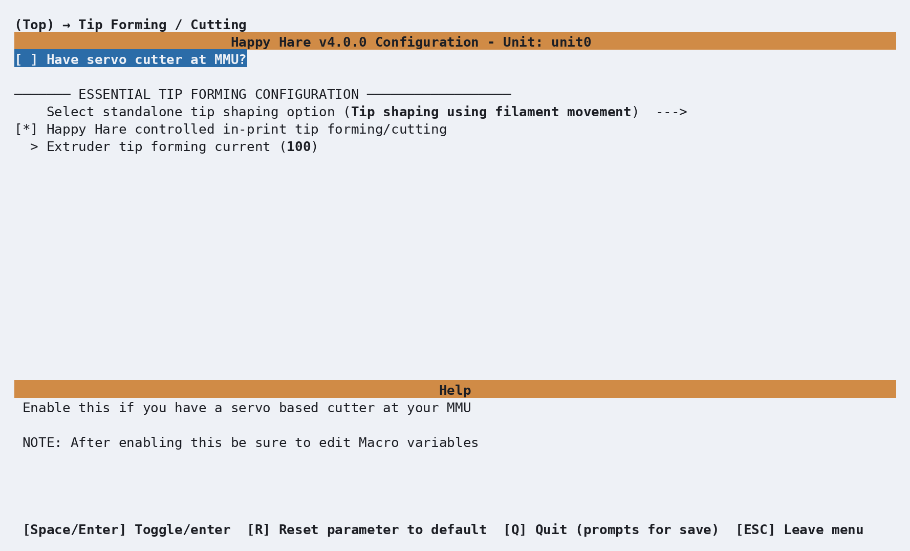
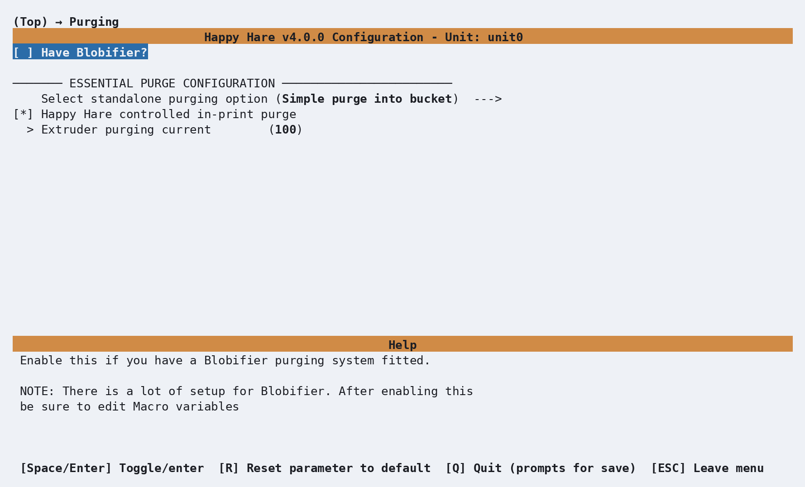

# Feature: Tip Forming and Purging

## Concept

Every toolchange needs two things done well: a clean filament **tip** (no
blobs, no long hairs - a good tip looks like a tiny spear) so the next load
doesn't jam, and a **purge** big enough to clear the old color/material
out of the nozzle without wasting excessive filament.

<p align="center">
  
</p>

Each has the same three-way choice, and they're independent of each other:

- **Tip forming**: Happy Hare's own standalone macro (`_MMU_FORM_TIP`), a
  toolhead-mounted filament cutter (`_MMU_CUT_TIP`) instead of forming a tip
  at all, or leave it to the slicer's own in-print tip-forming.
- **Purging**: Happy Hare's own standalone macro (`_MMU_PURGE`), an add-on
  purge system like [Purge: Blobifier](Macro-Blobifier.md), or leave it
  to the slicer's wipe tower.

There's also a separate, *additive* cutting option: a servo-driven cutter
mounted at the MMU itself (EREC-style) rather than at the toolhead - see
[Servo Cutter](#servo-cutter-mmu-mounted) below. It trims the tip after
unload; you still form a decent tip beforehand the normal way.

## Hardware Setup

Two independent menus, both unconditional (every MMU type gets them):

<p align="center">
  
</p>

| Setting | Purpose |
|---|---|
| `Have servo cutter at MMU?` | The additive EREC-style cutter - see [Servo Cutter](#servo-cutter-mmu-mounted) |
| `Select standalone tip shaping option` | `_MMU_FORM_TIP` / cut (needs a toolhead cutter fitted) / slicer-controlled / custom macro |
| `Happy Hare controlled in-print tip forming/cutting` | Forces standalone tip forming even during a print (on by default) - turn off only if the slicer is genuinely handling it |
| `Extruder tip forming current` | 100-150%, extra torque for the rapid tip-forming moves; 100 disables the boost |

<p align="center">
  
</p>

| Setting | Purpose |
|---|---|
| `Have Blobifier?` | See [Purge: Blobifier](Macro-Blobifier.md) |
| `Select standalone purging option` | `_MMU_PURGE` / Blobifier / slicer wipe tower / custom macro |
| `Happy Hare controlled in-print purging` | Forces standalone purging even during a print - turn the slicer's wipe tower off if you enable this |
| `Extruder purge current` | Same idea as tip-forming current, for purge moves |

These produce, in `mmu.cfg`'s general parameters (not the file literally
named `mmu_parameters.cfg`):

```ini
force_form_tip_standalone : 1              # 1 = always standalone tip forming (turn the slicer's off)
form_tip_macro             : _MMU_FORM_TIP  # or _MMU_CUT_TIP, BLOBIFIER, or your own
extruder_form_tip_current  : 100
slicer_tip_park_pos        : 0              # Only matters if the slicer forms tips instead

force_purge_standalone   : 0                # 0 = slicer's wipe tower in-print, standalone otherwise
purge_macro               : ''               # Blank = no standalone purge; set to _MMU_PURGE, BLOBIFIER, ...
extruder_purge_current    : 100
```

### Servo Cutter (MMU-mounted)

An MMU-end cutter (the classic EREC design, or similar) trims the tip
*after* unload, rather than replacing tip forming - you still want
`form_tip_macro: _MMU_FORM_TIP` so a decent tip exists going into the cut.
Enabling it under **Tip Forming / Cutting** adds a servo pin prompt and
generates `[mmu_servo cut_servo]` in `mmu.cfg`; its own tuning (open/close
angles, feed/cut length, cut attempts) lives in `mmu_macro_vars.cfg`'s
[`_MMU_SERVO_CUTTER_VARS`](Reference-Macro-Vars.md#servo-cutter-mmu-mounted-_mmu_servo_cutter_vars).
See [Tip Shaping: MMU Cutting](Macro-Servo-Cutter.md) for the build/wiring side.

## Parameter Setup

### Tuning tip forming

The default `_MMU_FORM_TIP` macro (`mmu_form_tip.cfg`) works similarly to
PrusaSlicer/SuperSlicer's own tip-forming, so their multi-material filament
profiles are a reasonable starting point even if you're not using slicer
tip forming at all - add a Prusa printer + MMU preset from the system
presets, then pick the **MMU** printer specifically (not **Single**); its
filament presets tagged **@MMU** in the name are the multi-material ones
with real tip-forming settings behind them:

<p align="center">
  
</p>

Pick the filament type you're tuning for (PLA, ABS, PETG, ...) and use its
Multimaterial section settings as your own starting point:

<p align="center">
  
</p>

Its tuning variables live in `mmu_macro_vars.cfg`'s
[`_MMU_FORM_TIP_VARS`](Reference-Macro-Vars.md#tip-forming-_mmu_form_tip_vars)
section. Tuning by hand:

1. Remove the bowden tube at the toolhead so you can feed filament directly.
2. Cut a ~400mm fragment of the filament you're tuning, heat the extruder,
   and hold the fragment to the gears:

    ```text
    MMU_LOAD EXTRUDER_ONLY=1
    ```

3. Extrude a few mm by hand to prime, then:

    ```text
    MMU_TEST_FORM_TIP
    ```

    This runs the tip-forming macro and ejects the result for inspection.

4. Adjust one variable at a time on the command line - changes are sticky
   for the session:

    ```text
    MMU_TEST_FORM_TIP cooling_moves=5 unloading_speed=15
    ```

5. Re-insert the fragment (`MMU_LOAD EXTRUDER_ONLY=1` again) and repeat.
   Expect this to take a few dozen attempts to converge.

!!! tip
    With an extruder-entry sensor fitted, select the
    [bypass](Feature-Filament-Bypass.md) before tuning and turn on
    `bypass_autoload` - inserting the fragment then loads it automatically
    for the next attempt, no `MMU_LOAD` needed each time.

!!! warning "Important"
    Values set with `MMU_TEST_FORM_TIP`/`MMU_TEST_CONFIG` only last until
    Klipper restarts. Copy anything you want to keep into
    `mmu_macro_vars.cfg`.

Full parameter reference: [`MMU_TEST_FORM_TIP`](Reference-Commands.md#mmu_test_form_tip).

### Toolhead cutter (`_MMU_CUT_TIP`)

Instead of tuning a tip-forming macro at all, a toolhead-mounted filament
cutter can just cut the tip cleanly and skip the forming step entirely -
switch to it with `form_tip_macro: _MMU_CUT_TIP` in `mmu.cfg`.

- **Advantages**: a clean, hair-free tip every time, with none of the
  fiddly per-filament tuning tip forming needs; works the same regardless
  of filament type.
- **Trade-offs**: it's extra hardware to build and wire in the first place,
  the blade itself is a consumable that eventually needs replacing, and if
  the cutter lives in the toolhead, cutting there wastes a little more
  filament and time during the purge than a clean-formed tip would.

Mechanically, a toolhead cutter is normally triggered by moving the
toolhead itself into a fixed position that presses a depressor or servo arm
against the cutter's own activation mechanism - rather than the cutter
having its own motor. The routine Happy Hare drives around that move looks
roughly like this: on seeing a toolchange, the toolhead moves to the prime
tower (or wherever purging happens) and runs a few cooling moves to firm up
the filament so the cut doesn't leave it stringy; the filament is then
positioned for the cut - tuned to leave the minimum practical length behind
while still getting a clean cut; the toolhead moves to a staging position
just outside the actual cut point, then makes a slow approach into the cut,
a quick cutting move, a quick retract, and a slow return to staging.
Unload, load of the next filament, purge, and resume follow as normal.

!!! tip
    The only variables you're expected to tune for this live in
    `mmu_macro_vars.cfg`'s cutter section, one at a time, same approach as
    tip-forming tuning above.

### Purge volumes

Slicers offer purge volumes three ways - a simple per-tool unload/load
value, a full N×N matrix for precise per-pair control, or an automatic
pigment-percentage calculation - each a tradeoff between setup effort and
waste:

<table>
  <tr>
    <td align="center">
      
    </td>
    <td align="center">
      
    </td>
  </tr>
</table>

The manual and matrix options are both set directly in the slicer, with no
Happy Hare involvement. PrusaSlicer/SuperSlicer also offer a fourth,
automatic option: enabling **Advanced wiping volume** (under **Printer
Settings → Single Extruder MM Setup**) lets the slicer calculate purge
volume from each filament's **pigment percentage** (0-1) instead of a fixed
number - tune the percentage per filament to fine-tune the result. If you
use the same base filament profile for several colors, you'll need to
duplicate that profile per color so each can carry its own pigment
percentage, and make sure the right profile is selected for each tool.

Happy Hare can also calculate its own matrix from filament colors, as an
alternative to any of the slicer's own methods - typically run from your
print-start macro:

```text
MMU_CALC_PURGE_VOLUMES SOURCE=gatemap MULTIPLIER=1.1     # From the gate map's (or Spoolman's) colors
MMU_CALC_PURGE_VOLUMES SOURCE=slicer MIN=50              # From the slicer's own tool colors, floored at 50mm3
```

```{.text .console-command}
MMU_CALC_PURGE_VOLUMES SOURCE=gatemap MULTIPLIER=1.1
```

```{.text .console-output}
Purge map updated. Use 'MMU_SLICER_TOOL_MAP PURGE_MAP=1' to view
```

Full parameter reference: [`MMU_CALC_PURGE_VOLUMES`](Reference-Commands.md#mmu_calc_purge_volumes).
Volumes default to a 0-800mm³ range unless overridden with `MIN=`/`MAX=`.
View the result with `MMU_SLICER_TOOL_MAP PURGE_MAP=1` (or
`SPARSE_PURGE_MAP=1` to drop toolchanges that can't actually occur in the
loaded print) - each cell is the calculated purge volume, in mm³, for that
row-to-column transition:

```{.text .console-command}
MMU_SLICER_TOOL_MAP PURGE_MAP=1
```

```{.text .console-output}
Purge Volume Map (mm^3):
To -> T0   T1   T2   T3   T4   T5   T6   T7   T8
T0    -   129  230  192  221  221  223  480  223
T1   316   -   210  155  393  393  325  606  325
T2   383  179   -   189  354  354  195  551  195
T3   322   78  143   -   359  359  264  570  264
T4   133  155  124  165   -    -   165  354  165
T5   133  155  124  165   -    -   165  354  165
T6   314  224   98  212  352  352   -   541   -
T7   102  122  120  116   65   65  111   -   111
T8   314  224   98  212  352  352   -   541   -
```

`printer.mmu.toolchange_purge_volume` is the number your own purge logic
should actually read during a toolchange - it's the sum of the matrix value
above, [toolhead residual filament](#toolhead-calibration-and-toolhead_ooze_reduction), and any
filament left behind by a cut tip, not just the matrix on its own.

### Purging without a wipe tower

A dedicated purge system (like [Purge: Blobifier](Macro-Blobifier.md))
lets you disable the slicer's wipe tower entirely - it still needs a purge
volume matrix to work from, which can come from any of: Happy Hare's own
[g-code preprocessing](Feature-Gcode-Preprocessing.md) of the slicer's
matrix, `MMU_SLICER_TOOL_MAP PURGE_VOLUMES=...` directly, or
`MMU_CALC_PURGE_VOLUMES` above. All three end up in
`printer.mmu.slicer_tool_map.purge_volumes` for your macros to read:

!!! tip
    Getting the matrix out of the slicer in the first place is a two-step
    dance: **enable wipe tower** first to unlock the purge-volume matrix
    editor and configure it, *then* disable **enable wipe tower** again
    once you're happy with the values - the slicer still writes the
    configured matrix into the g-code even with the tower itself off. Leave
    it disabled from the start and there's no matrix to edit at all.

```text
MMU_SLICER_TOOL_MAP PURGE_VOLUMES=70                                    # One value for every transition
MMU_SLICER_TOOL_MAP PURGE_VOLUMES=70,70,70,70,70,70,70,70,70            # N values - one per tool's "to" column
MMU_SLICER_TOOL_MAP PURGE_VOLUMES=70,70,70,...                         # NxN (or 2xN, see Command Reference) - full matrix
```

A flat `PURGE_VOLUMES=70` fills every transition with the same value:

```{.text .console-command}
MMU_SLICER_TOOL_MAP PURGE_MAP=1
```

```{.text .console-output}
Purge Volume Map:
To -> T0   T1   T2   T3   T4   T5   T6   T7   T8
T0    -   140  140  140  140  140  140  140  140
T1   140   -   140  140  140  140  140  140  140
T2   140  140   -   140  140  140  140  140  140
T3   140  140  140   -   140  140  140  140  140
T4   140  140  140  140   -   140  140  140  140
T5   140  140  140  140  140   -   140  140  140
T6   140  140  140  140  140  140   -   140  140
T7   140  140  140  140  140  140  140   -   140
T8   140  140  140  140  140  140  140  140   -
```

(A single input value of `70` still shows as `140` per cell above - the
displayed total is the sum of both tools' contribution to that transition,
consistent with how the manual per-tool unload/load volumes combine.)

!!! note
    If your slicer is set up with fewer tools than your MMU has gates,
    `NUM_SLICER_TOOLS=` trims the displayed matrix to match. Tool numbering
    is always zero-based (`T0` first) to match the g-code itself, regardless
    of what a slicer's own UI happens to label its first tool.

### Toolhead calibration and `toolhead_ooze_reduction`

Correct purge volumes still assume the toolhead's own geometry
(`toolhead_extruder_to_nozzle`, `toolhead_sensor_to_nozzle`,
`toolhead_residual_filament` - all in `mmu.cfg`'s toolhead settings) is
calibrated accurately. `toolhead_residual_filament` in particular - how
much filament is naturally left behind in the extruder after ejection - is
often bigger than expected (2-3mm on a low-flow extruder, 12-15mm on a
high-flow one), and is worth calibrating properly before reaching for the
setting below as a band-aid.

`toolhead_ooze_reduction` is a small final adjustment on top of that,
tunable live mid-print:

```text
MMU_TEST_CONFIG toolhead_ooze_reduction=1
```

<p align="center">
  
</p>

Blobs on the purge tower after a load mean the value is too low (more
reduction needed); a big gap after a load means it's too high. A working
value is usually small, ±3mm at most, once the toolhead geometry and
`toolhead_residual_filament` are actually correct - needing a large or
negative value is itself a sign one of those two is off, not that this
setting needs to compensate further. Persist the final value in `mmu.cfg`
once you're happy with it.

## Commands

```text
MMU_TEST_FORM_TIP                        # Run the tip-forming macro standalone, for tuning
MMU_TEST_PURGE LAST_TOOL=0 NEXT_TOOL=3   # Run the standalone purge macro for a specific tool transition
MMU_CALC_PURGE_VOLUMES SOURCE=gatemap    # Recalculate the purge matrix from current filament colors
MMU_SLICER_TOOL_MAP PURGE_MAP=1          # View the current purge volume matrix
MMU_TEST_CONFIG toolhead_ooze_reduction=1
```

Full parameter reference:
[`MMU_TEST_FORM_TIP`](Reference-Commands.md#mmu_test_form_tip),
[`MMU_TEST_PURGE`](Reference-Commands.md#mmu_test_purge),
[`MMU_CALC_PURGE_VOLUMES`](Reference-Commands.md#mmu_calc_purge_volumes),
[`MMU_SLICER_TOOL_MAP`](Reference-Commands.md#mmu_slicer_tool_map).

## Printer variables exposed

`printer.mmu.toolchange_purge_volume`, `.slicer_purge`,
`.slicer_tool_map.purge_volumes`, `.extruder_filament_remaining`, and
`.filament_remaining`/`.filament_remaining_color` (residual/cut-fragment
tracking) - see [Printer Variables: extruder / filament
remaining](Reference-Printer-Variables.md#extruder-filament-remaining).
`printer.mmu.action` also includes `Forming Tip`/`Cutting Tip`/`Cutting
Filament`/`Purging` states while each of these runs.

## Troubleshooting

- **Tip forming needs 40-50 attempts and still isn't right** - normal;
  tuning by feel is genuinely slow, which is exactly why a filament cutter
  exists as an alternative. Change one variable at a time.
- **Blobs on the purge tower after a load** - lower
  `toolhead_ooze_reduction`, but check `toolhead_residual_filament` and the
  toolhead's own geometry settings first if the needed change is large.
- **Big gaps on the purge tower after a load** - raise
  `toolhead_ooze_reduction` instead.
- **Wasting a lot of filament on purging** - review whether you're using
  the slicer's simple per-tool volumes (least efficient) versus the full
  matrix or Happy Hare's own color-based calculation.
- **Switched to a toolhead cutter but tips are still being formed the old
  way** - `form_tip_macro` needs to actually be changed to `_MMU_CUT_TIP`;
  simply having `MMU_HAS_TOOLHEAD_CUTTER` fitted doesn't switch it
  automatically unless that was the default chosen in menuconfig.

## See also

- [Command Reference: `MMU_TEST_FORM_TIP`](Reference-Commands.md#mmu_test_form_tip)
- [Command Reference: `MMU_TEST_PURGE`](Reference-Commands.md#mmu_test_purge)
- [Command Reference: `MMU_CALC_PURGE_VOLUMES`](Reference-Commands.md#mmu_calc_purge_volumes)
- [Command Reference: `MMU_SLICER_TOOL_MAP`](Reference-Commands.md#mmu_slicer_tool_map)
- [Purge: Blobifier](Macro-Blobifier.md) / [Tip Shaping: MMU Cutting](Macro-Servo-Cutter.md) - Blobifier and the MMU cutter build/wiring
- [Feature: G-code Preprocessing](Feature-Gcode-Preprocessing.md) - `!purge_volumes!` and friends
- [Feature: Gate/TTG Maps](Feature-Gate-TTG-Maps.md) - the slicer tool map this all reads from
- [Feature: Filament Bypass](Feature-Filament-Bypass.md) - the tip-forming tuning timesaver
- [Feature: Sync-Feedback Buffer](Feature-Sync-Feedback-Buffer.md) - `sync_form_tip`/`sync_purge`

---
