# Getting Started with 3MS

This page walks through the first `menuconfig` pass for a 3MS MMU — the
screens you'll see, in the order you'll see them, and the handful of choices worth
pausing on. It's the first of a set of getting-started pages; other pages cover
toolhead calibration and multi-unit setups in more depth. Here we're just getting
a 3MS installed and talking to Klipper.

## Menuconfig Installer

From your Happy-Hare checkout:

```bash
./install.sh
```

The very first time you run this, there's no `.mmu_config` yet, so the installer
drops you straight into `menuconfig` — no separate flag needed.

<p align="center">
  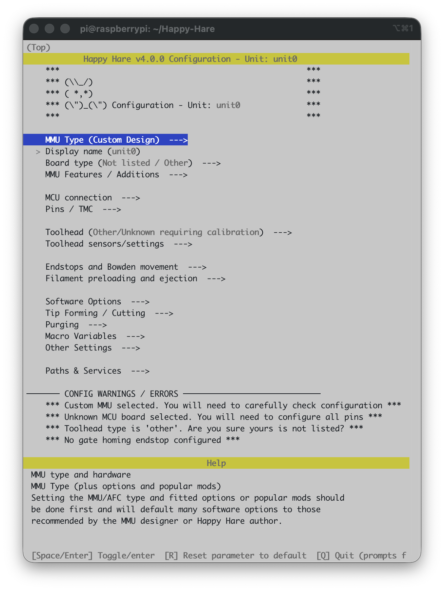
</p>

This is the installer's default state: `MMU Type` is `Custom Design`, the board is
unknown, and the **CONFIG WARNINGS / ERRORS** panel at the bottom lists exactly
that — four things still need a decision. As soon as you pick a real MMU type,
most of these clear themselves.

A quick word on the controls, since you'll use them constantly:

* **Arrow keys** move the highlight; **Enter** (or **Space**) opens a submenu or
  toggles/selects the highlighted item.
* **Esc** or **Left Arrow key** backs out one level; from the top level it offers to save.
* **R** resets the highlighted parameter back to its default — useful any time
  you've typed something and want to back out cleanly without hunting for the
  original value.

### Choosing the MMU type

Highlight **MMU Type** and press Enter. Use the arrow keys to navigate up to **3MS** and press Space to select it:

<p align="center">
  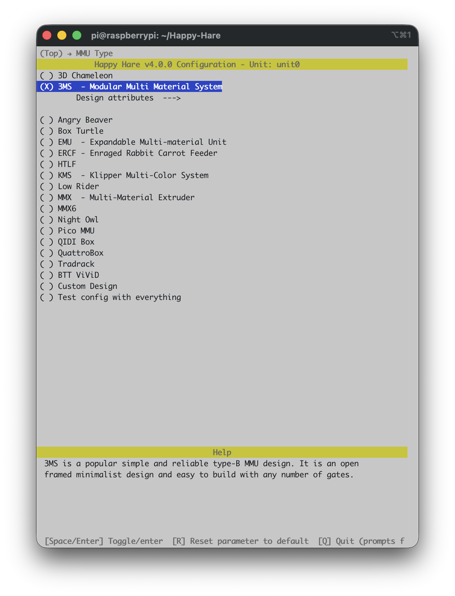
</p>

Use the left arrow key to go back to the main screen:

<p align="center">
  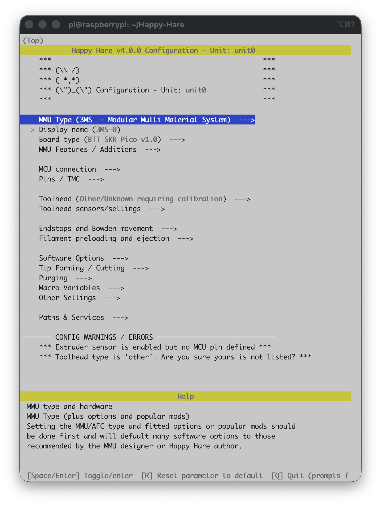
</p>

If you scroll to the bottom, you'll notice two warnings because Happy Hare still doesn't know your
toolhead, and that's covered in a different getting-started page. Don't worry
about it here.

### Board type

Enter **Board type**:

<p align="center">
  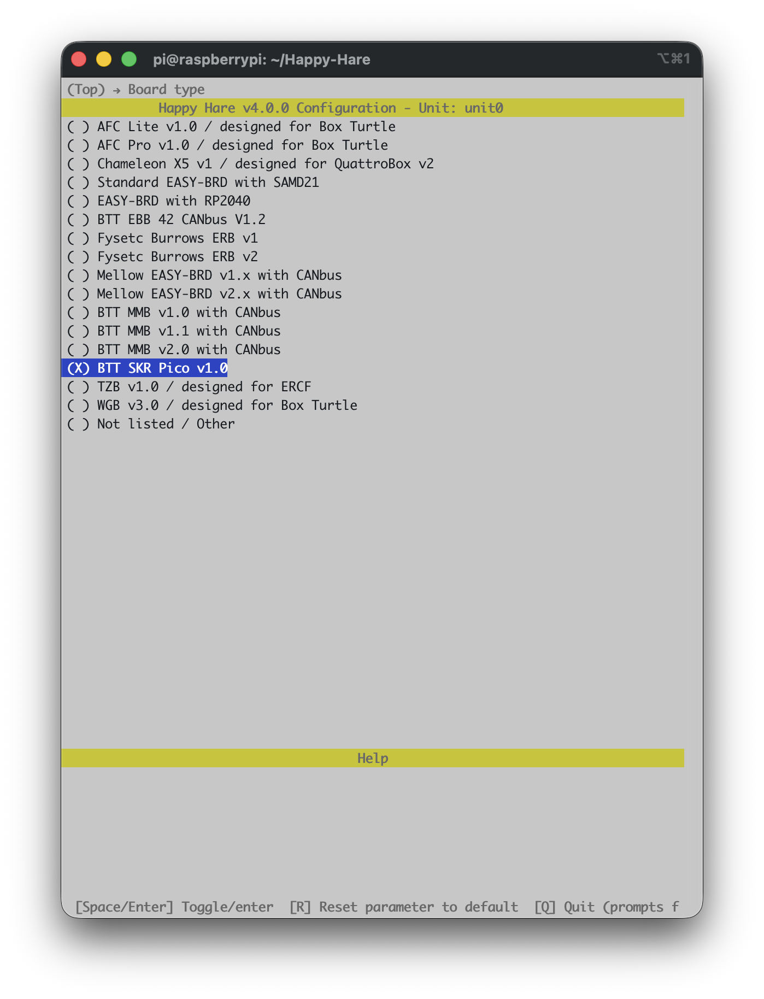
</p>

Because you already told it this is a 3MS, Happy Hare has pre-selected
**BTT SKR Pico v1.0** — the board most 3MS builds use. If your build uses a 
different controller board, this is where you'd pick it instead; the 
pin defaults for every stepper, sensor and TMC driver on the rest of 
the menu come from whatever you choose here.

### MCU connection

Back out to the top and enter **MCU connection**:

<p align="center">
  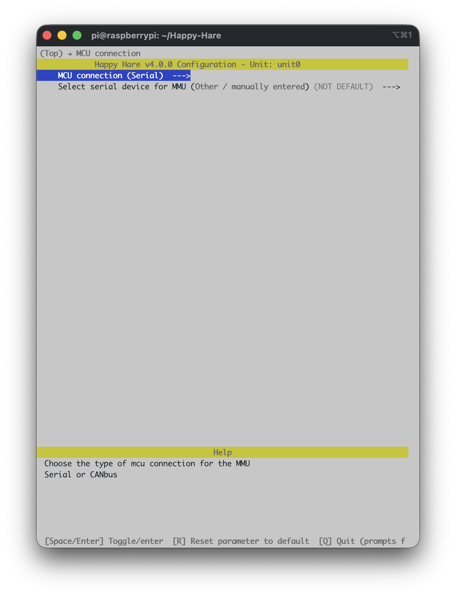
</p>

Again, already right for a board like the SKR Pico that plugs in over USB:
**MCU connection** is `Serial`, and there's a second line to pick *which* serial
device if you have more than one board attached. If your board talks CANbus
instead, this is where you'd switch it — but for a stock, USB-attached 3MS, Serial is what you want and there's nothing to change.

### MMU Features / Additions

Back out and enter **MMU Features / Additions**:

<p align="center">
  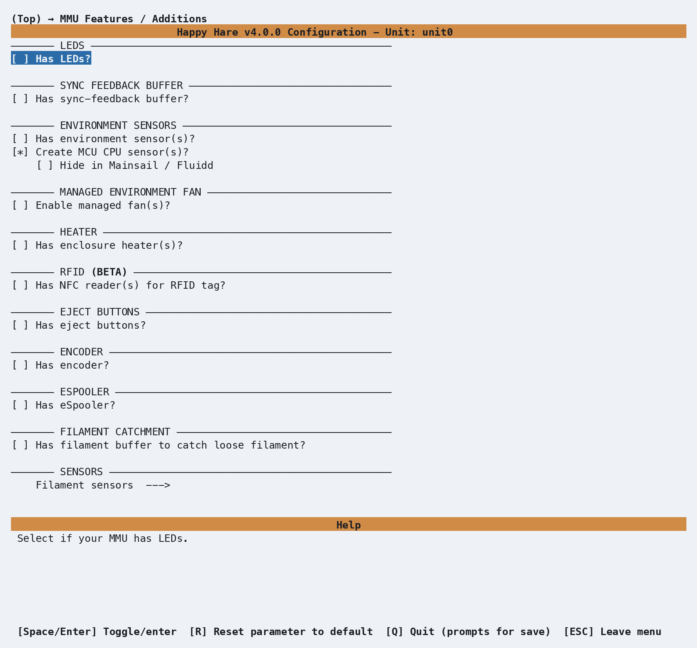
</p>

This is worth a look even though — for a stock 3MS — there's nothing to
add. The MCU temperature sensor is already switched
on. Since the 3MS is an open-ended design, you can add any features unique to your build. If you're following this page for a plain, stock 3MS, just look and
move on.

### Pins: gear direction

Back out to the top, enter **Pins / TMC**, then **Gear pins**:

<p align="center">
  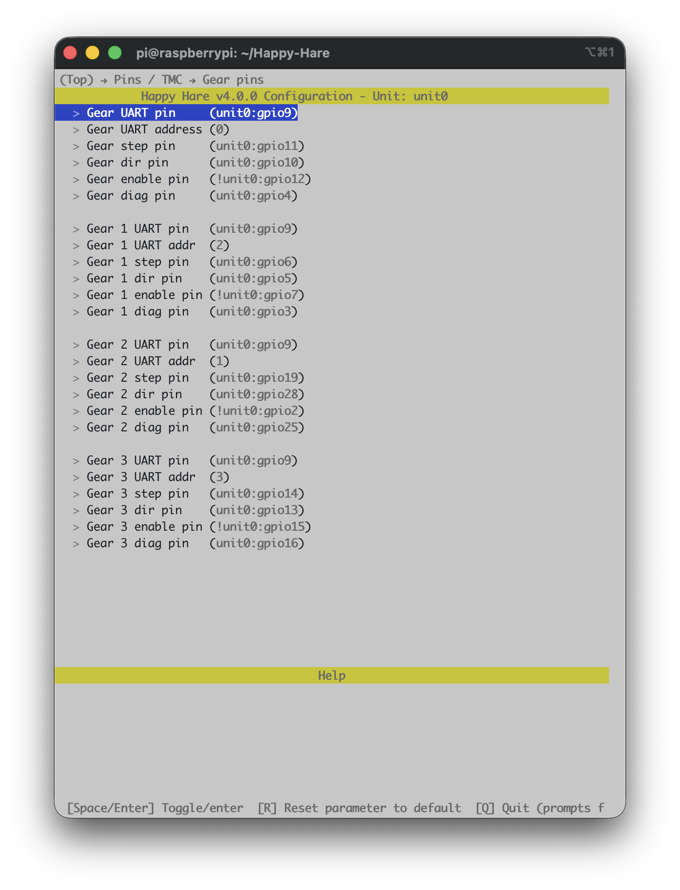
</p>

Every gate has its own UART, step, dir, enable and diag pin, all filled in from
the SKR Pico defaults you picked earlier. The one you're most likely to need to
touch is **dir** — whether a gear stepper spins the "right" way depends on which
way its cable happens to be plugged in, and no config file can know that in
advance. You'll find out the first time you try to load filament and gate 0 (say)
runs backwards.

Highlight **Gear dir pin** and press Enter to open its editor:

<p align="center">
  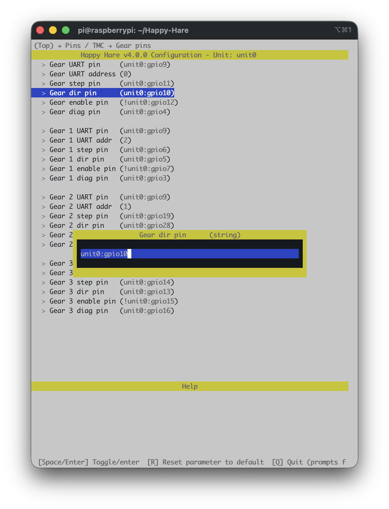
</p>

If that gear needs reversing, add a `!` in front of the pin name — Klipper's
standard way of inverting a pin's polarity:

<p align="center">
  
</p>

!!! tip
    If you built your 3MS from a kit, enter each of the dir pin entries and add a "!" in front of the pin to invert it. 

That's it — no rewiring, no `.cfg` files to hand-edit. Press Enter to accept the
change, or Esc to back out without applying it. And if you ever change a value
here and decide you'd rather have the default back, that's exactly what the **R**
key mentioned earlier is for: highlight the parameter and press R, and it resets
to whatever Happy Hare would have picked on its own.

### Picking a toolhead

From the top menu, enter **Toolhead**:

<p align="center">
  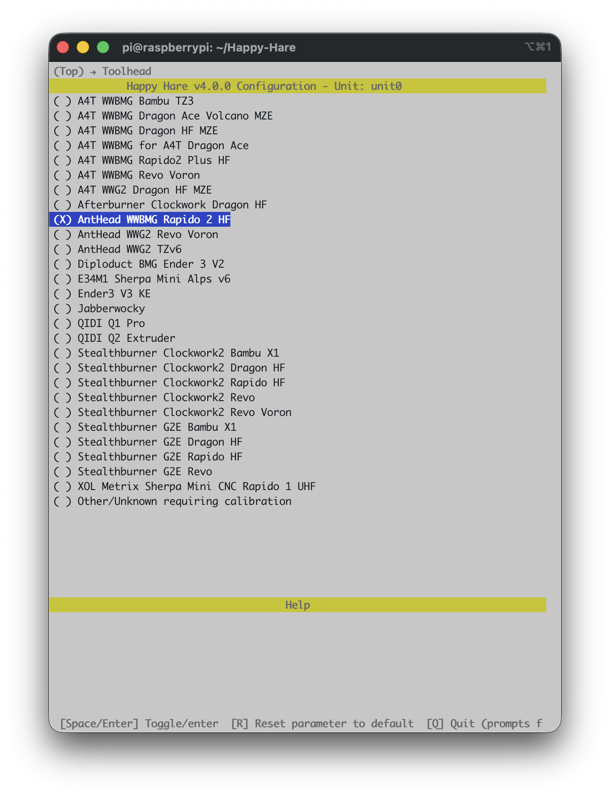
</p>

This step is entirely optional — skip it and Happy Hare falls back to generic
"Other/Unknown" dimensions, which is a perfectly normal starting point. But if
your toolhead (extruder + hotend combo) happens to be in this list, picking it
gets you real, community-measured values instead of guesses, for free. Here
we've picked **AntHead WWBMG Rapido 2 HF** at random, just to show
what selecting one does.

Back out and enter **Toolhead sensors/settings** to see the effect:

<p align="center">
  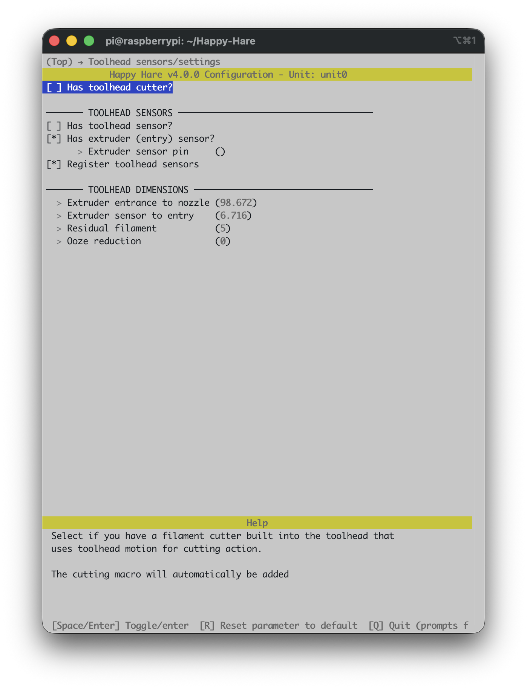
</p>

**Extruder entrance to nozzle** and **Residual filament**, under **Toolhead dimensions**,
are already filled in — `98.7` and `5` here — measured by someone else on the same
hardware rather than left at the generic default. The other two distances Happy Hare
can use (toolhead sensor to nozzle, extruder sensor to entry) only appear once you've
told it you actually have those sensors on your toolhead, higher up this same screen --
until relevent the values stay hidden here.

This is a shortcut, not a substitute: even with a listed toolhead, you're still
better off learning to measure and calibrate your own eventually, since small
build variations and mods add up. But it's a genuinely good starting point,
and if your exact combo isn't listed, "Other/Unknown" plus manual calibration
([`MMU_CALIBRATE_TOOLHEAD`](Calibration-Toolhead.md)) is exactly as normal a path as this one.

### An example software option: Spoolman

From the top menu, enter **Software Options**, then **Select spoolman
spool manager support**:

<p align="center">
  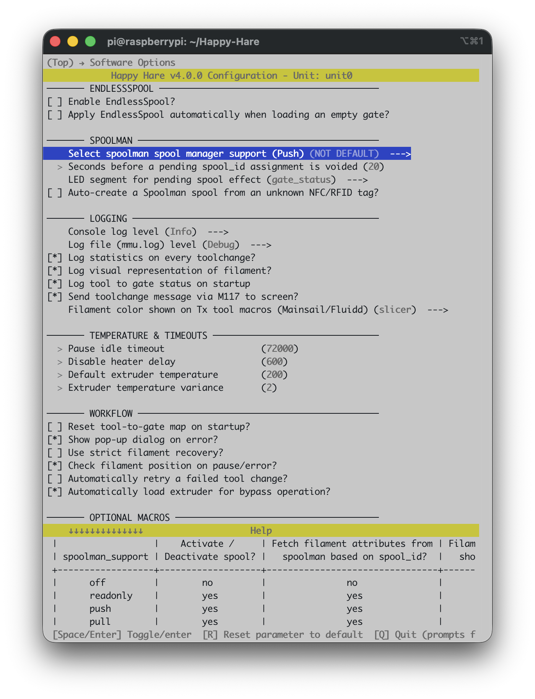
</p>

This is one small example of the many software-side options living under
**Software Options** — most of them, like this one, default to off and are
entirely optional. If you run a [Spoolman](https://github.com/Donkie/Spoolman)
instance and want Happy Hare to control filament details (material, color,
temperatures) for each gate and save them in Spoolman, select **Push**
as shown here. The help table on screen lays out exactly what each of the four
modes does — off, read-only, push, and pull — so you can pick the one that
matches how you actually use Spoolman.

Notice the row now reads `(Push) (NOT DEFAULT)` — menuconfig always flags a
value that differs from its default this way, which makes it easy to spot your
own changes later. If you decide you don't want it after all, `R` puts it straight
back to `Off`.

### Explore the rest

That's enough to get a stock 3MS basically talking to Klipper, but it's
only a fraction of the menu. **Software Options**, **Tip Forming / Cutting**,
**Purging**, **Endstops and Bowden movement** and the rest are all worth a look —
scroll all the way from the top to **Paths & Services** at the bottom at least
once. Nothing you look at will break anything: moving the highlight
costs nothing, and `R` is always there to undo a change you don't
want. Remember that you don't need to setup everything now — you can come back
many times and re-run menconfig with `./install.sh -i` and incrementally
setup features and macros.

### Saving, and coming back later

When you're done, press **Esc** from the top level (or **Q**) to get the save
prompt, and confirm. Happy Hare writes your `.cfg` files from what you chose.

The installer only forces `menuconfig` open automatically on that very first run.
After that, running `./install.sh` again just upgrades in place — it won't reopen
the menu. To go back in and change something, use:

```bash
./install.sh -i
```

This is the normal way to revisit any setting on this page — there's no need to
ever hand-edit the generated `.cfg` files directly.

!!! note
    The one thing worth knowing:
    if you've hand-edited a `.cfg` file since your last visit to `menuconfig`,
    `-i` will ask how to reconcile that — **Refresh** (keep your manual edits, and
    just add new options), **Replace** (regenerate everything from menuconfig, discarding
    direct edits) or **Merge** (attempts to merge manual edits into menuconfig)

    If you only ever configure through `menuconfig`, as this page assumes, option 2
    (**Refresh**) is the recommended choice because it rebuilds your Happy Hare
    klipper config files ensuring a clean config and any future update made to the
    Happy Hare sofware.


## Validating Hardware Setup

With Klipper accepting the config and no startup errors, confirm the
physical mechanism actually does what Happy Hare thinks it does before
calibrating anything or trying to print.

**Gear stepper direction.** Each gate has its own gear stepper, and which
way it spins depends entirely on how its motor cable happens to be
plugged in. Check each one — feed a scrap of filament in by hand first
so you can see which way it moves:

```{.text .console-output}
MMU_SELECT GATE=0
MMU_TEST_MOVE MOVE=50
```

It should feed forward, away from the spool. If a gate runs backward,
give that gate's **Gear dir pin** a `!` (see [Pins: gear
direction](#pins-gear-direction) above) and try again. Repeat with
`GATE=1`, `GATE=2`, `GATE=3`.

**Sensors.** Insert a short fragment of filament into your toolhead's entry sensor by
hand and check it registers:

```{.text .console-output}
MMU_SENSORS
extruder              --> TRIGGERED
toolhead              --> Open
```

Remove the fragment and confirm it goes back to `Open`. Do this for every
sensor you plan to use.

## Calibration

See [Calibration](Calibration.md) for the full picture (which steps apply
to which MMU type, and why) and [Calibration: Gear
Rotation Distance](Calibration-Gear.md) for the complete procedure.

## Checking Basic Operation

Outside of a print, confirm the basics work end to end on a gate you've
already validated above:

```{.text .console-output}
MMU_SELECT GATE=0
MMU_LOAD
MMU_UNLOAD
```

Each should complete without error — no pauses, no "not calibrated"
warnings you weren't expecting. If something goes wrong here, it's much
easier to diagnose now than mid-print; see [Operation: Debugging
Problems](Operation.md#debugging-problems) if any of it doesn't behave as
expected.

## Slicer Setup

You now need to add some gcode hooks into your favorate slicer for `start g-code`,
`end g-code`, `after layer change` and `on tool change`. This is to coordinate with
the MMU during certain phases of a print. This is covered in
[Slicer Setup](Slicer-Setup.md#start-g-code). Jump to this section, make these
changes and return here.

## Printing with MMU

Besides the slicer gcode hooks above, there's one real decision left before
your first multi-material print: how purging between colors happens.

- **Slicer-controlled** — your slicer's own wipe tower, printed alongside
  the model. Simplest to set up; costs bed space and filament.
- **Happy Hare-controlled** — a dedicated purge macro runs at each
  toolchange instead of a wipe tower: either [Macro:
  Purge](Macro-Purge.md) (simple, prints a purge line) or [Macro:
  Blobifier](Macro-Blobifier.md) (a dedicated purge/park station, more
  capable but its own hardware). See [Purging without a wipe
  tower](Feature-Tip-Forming-Purging.md#purging-without-a-wipe-tower) for
  how to disable the slicer's tower and hand purging over to Happy Hare.

Either way, the toolchange parking positions and movement (retraction,
z-hop, where the toolhead parks during a change) live in
`mmu_macro_vars.cfg`, tunable through **Macro Variables** in `menuconfig`
— see [Toolchange Movement](Toolchange-Movement.md) for what each setting
actually does before changing the defaults.

Once that's decided, slice something with more than one filament and run
your first print.

## What Next?

- Install [KlipperScreen (Happy Hare edition)](KlipperScreen.md) if you
  want a touchscreen front end, or drive everything from [Mainsail /
  Fluidd](Mainsail-Fluidd-Integration.md) — either works, and both are
  covered.
- From here, explore the rest of this site's [Features](Feature-Espooler.md)
  section one page at a time as you actually need them — Spoolman
  integration, NFC/RFID tags, EndlessSpool, and the rest. Trying to absorb
  all of it before your first print is the fastest way to feel
  overwhelmed by an MMU that, day to day, mostly just works.

---
