# Getting Started with Box Turtle

This page walks through the first `menuconfig` pass for a BoxTurtle MMU — the
screens you'll see, in the order you'll see them, and the handful of choices worth
pausing on. It's the first of a set of getting-started pages; other pages cover
toolhead calibration and multi-unit setups in more depth. Here we're just getting
a Box Turtle installed and talking to Klipper.

## Menuconfig Installer

First clone the Happy Hare repository as described in
[Cloning Happy Hare](Installation.md#cloning-happy-hare).

Then run the installer:

```bash
cd Happy-Hare
./install.sh
```

The first run opens `menuconfig` automatically because no `.mmu_config` exists
yet; no `-i` flag is needed.

<p align="center">
  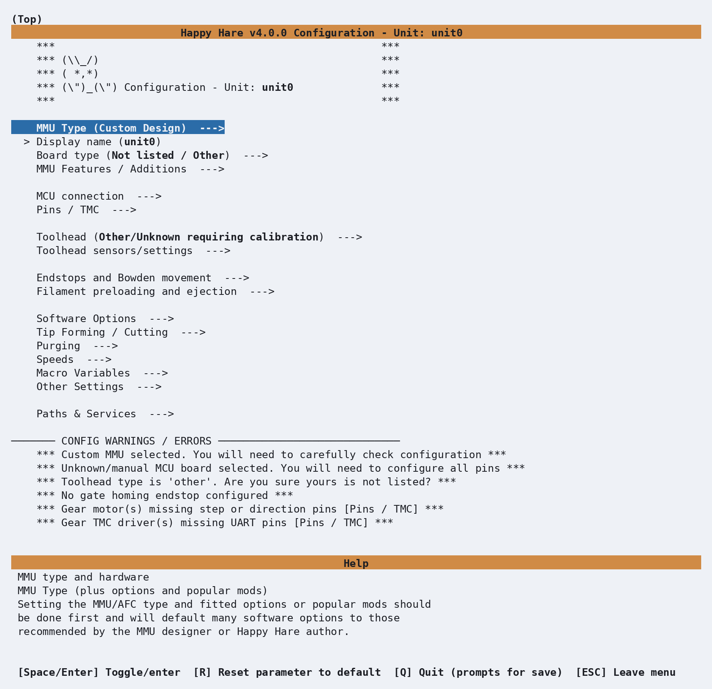
</p>

This is the installer's default state: `MMU Type` is `Custom Design`, the board is
unknown, and the **CONFIG WARNINGS / ERRORS** panel at the bottom lists exactly
that — four things still need a decision. As soon as you pick a real MMU type,
most of these clear themselves.

A quick word on the controls, since you'll use them constantly:

* **Arrow keys** move the highlight; **Enter** (or **Space**) opens a submenu or
  toggles/selects the highlighted item.
* **Esc** or **Left Arrow key** backs out one level; from the top level it offers to save.
* **R** resets the highlighted parameter back to its default — useful any time
  you've typed something and want to back out cleanly without hunting for the
  original value.

### Choosing the MMU type

Highlight **MMU Type** and press Enter:

<p align="center">
  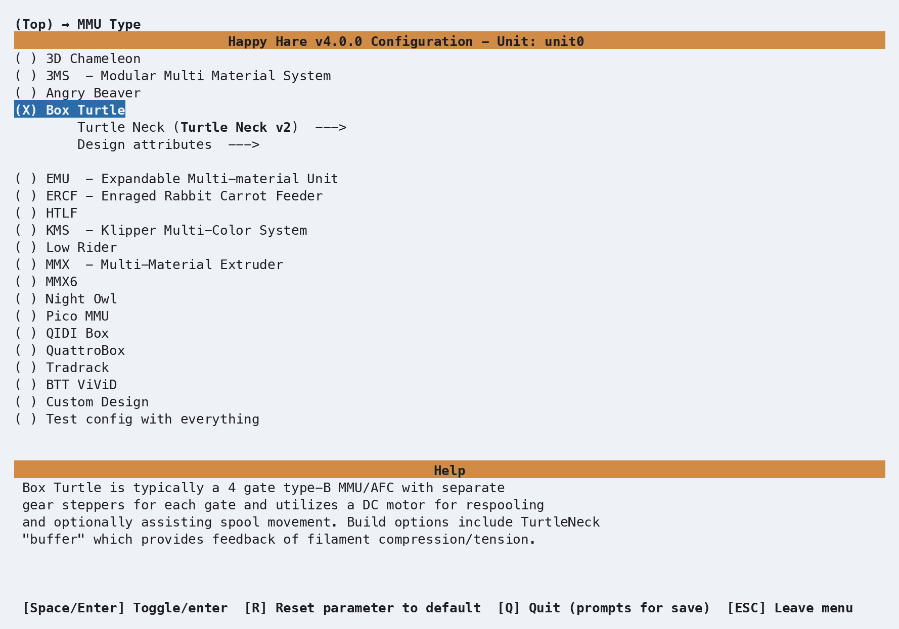
</p>

Move down to **Box Turtle** and press Space to select it. Two things happen
immediately: the radio button fills in (`(X) Box Turtle`), and two new lines
appear indented underneath it — **Turtle Neck** and **Design attributes** — options
that only make sense once Happy Hare knows this is a Box Turtle.

Enter **Turtle Neck** to see the buffer choice:

<p align="center">
  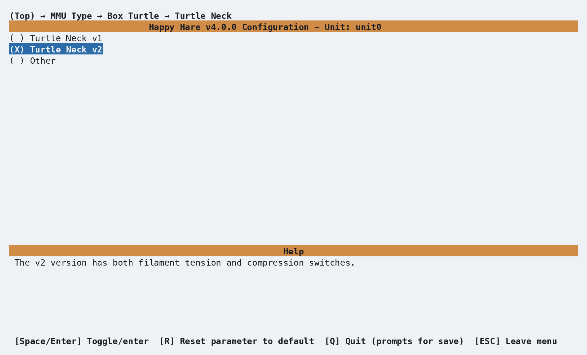
</p>

The Turtle Neck is Box Turtle's **sync-feedback buffer**. It senses whether
filament between the MMU and toolhead is under tension or compression so Happy
Hare can keep the gear motors synchronized with the extruder. It is not a
filament catchment buffer; those manage unloaded filament slack and are a
different feature.

**Turtle Neck v2** is the default and uses two switches with a spring that rests
toward the tension side. **Turtle Neck v1** also has tension and compression
switches but is unsprung. Choose **Other** for a different switch arrangement or
an analog proportional buffer. This choice supplies the right starting values,
but you will review its range and pins under **Buffer config** shortly.

Back out twice (Esc, Esc) to return to the top menu, and look at the warnings
panel again:

<p align="center">
  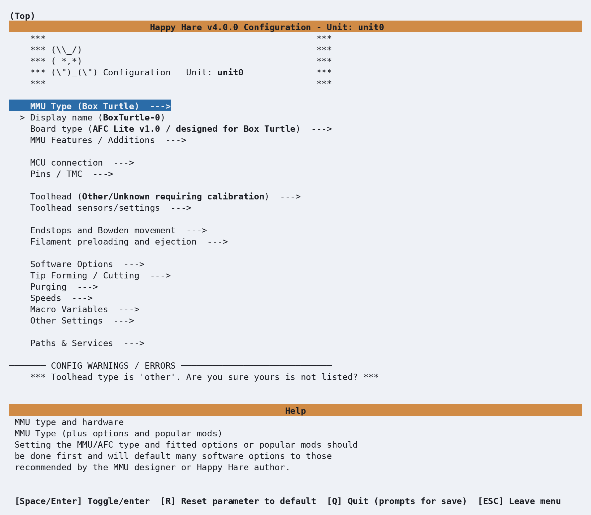
</p>

Three of the four warnings are already gone. The one that's left — *"Toolhead type
is 'other'"* — is exactly what it sounds like: Happy Hare still doesn't know your
toolhead, and that's covered in a different getting-started page. Don't worry
about it here.

### Board type

Enter **Board type**:

<p align="center">
  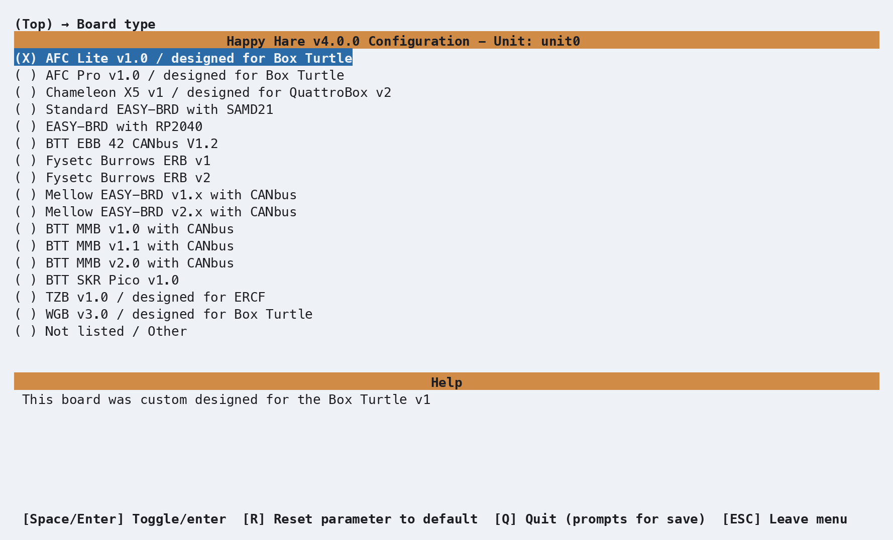
</p>

Because you already told it this is a Box Turtle, Happy Hare has pre-selected
**AFC Lite v1.0 / designed for Box Turtle** — the board most Box Turtles are built
around. If yours is a Box Turtle on a different controller board, this is where
you'd pick it instead; the pin defaults for every stepper, sensor and TMC driver
on the rest of the menu come from whatever you choose here.

### MCU connection

Back out to the top and enter **MCU connection**:

<p align="center">
  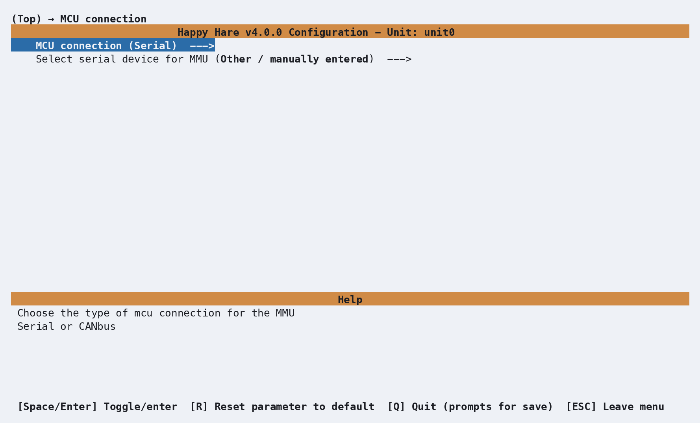
</p>

Again, already right for a board like the AFC Lite that plugs in over USB:
**MCU connection** is `Serial`, and there's a second line to pick *which* serial
device if you have more than one board attached. If your board talks CANbus
instead, this is where you'd switch it — but for a stock, USB-attached Box
Turtle, Serial is what you want and there's nothing to change.

### Built-in Box Turtle features

Back out and enter **MMU Features / Additions**:

<p align="center">
  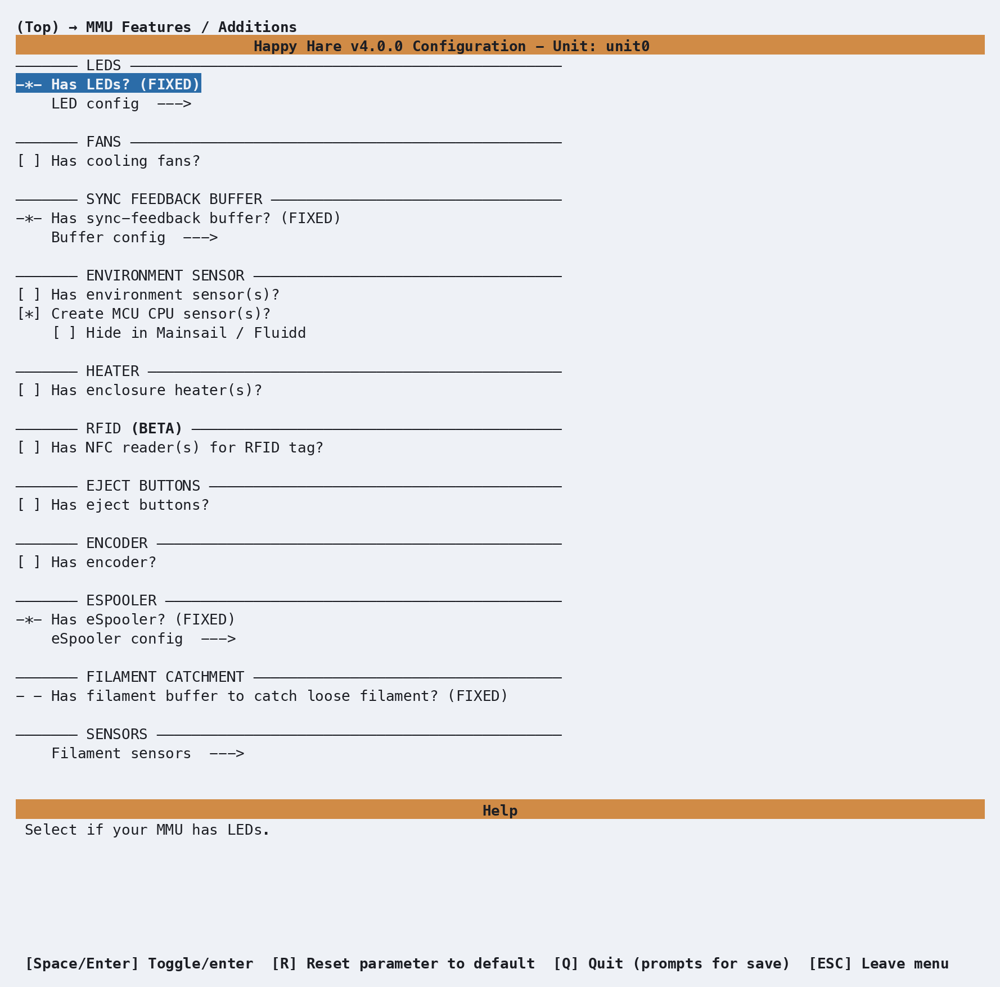
</p>

**LEDs**, **eSpooler** and the **sync-feedback buffer** are already switched on
and marked `(FIXED)`. That means they are part of the Box Turtle profile and
cannot be disabled here; it does not mean their pins should go unchecked. Fans,
an environment sensor, RFID readers, eject buttons and an encoder are optional
and default off — enable only the additions you actually built.

#### eSpooler configuration

Enter **eSpooler config**, then scroll down to the eSpooler pin rows:

<p align="center">
  
</p>

Each gate has separate **enable**, **rewind** and **forward** outputs. The
selected board profile fills these in automatically. For the stock AFC Lite
profile they should be:

| Gate | Enable | Rewind | Forward |
|---:|---|---|---|
| 0 | `unit0:PA2` | `unit0:PA0` | `unit0:PA1` |
| 1 | `unit0:PA5` | `unit0:PA6` | `unit0:PA7` |
| 2 | `unit0:PB13` | `unit0:PB14` | `unit0:PB15` |
| 3 | `unit0:PD11` | `unit0:PD12` | `unit0:PD13` |

If you selected another controller, use the values supplied for that board and
compare them with its wiring diagram instead of copying this table. The optional
trigger pin is normally blank on a stock Box Turtle; it is only needed by an
eSpooler modified with a dedicated tension-switch burst trigger.

Leave the supplied power and speed settings alone for the first installation.
They are starting values, not proof that a motor is wired in the correct
direction. You will safely test each output after installation. See
[Feature: eSpooler](Feature-Espooler.md) when you are ready to tune rewind,
load assist and in-print assist.

#### Turtle Neck buffer configuration

Back out once and enter **Buffer config**:

<p align="center">
  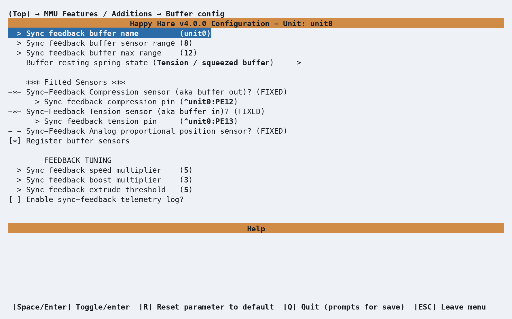
</p>

For Turtle Neck v1 and v2, the profile supplies a sensor range of `8` mm and a
maximum physical range of `12` mm. V2 also sets **Buffer resting spring state**
to **Tension / squeezed buffer**; v1 uses **n/a** because it is unsprung. These
are suitable starting values for an unmodified mechanism.

On an AFC Lite, the normal switch assignments are
`compression = ^unit0:PE12` and `tension = ^unit0:PE13`. A different controller
may supply different pins. What matters is not merely that both rows are filled
in, but that each physical switch later reports the filament condition named by
its row. See [Feature: Sync-Feedback Buffer](Feature-Sync-Feedback-Buffer.md)
for range measurement, tuning and proportional-sensor setup.

### Pins: gear direction

This is the one setting on this page that's genuinely impossible to get right by
guessing. Back out to the top, enter **Pins / TMC**, then **Gear pins**:

<p align="center">
  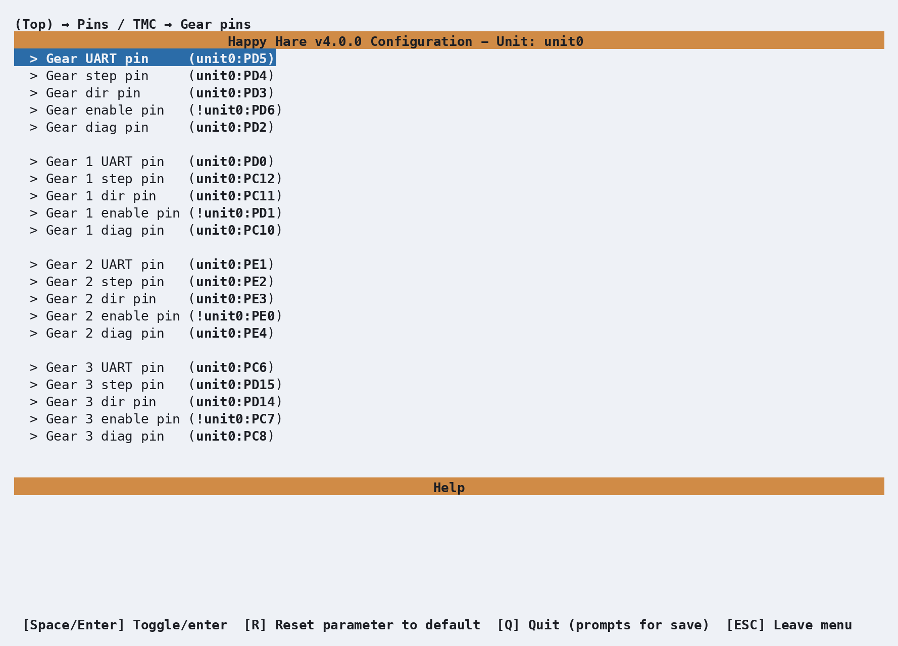
</p>

Every gate has its own UART, step, dir, enable and diag pin, all filled in from
the AFC Lite defaults you picked earlier. The one you're most likely to need to
touch is **dir** — whether a gear stepper spins the "right" way depends on which
way its cable happens to be plugged in, and no config file can know that in
advance. You'll find out the first time you try to load filament and gate 0 (say)
runs backwards.

Highlight **Gear dir pin** and press Enter to open its editor:

<p align="center">
  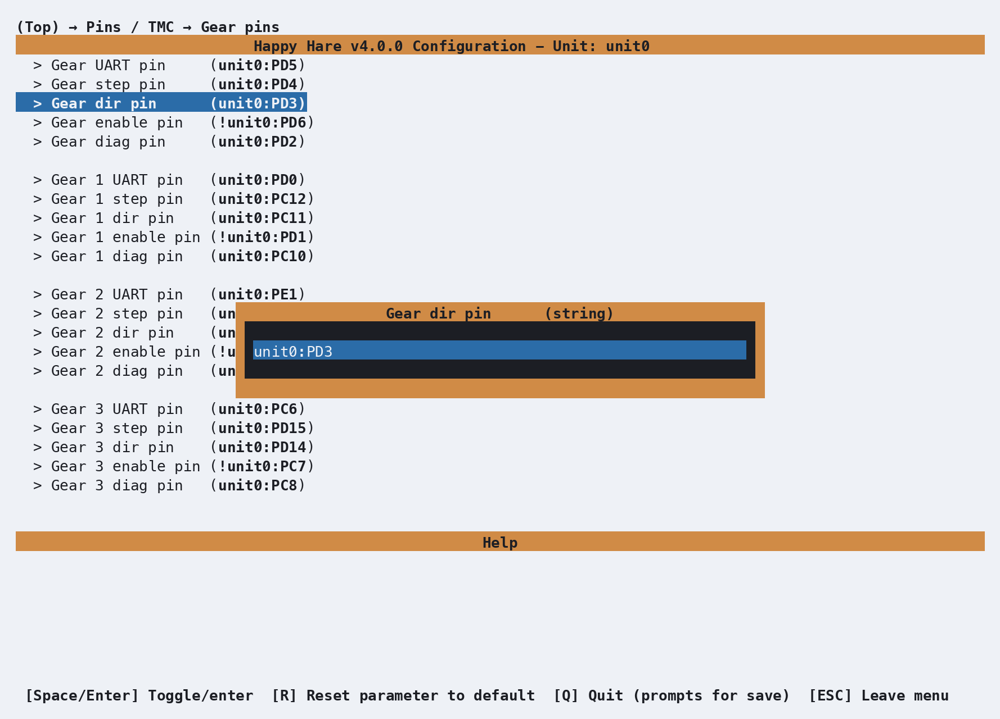
</p>

If that gear needs reversing, add a `!` in front of the pin name — Klipper's
standard way of inverting a pin's polarity:

<p align="center">
  
</p>

That's it — no rewiring, no `.cfg` files to hand-edit. Press Enter to accept the
change, or Esc to back out without applying it. And if you ever change a value
here and decide you'd rather have the default back, that's exactly what the **R**
key mentioned earlier is for: highlight the parameter and press R, and it resets
to whatever Happy Hare would have picked on its own.

### Picking a toolhead

From the top menu, enter **Toolhead**:

<p align="center">
  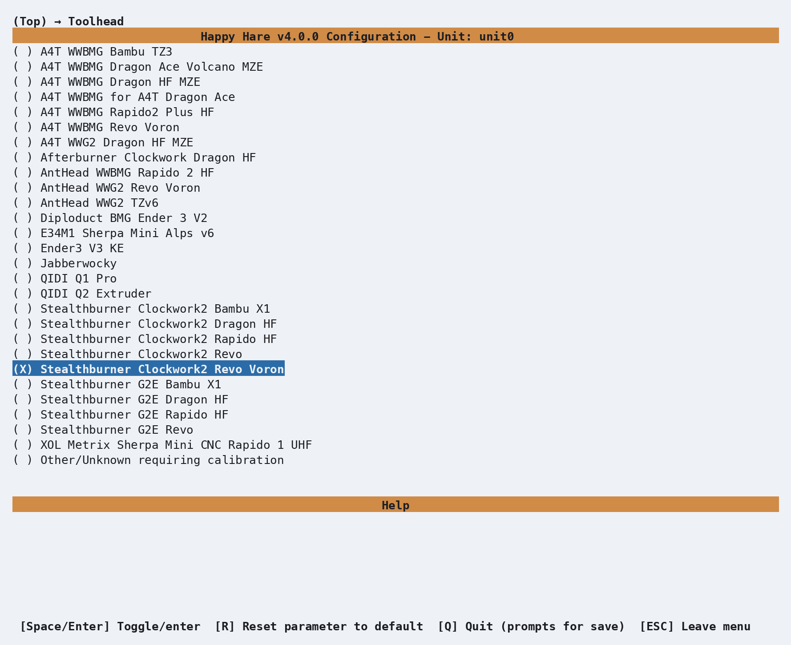
</p>

This step is entirely optional — skip it and Happy Hare falls back to generic
"Other/Unknown" dimensions, which is a perfectly normal starting point. But if
your toolhead (extruder + hotend combo) happens to be in this list, picking it
gets you real, community-measured values instead of guesses, for free. Here
we've picked **Stealthburner Clockwork2 Revo Voron** at random, just to show
what selecting one does.

Back out and enter **Toolhead sensors/settings** to see the effect:

<p align="center">
  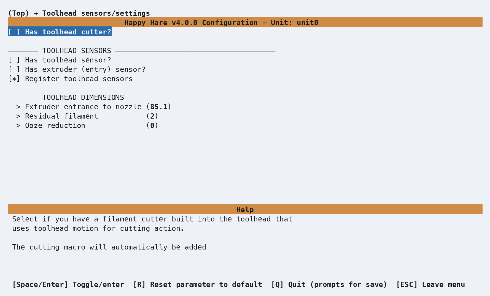
</p>

**Extruder entrance to nozzle** and **Residual filament**, under **Toolhead dimensions**,
are already filled in — `85.1` and `2` here — measured by someone else on the same
hardware rather than left at the generic default. The other two distances Happy Hare
can use (toolhead sensor to nozzle, extruder sensor to entry) only appear once you've
told it you actually have those sensors on your toolhead, higher up this same screen --
until relevant the values stay hidden here.

This is a shortcut, not a substitute: even with a listed toolhead, you're still
better off learning to measure and calibrate your own eventually, since small
build variations and mods add up. But it's a genuinely good starting point,
and if your exact combo isn't listed, "Other/Unknown" plus manual calibration
([`MMU_CALIBRATE_TOOLHEAD`](Calibration-Toolhead.md)) is exactly as normal a path as this one.

### Explore the rest

That's enough to get a stock Box Turtle basically talking to Klipper, but it's
only a fraction of the menu. **Software Options**, **Tip Forming / Cutting**,
**Purging**, **Endstops and Bowden movement** and the rest are all worth a look —
scroll all the way from the top to **Paths & Services** at the bottom at least
once. Nothing you look at will break anything: moving the highlight
costs nothing, and `R` is always there to undo a change you don't
want. Remember that you don't need to setup everything now — you can come back
many times and re-run menuconfig with `./install.sh -i` and incrementally
setup features and macros.

Software integrations such as [Spoolman](Feature-Spoolman.md) are optional and
can be added after the core hardware is working.

### Saving, and coming back later

When you're done, press **Esc** from the top level (or **Q**) to get the save
prompt, and confirm. Happy Hare writes your `.cfg` files from what you chose.

The installer only forces `menuconfig` open automatically on that very first run.
After that, running `./install.sh` again just upgrades in place — it won't reopen
the menu. To go back in and change something, use:

```bash
cd ~/Happy-Hare
./install.sh -i
```

This is the normal way to revisit any setting on this page — there's no need to
ever hand-edit the generated `.cfg` files directly.

!!! note
    The one thing worth knowing:
    if you've hand-edited a `.cfg` file since your last visit to `menuconfig`,
    `-i` will ask how to reconcile that — **Refresh** (keep your manual edits, and
    just add new options), **Replace** (regenerate everything from menuconfig, discarding
    direct edits) or **Merge** (attempts to merge manual edits into menuconfig)

    If you only ever configure through `menuconfig`, as this page assumes, option 2
    (**Refresh**) is the recommended choice because it rebuilds your Happy Hare
    klipper config files ensuring a clean config and any future update made to the
    Happy Hare software.


## Validating Hardware Setup

The shared [Hardware Validation](Hardware-Validation.md) checklist covers the
MCU, optional hardware and movement/homing model in full. The checks below are
the Box Turtle-specific minimum: every gear drive, every fitted filament
switch, both Turtle Neck states and both eSpooler directions on all four gates.

With Klipper accepting the config and no startup errors, confirm the
physical mechanism actually does what Happy Hare thinks it does before
calibrating anything or trying to print.

### Gear stepper direction

Each gate has its own gear stepper, and which way it spins depends on how its
motor cable is connected. Check each one with a short, visible piece of
filament:

```text
MMU_SELECT GATE=0
MMU_TEST_MOVE MOVE=50 GRIP=1
MMU_TEST_MOVE MOVE=-50 GRIP=1
```

The positive move must feed away from the spool and toward the toolhead; the
negative move must return toward the spool. If both are reversed, add or remove
`!` on that gate's **Gear dir pin** in menuconfig (see [Pins: gear
direction](#pins-gear-direction)), reinstall and try again. Repeat with
`GATE=1`, `GATE=2` and `GATE=3`.

### Filament sensors

Query the sensors, then use a short filament fragment to trigger each physical
switch in turn:

```{.text .console-command}
MMU_SENSORS
```

```{.text .console-output}
mmu_entry_0           --> TRIGGERED
mmu_entry_1           --> Open
mmu_exit_0            --> Open
mmu_shared_exit       --> Open
filament_compression  --> Open
filament_tension      --> Open
```

Confirm the intended sensor alone changes to `TRIGGERED`, then remove the
fragment and confirm it returns to `Open`. Repeat for every configured sensor:

- `mmu_entry_0` through `mmu_entry_3` at the four lane entrances;
- `mmu_exit_0` through `mmu_exit_3` after the four gear drives;
- `mmu_shared_exit` at the common hub exit.

Your list contains only the sensors enabled by your build. If a switch reads
backward, correct its pin inversion in menuconfig. If it never changes, check
the selected pin, connector and pull-up before continuing.

### Turtle Neck sync-feedback

A Turtle Neck reports the condition experienced by the filament, which can
sound opposite to its visible motion. Excess filament under **compression**
makes the neck extend; taut filament under **tension** squeezes it together.

Run both status commands, move the neck by hand to the middle and both extremes,
then query it again at each position:

```{.text .console-command}
MMU_SENSORS
MMU_SYNC_FEEDBACK
```

| Position | Expected result |
|---|---|
| Mid-travel | Both switches open; sync feedback reports neutral |
| Extended by excess filament | `filament_compression` is `TRIGGERED` |
| Squeezed by taut filament | `filament_tension` is `TRIGGERED` |

Do not assume an unloaded Turtle Neck v2 should stay neutral: its spring normally
returns it toward the squeezed/tension state. V1 is unsprung and may remain
where it was left. The test is whether the middle and two extremes report the
right conditions.

If compression and tension are exchanged, swap those assignments under
**MMU Features / Additions → Buffer config**. If one switch reports triggered
when released, correct that pin's inversion there. Reinstall and repeat the
test rather than editing the generated `mmu_hardware.cfg` directly.

### eSpooler direction and pins

!!! warning "Keep the stop command ready"
    Test with an empty or scrap spool first. A wrong direction or excessive
    power can unwind a full spool very quickly. `MMU_ESPOOLER ALLOFF=1` stops
    every eSpooler immediately.

Run one short burst in each direction, then stop everything:

```text
MMU_ESPOOLER GATE=0 BURST=1 OPERATION=rewind
MMU_ESPOOLER GATE=0 BURST=1 OPERATION=assist
MMU_ESPOOLER ALLOFF=1
```

`rewind` should take up slack onto the spool; `assist` should feed
filament off it toward the MMU. Repeat for gates 1, 2 and 3.

| Symptom | What to check in **eSpooler config** |
|---|---|
| Neither direction moves | Enable pin, motor connection and power |
| `rewind` feeds out and `assist` takes up | Swap that gate's rewind and forward pin assignments |
| Motor is active when it should be off | Output and enable-pin active polarity; add or remove `!` only if required by the controller |
| One direction alone does nothing | That direction's pin assignment and wiring |

Reversed eSpooler direction is not corrected like a stepper `dir_pin`: AFC Lite
uses two separate directional outputs. See [Feature: eSpooler — Setting up each
mode](Feature-Espooler.md#setting-up-each-mode) before changing power, speed or
in-print assist settings.

## Calibration

A Box Turtle doesn't need much here. Bowden length is auto-calibrated on
first load by default (`autocal_bowden_length`, on for the Turtle Neck v2
buffer this guide assumes), so there's nothing to run by hand for that.

The one step worth doing anyway is calibrating each gate/lane's gear
stepper for an accurate `rotation_distance`:

```text
MMU_CALIBRATE_GEAR MEASURED=102.5
```

It isn't forced — Happy Hare will run on the installed default
regardless — but it's genuinely worth the few minutes per gate for
accurate filament changes and fewer load/unload errors down the line.
See [Calibration](Calibration.md) for the full picture (which steps apply
to which MMU type, and why) and [Calibration: Gear
Rotation Distance](Calibration-Gear.md) for the complete procedure.

## Checking Basic Operation

After the individual hardware checks and gear calibration pass, test all three
mechanisms together on gate 0:

```text
MMU_SELECT GATE=0
MMU_LOAD
MMU_UNLOAD
MMU_ESPOOLER
MMU_SYNC_FEEDBACK
```

During loading, the gear must feed toward the toolhead and the eSpooler must
assist by releasing filament. During unloading, the eSpooler must rewind slack
onto the spool. The Turtle Neck should move through its expected range without
remaining jammed at an extreme. Each command should complete without an
unexpected pause or error.

Repeat on the other gates before printing. If something goes wrong here, it is
much easier to diagnose now than mid-print; see [Operation: Debugging
Problems](Operation.md#debugging-problems).

## Slicer Setup

You now need to add some gcode hooks into your favorite slicer for `start g-code`,
`end g-code`, `after layer change` and `on tool change`. This is to coordinate with
the MMU during certain phases of a print. This is covered in
[Slicer Setup](Slicer-Setup.md#start-g-code). Jump to this section, make these
changes and return here.

## Printing with MMU

Besides the slicer gcode hooks above, there's one real decision left before
your first multi-material print: how purging between colors happens.

- **Slicer-controlled** — your slicer's own wipe tower, printed alongside
  the model. Simplest to set up; costs bed space and filament.
- **Happy Hare-controlled** — a dedicated purge macro runs at each
  toolchange instead of a wipe tower: either [Macro:
  Purge](Macro-Purge.md) (simple, prints a purge line) or [Macro:
  Blobifier](Macro-Blobifier.md) (a dedicated purge/park station, more
  capable but its own hardware). See [Purging without a wipe
  tower](Feature-Tip-Forming-Purging.md#purging-without-a-wipe-tower) for
  how to disable the slicer's tower and hand purging over to Happy Hare.

Either way, the toolchange parking positions and movement (retraction,
z-hop, where the toolhead parks during a change) live in
`mmu_macro_vars.cfg`, tunable through **Macro Variables** in `menuconfig`
— see [Toolchange Movement](Toolchange-Movement.md) for what each setting
actually does before changing the defaults.

Once that's decided, slice something with more than one filament and run
your first print.

## What Next?

- Install [KlipperScreen (Happy Hare edition)](KlipperScreen.md) if you
  want a touchscreen front end, or drive everything from [Mainsail /
  Fluidd](Mainsail-Fluidd-Integration.md) — either works, and both are
  covered.
- From here, explore the rest of this site's [Features](Feature-Espooler.md)
  section one page at a time as you actually need them — Spoolman
  integration, NFC/RFID tags, EndlessSpool, and the rest. Trying to absorb
  all of it before your first print is the fastest way to feel
  overwhelmed by an MMU that, day to day, mostly just works.

---
