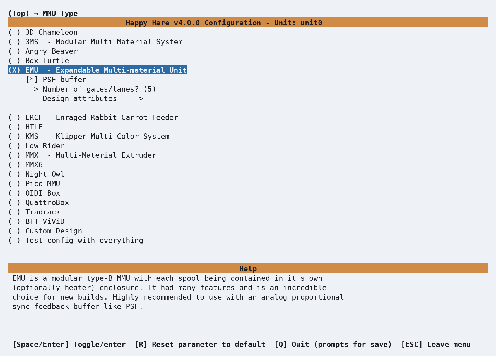
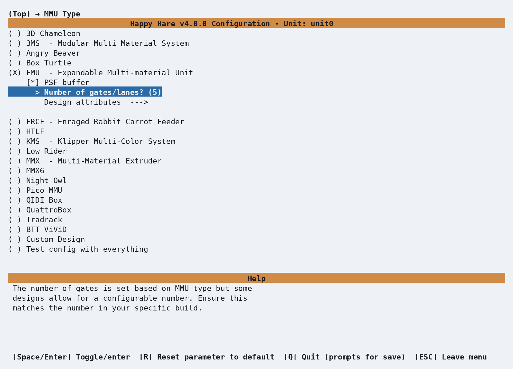
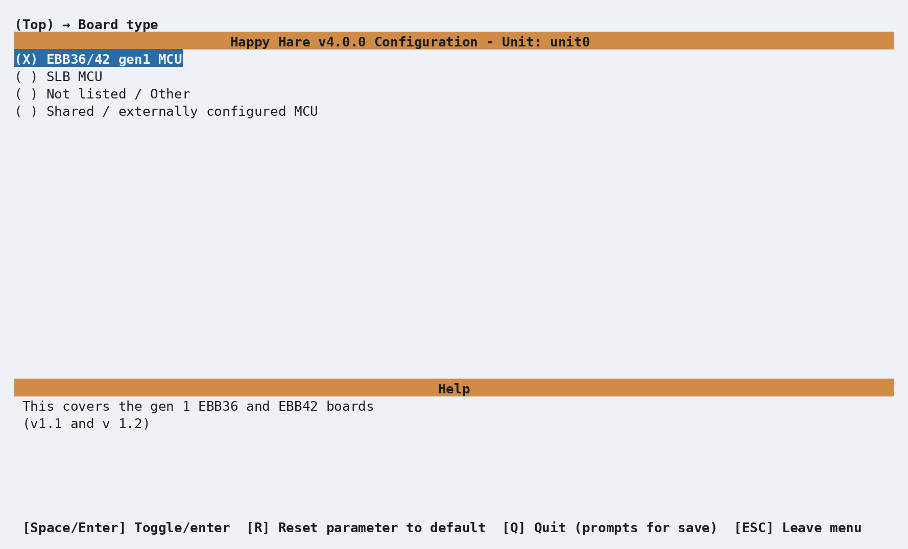
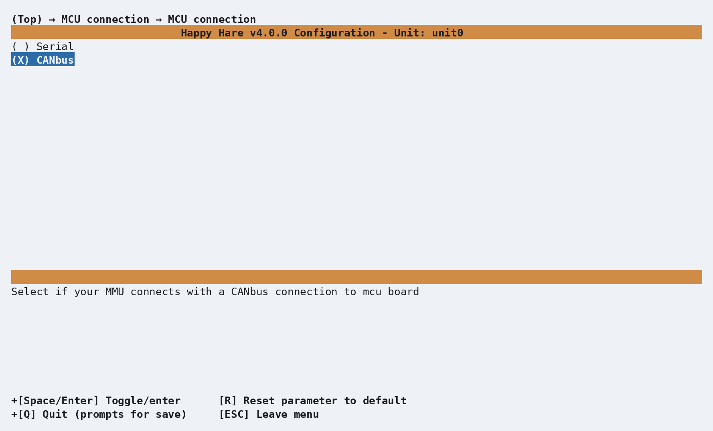
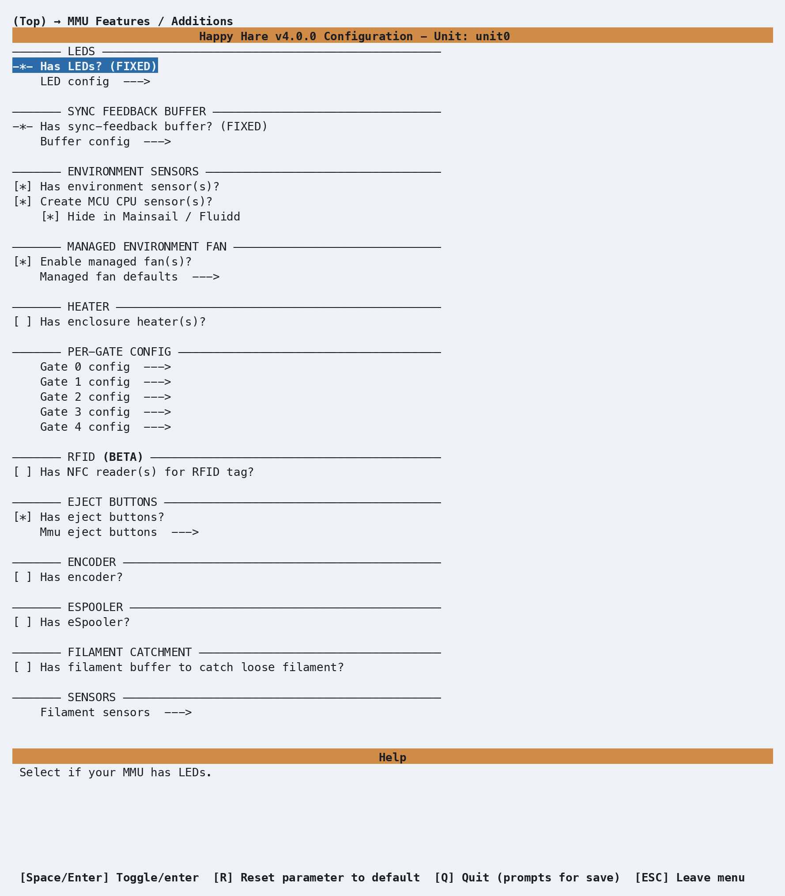
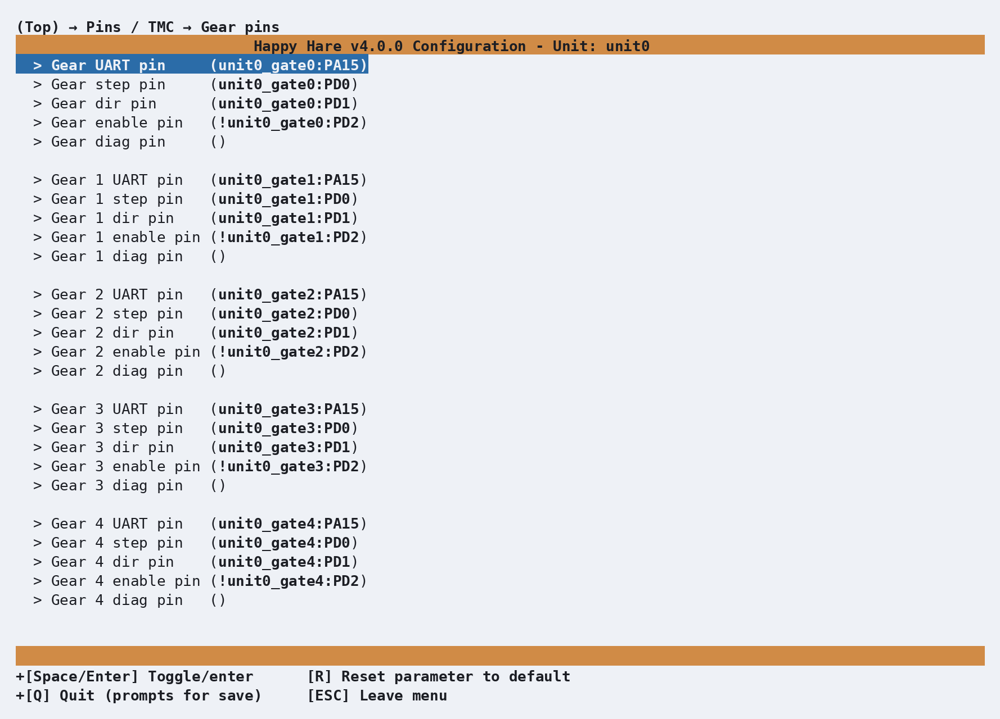
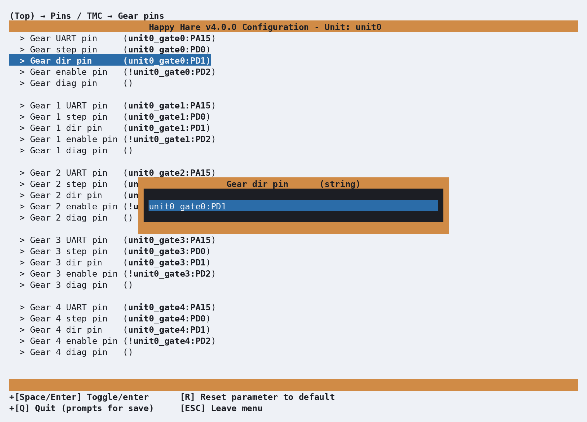
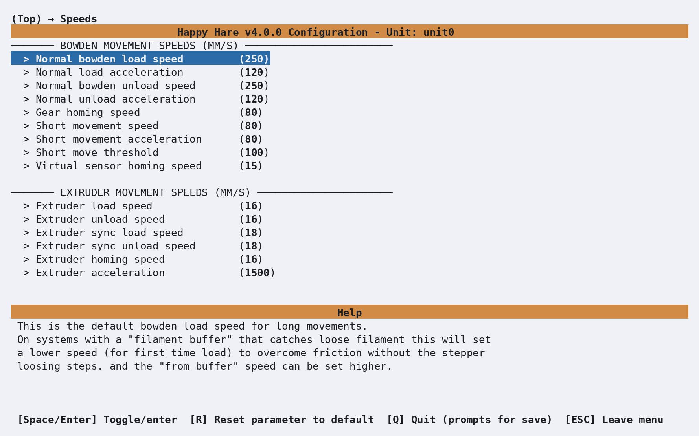
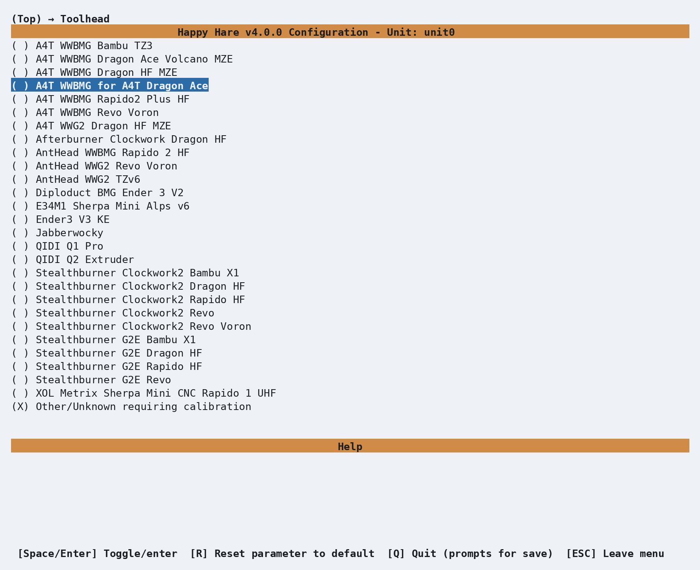
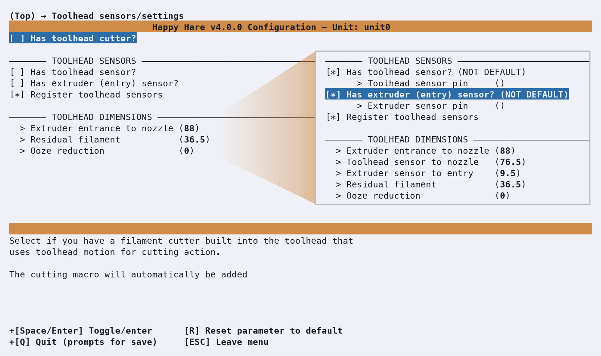

# Getting Started with EMU

This page walks through the first `menuconfig` pass for an EMU Type-B MMU — the
screens you'll see, in the order you'll see them, and the handful of choices
worth pausing on. It's the first of a set of getting-started pages; other pages
cover toolhead calibration and multi-unit setups in more depth. Here we're just
getting an EMU installed and talking to Klipper.

## Menuconfig Installer

From your Happy-Hare checkout:

```bash
cd ~/Happy-Hare
./install.sh -e
```

The very first time you run this, there's no `.mmu_config` yet, so the installer
drops you straight into `menuconfig`.

!!! note
    `-e` ensures multi-mcu support loads, you may omit it on later
    iterations. `menuconfig` may take longer to start up as a result, but it is
    required for a typical EMU setup.

<p align="center">  </p>

This is the installer's default state: `MMU Type` is `Custom Design`, the board
is unknown, and the **CONFIG WARNINGS / ERRORS** panel at the bottom lists
exactly that — four things still need a decision. As soon as you pick a real MMU
type, most of these clear themselves.

A quick word on the controls, since you'll use them constantly:

- **Arrow keys** move the highlight; **Enter** (or **Space**) opens a submenu or
  toggles/selects the highlighted item.
- **Esc** or **Left Arrow key** backs out one level; from the top level it
  offers to save.
- **R** resets the highlighted parameter back to its default — useful any time
  you've typed something and want to back out cleanly without hunting for the
  original value.

### Choosing the MMU type

Highlight **MMU Type** and press Enter:

<p align="center">  </p>

Move down to **EMU** and press Space to select it. Three things happen
immediately: the radio button fills in (`(X) EMU Type-B`), and new lines appear
indented underneath it — **PSF Buffer**, **Number of gates**, **Design
attributes** — options that only make sense once Happy Hare knows this is an
EMU.

### Number of gates

Enter **Number of gates** to set the gate count to match your hardware:

<p align="center">  </p>

Set the number of lanes according to your build.

### Board type

Back out to the top and enter **Board type**:

<p align="center">  </p>

Because you already told it this is an EMU, Happy Hare has pre-selected **SLB**
— the board purpose-built for the EMU. The pin defaults for every stepper,
sensor and TMC driver on the rest of the menu come from whatever you choose
here. If you have sourced a different board, select it here.

### MCU connection

Next, enter **MCU connection**:

<p align="center">  </p>

The EMU uses **CAN bus** communication. Each per-gate MCU (mmu0, mmu1, etc.)
communicates over CAN with its own UUID. The `canbus_uuid` for each unit must be
manually entered. You should have noted these down during the flashing step
while building your EMU - enter them here now.

### MMU Features / Additions

Back out and enter **MMU Features / Additions**:

<p align="center">  </p>

This is worth a look. For an EMU, **LEDs**, **eject buttons**, and the
**sync-feedback buffer** (analog or digital) are already switched on — these are
core to the EMU design. An environment sensor, enclosure heaters and RFID readers
are all genuine build options and default off — enable whichever ones you actually
built. If you're following this page for a basic EMU, just look and move on.

### Pins: gear direction

This is the one setting on this page that's genuinely impossible to get right by
guessing. Back out to the top, enter **Pins / TMC**, then **Gear pins**:

<p align="center">  </p>

Every gate has its own UART, step, dir, enable and diag pin, all filled in from
the SLB or EBB defaults you picked earlier. The one you're most likely to need to
touch is **dir** — whether a gear stepper spins the "right" way depends on which
way its cable happens to be plugged in, and no config file can know that in
advance. You'll find out the first time you try to load filament and gate 0
(say) runs backwards.

Highlight **Gear dir pin** and press Enter to open its editor:

<p align="center">  </p>

If that gear needs reversing, add a `!` in front of the pin name — Klipper's
standard way of inverting a pin's polarity:

<p align="center">  </p>

That's it — no rewiring, no `.cfg` files to hand-edit. Press Enter to accept the
change, or Esc to back out without applying it. And if you ever change a value
here and decide you'd rather have the default back, that's exactly what the
**R** key mentioned earlier is for: highlight the parameter and press R, and it
resets to whatever Happy Hare would have picked on its own.

### Speeds configuration

Back out to the top and enter **Other Settings** and **Speeds** to review the
motion parameters. The EMU defaults are conservative by design:

<p align="center">  </p>

Key defaults for the EMU:

| Parameter                   | Default  |
| --------------------------- | -------- |
| Normal bowden load speed    | 250 mm/s |
| Normal bowden unload speed  | 250 mm/s |
| Short movement speed        | 80 mm/s  |
| Short movement acceleration | 80 mm/s² |
| Gear homing speed           | 80 mm/s  |
| Extruder load speed         | 16 mm/s  |
| Extruder unload speed       | 16 mm/s  |

These are conservative values suitable for production use. If you're
experimenting or building a prototype, you can raise the short-move and homing
speeds, but start with these defaults and adjust only if you have a reason to.

### Picking a toolhead

From the top menu, enter **Toolhead**:

<p align="center">  </p>

This step is entirely optional — skip it and Happy Hare falls back to generic
"Other/Unknown" dimensions, which is a perfectly normal starting point. But if
your toolhead (extruder - hotend combo) happens to be in this list, picking it
gets you real, community-measured values instead of guesses, for free.

Back out and enter **Toolhead sensors/settings** to see the effect:

<p align="center"> 
</p>

**Extruder entrance to nozzle** and **Residual filament**, under **Toolhead
dimensions**, are already filled in — values measured by someone else on the
same hardware rather than left at the generic default. The other two distances
Happy Hare can use (toolhead sensor to nozzle, extruder sensor to entry) only
appear once you've told it you actually have those sensors on your toolhead,
higher up this same screen -- until relevant the values stay hidden here.

This is a shortcut, not a substitute: even with a listed toolhead, you're still
better off learning to measure and calibrate your own eventually, since small
build variations and mods add up. But it's a genuinely good starting point, and
if your exact combo isn't listed, "Other/Unknown" plus manual calibration
([`MMU_CALIBRATE_TOOLHEAD`](Calibration-Toolhead.md)) is exactly as normal a
path as this one.

### Saving, and coming back later

When you're done, press **Esc** from the top level (or **Q**) to get the save
prompt, and confirm. Happy Hare writes your `.cfg` files from what you chose.

The installer only forces `menuconfig` open automatically on that very first
run. After that, running `./install.sh` again just upgrades in place — it won't
reopen the menu. To go back in and change something, use:

`bash ./install.sh -i`

This is the normal way to revisit any setting on this page — there's no need to
ever hand-edit the generated `.cfg` files directly.

!!! note
    The one thing worth knowing: if you've hand-edited a `.cfg` file since
    your last visit to `menuconfig`, `-i` will ask how to reconcile that —
    **Refresh** (keep your manual edits, and just add new options), **Replace**
    (regenerate everything from menuconfig, discarding direct edits) or **Merge**
    (attempts to merge manual edits into menuconfig)

If you only ever configure through `menuconfig`, as this page assumes, option 2
(**Refresh**) is the recommended choice because it rebuilds your Happy Hare
klipper config files ensuring a clean config and any future update made to the
Happy Hare software.

## Validating Hardware Setup

With Klipper accepting the config and no startup errors, confirm the physical
mechanism actually does what Happy Hare thinks it does before calibrating
anything or trying to print.

**Gear stepper direction.** Each gate has its own gear stepper, and which way it
spins depends entirely on how its motor cable happens to be plugged in. Check
each one — feed a scrap of filament in by hand first so you can see which way it
moves:

```{.text .console-command}
MMU_SELECT GATE=0 MMU_TEST_MOVE MOVE=50
```

It should feed forward, away from the spool. If a gate runs backward, give that
gate's **Gear dir pin** a `!` (see [Pins: gear direction](#pins-gear-direction)
above) and try again. Repeat with `GATE=1`, `GATE=2`, `GATE=3`, up to `GATE=7`
for all eight gates.

**Sensors.** Insert a short fragment of filament into a gate's entry by hand and
check it registers:

```{.text .console-command}
MMU_SENSORS DETAIL=1
```

```{.text .console-output}
mmu_entry_0           --> TRIGGERED
mmu_entry_1           --> Open
filament_compression  --> Open
filament_tension      --> Open
```

Remove the fragment and confirm it goes back to `Open`. Do this for every gate
you plan to use, not just the first — a per-gate sensor is exactly as likely to
be miswired as a gear direction pin.

**Sync-feedback buffer orientation.** The EMU recommends proportional sync
feedback (PSF) or a switch-based EMUSync with compression and tension sensing.
Filament under **compression** (excess being fed in) makes the buffer
**extend**; filament under **tension** (being pulled taut, not enough slack)
makes it **fully compress**. Centered, at rest, it should read neutral. Move the
shuttle by hand to each extreme and confirm:

```{.text .console-command}
MMU_SYNC_FEEDBACK Sync feedback: Neutral
```

If compression and tension read backward from what you expect, swap
`compression_pin`/`tension_pin` in `mmu_hardware.cfg` (or their inversions)
rather than second-guessing the mechanism.

**LEDs.** With filament at the gate, trigger a few status effects to confirm the
NeoPixel strip is responding:

```{.text .console-command}
MMU_LED_EFFECT EFFECT=gate_status GATE=0
MMU_LED_EFFECT EFFECT=filament_color GATE=0
```

Each gate should light with the color mapped in `PARAM_LEDS_COLOR0` through
`PARAM_LEDS_COLOR20`. If colors are wrong, verify the color table values match
your intent.

## Calibration

The EMU needs a few calibration steps to get accurate filament tracking:

**Gear rotation distance.** Each gate's gear stepper needs an accurate
`rotation_distance` value. The EMU ships with a calibrated default of `22.7574`
mm/rot, but this should be verified:

```{.text .console-command}
MMU_CALIBRATE_GEAR MEASURED=102.5
```

This measures the actual distance the filament moves for a known input rotation.
Repeat for each gate if you have different gear configurations. See
[Calibration: Gear Rotation Distance](Calibration-Gear.md) for the complete
procedure.

**Bowden length auto-calibration.** The EMU enables auto bowden calibration by
default (`PARAM_CALIBRATION_BOWDEN_LENGTH = 1`). This runs on first load and
measures the exact bowden length for each gate. No manual calibration is needed
for this step.

**Sync feedback calibration.** If you have a PSF buffer, verify the calibration
values in `hh.json` match your hardware. Key PSF values:

| Parameter                                    | Value    | Notes                        |
| -------------------------------------------- | -------- | ---------------------------- |
| `PARAM_SYNC_FEEDBACK_ANALOG_MAX_COMPRESSION` | `0.9435` | Max compression analog value | -   |
| `PARAM_SYNC_FEEDBACK_ANALOG_MAX_TENSION`     | `0.0982` | Max tension analog value     | -   |
| `PARAM_SYNC_FEEDBACK_ANALOG_NEUTRAL_POINT`   | `0.5275` | Neutral point                |

These values are set via macro variables after calibration. See the
[Calibration](Calibration.md) page for full details.

## Checking Basic Operation

Outside of a print, confirm the basics work end to end on a gate you've already
validated above:

```{.text .console-command}
MMU_SELECT GATE=0
MMU_LOAD
MMU_UNLOAD
```

Each should complete without error — no pauses, no "not calibrated" warnings you
weren't expecting. If something goes wrong here, it's much easier to diagnose
now than mid-print; see
[Operation: Debugging Problems](Operation.md#debugging-problems) if any of it
doesn't behave as expected.

## Slicer Setup

You now need to add some gcode hooks into your favorite slicer for `start
g-code`, `end g-code`, `after layer change` and `on tool change`. This is to
coordinate with the MMU during certain phases of a print. This is covered in
[Slicer Setup](Slicer-Setup.md#start-g-code). Jump to this section, make these
changes and return here.

## Printing with MMU

Besides the slicer gcode hooks above, there's one real decision left before your
first multi-material print: how purging between colors happens.

- **Slicer-controlled** — your slicer's own wipe tower, printed alongside the
  model. Simplest to set up; costs bed space and filament.
- **Happy Hare-controlled** — a dedicated purge macro runs at each toolchange
  instead of a wipe tower: either [Macro: Purge](Macro-Purge.md)
  (simple, prints a purge line) or [Macro: Blobifier](Macro-Blobifier.md)
  (a dedicated purge/park station, more capable but its own hardware). See
  [Purging without a wipe tower](Feature-Tip-Forming-Purging.md#purging-without-a-wipe-tower)
  for how to disable the slicer's tower and hand purging over to Happy Hare.

Either way, the toolchange parking positions and movement (retraction, z-hop,
where the toolhead parks during a change) live in `mmu_macro_vars.cfg`, tunable
through **Macro Variables** in `menuconfig` — see [Toolchange
Movement](Toolchange-Movement.md) for what each setting actually does before
changing the defaults.

Once that's decided, slice something with more than one filament and run your
first print.

## What Next?

- Install [KlipperScreen (Happy Hare edition)](KlipperScreen.md) if you want a
  touchscreen front end, or drive everything from [Mainsail /
  Fluidd](Mainsail-Fluidd-Integration.md) — either works, and both are covered.
- From here, explore the rest of this site's [Features](Feature-Espooler.md)
  section one page at a time as you actually need them — Spoolman integration,
  NFC/RFID tags, EndlessSpool, and the rest. Trying to absorb all of it before
  your first print is the fastest way to feel overwhelmed by an MMU that, day to
  day, mostly just works.

---
