# Getting Started with Enraged Rabbit Carrot Feeder (ERCF)

The Enraged Rabbit Carrot Feeder (ERCF) is the original Multi Material Unit for Voron printers that started it all.
It's evolved considerably since it's formative v1.0 release. This guide walks through the initial
**`menuconfig`** pass for setting up an ERCF‑style MMU — the screens you’ll encounter, the order they appear in,
and the handful of selections that actually matter to getting core ERCF functionality up and running.

As it's evolved (v1, v1.1, v2, v2.5, and v3), the ERCF ecosystem has expanded into a wide range of permutations
including:

* Jack Rabbit, servo-less selector variants
* Multiple selector servo options
* Different encoder options (TCRT, and Binky optical encoders)
* Direct‑drive and geared NEMA 14 & 17 options
* Optional entry sensors
* Optional LED's/Neopixel entry / exit / logo bling
* Optional integrated filament buffer

Each revision introduces its own mechanical differences, quality of life improvements and optional features, 
which means the exact configuration screens you see — and the choices worth pausing on — depend on the 
hardware you’ve built.

**The goal here is simple:** get your ERCF‑style MMU installed, recognized by Klipper, and performing 
base load/unload operations. Once operational, optional capabilities like LED's, entry sensors and
more advanced Happy Hare features can be enabled, configured and calibrated.

## Menuconfig Installer

First clone the Happy Hare repository as described in
[Cloning Happy Hare](Installation.md#cloning-happy-hare).

Then run the installer:

```bash
cd Happy-Hare
./install.sh
```

The first run opens `menuconfig` automatically because no `.mmu_config` exists
yet; no `-i` flag is needed.

<p align="center">
  
</p>
<br>

This is the installer's default state: `MMU Type` is `Custom Design`, the board is unknown, and the
**`CONFIG WARNINGS / ERRORS`** panel at the bottom lists exactly that — four things still need a decision.
As soon as you pick a real MMU type, most of these clear themselves.

### Choosing the MMU type
Highlight **`MMU Type`** and press Enter. Move down to **`ERCF - Enraged Rabbit Carrot Feeder`** and press
++space++ to select it. Once selected (`(X) ERCF - Enraged Rabbit Carrot Feeder`), five new options appear
indented underneath — **`Version`**,**`Number of gates/lanes`**, **`Selector servo type`**,
 **`Project Options`** and **`Design attributes`** — options that only make sense once Happy Hare knows this
 is an ERCF. Other settings and options are also enabled based on the MMU design choice.
<br>

<p align="center">
  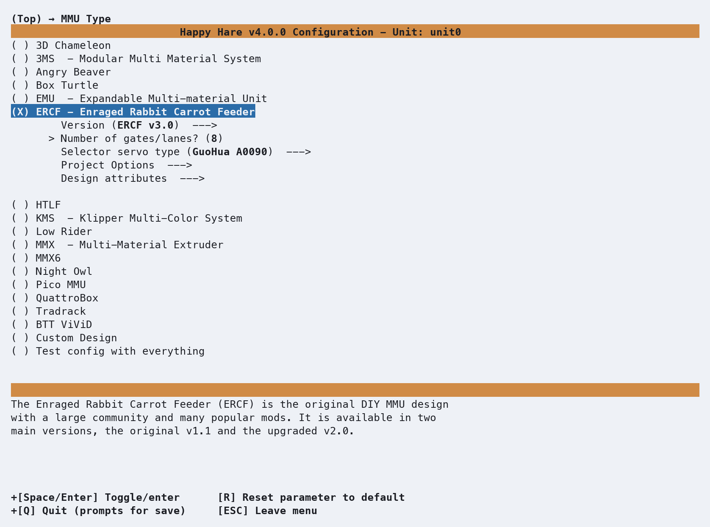
</p>
<br>
Confirm the version of your ERCF build. Because ERCF has evolved significantly over time, Happy Hare needs
to know which version you built so it can recommend and set appropriate defaults.

<p align="center">
  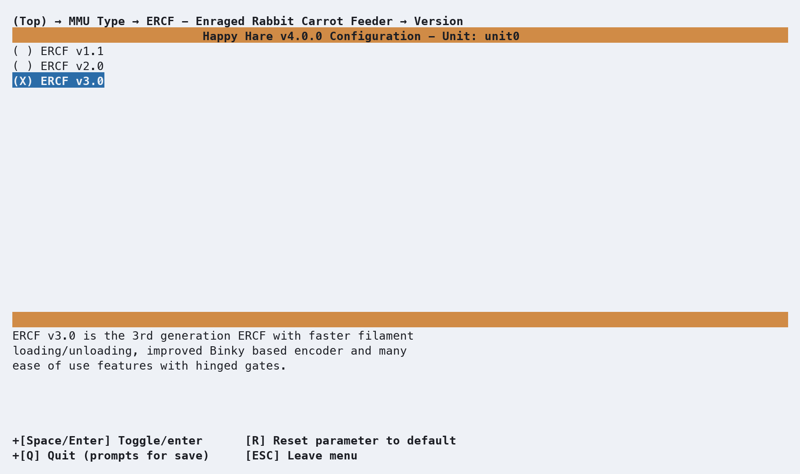
</p>
<br>
<br>
Enter the **`Number of gates/lanes`** to match your ERCF build. Different ERCF generations use different
gate conventions, so lane counts typically fall into multiples of **`3`** or **`4`** depending on the generation
built (e.g. versions < v2.x, groups of **`3`**, others groups of **`4`**).

The default is **`8`** gates, but you can change it to match your build — in this case, setting it to **`6`** gates.

<p align="center">
  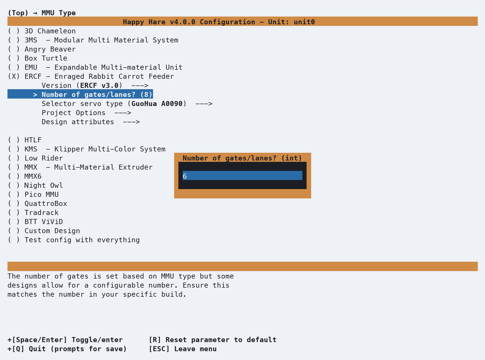
</p>
<br>
<br>
Next, select the **`Selector servo type`**. For most ERCF v3 builds the default is the **`GuoHua A0090`**, 
with several other common kit servos included in the list — **`GDW DS041MG`** and **`MG‑90S`** among them.

You’ll also find the **`Savox SH‑0255MG`**, a community‑favorite and widely regarded as the _Gucci_,
ultra‑reliable option thanks to its consistent torque and proven, long‑term durability.

If your build uses a different servo, select **`Not listed`**. Servo settings such as min/max
pulse widths, etc. are managed using `(Top) → Other Settings → Selector servo` options later in the
`menuconfig` workflow.

In this example, we have selected the **`Savox SH-0255MG`** servo.

<p align="center">
  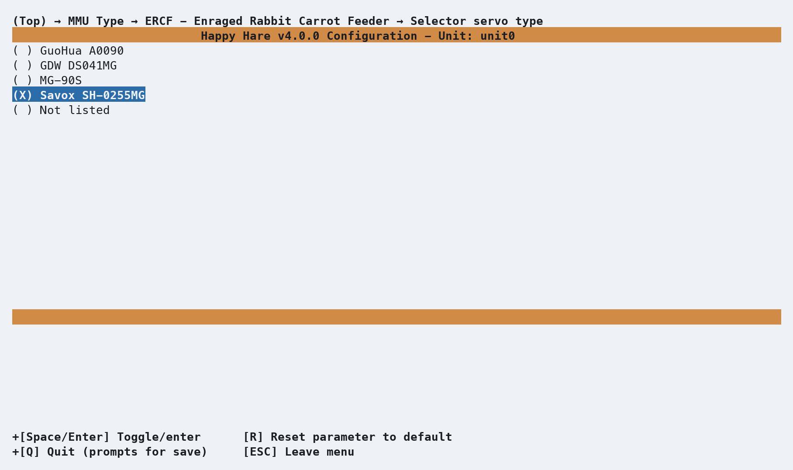
</p>
<br>
<br>
Next, review applicable Project Options. If your ERCF build uses the servo-less selector or integrated
**Enraged Rabbit Cotton Tail** (ERCT) Filament Buffer, select and enable these here.

<p align="center">
  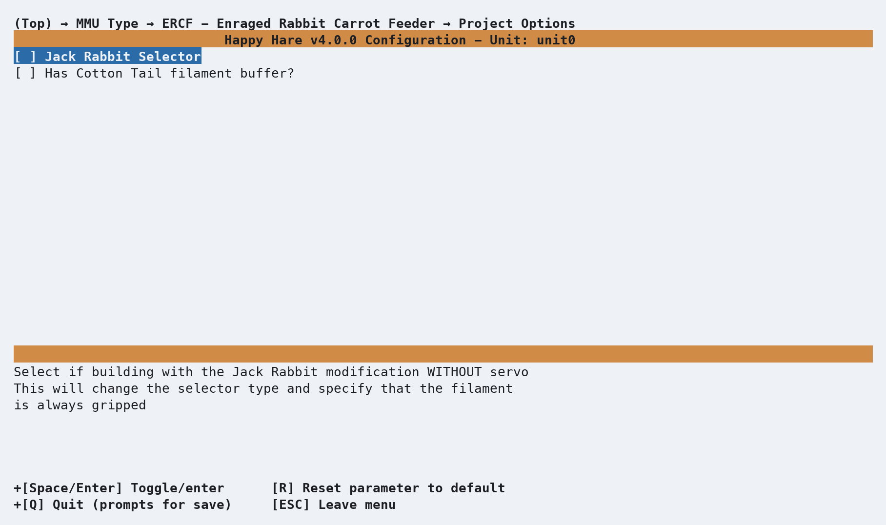
</p>
<br>
<br>
++esc++ and back out to the top menu, and review the warnings panel again. Three of the four warnings are
already gone. The one that's left — *"`Toolhead type is 'other'`"* — is exactly what it sounds like: 
Happy Hare still doesn't know your toolhead, and that's covered in a different getting-started page. 
Don't worry about it here.

<p align="center">
  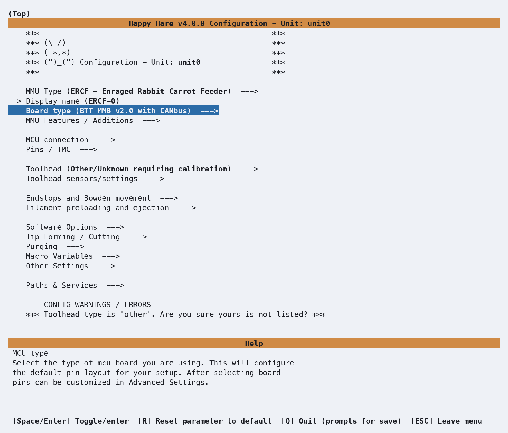
</p>

### Board type
Enter **Controller Board type**. Because you’ve already told the configurator this is an ERCF and its version, 
Happy Hare pre‑selects `BTT MMB v2.0 with CANbus` — the most common controller for more recent ERCF kits and builds.
If your ERCF runs a different controller, this is where you’d choose it; default pins for steppers, sensors, and
TMC drivers throughout the rest of `menuconfig` are derived from whatever controller you select here.

<p align="center">
  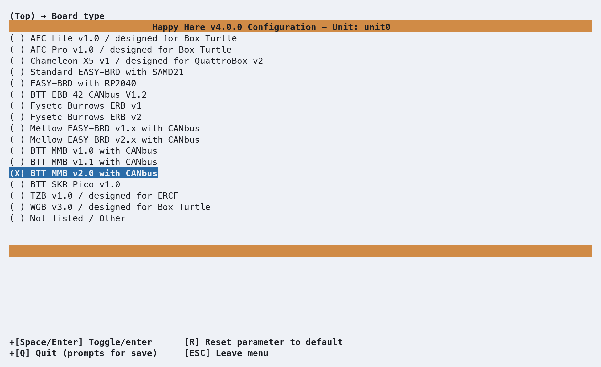
</p>

### MCU connection
++esc++ and back out to the top menu and open **`MCU connection`**. ERCF defaults to USB serial, but if your setup
uses CANBus, select CAN instead. The installer attempts to auto‑detect USB serial device IDs and CANBus UUIDs where
possible for you to choose from. Unfortunately, if Klipper has previously claimed a CANBus device, UUID's can’t
be rediscovered easily unless you remove/comment all references from your Klipper/Kalico Happy Hare configuration and 
power cycle the printer.

If you’re unsure of the USB serial or CANBus UUID's when migrating to v4, you can check your saved
`mmu.v3/base/mmu_hardware.cfg` configuration or `klippy.log` for previous device ID's/UUID's. The installer will
then prompt you for your serial device or CANBus UUID, depending on the option selected.
Existing connection selections/mapping's are retained and not overwritten once saved.

The first discovered serial device is selected by default. Press enter to choose a different discovered device.

<p align="center">
  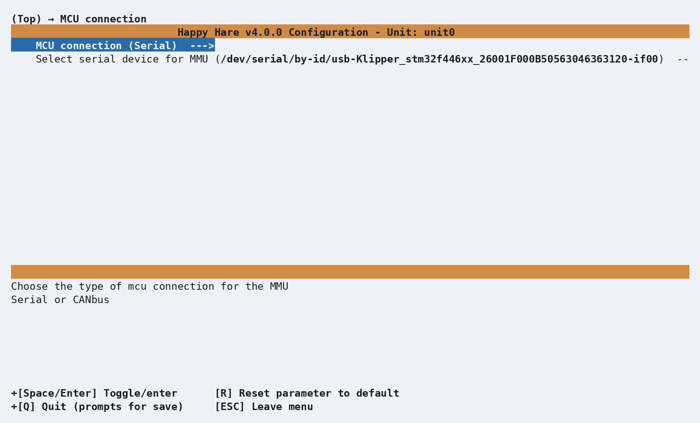
</p>
<br>

In this example, we are going to switch to CANBus. Open **`MCU connection`** and select **`CANbus`**:
<p align="center">
  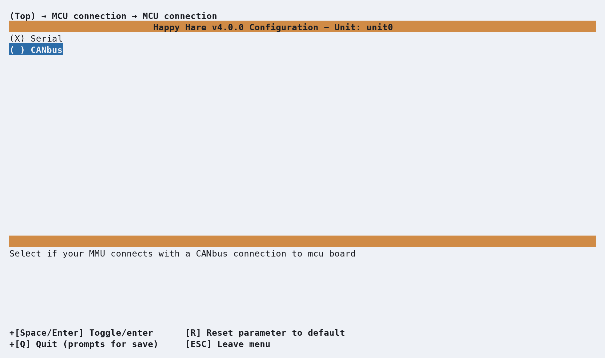
</p>
<br>

A list of discovered CANBus UUIDs is shown. If more than one device is found, select the one that corresponds to 
your ERCF controller. If only one device is detected, it will be selected automatically.
If no UUIDs are discovered, choose **`Other / manually entered`** and enter the correct CANBus UUID manually.
<p align="center">
  
</p>

### Pins: gear and selector direction
++esc++ and back out to the top menu and open **`Pins / TMC`**, then **`Gear pins`**. GPIO Pin defaults are set based
on your MCU controller board and ERCF MMU version selection. Review all pin settings for **`Gear`** and **`Selector`**
steppers to make sure they are correct for your build. Gear direction especially is the one setting that is impossible
to set correctly by default or guessing and depends on how the stepper cable is _actually wired_. You will validate
this later when you buzz the steppers to verify their direction in
[Stepper direction and homing](#stepper-direction-and-homing).

This is where you would change the stepper direction if needed.

<p align="center">
  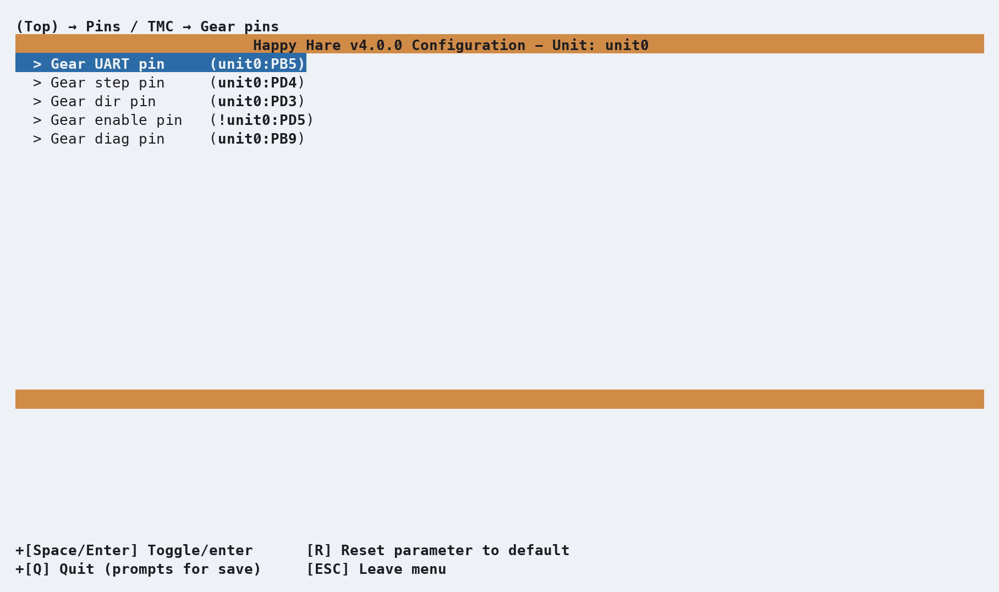
</p>
<br>

If the stepper spins the wrong way, you can invert it here without rewiring or hand-editing the configuration.
Highlight the **`Gear dir pin`** for the stepper and press Enter to open its editor. If that stepper needs reversing,
add a `!` in front of the pin name — Klipper's standard way of inverting a pin's polarity.

<p align="center">
  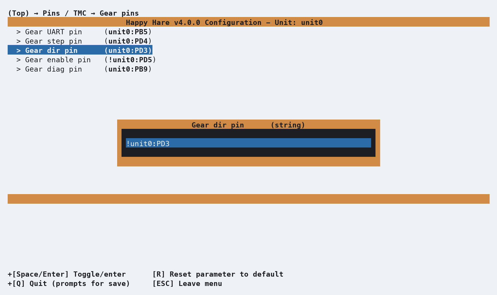
</p>
<br>

**Repeat** this for the **`selector stepper`**.

### Encoder
++esc++ and back out to the top menu and open **`MMU Features / Additions`**, then **`Encoder config`**.

ERCF requires an encoder to operate (enabled by default) for filament loading and unloading which can also
be used for clog detection by the Happy Hare Flowguard facility and automatic calibration of bowden
lengths and **`Rotation Distances`**. Different ERCF encoder hardware and encoder resolutions are
supported depending on your specific build.

Optional ERCF features also can be enabled or disabled here - entry sensors, LED's, 
and popular community contributed extensions like Sync-feedback buffers (sensors) such as 
Annex Belay or more recent analog Proportional Sync Feedback sensors, etc.
  
<p align="center">
  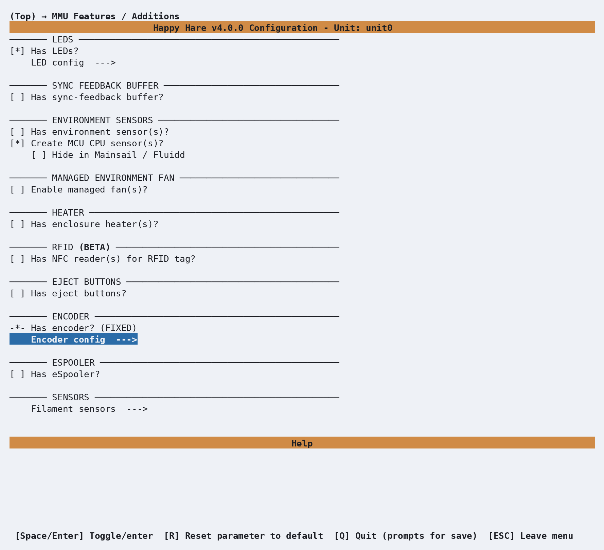
</p>
<br>

The most common choice based on the ERCF version you selected is enabled by default - in this case, for ERCF v3,
a **`Binky 12-vane Encoder`**. If you have a different encoder configuration open **`Type`** to change options. 
Encoder accuracy is dependent on this configuration and the type and actual number of vanes the installed
encoder wheel has.
<p align="center">
  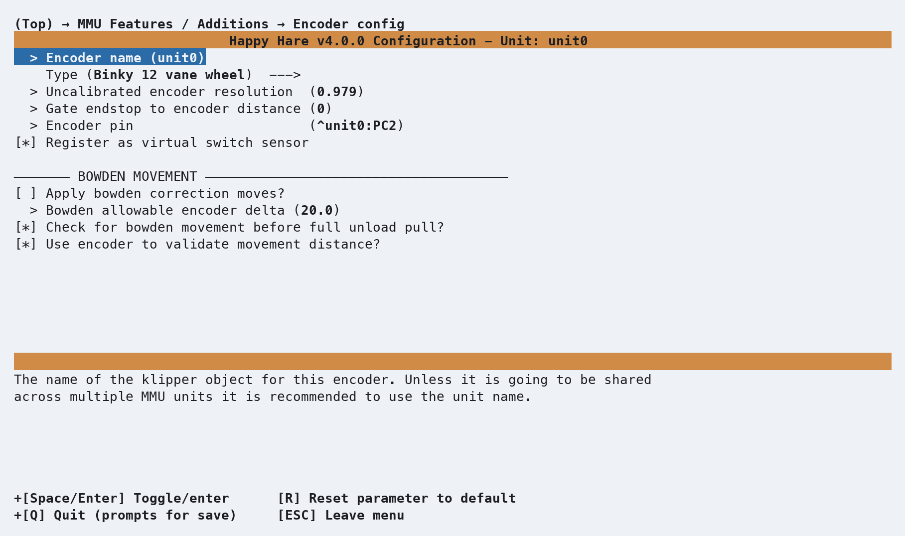
</p>
<br>

Select the appropriate type that matches your configuration. `12` (Default) & `8-vane` Binky based encoders are
the most common. However as the the original reason for reverting to fewer vanes (`8` or `10`) for direct-drive
configurations no longer applies, it's recommended to swap back to **`12-vanes`** for better fidelity and 
performance.

The TCRT 5000 based encoders are only applicable to original ERCF v1.x builds.

<p align="center">
  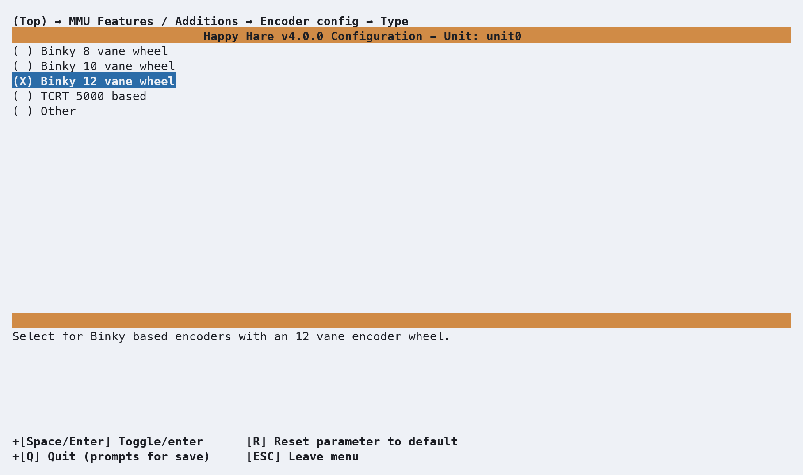
</p>
<br>

### Picking a toolhead
From the top menu, select **Toolhead**. This step is optional — if you skip it, Happy Hare falls back to generic
**`Other/Unknown`** default  dimensions, which is a perfectly fine starting point. But if your toolhead 
(extruder + hotend combo) appears in the list, selecting it gives you real, community‑contributed measurements
instead of generic estimates. Here we’ve chosen **`A4T WWBMG for A4T Dragon Ace`** to illustrate.

<p align="center">
  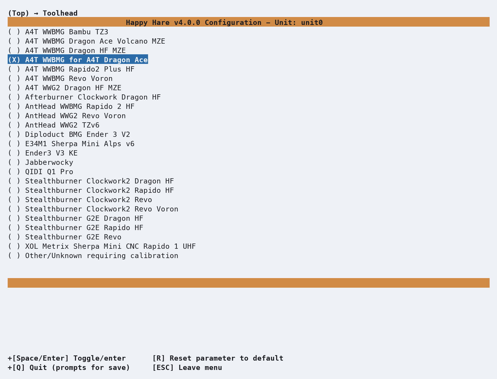
</p>
<br>

++esc++ to backout to the top menu and select **Toolhead sensors/settings**. This is where you can enable other features 
such as **`Toolhead cutter`**, **`toolhead`** and **`extruder entry`** sensors if fitted. The community-contributed
measurements for **`Extruder entrance to nozzle`** and **`Residual filament`**, under **`Toolhead dimensions`**,
can be reviewed and tuned if necessary. For **`A4T WWBMG for A4T Dragon Ace`**, the values are`88` and `36.5`.

The other two distances Happy Hare can use (**`Toolhead sensor to nozzle`** & **`Extruder sensor to entry`**) 
only appear when you have enabled the sensors and remain hidden when disabled.

<p align="center">
  
</p>
<br>

This is a shortcut, not a substitute: even with community-sourced toolhead measurements, it's useful to learn how to 
measure and calibrate your own eventually, since small build variations and mods add up. But it's a genuinely good 
starting point. If your exact combo isn't listed, select **`Other/Unknown`** and follow the manual calibration
[`MMU_CALIBRATE_TOOLHEAD`](Calibration-Toolhead.md) process.

## Validating Hardware setup & initial calibration
The [Hardware Validation](Hardware-Validation.md) checklist covers the MCU, selector variants, encoder and the movement/homing
model in more detail. The guide below calls out ERCF specific hardware and initial calibration needed.

### Selector servo
For first time builds and initial hardware setup, start the process with the servo arm removed so you can set the
initial angle on the shaft to the default `DOWN` position before positioning and securing it. 
!!! note
    Different versions of ERCF top hats like for ERCF v2/2.5 may have separate `MOVE`, `UP`, & `DOWN` positions. Other versions
    only `DOWN` and `UP` positions (e.g. `MOVE` = `UP` angle). 

With the servo connected and arm unattached, power up and set the servo to the `DOWN` position using **`MMU_SERVO POS=down`**.

Power down and position the servo arm on the shaft so it sits in the indentation of the top hat in the `DOWN` position taking
care not to move the servo shaft as you do. Secure the arm on the servo shaft and power up so you can validate and adjust servo
angles if needed.  

1. Disable steppers (**`MMU_MOTORS_OFF`**).
2. Set servo to `UP` position using **`MMU_SERVO POS=up`**. 
3. Line up the selector with a gate until you can insert a short piece of filament though the gate and into the selector.
4. Issue the following commands to validate the servo angles and expected results:

These are default angles for popular ERCF servos. Note angles differences and just two positions for ERCF v3:

| Command                                    | Savox SH0255MG  |   GDW DS041MG   |   GUOHUA A0090  | Expected Result                                         |
|--------------------------------------------|-----------------|-----------------|-----------------|---------------------------------------------------------|
| `MMU_SERVO POS=up`                         |      `140°`     |      `30°`      |      `30°`      | Filament can be inserted and removed easily             |
| `MMU_SERVO POS=down`                       |       `30°`     |     `100°`      |     `100°`      | Filament is gripped securely                            |
| For 3 position servos `MMU_SERVO POS=move` |      `109°`     |      `50°`      |      `50°`      | Servo arm is central in top hat channel and doesn't rub |


Servo angles can be adjusted dynamically using **`MMU_SERVO ANGLE=<angle>`**. To save the angle into the **`mmu/mmu_vars.cfg`** 
persistent state file, issue **`MMU_SERVO POS=<position> SAVE=1`** when you are happy with the angles 
e.g. **`MMU_SERVO POS=up SAVE=1`**.

### Stepper direction and homing
* Buzz the **`gear`** stepper to identify the correct stepper moves (**`MMU_TEST_BUZZ_MOTOR MOTOR=gear`**).  Power down and swap the
stepper cables over or update gear stepper pin settings in **`menuconfig`** if the incorrect stepper moves - whichever is easiest.
* Disable the steppers (**`MMU_MOTORS_OFF`**) and move the selector away from the homing end stop.
* Buzz the selector stepper to identify it's direction. It should initially move to the right when you issue 
  **`MMU_TEST_BUZZ_MOTOR MOTOR=selector`** when looking from the bowden/encoder side of the unit. 
  If it moves to the left, update and invert the **`selector stepper dir pin`** in **`menuconfig`** (e.g. add or remove the **`!`**) 
  in front of the pin.
* Once the steppers are moving in the correct direction, issue **`MMU_HOME`** to home ERCF. 
  The selector should move to the homing endstop (on the left) and home the MMU.

### Selector calibration
Issue `MMU_CALIBRATE_SELECTOR AUTO=1` to calibrate the selector and inter-gate spacing. Depending on your build and homing end-stop offset, 
if the gate spacing isn't _CAD_ perfect or gates tightly butted up against each other, you _"may"_ need to manually calibrate the selector
position and offsets for each gate - refer to [MMU_CALIBRATE_SELECTOR](Calibration-Selector.md) for details.

### Calibration Gear Rotation Distance
While Happy Hare sets the default BMG `Rotation Distance` out-of-the-box, for reliable Encoder operation it's worthwhile manually calibrating
the gear stepper `Rotation Distance` prior to calibrating the Encoder as BMG extruder gear manufacturing tolerances do matter, affecting accuracy. 
Also as the ERCF uses separate BMG gear-sets for each gate, each gate needs to be calibrated individually. 

Once the `Rotation Distance` for the `Gate 0` reference has been set, you "can" optionally enable **`Autotune rotation distance`** in 
`(Top) → Other Settings → Calibration/Autotuning` to enable Happy Hare to automatically tune **`rotation distance`** for each gate when
it's loaded. 
??? warning
    As this _can_ mask other selector build issues, **`Autotune rotation distance`** defaults to off. For accuracy, it's recommended to
    manually calibrate `Rotation Distance` for subsequent gates using the `MMU_CALIBRATE_GATE GATE=<n>` command.

[Calibration: Gear Rotation Distance](Calibration-Gear.md) 

### Encoder calibration
Using `gate 0` as the reference, make sure you have 500mm+ of filament ready to go before running `MMU_CALIBRATE_ENCODER`. Ideally,
you are looking for symmetrical **`+`** and **`-`** counts with a standard deviation as close to **`0.0`** as possible in both 
directions. One or two count differences are acceptable. The number of counts will be less depending on the number of vanes your encoder
wheel has. Expected counts using an Encoder with a 12-vane wheel:
```{.text .console-command}
// Calibrating over 400.0mm...
// + counts: 424
// - counts: 423
// + counts: 424
// - counts: 424
// + counts: 424
// - counts: 422
// Load direction:   mean=424.00 stdev=0.00 min=424 max=424 range=0
// Unload direction: mean=423.00 stdev=1.00 min=422 max=424 range=2
// Before calibration measured length: 400.33mm
// Calculated resolution of the encoder: 0.9445 (currently: 0.9453)
// Encoder calibration has been saved
```
[Calibration: Encoder](Calibration-Encoder.md)

## Checking Basic Operation
That's it, you should now be able to load and unload filament using your ERCF MMU. The bowden length will be automatically calibrated
the first time you attempt to load filament (`autocal_bowden_length: 1` setting) using collision based homing by default, extruder
sensors, or compression / proportional sync feedback sensors if defined and set as the **`extruder homing endstop`** in **`menuconfig`**.

Outside of a print, confirm the basics work end to end (if using ASB/ASA, preheat the extruder to an appropriate temperature as the default
minimum preheat temperature is 210°C).

Issue the following commands to validate the basic load/unload operation:

```{.text .console-command}
MMU_SELECT GATE=0
MMU_LOAD
MMU_UNLOAD
```

Each command should complete without error — no pauses, no "not calibrated" warnings you weren't expecting. If something goes wrong here, 
it's much easier to diagnose now than mid-print; see [Operation: Debugging Problems](Operation.md#debugging-problems) if any of 
it doesn't behave as expected.

## What Next? 
- [Tip Forming and Purge](Feature-Tip-Forming-Purging.md) to get your ERCF ready for printing
- Install [KlipperScreen (Happy Hare edition)](KlipperScreen.md) if you
  want a touchscreen front end, or drive everything from [Mainsail /
  Fluidd](Mainsail-Fluidd-Integration.md) — either works, and both are
  covered.
- From here, explore the rest of this site's [Features](Feature-Espooler.md)
  section one page at a time as you actually need them — Spoolman
  integration, Toolhead cutter, **`Blobifier`**, Shared NFC/RFID reader, EndlessSpool, and the rest. Trying to absorb
  all of it before your first print is the fastest way to feel overwhelmed by an MMU that, day to day, mostly just works.

---
