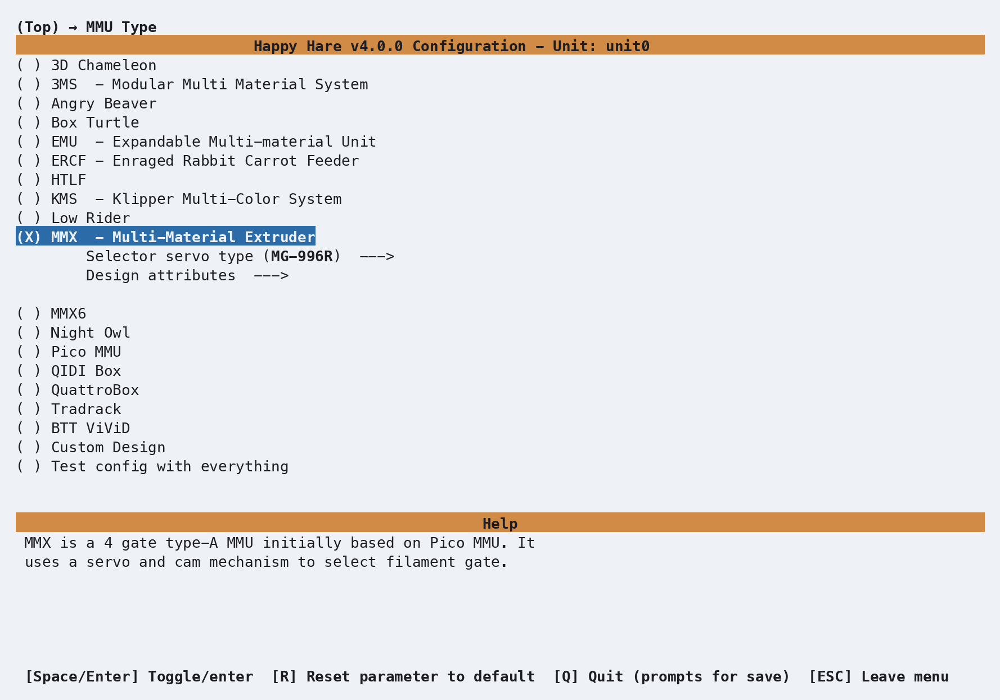
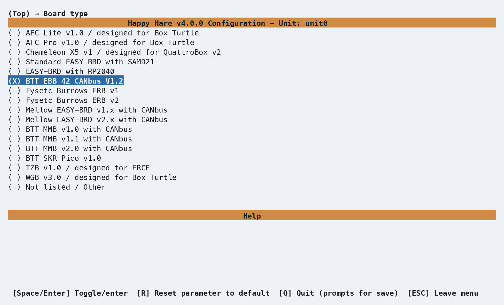
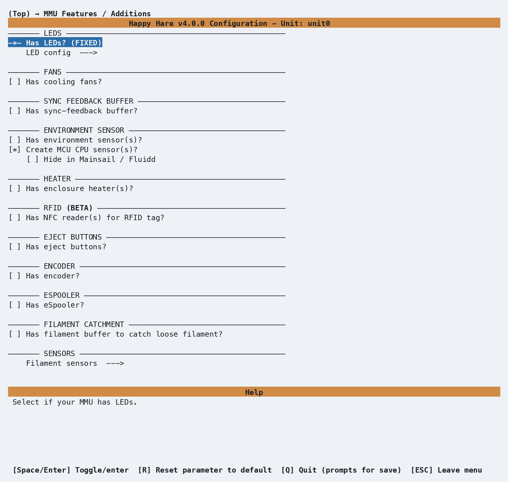
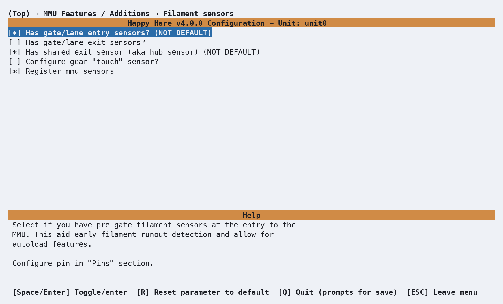
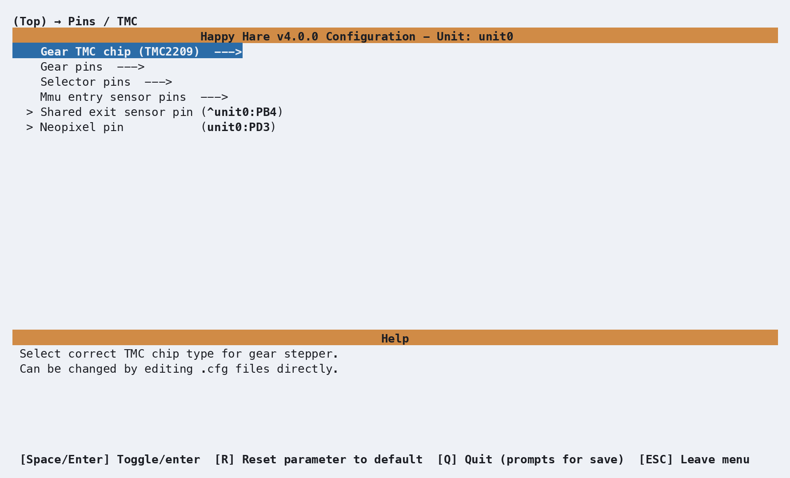
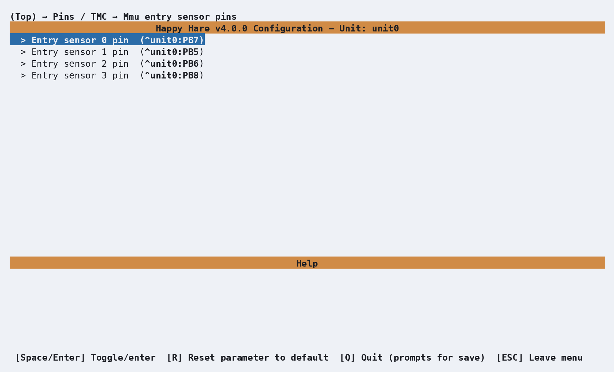
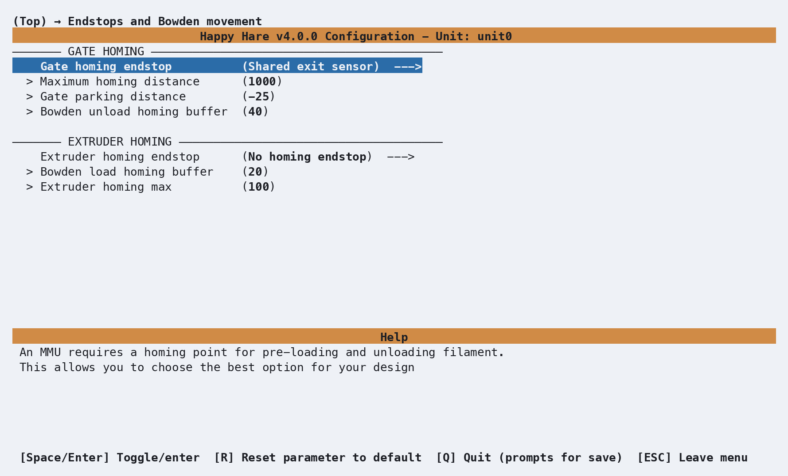

# Getting Started with MMX

This guide walks through the first Happy Hare `menuconfig` pass for the
original four-gate MMX. MMX uses one shared gear stepper and an MG-996R servo
to rotate a cam between four filament paths. It is a servo-cam selector, not a
linear-selector machine and not the separate six-gate MMX6 design.

The MMX project documentation remains the best source for printed parts,
assembly, power and wiring. This page starts once the mechanism is built and
the controller is flashed, and covers the Happy Hare choices that turn that
hardware into a working Klipper MMU.

## Before You Begin

Confirm the following before starting the installer:

- The cam and all four filament paths move freely.
- The MG-996R servo is powered from a suitable regulated supply. Do not power
  it from a controller pin that cannot supply its current.
- Each of the four pre-gate switches changes state when filament is inserted.
- The sensor after the selector, before the shared Bowden path, changes state.
  Happy Hare calls this the **shared exit sensor**. Some MMX drawings label it
  as a toolhead sensor, but its physical position makes it the MMX gate-homing
  reference.
- The controller is flashed for the connection you intend to use and is
  visible to the Klipper host.

The reference MMX build uses a BTT EBB42 v1.2. If your controller or wiring is
different, select the real board and enter the pins from your build rather than
copying the reference values below.

## Install Happy Hare

For a new Happy Hare installation, connect to the Klipper host and clone the
repository:

```bash
cd ~
git clone https://github.com/moggieuk/Happy-Hare.git
cd Happy-Hare
./install.sh
```

The first run opens `menuconfig` automatically. Use `./install.sh -i` when you
want to reopen it later. If Happy Hare is already installed, use the existing
checkout; do not clone another copy over it. See [Installation](Installation.md)
for non-standard Klipper paths and the full installer flag reference.

!!! note "Coming from an existing installation"
    The installer preserves the existing MMU configuration automatically
    before it changes anything. For a major upgrade, follow
    [Upgrading from v3 to v4](Upgrade-v3-v4.md) rather than trying to load an
    old configuration layout directly.

## Choose the MMX Profile

Open **MMU Type**, select **MMX - Multi-Material Extruder**, and leave the
selector servo type at **MG-996R**.

<p align="center">
  
</p>

This profile fixes the gate count at four and supplies the MMX starting
geometry, gear ratio, motor currents and servo gate angles. Do not select
**MMX6**: that is a different six-gate rotary-stepper design.

## Choose the Controller and Connection

Open **Board type** and select the controller actually installed. For the MMX
reference wiring, choose **BTT EBB 42 CANbus V1.2**:

<p align="center">
  
</p>

Next open **MCU connection** and select Serial or CANbus to match the firmware
on the board. Select the discovered serial device or CAN UUID when offered; if
it is not discovered, enter its stable device path or UUID manually.

See [MCU Reference](Reference-Mcu.md) for board firmware and connection details,
and [Hardware Validation](Hardware-Validation.md#mcu-connection) for connection
checks after the configuration is generated.

## Enable the MMX Sensors

Open **MMU Features / Additions**. LEDs are fixed on for the MMX profile. Leave
the sync-feedback buffer, encoder, eSpooler and other additions off unless your
particular build really includes them.

<p align="center">
  
</p>

Open **Filament sensors** and enable both:

- **Has gate/lane entry sensors?** for the four pre-gate switches.
- **Has shared exit sensor (aka hub sensor)** for the switch after the selector
  and before the shared Bowden path.

<p align="center">
  
</p>

!!! warning "Use the sensor's physical location"
    In the reference EBB42 wiring, PB4 is the shared MMX exit sensor. Do not
    configure that switch as a toolhead sensor merely because a wiring drawing
    uses that label, and do not disable it to work around an incorrect
    triggered state. Correct its pin, pull-up or inversion instead. A genuine
    toolhead sensor is mounted after the extruder entry and is configured
    separately under **Toolhead sensors/settings**.

## Review the Generated Pins

Selecting the EBB42 fills the MMX reference pins directly in **Pins / TMC**.
Happy Hare v4 uses fully qualified pins such as `unit0:PD0`; there is no
separate pin-alias block to create in `mmu.cfg`.

<p align="center">
  
</p>

The reference profile generates:

| Function | Generated pin |
|---|---|
| Gear UART | `unit0:PA15` |
| Gear step | `unit0:PD0` |
| Gear direction | `unit0:PD1` |
| Gear enable | `!unit0:PD2` |
| Selector servo | `unit0:PB9` |
| Entry sensors 0-3 | `^unit0:PB7`, `^unit0:PB5`, `^unit0:PB6`, `^unit0:PB8` |
| Shared exit sensor | `^unit0:PB4` |
| NeoPixel | `unit0:PD3` |

<p align="center">
  
</p>

Compare every value with the MMX wiring you actually built. Change a pin here
when needed. In particular, gear direction depends on the motor wiring; add or
remove `!` on **Gear dir pin** if validation shows that positive movement feeds
toward the spool rather than toward the extruder.

## Check Homing and Toolhead Choices

With the shared exit sensor enabled, **Endstops and Bowden movement** selects it
as the gate-homing endstop and applies the MMX starting distances:

<p align="center">
  
</p>

The standard MMX has no sync-feedback sensor. Leaving that feature disabled is
enough; there is no separate `sync_feedback_enabled` value to hand-edit for a
normal build.

Under **Toolhead**, select your real extruder/hotend combination if it is listed.
Under **Toolhead sensors/settings**, enable only sensors physically fitted at
the toolhead or extruder and enter their actual pins. These are printer choices,
not fixed properties of the MMX.

Review **Software Options** and keep the supplied client macros enabled for a
first installation. When the configuration has no unresolved errors, press
**Q** or leave the top menu and confirm that you want to save and install.

## Backups and Recovery

You do not need to make a manual copy before running `install.sh`. Every normal
install or configuration update preserves the existing `mmu` directory as a
timestamped sibling such as `mmu.old-20260831-115007` before writing the new
one.

To inspect the available backups and recover one, run:

```bash
cd ~/Happy-Hare
./install.sh -i --prev
```

The installer lists the current configuration first and timestamped backups
from newest to oldest. If you select an older backup, it first preserves the
configuration you are replacing, restores the chosen directory and opens the
recovered choices in `menuconfig`. See
[Menuconfig: Recovering Configuration from a Backup](GettingStarted-Installer-Configurator.md#recovering-configuration-from-a-backup)
for the complete recovery workflow.

### Returning to a preserved v3 installation

If this MMX was upgraded from v3, the upgrade preserves the original directory
as `mmu.V3`. To remove v4 cleanly and return to that saved installation:

```bash
cd ~/Happy-Hare
./install.sh -d
cp -a ~/printer_data/config/mmu.V3 ~/printer_data/config/mmu
./install.sh -b v3
```

The uninstall step backs up the active v4 configuration, removes its installed
modules and configuration, and leaves `mmu.V3` untouched. Copying rather than
moving keeps the original v3 backup available. The final command switches the
checkout and Moonraker update manager to the `v3` branch, then runs the v3
installer against the restored `mmu` directory.

!!! warning
    Use the Klipper configuration path supplied with `-c` if your printer does
    not use `~/printer_data/config`. If more than one `mmu.V3-*` directory
    exists, identify the correct saved v3 configuration before copying it. Do
    not run the copy command over an existing `mmu` directory.

## Validate the Hardware

Restart Klipper and resolve every configuration or MCU error before moving the
mechanism. Then work through [Hardware Validation](Hardware-Validation.md),
paying particular attention to these MMX checks.

### Sensors

Run the sensor report with every filament path empty:

```text
MMU_SENSORS
```

Insert a short filament fragment into each gate in turn. `mmu_entry_0` through
`mmu_entry_3` must each change state independently. Then operate the sensor at
the MMX outlet and confirm `mmu_shared_exit` changes state. Correct any pin,
pull-up or inversion problem before continuing.

### Gear direction

Select gate 0, grip the filament and make a short positive move:

```text
MMU_SELECT GATE=0
MMU_TEST_MOVE MOVE=50 GRIP=1
MMU_TEST_MOVE MOVE=-50 GRIP=1
```

Positive movement must feed toward the extruder; negative movement must return
toward the spool.

### Servo-cam selector

The MMX has no physical selector zero mark, so verify every gate visually. Use
the dedicated servo-selector calibration command rather than the linear
selector's `MMU_SERVO POS=up/down` workflow:

```text
MMU_CALIBRATE_SERVO_SELECTOR
MMU_CALIBRATE_SERVO_SELECTOR ANGLE=83
MMU_CALIBRATE_SERVO_SELECTOR GATE=0 SINGLE=1
```

Tune and save gates 0 through 3, then exercise each one with `MMU_SELECT`. Use
`MMU_GRIP` and `MMU_RELEASE` when you need to test the cam's filament grip and
release positions. See [Selector Calibration: Servo-cam selectors](Calibration-Selector.md#servo-cam-selectors)
for the complete command behavior.

Continue through [Calibration](Calibration.md) for gear rotation distance,
Bowden length and toolhead calibration before attempting the first print.

## Troubleshooting

- **Happy Hare reports filament loaded while the path is empty:** query
  `MMU_SENSORS`. Check the PB4 shared-exit switch wiring, pull-up and inversion;
  do not remove the homing sensor from the configuration to hide the symptom.
- **No gate-homing reference is configured:** enable the shared exit sensor in
  **MMU Features / Additions → Filament sensors** and verify its pin under
  **Pins / TMC**.
- **Klipper rejects copied alias names:** remove the old alias-based pin setup
  and enter fully qualified pins through `menuconfig`.
- **The selector calibration commands do not match the mechanism:** confirm
  that **MMX**, not **MMX6**, is selected.
- **The MMU panel is missing:** update Mainsail or Fluidd and see
  [Mainsail / Fluidd](Mainsail-Fluidd-Integration.md). Hardware can still be
  validated from the console with `MMU_SENSORS` and the commands above.

## See Also

- [MMX assembly and reference wiring](https://docs.cn3d.eu/en/projects/mmx/wiring)
- [Installation](Installation.md)
- [Menuconfig](GettingStarted-Installer-Configurator.md)
- [Hardware Validation](Hardware-Validation.md)
- [Calibration](Calibration.md)
- [Feature: Sensors](Feature-Sensors.md)

---
