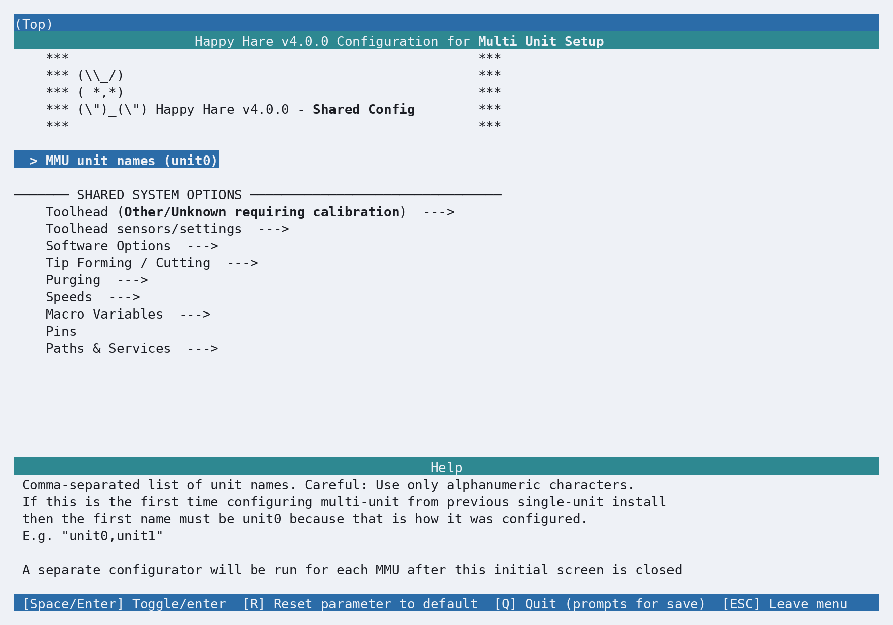
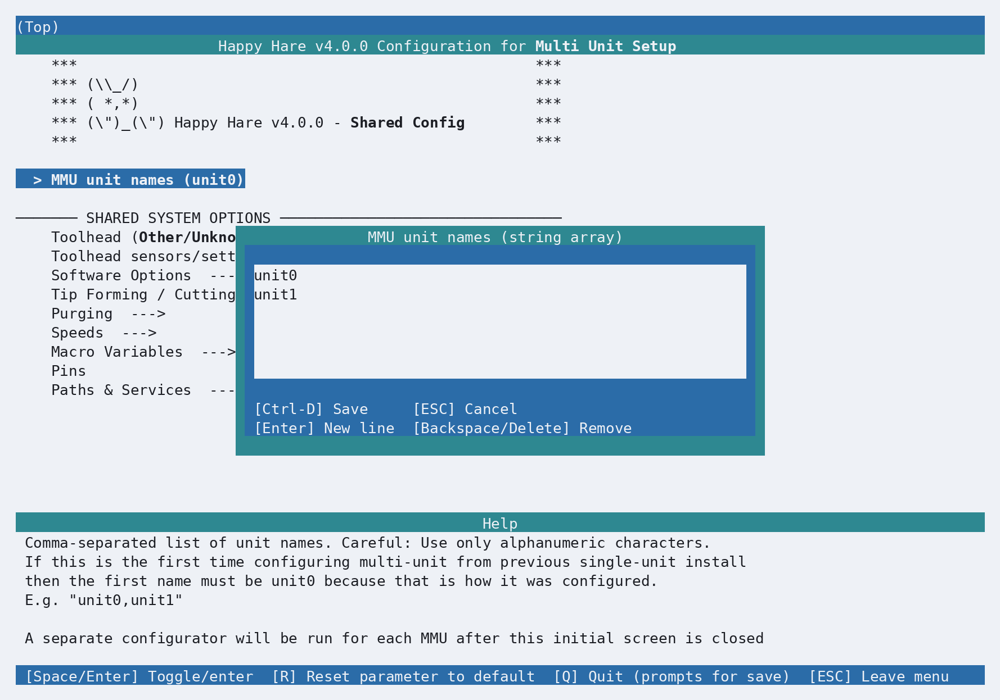
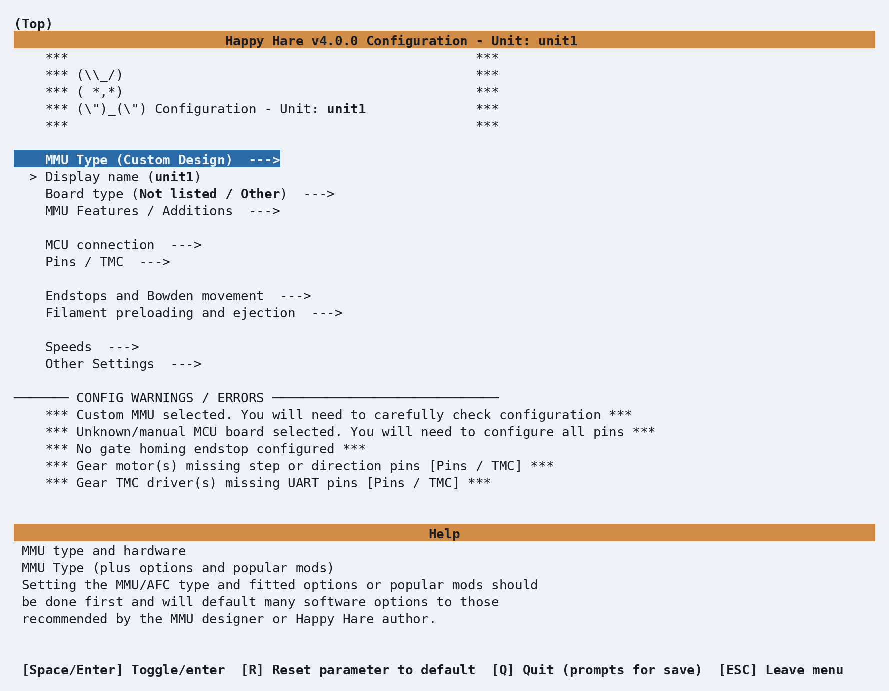
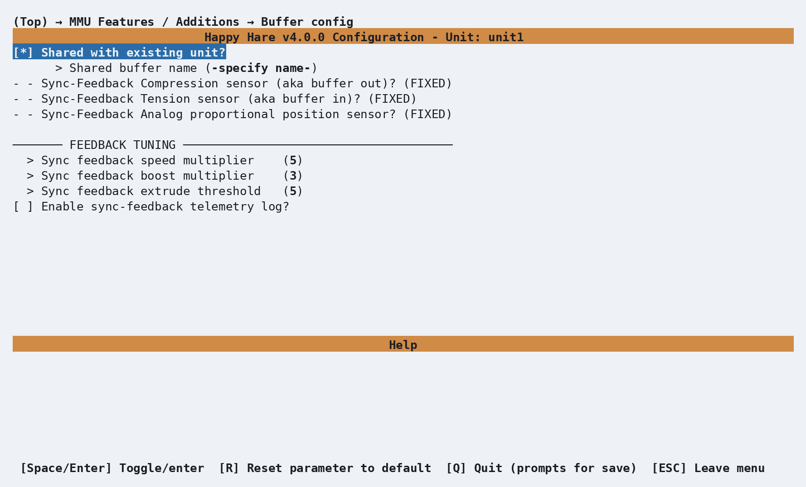
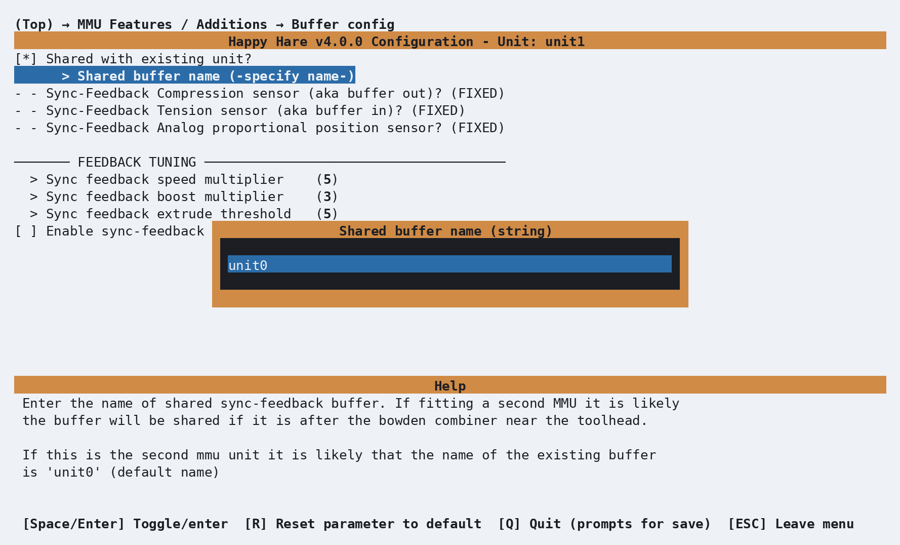
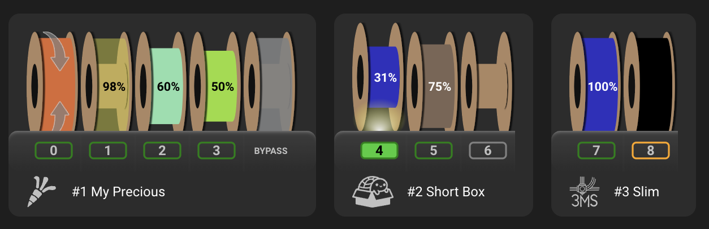

# Getting Started with Multiple MMU Units

Happy Hare can combine multiple physical MMU units into one logical MMU. There is
no fixed installer limit on the number of units, and the units do not have to be
the same type. For example, one printer can use an ERCF alongside a Box Turtle or
a ViViD. Each unit keeps its own hardware and movement configuration while the
printer-wide settings are configured once.

This guide starts with a working single-unit installation and adds a second unit.
The same process can be repeated for further units.

## Configure first unit

Install and configure the first MMU in the normal way described by the Getting
Started guide for that design:

```bash
./install.sh -i
```

Complete the configuration, save it, and validate that unit before adding another.
The initial unit is configured under the symbolic name `unit0` by default.

!!! warning "Before adding another unit"
    Do not start with two untested configurations. Confirm the first unit's MCU,
    sensors and motors using [Hardware Validation](Hardware-Validation.md), then
    add the next unit. This makes wiring and configuration problems much easier to
    isolate.

## Convert to multi-unit

From the `Happy-Hare` directory, rerun the interactive installer with `-n`:

```bash
./install.sh -i -n
```

The `-n` flag converts the existing configuration to multi-unit mode. It causes
`menuconfig` to run once for shared settings and then once for every unit in the
unit list.

!!! warning "Keep the first unit named unit0 during conversion"
    When converting an existing single-unit installation, the first entry must
    remain `unit0`. That is the name associated with the configuration being
    carried forward. Changing it at this point would create a new unit rather than
    preserve the existing one.

!!! tip "Try the multi-unit installer safely first"
    Add the `-t` flag to rehearse the complete multi-unit installer workflow in
    test mode:

    ```bash
    ./install.sh -i -n -t
    ```

    Test mode uses a disposable configuration under `/tmp/mmu_test` and disables
    service restarts, leaving the printer's real configuration untouched. It is an
    ideal way to explore the shared and per-unit screens before repeating the
    process for real without `-t`. See [Running `./install.sh` without touching
    your printer](Dev-Kconfig-Structure.md#running-installsh-without-touching-your-printer)
    for details and the location of the generated test files.

## Pass 1: shared configuration

The first `menuconfig` pass has a different color scheme and is labelled
**Shared Config**. It contains settings that apply to the complete printer rather
than to one physical MMU. Existing values are pulled from the first unit's saved
configuration; review them and update anything that should now apply to the whole
multi-unit setup.

<p align="center">
  
</p>

Printer-wide settings on this screen include the toolhead and its sensors,
software options, tip forming and cutting, purging, speeds, macro variables,
shared pins, and installation paths and services.

Select **MMU unit names** and add the new symbolic name. The editor presents one
unit per line; add `unit1` below the existing `unit0` entry.

<p align="center">
  
</p>

Press **Ctrl-D** to save the unit-name editor, then press **Q** and save the shared
configuration as usual. `menuconfig` now knows that two unit-specific passes are
required.

### Symbolic names and display names

`unit0` and `unit1` are recommended symbolic names, but that naming pattern is not
mandatory for newly added units. The symbolic name associates Klipper objects and
generated configuration files with the physical unit, so keep it short, unique,
and alphanumeric. Avoid renaming an established unit unless you intend to
reconfigure it under a new identity.

Each unit also has a **Display name** setting. Use that for a friendlier label such
as `ERCF Left` or `Box Turtle`, including spaces. Mainsail, Fluidd and
KlipperScreen use the display name where appropriate without changing the
symbolic names in the configuration.

## Pass 2: review existing unit0

The next `menuconfig` pass returns to the normal color scheme and is labelled
**Unit: unit0**. It contains only settings specific to the first physical unit.
Its existing configuration has been carried forward, but review the MMU type,
board and MCU connection, fitted features, pins, endstops and unit-specific
parameters before saving.

Press **Q** and save when the `unit0` configuration is correct.

## Pass 3: configure new unit1

The installer then opens a fresh unit-specific configuration labelled
**Unit: unit1**.

<p align="center">
  
</p>

Configure this unit as thoroughly as a first installation:

1. Select its **MMU Type**, version, and any design-specific project options.
2. Set its user-facing **Display name**.
3. Select its controller board and configure its MCU connection.
4. Review its fitted features and additions.
5. Configure and verify its pins, steppers, TMC drivers, sensors and endstops.
6. Decide whether its encoder or sync-feedback buffer is independent or shared
   with an existing unit.
7. Resolve every configuration warning, press **Q**, and save.

## Removing a unit

From the `Happy-Hare` directory, rerun the interactive installer:

```bash
./install.sh -i
```

On the first, teal-colored **Shared Config** pass, open **MMU unit names** and
remove the symbolic name of the unit you no longer want. Save the shared
configuration, then complete the remaining unit-specific passes. When the
installer finishes, it removes the generated configuration for the deleted unit.

!!! warning "Symbolic names cannot be renamed"
    The installer cannot currently rename an established unit's symbolic name.
    The only workaround is to edit `.mmu_config` and every affected per-unit file,
    such as `.mmu_config_unit0` and `.mmu_config_unit1`, by hand so that all names
    remain consistent. Use the unit's **Display name** instead when you only want
    to change the name shown in Mainsail, Fluidd or KlipperScreen.

!!! note "Where menuconfig choices are stored"
    `.mmu_config` contains the shared choices used by `menuconfig`, while files
    such as `.mmu_config_unit0` and `.mmu_config_unit1` contain each unit's
    choices. The installer also copies these files into
    `~/printer_data/config/mmu/`. Before applying an installation, it backs up
    the previous `mmu` directory to a timestamped location such as
    `~/printer_data/config/mmu.old-20260827-143000`, so the earlier menuconfig
    choices remain available if they are needed for recovery.

## Sharing components

Multi-unit configurations can reuse hardware that is genuinely common to more
than one filament path:

| Component | Multi-unit behavior |
| --- | --- |
| Toolhead | Shared by default and configured in the shared pass |
| Encoder | Can be owned by one unit and referenced by another if it sees filament from both units |
| Sync-feedback buffer | Can be owned by one unit and referenced by another when it sits in their common filament path |

!!! warning "Shared means physically shared"
    Do not select **Shared with existing unit?** merely to avoid configuring a
    second component. A shared encoder must measure filament from every unit that
    references it. A shared sync-feedback buffer must likewise be in their common
    filament path, typically after a combiner near the toolhead.

For example, to make `unit1` use the sync-feedback buffer configured for `unit0`,
enable the buffer for `unit1`, open **Buffer config**, and select **Shared with
existing unit?**.

<p align="center">
  
</p>

Set **Shared buffer name** to the symbolic name of the unit that owns the buffer,
in this example `unit0`.

<p align="center">
  
</p>

See [Encoder](Feature-Encoder.md) and
[Sync-Feedback Buffer](Feature-Sync-Feedback-Buffer.md) for the hardware and tuning
requirements of those components.

## Bypass association

Happy Hare always makes a filament bypass available. Normally the UIs and console
status render it as a separate lane, but one MMU unit can be associated with that
bypass. This is particularly useful for a design such as ERCF with a selectable
bypass gate, and lets the visualization draw the bypass as part of the correct
unit.

Only one unit may have **Associate bypass with this unit?** enabled. Leave it off
for every unit if the bypass should remain visually separate. See
[Filament Bypass](Feature-Filament-Bypass.md) for the available layouts.

## Mainsail / Fluidd / KlipperScreen

Mainsail, Fluidd and KlipperScreen display each physical MMU unit separately
while presenting them as parts of the same logical MMU. Each unit keeps its own
display name, design icon, gates and filament state. The bypass is shown either
integrated into its associated unit or as a separate lane.

The Mainsail panel below shows three dissimilar units connected to the same
printer: a four-gate ERCF with an integrated bypass, a three-gate Box Turtle, and
a two-gate 3MS. The unit cards also make the continuous numbering visible: the
ERCF uses gates 0-3, the Box Turtle uses gates 4-6, and the 3MS uses gates 7-8.

<p align="center">
  
</p>

See [Mainsail / Fluidd](Mainsail-Fluidd-Integration.md) and
[KlipperScreen](KlipperScreen.md) for their complete controls and status displays.

## Gate and tool numbering across units

Gate numbers are global and sequential across the complete logical MMU; numbering
does not restart at zero for each physical unit. Tool numbers are also global and
sequential across the units.

For example, consider a four-gate `unit0` followed by a six-gate `unit1`:

| Unit | Gates local to that unit | Global gate numbers | Default tools |
| --- | --- | --- | --- |
| `unit0` | 0-3 | 0-3 | T0-T3 |
| `unit1` | 0-5 | 4-9 | T4-T9 |

The default tool-to-gate map is one-to-one, so tool 6 maps to gate 6 in this
example. The
[tool-to-gate map](Feature-Gate-TTG-Maps.md) can change that association, but tool
and gate identifiers remain global across the complete setup.

Most `GATE=` and `TOOL=` parameters therefore expect the global number. A command
uses a unit-local gate number only when it explicitly offers `LGATE=`. For example,
`UNIT=unit1 LGATE=0` identifies the first physical gate on `unit1`, which is global
gate 4 in the table above.

!!! warning "Do not restart gate or tool numbering for unit1"
    On the example machine, `GATE=0` and `TOOL=0` refer to `unit0`. Use gate 4 or
    tool 4 for the first gate or default tool on `unit1`, unless a command
    explicitly requests `LGATE=0` together with the unit.

## Targeting units with MMU commands

Many `MMU_*` commands do not require a `UNIT=` parameter. Happy Hare can often
identify the correct physical unit from a global gate or tool number, or from the
currently selected gate. Other commands operate directly on one physical unit and
must be told which unit to use when more than one is configured.

When `UNIT=` is accepted, specify either its zero-based ordinal number or its
symbolic name. These two commands target the same unit:

```text
MMU_HOME UNIT=1
MMU_HOME UNIT=unit1
```

Unit ordinals follow the order in **MMU unit names**: the first unit is `0`, the
second is `1`, and so on. Symbolic names are usually clearer in macros and saved
configuration because they show which hardware is being addressed.

Use these rules when deciding whether `UNIT=` is needed:

| Command context | Is `UNIT=` needed? |
| --- | --- |
| A global `GATE=` or `TOOL=` uniquely identifies the unit | Usually no; the owning unit is implied |
| The command acts on the currently selected gate and that gate is known | Usually no; the active unit is implied |
| The command controls one unit but has no gate or tool context | Yes on a multi-unit machine |
| Only one MMU unit is configured | No; the sole unit is selected automatically |

For example, these commands already contain enough global context to identify the
unit:

```text
MMU_SELECT GATE=4
MMU_CHANGE_TOOL TOOL=7
```

By contrast, unit-specific operations such as homing, motor control, encoder
control, or selector calibration generally require an explicit unit on a
multi-unit machine:

```text
MMU_HOME UNIT=unit1
MMU_MOTORS_OFF UNIT=1
```

Some per-unit commands also accept `UNIT=ALL` to repeat the operation for every
configured unit:

```text
MMU_HOME UNIT=ALL
```

`UNIT=ALL` is not universal. Check the command's entry in the
[Command Reference](Reference-Commands.md), or run `MMU_HELP CMD=<command>`,
before using it.

!!! warning "UNIT can be mandatory"
    If a command cannot infer a unit and more than one unit is configured, it
    reports that `UNIT` is required rather than guessing. Add `UNIT=<ordinal>` or
    `UNIT=<symbolic_name>` and run the command again.

## Generated configuration files

After the final unit is saved, the installer generates a separate hardware and
parameter file for every symbolic unit name:

```text
mmu_hardware_<unit_name>.cfg
mmu_parameters_<unit_name>.cfg
```

For the example above, the per-unit files are:

```text
mmu_hardware_unit0.cfg
mmu_parameters_unit0.cfg
mmu_hardware_unit1.cfg
mmu_parameters_unit1.cfg
```

Shared configuration remains in the common Happy Hare files. This separation
keeps each physical unit's hardware and movement settings readable while allowing
Happy Hare to present all configured units as one logical MMU.

## Reconfigure or add more units

Once the installation is multi-unit, rerun the normal interactive command:

```bash
./install.sh -i
```

The installer detects the saved multi-unit configuration automatically. It opens
the shared configuration first and then opens one unit-specific pass for every
name in **MMU unit names**.

To add a third or later unit, add another name in the shared pass and save. The
installer will review each existing unit in order and then open a fresh
configuration for the new unit. The `-n` flag is only needed when converting the
original single-unit installation.

After changing the setup, repeat [Hardware Validation](Hardware-Validation.md) for
every affected unit before printing.

---
