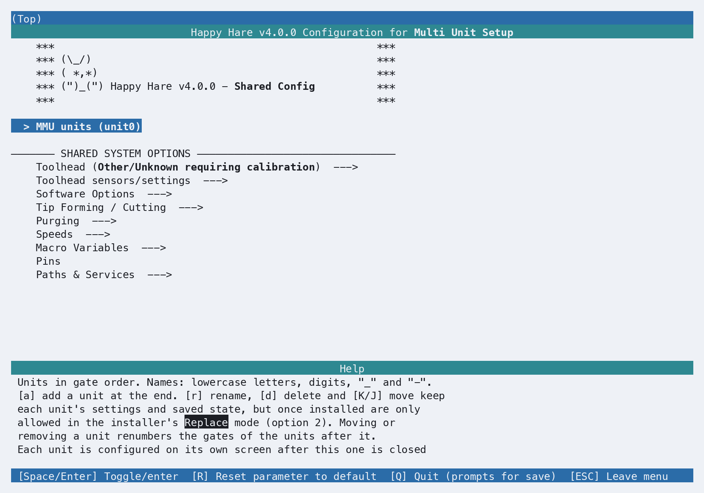
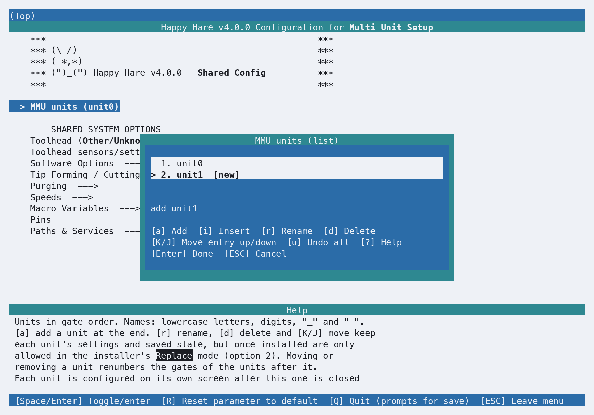
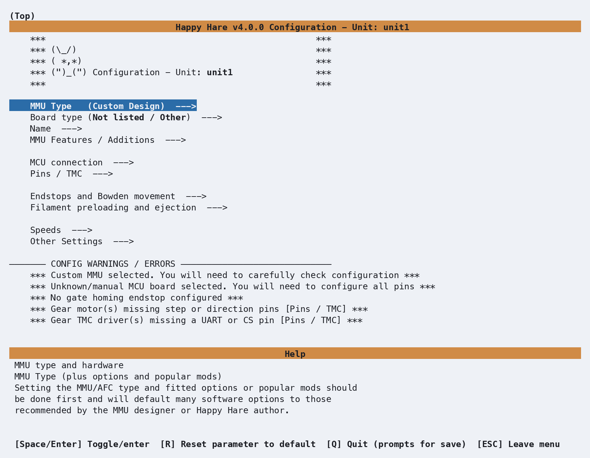
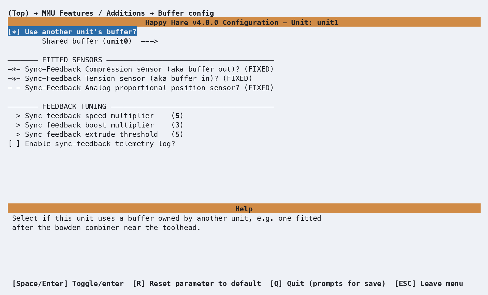
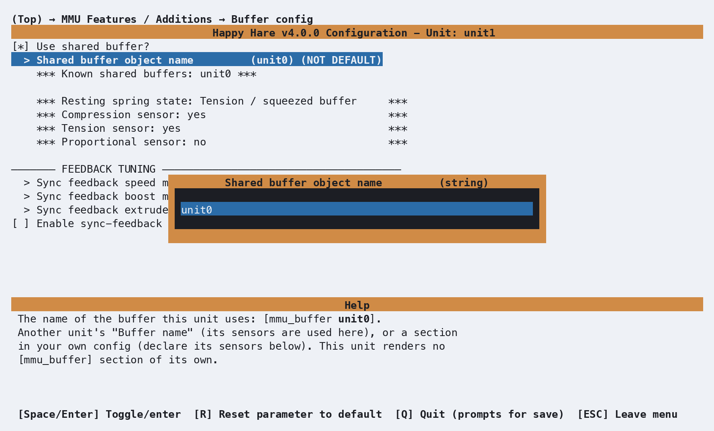
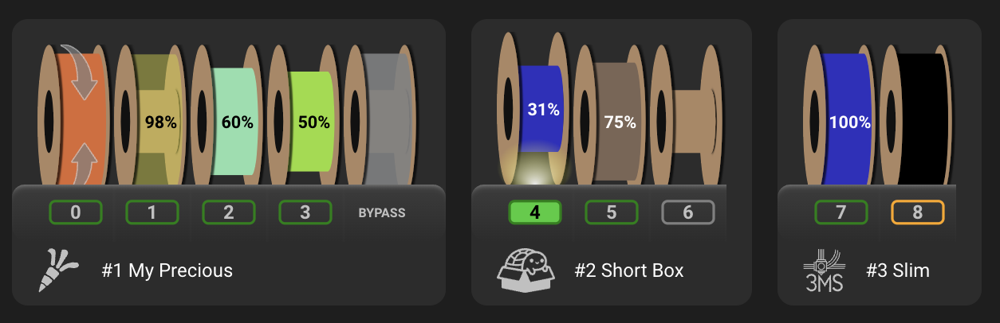

# Getting Started with Multiple MMU Units

Happy Hare can combine multiple physical MMU units into one logical MMU. There is
no fixed installer limit on the number of units, and the units do not have to be
the same type. For example, one printer can use an ERCF alongside a Box Turtle or
a ViViD. Each unit keeps its own hardware and movement configuration while the
printer-wide settings are configured once.

This guide starts with a working single-unit installation and adds a second unit.
The same process can be repeated for further units.

## Configure first unit

Install and configure the first MMU in the normal way described by the Getting
Started guide for that design:

```bash
./install.sh -i
```

Complete the configuration, save it, and validate that unit before adding another.
In **Name → Klipper object name**, choose the unit's symbolic name or keep the
`unit0` default. The name is not fixed, even for the first MMU. This walkthrough
uses `unit0` and `unit1` as examples; substitute your own names throughout.
See [Naming an MMU unit](Installation.md#naming-an-mmu-unit).

!!! warning "Before adding another unit"
    Do not start with two untested configurations. Confirm the first unit's MCU,
    sensors and motors using [Hardware Validation](Hardware-Validation.md), then
    add the next unit. This makes wiring and configuration problems much easier to
    isolate.

## Convert to multi-unit

From the `Happy-Hare` directory, rerun the interactive installer with `-n`:

```bash
./install.sh -i -n
```

The `-n` flag converts the existing configuration to multi-unit mode. It causes
`menuconfig` to run once for shared settings and then once for every unit in the
unit list.

The shared unit list starts with the first unit's existing name and carries its
configuration forward, including when that name is something other than `unit0`.
To rename it during conversion, choose **Replace (option 2)** and use the list
editor's rename action as described under [Unit renaming](#unit-renaming).

!!! tip "Try the multi-unit installer safely first"
    Add the `-t` flag to rehearse the complete multi-unit installer workflow in
    test mode:

    ```bash
    ./install.sh -i -n -t
    ```

    Test mode uses a disposable configuration under `/tmp/mmu_test` and disables
    service restarts, leaving the printer's real configuration untouched. It is an
    ideal way to explore the shared and per-unit screens before repeating the
    process for real without `-t`. See [Running `./install.sh` without touching
    your printer](Dev-Kconfig-Structure.md#running-installsh-without-touching-your-printer)
    for details and the location of the generated test files.

## Pass 1: shared configuration

The first `menuconfig` pass has a different color scheme and is labelled
**Shared Config**. It contains settings that apply to the complete printer rather
than to one physical MMU. Existing values are pulled from the first unit's saved
configuration; review them and update anything that should now apply to the whole
multi-unit setup.

<p align="center">
  
</p>

Printer-wide settings on this screen include the toolhead and its sensors,
software options, tip forming and cutting, purging, speeds, macro variables,
shared pins, and installation paths and services.

Select **MMU units** to open the list editor. Press **a** to append a unit, enter
`unit1`, and press **Enter**. The new entry is marked **[new]**.

<p align="center">
  
</p>

Press **Enter** to finish editing the list, then press **Q** and save the shared
configuration. The installer reviews the unit-list changes before opening the
unit-specific passes. A rename, removal or reorder also requires confirmation.

The list editor uses these controls:

| Key | Action |
| --- | --- |
| **Up / Down** | Select an entry |
| **a** | Add a unit at the end |
| **i** | Insert a unit before the selected entry |
| **r** | Rename the selected unit while retaining its identity |
| **d** | Delete the selected unit; at least one must remain |
| **K / J** | Move the selected unit up / down |
| **u** | Undo all pending list changes |
| **Enter / Esc** | Finish / cancel editing the list |

**Shift-Up / Shift-Down** also move entries when the terminal passes those keys
through. Use uppercase **K / J** if the terminal intercepts them. For an installed
setup, **Refresh** and **Merge** modes only allow appending units; choose
**Replace (option 2)** for the other changes.

### Symbolic names and display names

A symbolic name is the **Klipper object name**: it identifies the unit in Klipper
sections, pin prefixes, generated filenames, and saved state. Names must be unique,
start with a lowercase letter, and contain only lowercase letters, digits, `_` or
`-`. Names such as `left`, `ercf` and `box_2` work just as well as `unit0`.

Each unit's **Name → Display name** is a separate, friendly label such as
`ERCF Left` or `Box Turtle`, including spaces. Mainsail, Fluidd and KlipperScreen
use it where appropriate. Changing it does not rename Klipper objects or files.
In multi-unit mode, the **Name** menu shows the Klipper object name for reference;
change that name in the shared **MMU units** editor.

## Pass 2: review existing unit0

The next `menuconfig` pass returns to the normal color scheme and is labelled
**Unit: unit0**. It contains only settings specific to the first physical unit.
Its existing configuration has been carried forward, but review the MMU type,
board and MCU connection, fitted features, pins, endstops and unit-specific
parameters before saving.

Press **Q** and save when the `unit0` configuration is correct.

## Pass 3: configure new unit1

The installer then opens a fresh unit-specific configuration labelled
**Unit: unit1**.

<p align="center">
  
</p>

Configure this unit as thoroughly as a first installation:

1. Select its **MMU Type**, version, and any design-specific project options.
2. Set its user-facing **Name → Display name**.
3. Select its controller board and configure its MCU connection.
4. Review its fitted features and additions.
5. Configure and verify its pins, steppers, TMC drivers, sensors and endstops.
6. Decide whether its encoder or sync-feedback buffer is independent or shared
   with an existing unit.
7. Resolve every configuration warning, press **Q**, and save.

## Unit renaming

To change only the label shown in the UI, edit **Name → Display name** in the
unit's configuration. To change the Klipper object name of an installed unit:

1. Run `./install.sh -i` and choose **Replace (option 2)**.
2. In multi-unit mode, open **MMU units** in **Shared Config**, select the unit,
   press **r**, and enter the new name. For a single-unit installation, edit
   **Name → Klipper object name** instead.
3. Finish the editor and save the configuration. Review and confirm the installer's
   change summary, then review and save each unit-specific pass if applicable.
4. Complete the install and review any warnings about manually edited references.

Use **r** to rename, rather than deleting the old entry and adding a new one.
The rename action tells the installer to retain that unit's configuration,
calibration and saved state. It updates generated objects and filenames, saved
pin and shared-component references, and unit-specific saved-state keys. A rename
alone keeps the selected gate and tool because no gates change number.

On a first installation there is no installed state to migrate, so names can be
chosen freely without selecting Replace mode.

!!! warning "Replace mode and manual edits"
    Replace rebuilds generated configuration from your saved menuconfig choices
    and overwrites direct edits to generated `.cfg` settings. Review those edits
    first and carry required settings into menuconfig. The installer flags old
    names it finds in preserved custom sections, `printer.cfg` and add-on `.cfg`
    files, but you must update your own macros and other external references.
    Check commands such as `UNIT=unit0` and any explicit pin or object names.

## Unit reordering

Run `./install.sh -i`, choose **Replace (option 2)**, and open **MMU units** in the
shared pass. Select a unit and press **K** to move it up or **J** to move it down.
Finish the editor, save, confirm the change summary, and complete the per-unit
passes and installation.

List order determines unit ordinals and global gate numbers. For example, moving
six-gate `unit1` before four-gate `unit0` gives `unit1` gates 0–5 and `unit0` gates
6–9. `UNIT=0` now refers to `unit1`; `UNIT=unit0` still refers to the same physical
unit. Local gate numbers within each unit do not change.

Calibration and saved gate data move with the units. The installer remaps the
saved tool-to-gate map, endless-spool groups and sensor-enabled state as well.
Review macros with numeric `UNIT=`, `GATE=` or `TOOL=` arguments and any configured
per-gate lists; arbitrary user configuration is not automatically reordered.

When existing gates are renumbered or removed, the selected gate and tool reset
to **unknown (-1)**. Unload filament before restructuring, then select or home
again after installation and check the gate and tool maps before printing.

## Unit adding/removing

To add a unit to an existing multi-unit setup, run `./install.sh -i` and press
**a** in **Shared Config → MMU units**. Appending works in **Refresh**, **Merge**
or **Replace** mode. Existing units retain their settings and gate numbers, and
the new unit gets its own configuration pass. Configure and validate its hardware
before printing. Use `./install.sh -i -n` when first converting from single-unit
mode, as shown above.

To insert a unit before an existing one, choose **Replace (option 2)** and press
**i** on the entry it should precede. This shifts later gates, so follow the same
checks as [Unit reordering](#unit-reordering).

To remove a unit, choose **Replace (option 2)**, select it in **MMU units**, and
press **d**. At least one unit must remain. Finish the editor, save, confirm the
removal, and complete the remaining passes. The installer removes the deleted
unit's generated hardware and parameter files and its unit-specific saved state,
and adjusts the remaining gate data. Review the tool-to-gate map and per-gate
settings after removal, especially tools that previously used the deleted unit.

If another unit still shares the removed unit's encoder, buffer or NFC reader,
the installer refuses removal. Reconfigure that dependency and save it in a
separate run before removing the owner.

### Backups and saved state

In multi-unit mode, `.mmu_config` contains the shared menuconfig choices and files
such as `.mmu_config_unit0` contain each unit's choices. The installer copies them
into `~/printer_data/config/mmu/` and backs up the previous `mmu` directory to a
timestamped location before installing.

Check the saved-state path printed in the change summary. Migration uses the
installed `[save_variables] filename` in `mmu_macro_vars.cfg`, falling back to the
menuconfig **save_variables path**. An override elsewhere, such as `printer.cfg`,
is not followed automatically. A saved-state file outside the `mmu` directory
gets its own `.old-<timestamp>` backup; restoring an MMU backup with `--prev` does
not restore that external file.

## Sharing components

Multi-unit configurations can reuse hardware that is genuinely common to more
than one filament path:

| Component | Multi-unit behavior |
| --- | --- |
| Toolhead | Shared by default and configured in the shared pass |
| Encoder | Can be owned by one unit and referenced by another if it sees filament from both units |
| Sync-feedback buffer | Can be owned by one unit and referenced by another when it sits in their common filament path |

!!! warning "Shared means physically shared"
    Do not share hardware merely to avoid configuring a
    second component. A shared encoder must measure filament from every unit that
    references it. A shared sync-feedback buffer must likewise be in their common
    filament path, typically after a combiner near the toolhead.

For example, to make `unit1` use the sync-feedback buffer configured for `unit0`,
enable the buffer for `unit1`, open **Buffer config**, and select **Use another
unit's buffer?**. This option appears when another unit can supply a buffer,
or when a saved configuration already uses a shared one.

<p align="center">
  
</p>

Open **Shared buffer** and choose the unit that owns it, in this example
`unit0`. The list includes units with their own buffer and units not yet
configured. Configure the owner first so the installer can show its actual
sensor settings.

<p align="center">
  
</p>

See [Encoder](Feature-Encoder.md) and
[Sync-Feedback Buffer](Feature-Sync-Feedback-Buffer.md) for the hardware and tuning
requirements of those components.

## Bypass association

Happy Hare always makes a filament bypass available. Normally the UIs and console
status render it as a separate lane, but one MMU unit can be associated with that
bypass. This is particularly useful for a design such as ERCF with a selectable
bypass gate, and lets the visualization draw the bypass as part of the correct
unit.

Only one unit may have **Associate bypass with this unit?** enabled. Leave it off
for every unit if the bypass should remain visually separate. See
[Filament Bypass](Feature-Filament-Bypass.md) for the available layouts.

## Mainsail / Fluidd / KlipperScreen

Mainsail, Fluidd and KlipperScreen display each physical MMU unit separately
while presenting them as parts of the same logical MMU. Each unit keeps its own
display name, design icon, gates and filament state. The bypass is shown either
integrated into its associated unit or as a separate lane.

The Mainsail panel below shows three dissimilar units connected to the same
printer: a four-gate ERCF with an integrated bypass, a three-gate Box Turtle, and
a two-gate 3MS. The unit cards also make the continuous numbering visible: the
ERCF uses gates 0-3, the Box Turtle uses gates 4-6, and the 3MS uses gates 7-8.

<p align="center">
  
</p>

See [Mainsail / Fluidd](Mainsail-Fluidd-Integration.md) and
[KlipperScreen](KlipperScreen.md) for their complete controls and status displays.

## Gate and tool numbering across units

Gate numbers are global and sequential across the complete logical MMU; numbering
does not restart at zero for each physical unit. Tool numbers are also global and
sequential across the units.

For example, consider a four-gate `unit0` followed by a six-gate `unit1`:

| Unit | Gates local to that unit | Global gate numbers | Default tools |
| --- | --- | --- | --- |
| `unit0` | 0-3 | 0-3 | T0-T3 |
| `unit1` | 0-5 | 4-9 | T4-T9 |

The default tool-to-gate map is one-to-one, so tool 6 maps to gate 6 in this
example. The
[tool-to-gate map](Feature-Gate-TTG-Maps.md) can change that association, but tool
and gate identifiers remain global across the complete setup.

Most `GATE=` and `TOOL=` parameters therefore expect the global number. A command
uses a unit-local gate number only when it explicitly offers `LGATE=`. For example,
`UNIT=unit1 LGATE=0` identifies the first physical gate on `unit1`, which is global
gate 4 in the table above.

!!! warning "Do not restart gate or tool numbering for unit1"
    On the example machine, `GATE=0` and `TOOL=0` refer to `unit0`. Use gate 4 or
    tool 4 for the first gate or default tool on `unit1`, unless a command
    explicitly requests `LGATE=0` together with the unit.

## Targeting units with MMU commands

Many `MMU_*` commands do not require a `UNIT=` parameter. Happy Hare can often
identify the correct physical unit from a global gate or tool number, or from the
currently selected gate. Other commands operate directly on one physical unit and
must be told which unit to use when more than one is configured.

When `UNIT=` is accepted, specify either its zero-based ordinal number or its
symbolic name. These two commands target the same unit:

```text
MMU_HOME UNIT=1
MMU_HOME UNIT=unit1
```

Unit ordinals follow the order in **MMU units**: the first unit is `0`, the
second is `1`, and so on. Symbolic names are usually clearer in macros and saved
configuration because they show which hardware is being addressed.

Use these rules when deciding whether `UNIT=` is needed:

| Command context | Is `UNIT=` needed? |
| --- | --- |
| A global `GATE=` or `TOOL=` uniquely identifies the unit | Usually no; the owning unit is implied |
| The command acts on the currently selected gate and that gate is known | Usually no; the active unit is implied |
| The command controls one unit but has no gate or tool context | Yes on a multi-unit machine |
| Only one MMU unit is configured | No; the sole unit is selected automatically |

For example, these commands already contain enough global context to identify the
unit:

```text
MMU_SELECT GATE=4
MMU_CHANGE_TOOL TOOL=7
```

By contrast, unit-specific operations such as homing, motor control, encoder
control, or selector calibration generally require an explicit unit on a
multi-unit machine:

```text
MMU_HOME UNIT=unit1
MMU_MOTORS_OFF UNIT=1
```

Some per-unit commands also accept `UNIT=ALL` to repeat the operation for every
configured unit:

```text
MMU_HOME UNIT=ALL
```

`UNIT=ALL` is not universal. Check the command's entry in the
[Command Reference](Reference-Commands.md), or run `MMU_HELP CMD=<command>`,
before using it.

!!! warning "UNIT can be mandatory"
    If a command cannot infer a unit and more than one unit is configured, it
    reports that `UNIT` is required rather than guessing. Add `UNIT=<ordinal>` or
    `UNIT=<symbolic_name>` and run the command again.

## Generated configuration files

After the final unit is saved, the installer generates a separate hardware and
parameter file for every symbolic unit name:

```text
mmu_hardware_<unit_name>.cfg
mmu_parameters_<unit_name>.cfg
```

For the example above, the per-unit files are:

```text
mmu_hardware_unit0.cfg
mmu_parameters_unit0.cfg
mmu_hardware_unit1.cfg
mmu_parameters_unit1.cfg
```

Shared configuration remains in the common Happy Hare files. This separation
keeps each physical unit's hardware and movement settings readable while allowing
Happy Hare to present all configured units as one logical MMU.

## Reconfigure or add more units

Once the installation is multi-unit, rerun the normal interactive command:

```bash
./install.sh -i
```

The installer detects the saved multi-unit configuration automatically. It opens
the shared configuration first and then opens one unit-specific pass for every
name in **MMU units**.

To add a third or later unit, add another name in the shared pass and save. The
installer opens unit-specific passes in list order, retaining existing settings
and starting a fresh configuration for each new unit. The `-n` flag is only needed when converting the
original single-unit installation.

After changing the setup, repeat [Hardware Validation](Hardware-Validation.md) for
every affected unit before printing.

---
