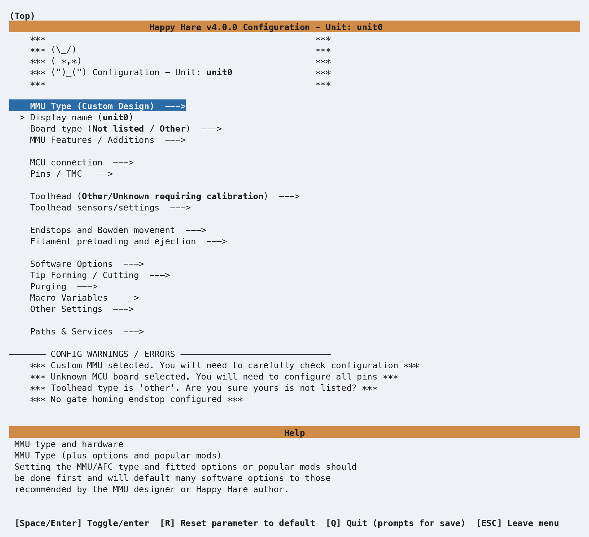
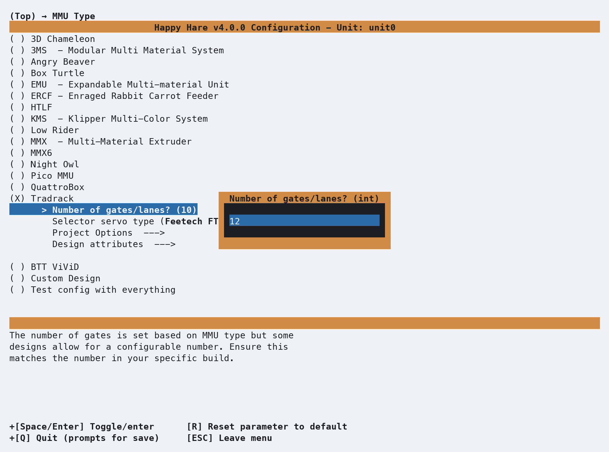
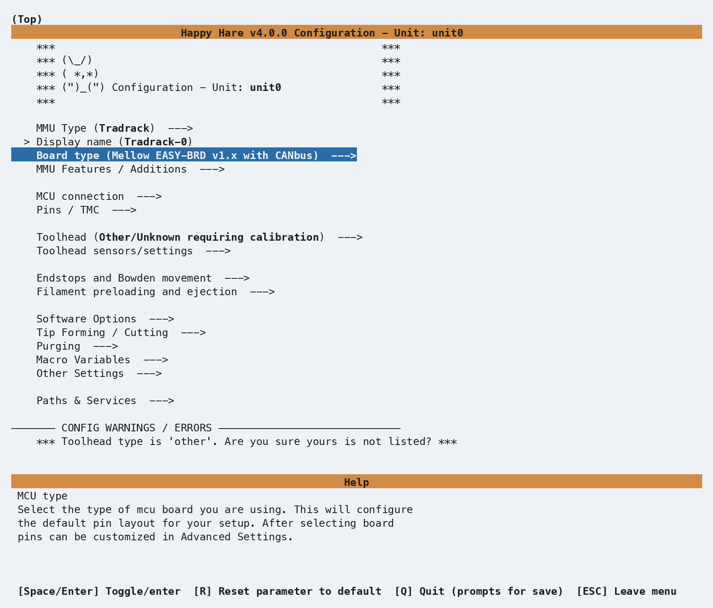
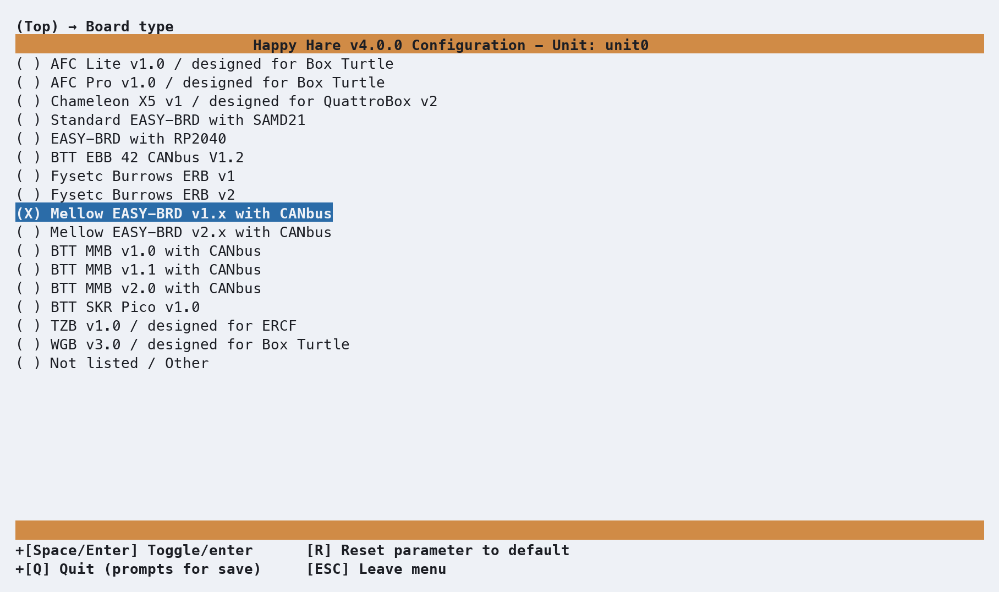
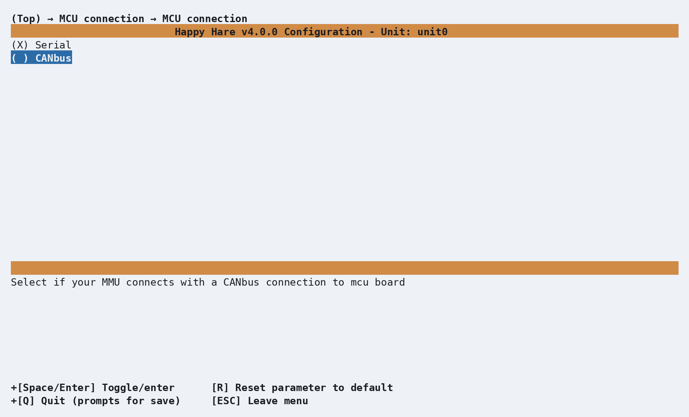
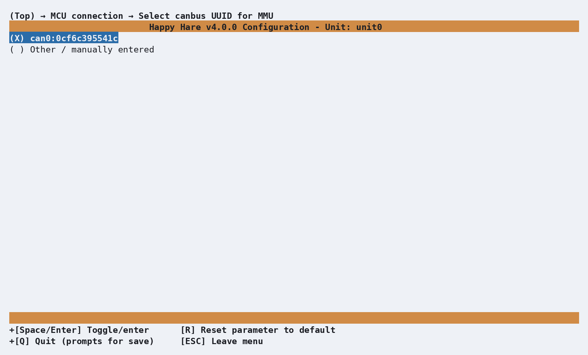
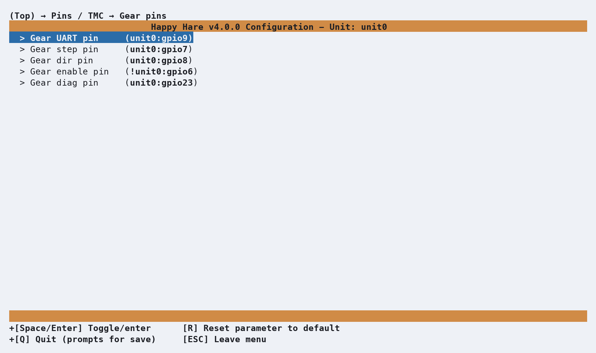
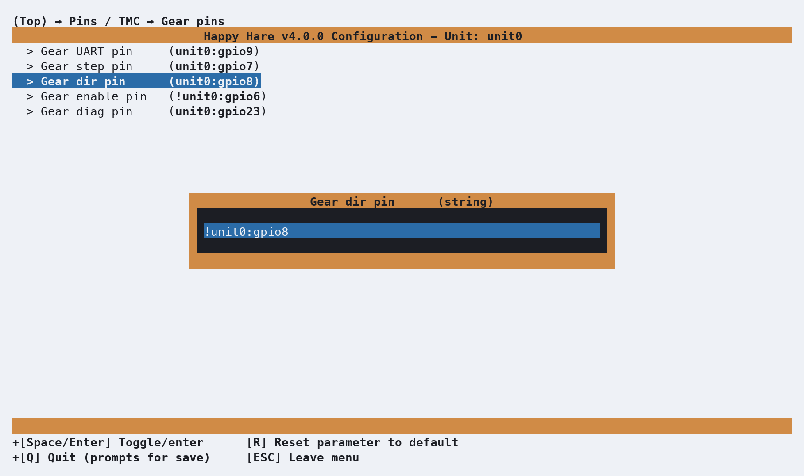
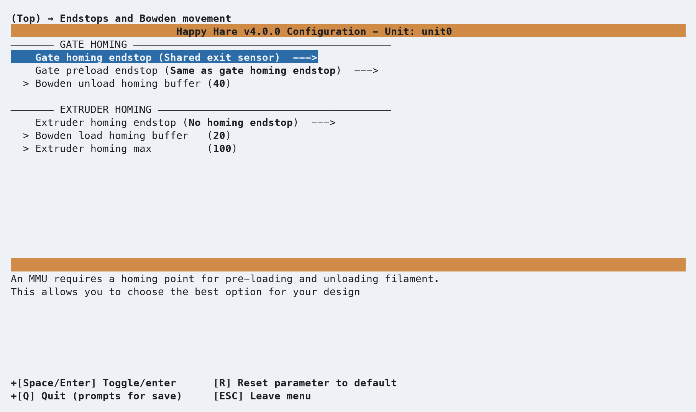
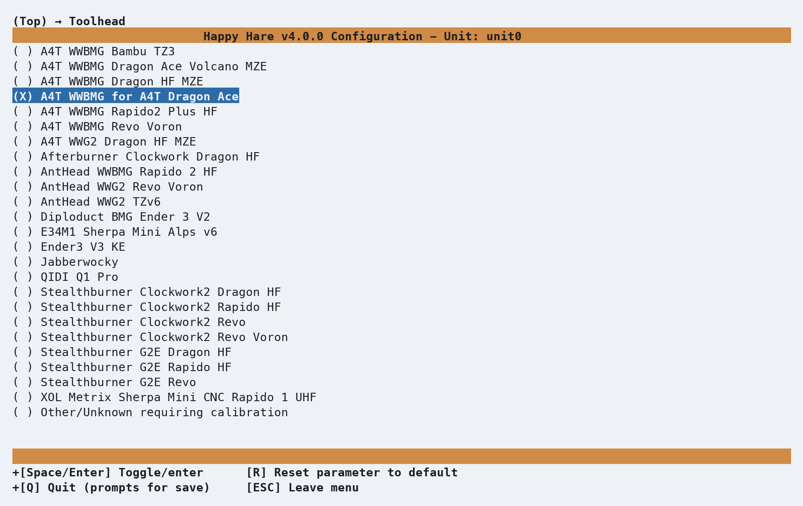

# Getting Started with Tradrack

This walks through the initial `menuconfig pass` for a Tradrack MMU — the screens you’ll see, in the order you’ll 
see them, and the few choices worth pausing on. Tradrack is deceptively simple: it relies on a single shared gate
(entry) sensor and forgoes pre-gate sensors or LED extras, focusing instead on fast, reliable filament handling
rather than bling. Other sections cover toolhead calibration and multi‑unit setups. Here the goal is simply to 
get a Tradrack installed and up and running with Klipper.


## Menuconfig Installer
From your Happy-Hare checkout/directory:

```bash
./install.sh
```

If this is the very first time you've run `./install.sh`, there's no `.mmu_config` yet, so the installer
drops you straight into the interactive `menuconfig` mode — no separate `-i` flag needed.

<p align="center">
  
</p>
<br>

This is the installer's default state: `MMU Type` is `Custom Design`, the board is unknown, and the
**`CONFIG WARNINGS / ERRORS`** panel at the bottom lists exactly that — four things still need a decision. 
As soon as you pick a real MMU type, most of these clear themselves.

### Choosing the MMU type
Highlight **`MMU Type`** and press Enter. Move down to **`Tradrack`** and press ++space++ to select it. Once selected
`(X) Tradrack`, four new options appear indented underneath — **`Number of gates/lanes`**, **`Selector servo type`**,
 **`Project Options`** and **`Design attributes`** — options that only make sense once Happy Hare knows this is a 
 Tradrack. Other settings and options are also enabled based on the MMU design choice. 
<br>

<p align="center">
  
</p>
<br>
<br>
Enter **`Number of gates/lanes`** to match your setup. Tradrack is a modular type-A design with support for as few or
as many lanes as you can accommodate in your build. The default is 10, but you can change it to any number from 1 
to Happy Hare's maximum of 20.

<p align="center">
  
</p>
<br>
<br>
Next select the **`Selector servo type`**. Common options are provided - `Feetech FT1117M` (default) for people who sourced their servos in 
the US, `JX PS-1171MG` Aliexpress alternate and `Not listed` if you have a different servo. Servo settings such as min/max pulse widths, etc
are managed using `(Top) → Other Settings → Selector servo` options later in the `menuconfig` flow.

<p align="center">
  
</p>
<br>
<br>
Next, review applicable Project Options. If you added an optional Binky encoder, you can select and enable this here.

<p align="center">
  
</p>
<br>
<br>
Back out twice (++esc++, ++esc++) to return to the top menu, and review the warnings panel again. Three of the 
four warnings are already gone. The one that's left — *"`Toolhead type is 'other'`"* — is exactly what it sounds
like: Happy Hare still doesn't know your toolhead, and that's covered in a different getting-started page. 
Don't worry about it here.

<p align="center">
  
</p>

### Board type
Enter **Controller Board type**. Because you’ve already told the configurator this is a Tradrack, Happy Hare pre‑selects 
`Mellow EASY-BRD v1.x with CANbus` — a popular controller choice for Tradrack builds. If your Tradrack runs a different
board like an original or RP2040 based `EASY-BRD`, this is where you’d choose it; default pins for steppers, sensors, and
TMC drivers throughout the rest of `menuconfig` are derived from whatever controller you select here.

<p align="center">
  
</p>

### MCU connection
++esc++ and back out to the top menu and open **`MCU connection`**. Tradrack defaults to USB serial, but if your setup uses CANBus,
select CAN instead. The installer attempts to auto‑detect USB serial device IDs and CANBus UUIDs where possible for you to choose from. 
Unfortunately, if Klipper has previously claimed the CANBus device, UUID's can’t be rediscovered easily unless you remove all references
from your klipper Happy Hare configuration and power cycle the printer.

If you’re unsure of the CANBus UUID's when migrating to v4, you can check your saved `mmu.v3/base/mmu_hardware.cfg` configuration or
`klippy.log` for the claimed device entries. The installer will then prompt you for your serial device or CANBus UUID, depending
on the option selected. 

Existing CANBus UUID selections/mapping are retained and not overwritten once saved.

<p align="center">
  
</p>
<br>

In this example, we are switching to CANBus. Open **`MCU connection`** and select **`CANbus`**:
<p align="center">
  
</p>
<br>

A list of discovered CANBus UUIDs is shown. If more than one device is found, select the one that corresponds to your Tradrack
controller. If only one device is detected, it will be selected automatically.
If no UUIDs are discovered, choose **`Other / manually entered`** and enter the correct CANBus UUID manually.
<p align="center">
  
</p>

### Pins: gear and selector direction
++esc++ and back out to the top menu and open **`Pins / TMC`**, then **`Gear pins`**. GPIO Pin defaults are set based on 
your MCU controller board and Tradrack MMU selection. Review all pin settings for **Gear** and **Selector** steppers
to make sure they are correct for your build. Gear direction especially is the one setting that is impossible to set
correctly by default or guessing and depends on how the stepper cable is _actually wired_.

<p align="center">
  
</p>
<br>

If the stepper spins the wrong way, you can invert it here without rewiring or hand-editing the configuration. 
Highlight the **`Gear dir pin`** for the stepper and press Enter to open its editor. If that stepper needs reversing, 
add a `!` in front of the pin name — Klipper's standard way of inverting a pin's polarity. 

<p align="center">
  
</p>
<br>

**Repeat** this for the **`selector stepper`**.

### Shared Exit Sensor (Gate Sensor)
Happy Hare requires one viable gate sensor — either a switch or an encoder. Most Tradrack builds use a single 
shared exit (gate) sensor to detect filament presence, and this is all Happy Hare needs for a basic setup. If your 
Tradrack uses a Binky Encoder, you may not have installed this sensor and can disable it by switching the **`Gate
homing endstop`** to **`Encoder Movement`** in the **`Endstops and Bowden movement`** menu. Even with a Binky encoder, 
the gate sensor is still highly recommended, as it reacts much faster and significantly speeds up load and unload
operations when set as the **`Gate homing endstop`**.

<p align="center">
  
</p>

### Picking a toolhead
From the top menu, select **Toolhead**. This step is optional — if you skip it, Happy Hare falls back to generic 
**`Other/Unknown`** default  dimensions, which is a perfectly fine starting point. But if your toolhead 
(extruder + hotend combo) appears in the list, selecting it gives you real, community‑sourced measurements instead
of generic estimates. Here we’ve chosen **`A4T WWBMG for A4T Dragon Ace`** to illustrate.

<p align="center">
  
</p>
<br>

++esc++ to backout to the top menu and select **Toolhead sensors/settings**. This is where you can enable other features 
such as **`Toolhead cutter`**, **`toolhead`** and **`extruder`** sensors if fitted. The community-sourced measurements for
**`Extruder entrance to nozzle`** and **`Residual filament`**, under **`Toolhead dimensions`**,
can be reviewed and tuned if necessary. For **`A4T WWBMG for A4T Dragon Ace`**, the values are`88` and `36.5`.

The other two distances Happy Hare can use (**`Toolhead sensor to nozzle`** & **`Extruder sensor to entry`**) only appear when you
have enabled them and remain hidden when disabled.

<p align="center">
  
</p>
<br>

This is a shortcut, not a substitute: even with community-sourced toolhead measurements, it's useful to learn how to 
measure and calibrate your own eventually, since small build variations and mods add up. But it's a genuinely good 
starting point. If your exact combo isn't listed, **`Other/Unknown`** plus manual calibration
([`MMU_CALIBRATE_TOOLHEAD`](Calibration-Toolhead.md)) is the process to follow.

### MMU Features / Additions
Optional Tradrack features can be enabled or disabled based on your Tradrack build here. Tradrack is a relatively simple, 
modular design with a basic set of out-of-the-box features. Popular community authored extensions like Sync-feedback
buffers (sensors) such as Annex Belay or more recent analog Proportional Sync Feedback sensors, Encoder, etc 
can be enabled here. 
<p align="center">
  
</p>

## Validating Hardware setup & initial calibration
The [Hardware Validation](Hardware-Validation.md) checklist covers the MCU, selector variants, encoder and the movement/homing
model in more detail. The guide below calls out the Tradrack specific hardware and initial calibration needed.

### Selector servo
Tradrack includes a 3D printed servo tool to help orientate the servo arm correctly on the shaft before securing. 
With the servo removed and arm unattached, set the servo angle to 0 (**`MMU_SERVO ANGLE=0`**), power down and use the tool
to position and secure the servo arm in the correct position trying not to move the servo as you do it. Install the servo, and
power up so you can validate servo angles.  

1. Disable steppers (**`MMU_MOTORS_OFF`**).
2. Line up the selector with a gate until you can insert a short piece of filament though the gate into the selector.
3. Issue the following commands to validate the servo angles and expected results:

| Command              | Default angle | Expected Result                             |
|----------------------|---------------|---------------------------------------------|
| `MMU_SERVO POS=up`   |     `145°`    | Filament can be inserted and removed easily |
| `MMU_SERVO POS=down` |      `1°`     | Filament is gripped securely                |

Servo angles can be adjusted dynamically using **`MMU_SERVO ANGLE=<angle>`**. To save the angle into the **`mmu/mmu_vars.cfg`** 
state file, issue **`MMU_SERVO POS=<position> SAVE=1`** when you are happy with the angles e.g. **`MMU_SERVO POS=up SAVE=1`**.

### Stepper direction and homing
* Buzz the **`gear`** stepper to identify the correct stepper moves (**`MMU_TEST_BUZZ_MOTOR MOTOR=gear`**).  Power down and swap the
stepper cables over or update gear stepper pin settings in **`menuconfig`** if the incorrect stepper moves - whichever is easiest.
* Disable the steppers (**`MMU_MOTORS_OFF`**) and move the selector away from the homing end stop.
* Buzz the selector stepper to identify it's direction. It should initially move to the right when you issue 
  **`MMU_TEST_BUZZ_MOTOR MOTOR=selector`**. 
  If it moves to the left, update and invert the **`selector stepper dir pin`** in **`menuconfig`** (e.g. add or remove the **`!`** 
  in front of the pin.
* Once the steppers are moving in the correct direction, issue **`MMU_HOME`** to home Tradrack. 
  The selector should move to the left and home the MMU.

### Selector calibration
Issue `MMU_CALIBRATE_SELECTOR AUTO=1` to calibrate the selector and inter-gate spacing. Depending on your build and homing end-stop offset, you
_"may"_ need to manually calibrate the selector position and offsets for each gate - refer to [MMU_CALIBRATE_SELECTOR](Calibration-Selector.md)
for details.

### Shared exit sensor
When filament isn't present, the `mmu_shared_exit` sensor should report as `Open`. Insert a short piece of filament into `gate 0` after homing
(**`MMU_HOME`**) until it triggers the Tradrack `gate sensor`. If it's working correctly, `mmu_shared_exit` should report as `Triggered` 
and `Open` when removed.

Use the following command to verify or use the Mainsail/Fluid sensor status.
```{.text .console-command}
MMU_SENSORS

mmu_shared_exit       --> Open
```

## Checking Basic Operation
That's it, you should now be able to load and unload filament using your Tradrack MMU. The bowden length will be automatically calibrated
the first time you attempt to load filament (default, `autocal_bowden_length: 1` setting) using collision based homing by default, extruder 
sensors, or compression / proportional sync feedback sensors if defined and set as the **`extruder homing endstop`** in **`menuconfig`**.

Outside of a print, confirm the basics work end to end (if using ASB/ASA, preheat the extruder to an appropriate temperature as the default
minimum preheat temperature is 210°C).

Issue the following commands to validate the basic load/unload operation:

```{.text .console-command}
MMU_SELECT GATE=0
MMU_LOAD
MMU_UNLOAD
```

Each command should complete without error — no pauses, no "not calibrated" warnings you weren't expecting. If something goes wrong here, 
it's much easier to diagnose now than mid-print; see [Operation: Debugging Problems](Operation.md#debugging-problems) if any of 
it doesn't behave as expected.

## Closing Thoughts
It's worthwhile manually calibrating the gear stepper rotation distance to fine tune out-of-the-box defaults as BMG extruder gear 
manufacturing tolerances do matter, affecting accuracy. As the Tradrack uses a single BMG gear set for all gates, it only needs to be
calibrated once.

Refer to [Gear Rotation Distance Calibration](Calibration-Gear.md) for details on how to calibrate this for an accurate `rotation_distance`.

If you have extruder sensors, refer to the [Calibration](Calibration-Toolhead.md) page for details on how to calibrate toolhead and filament
handling.

## What Next?
- Install [KlipperScreen (Happy Hare edition)](KlipperScreen.md) if you
  want a touchscreen front end, or drive everything from [Mainsail /
  Fluidd](Mainsail-Fluidd-Integration.md) — either works, and both are
  covered.
- From here, explore the rest of this site's [Features](Feature-Espooler.md)
  section one page at a time as you actually need them — Spoolman
  integration, Toolhead cutter, **`Blobifier`**, Shared NFC/RFID reader, EndlessSpool, and the rest. Trying to absorb
  all of it before your first print is the fastest way to feel overwhelmed by an MMU that, day to day, mostly just works.

---
