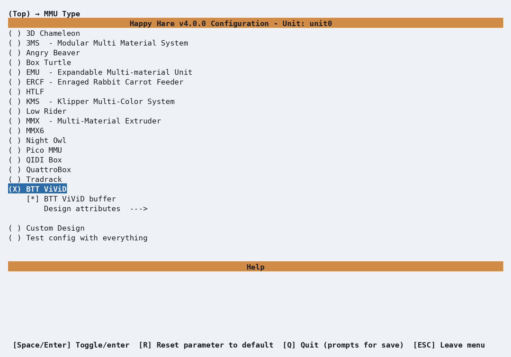
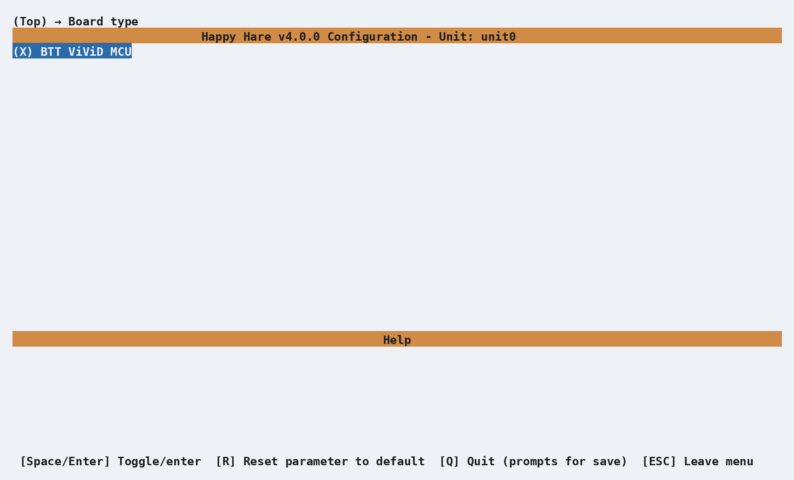
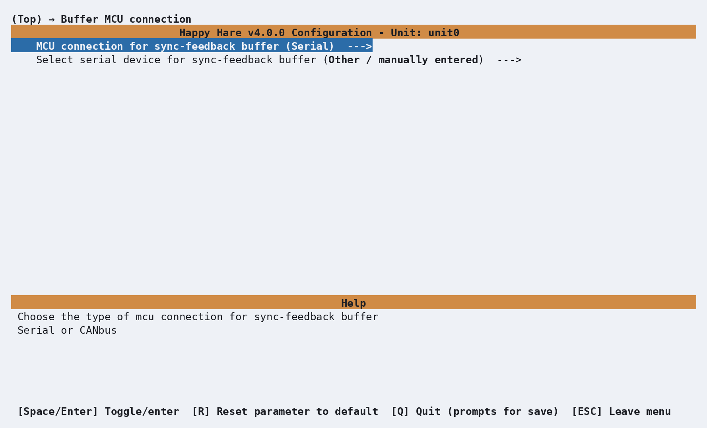
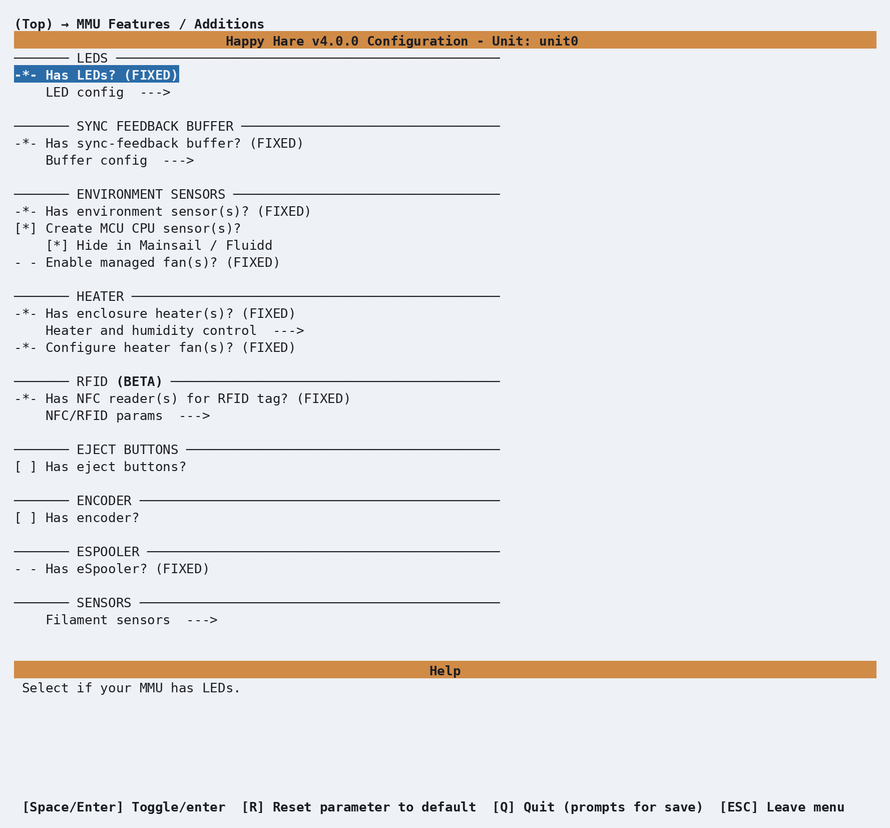
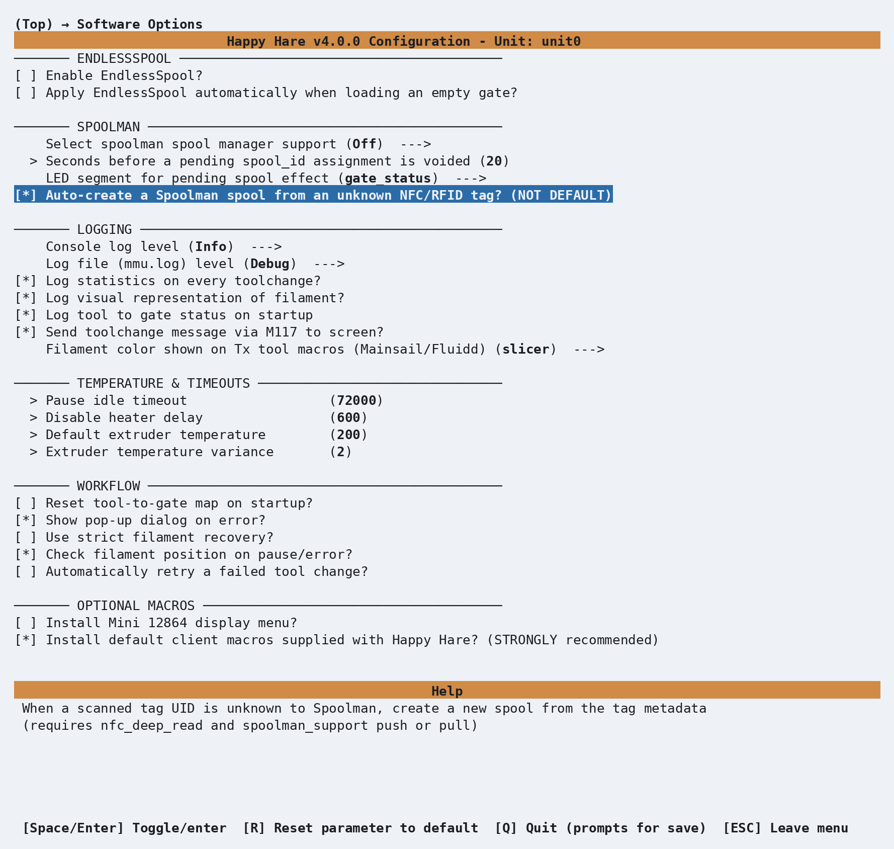

# Getting Started with BTT ViViD

BTT ViViD is a fully-specified design - unlike a modular design such as ERCF or
Box Turtle, almost every menuconfig default is already correct the moment you
pick it: board, pins, LEDs, environment sensor, heater and per-gate NFC
readers all come pre-filled. What's genuinely left for you to decide is
small: whether you have the official ViViD buffer board, and which of your
computer's serial devices is which - because a ViViD unit and its buffer are
two separate controller boards, not one.

## Menuconfig Installer

First clone the Happy Hare repository as described in
[Cloning Happy Hare](Installation.md#cloning-happy-hare).

Then run the installer:

```bash
cd Happy-Hare
./install.sh
```

The first run opens `menuconfig` automatically because no `.mmu_config` exists
yet; no `-i` flag is needed.

## Choosing the MMU type

Highlight **MMU Type** and press Enter, move down to **BTT ViViD** and press
Space to select it. A second line appears indented directly underneath it -
**BTT ViViD buffer** - already checked:

<p align="center">
  
</p>

Leave **BTT ViViD buffer** checked if you have the official buffer board
fitted on the bowden tube (its own separate MCU, with its own sync-feedback
tension/compression sensors already wired) - that's the common case, and it's
suggested on by default. Uncheck it only if you're using a different buffer
mechanism entirely, which you'd then add under **MMU Features / Additions**
instead.

**Board type** doesn't need a visit at all - ViViD only has one controller
board, **BTT ViViD MCU**, and it's already selected:

<p align="center">
  
</p>

Gate count is fixed at `4` too; unlike a modular design, there's no separate
prompt for it.

## MCU connections: two separate boards

This is the one part of ViViD setup that genuinely needs your input, and it
needs it twice - once for the ViViD unit's own MCU, and once for the
buffer's, because they're two independent boards that each show up as their
own serial device.

From the top menu, enter **MCU connection**:

<p align="center">
  
</p>

This is a small submenu, not a single screen: the first row is the
Serial/CANbus choice (already `Serial`, right for a USB-attached board), and
the second - **Select serial device for MMU** - is where you actually pick
*which* serial device. Enter that second row and every currently-connected
device shows up by its full `/dev/serial/by-id/` name - BTT's own boards name
themselves clearly, so telling the two apart is normally just reading the
list:

```text
Select serial device for MMU  --->
    ( ) usb-Klipper_stm32g0b1xx_vivid_410030000150505539323520-if00
    ( ) usb-Klipper_stm32f042x6_buffer_2D0001000143565335383320-if00
    ( ) Other / manually entered
```

The ViViD unit's device string contains `vivid`, the buffer's contains
`buffer`. Pick the `vivid` one here - it shows `Other / manually entered`
above only because nothing was plugged in when this screenshot was captured.

Back out to the top and enter the buffer's own connection screen, **Buffer
MCU connection**:

<p align="center">
  
</p>

Same shape, same list, but this time enter **Select serial device for
sync-feedback buffer** and pick the `buffer` one instead:

```text
Select serial device for sync-feedback buffer  --->
    ( ) usb-Klipper_stm32g0b1xx_vivid_410030000150505539323520-if00
    (X) usb-Klipper_stm32f042x6_buffer_2D0001000143565335383320-if00
    ( ) Other / manually entered
```

If a board you expect isn't listed at all, Klipper doesn't have a valid
serial connection to it yet - check that its firmware is flashed and it's
actually plugged in before assuming menuconfig is at fault. **Other / manually
entered** lets you type the exact `/dev/serial/by-id/...` path directly,
which works identically to picking it from the list once the device does
show up.

## MMU Features / Additions

Worth a glance even though there's nothing to add for a stock ViViD:

<p align="center">
  
</p>

**LEDs**, the **sync-feedback buffer** (supplied by the buffer board from the
previous step), the **environment sensor**, the **heater**, and the
**NFC readers** are all already switched on and marked
`(FIXED)`, because every stock ViViD ships with them. The old-style
**filament buffer to catch loose filament** is fixed *off* instead - the
filament movement also moves the spool on this design. **Cooling fans**,
**eject buttons** and an **encoder** are the genuine options here, and all
default off; enable whichever ones you actually built.

## Picking a toolhead

From the top menu, enter **Toolhead**:

<p align="center">
  
</p>

This step is entirely optional - skip it and Happy Hare falls back to
generic "Other/Unknown" dimensions, a perfectly normal starting point. If
your toolhead (extruder + hotend combo) happens to be in the list, though,
picking it fills in real, community-measured values
(extruder-entrance-to-nozzle distance, residual filament) instead of
guesses, for free - here we've picked **Stealthburner Clockwork2 Revo
Voron** at random, just to show what selecting one does. This choice is the
same regardless of MMU type - it isn't ViViD-specific.

## An example software option: Spoolman NFC auto-create

From the top menu, enter **Software Options**. Since a stock ViViD already
has an NFC reader on every gate, one option in the **Spoolman** section here
is worth calling out specifically rather than skimming past: **Auto-create a
Spoolman spool from an unknown NFC/RFID tag?**

<p align="center">
  
</p>

**Select spoolman spool manager support** defaults to `Off` regardless of MMU
type - ViViD's built-in NFC readers don't change that default, they just make
the feature genuinely worth turning on. **Auto-create** itself needs deep NFC
reads enabled and **Push** or **Pull** selected above it, not just
`Read-only` - creating a spool record is itself a write back to Spoolman, so
a mode that only reads isn't enough. With both set, scanning a tag Spoolman
has never seen creates a new spool record from the tag's own metadata
automatically, instead of the print pausing for you to assign one by hand.
That kind of dependency is exactly what the on-screen help for any option
spells out, so read it before assuming a checkbox alone will do something.

## Explore the rest

That covers everything genuinely specific to a stock ViViD, but it's only a
fraction of the menu. **Endstops and Bowden movement**, **Tip Forming /
Cutting**, **Purging** and the rest are all worth a look - scroll all the way
from the top to **Paths & Services** at the bottom at least once. Nothing you
look at will break anything: moving the highlight and pressing `?` for help
costs nothing, and `R` resets whatever's highlighted back to its default.

## Saving, and coming back later

When you're done, press **Esc** from the top level (or **Q**) to get the
save prompt, and confirm. Happy Hare writes your `.cfg` files from what you
chose.

The installer only forces `menuconfig` open automatically on that very first
run. After that, running `./install.sh` again just upgrades in place - it
won't reopen the menu. To go back in and change something, use:

```bash
cd ~/Happy-Hare
./install.sh -i
```

This is the normal way to revisit any setting on this page - there's no need
to ever hand-edit the generated `.cfg` files directly.

!!! note
    The one thing worth knowing:
    if you've hand-edited a `.cfg` file since your last visit to `menuconfig`,
    `-i` will ask how to reconcile that — **Refresh** (keep your manual edits, and
    just add new options), **Replace** (regenerate everything from menuconfig, discarding
    direct edits) or **Merge** (attempts to merge manual edits into menuconfig)

    If you only ever configure through `menuconfig`, as this page assumes,
    **Refresh** is the recommended choice because it rebuilds your Happy Hare
    Klipper configuration files, ensuring a clean configuration that includes
    future Happy Hare software updates.

## Validating Hardware Setup

The shared [Hardware Validation](Hardware-Validation.md) checklist covers the
same checks in more depth. The sequence below calls out the stock ViViD
hardware specifically.

With Klipper accepting the configuration and no startup errors, first confirm
that both controller boards are connected: the ViViD MCU drives the selector,
gear, entry sensors and built-in accessories, while the separate buffer MCU
provides the four exit sensors and the tension/compression switches. An error
for either MCU needs fixing before movement tests will be meaningful.

**Entry and exit sensors.** Run `MMU_SENSORS`, then insert a short piece of
filament into gate 0. Its `mmu_entry_0` sensor should change to `TRIGGERED`.
Move the filament through the selected path to the buffer and confirm
`mmu_exit_0` triggers there too. Remove the filament and make sure both return
to `Open`, then repeat for gates 1, 2 and 3:

```text
MMU_SENSORS
```

The exact order in the output is not important; what matters is that only the
sensor belonging to the gate under test changes state. A neighboring sensor
changing instead usually means the gate wiring or buffer tube routing is
crossed.

**Indexed selector.** Remove all filament before moving the selector. ViViD
has a switch at every selector position, so there is no conventional home
switch to find at startup. Exercise the selector motor, then select all four
gates:

```text
MMU_TEST_BUZZ_MOTOR MOTOR=selector
MMU_SELECT GATE=0
MMU_SELECT GATE=1
MMU_SELECT GATE=2
MMU_SELECT GATE=3
```

The buzz should make a small back-and-forth movement. Each selection should
stop cleanly at the requested gate without a missed-index error. The physical
order around the selector is not numerical (`0, 3, 1, 2` is the stock ViViD
order), so don't diagnose a fault merely because the mechanism doesn't visit
the printed gate numbers clockwise.

**Gear direction.** ViViD has one shared gear stepper, so this test only needs
to pass once. Select gate 0, insert some scrap filament, and make a short
positive move:

```text
MMU_SELECT GATE=0
MMU_TEST_MOVE MOVE=50
```

The filament should move away from the spool and toward the buffer. If it
moves backward, invert the **Gear dir pin** under **Pins / TMC → Gear pins**
in `menuconfig` by adding or removing `!`, restart Klipper, and test again.

**Sync-feedback buffer.** With the buffer unloaded, query its state, then move
it gently through its travel by hand:

```text
MMU_SYNC_FEEDBACK
```

The stock ViViD profile expects the spring to rest at **Tension** when
unloaded. Moving away from that end should pass through neutral, and the
opposite, excess-filament limit must report **Compression**. If tension and
compression are reversed, swap the buffer's pin assignments rather than
compensating elsewhere. See [Sync-Feedback
Buffer](Feature-Sync-Feedback-Buffer.md#troubleshooting) for the full sensor
test and troubleshooting procedure.

A stock ViViD has no encoder or eSpooler, so skip those parts of the shared
validation checklist unless you enabled the optional hardware yourself.

## Calibration

Most ViViD values are already supplied by the installer. Bowden length is
auto-calibrated the first time filament is loaded through the stock buffer,
and the indexed selector ships with the correct gate order and a usable
endstop-width default. The calibration worth doing before regular use is the
shared gear stepper's `rotation_distance`.

### Gear rotation distance (recommended)

Manufacturing tolerances in the drive gear change how much filament actually
moves for a commanded distance. The installed value is a good starting point,
but measuring your own improves load and unload accuracy.

1. Select gate 0 and advance filament until it emerges from the ViViD/buffer
   path at a point where you can cut and measure it accurately.
2. Cut it flush with that reference point.
3. Command a 100 mm move while retaining gear grip:

    ```text
    MMU_TEST_MOVE MOVE=100 GRIP=1
    ```

4. Measure the actual length emitted and pass that number to the calibration
   command. For example, if the move produced 102.5 mm:

    ```text
    MMU_CALIBRATE_GEAR MEASURED=102.5
    ```

5. Cut the filament flush again and repeat the 100 mm test move to verify the
   result.

ViViD uses the same gear drive for all four gates, so calibrate it once—there
is no per-gate gear calibration to repeat. See [Calibration: Gear Rotation
Distance](Calibration-Gear.md) for longer test moves, resetting the saved
value, and the calculation Happy Hare performs.

### Selector indexes (normally optional)

If every gate selected correctly during hardware validation, the stock index
settings are sufficient. You can optionally let Happy Hare detect the physical
gate order and center point of every index switch:

```text
MMU_CALIBRATE_SELECTOR_INDEXES
```

Run this only with filament fully unloaded. It automatically measures and
saves the switch widths; there is nothing to align by hand. This is most useful
after selector work, a sensor replacement, or if selection is reliable but
slower or less centered than expected. See [Calibration: Selector
Movement](Calibration-Selector.md#indexed-selectors) for the reporting-only
and reset options.

The first real `MMU_LOAD` will learn the Bowden length automatically. Toolhead
calibration remains optional if you selected a known toolhead during install;
otherwise follow [Calibration: Toolhead](Calibration-Toolhead.md) when you're
ready to replace the generic dimensions with measurements from your printer.

## Checking Basic Operation

With the hardware checked and gear rotation distance calibrated, test one
complete filament cycle outside a print:

```text
MMU_SELECT GATE=0
MMU_LOAD
MMU_UNLOAD
```

The first load can take longer because Happy Hare is also learning the Bowden
length. Each command should then complete without a pause or unexpected
calibration warning. Repeat the cycle on the other three gates so every index
switch, entry sensor and buffer exit path is exercised before your first
multi-material print.

If the hotend must be heated for the unload/tip-forming method you selected,
preheat it to a safe temperature for the loaded material first. See
[Operation: Debugging Problems](Operation.md#debugging-problems) if a load or
unload fails.

## Slicer Setup

Add the Happy Hare hooks to your slicer's start g-code, end g-code, after-layer
change and toolchange sections. [Slicer Setup](Slicer-Setup.md#start-g-code)
provides the exact snippets and placement for each supported slicer. Make
those changes before trying a multi-material file.

## Printing with MMU

The remaining choice before a first print is how to purge the previous color
at each toolchange:

- **Slicer-controlled** — use the slicer's wipe tower. This is the simplest
  starting point, but consumes bed space and filament.
- **Happy Hare-controlled** — disable the wipe tower and use [Purge:
  Simple](Macro-Purge.md) for a purge line, or [Purge:
  Blobifier](Macro-Blobifier.md) with a dedicated purge station. The complete
  hand-off is covered under [Purging without a wipe
  tower](Feature-Tip-Forming-Purging.md#purging-without-a-wipe-tower).

Toolchange retraction, z-hop and parking positions live in
`mmu_macro_vars.cfg` and are exposed under **Macro Variables** in
`menuconfig`. Review [Toolchange Movement](Toolchange-Movement.md) before
changing those defaults.

Once the slicer hooks and purge method are set, slice a small two-color test
object and run the first print. Starting with two gates keeps diagnosis simple
while still exercising a real unload, selector move and reload.

## What Next?

- Configure [NFC/RFID reading](Feature-NFC.md) and
  [Spoolman](Feature-Spoolman.md) if you want ViViD's built-in gate readers to
  identify and assign spools automatically.
- Review the [Sync-Feedback Buffer](Feature-Sync-Feedback-Buffer.md) page to
  understand how the stock buffer assists filament motion and detects tension.
- Install [KlipperScreen (Happy Hare edition)](KlipperScreen.md) for a
  touchscreen front end, or use the [Mainsail / Fluidd
  integration](Mainsail-Fluidd-Integration.md).
- Explore the remaining [Features](Feature-LEDs.md) as you need them rather
  than enabling everything before the first print.

---
