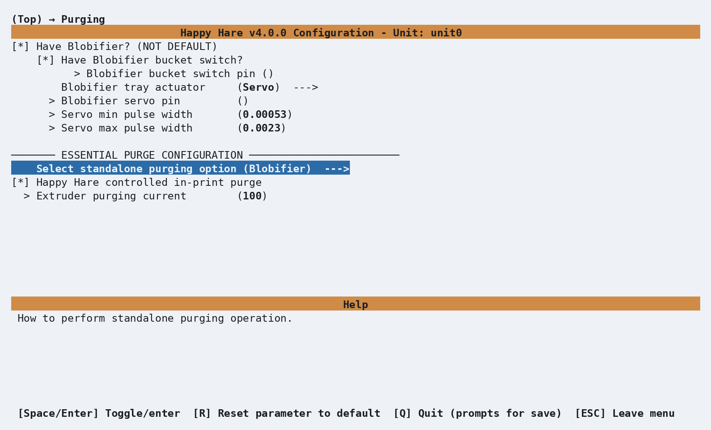
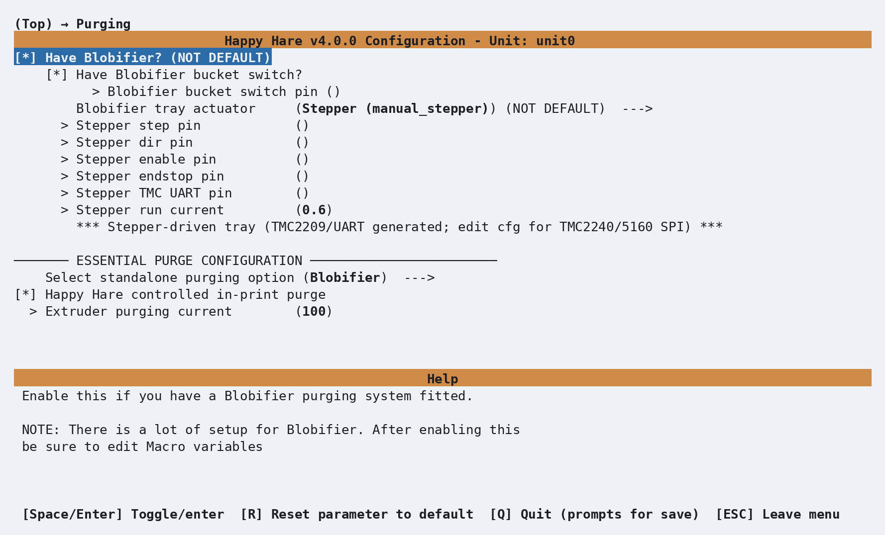
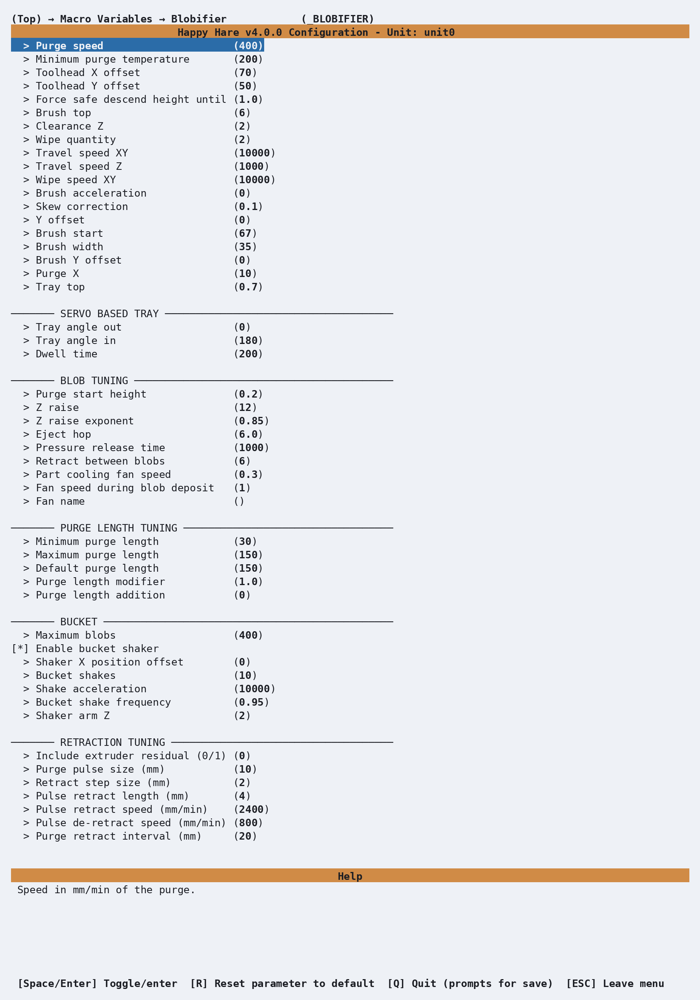

# Purge: Blobifier

## What it does

  

Tunes Blobifier, a standalone purge system that replaces the slicer's wipe
tower with a purge tray and collection bucket. It is configured through
menuconfig's **Purging** screen (**Have Blobifier?**). Genuinely the largest
single tuning surface on this site, third-party-maintained and reproduced
here in full rather than left to its upstream README alone. Physical build
instructions are at [Blobifier's own project
page](https://github.com/Dendrowen/Blobifier).

## Where it's applied

Defined in `blobifier.cfg`, active once `purge_macro: BLOBIFIER` in
`mmu.cfg` (select **Blobifier** as the standalone purging option under
menuconfig's **Purging** screen - the tray actuator type, servo or stepper,
is also chosen there, not on the Macro Variables screen below). Three
extension points fire around the purge itself, distinct from - and not
listed on - [Macro Customization](Macro-Customization.md)'s general table,
since they're scoped to Blobifier's own sequence rather than Happy Hare's
load/unload cycle: `user_pre_blobifier_extension` (at the very start, after
state is saved), `user_post_purge_extension` (after purging and cleaning,
before Z is restored), and `user_post_blobifier_extension` (after Z is
restored). All three exist specifically for a gantry-mounted brush/nozzle
leak-stop setup that needs its own parking logic around the sequence; leave
them blank for the default bed-mounted brush.

!!! tip
    Parking the nozzle over the tray during a swap is better handled
    through the standard parking configuration in [Macro:
    Sequence](Macro-Sequence.md) than the older
    `variable_user_post_form_tip_extension: 'BLOBIFIER_PARK'` approach -
    the newer mechanism accounts for toolhead movement more generally
    rather than being specific to this one add-on.

!!! note
    These three hooks - and `clean_macro`, which points at the nozzle
    cleaning macro to run - aren't exposed in menuconfig at all. Set them
    by hand-editing `mmu_macro_vars.cfg` directly.

## Enabling Blobifier

Open menuconfig's **Purging --->** screen and enable **Have Blobifier?**.
This expands the screen with the bucket-presence input and the tray actuator
settings. Then open **Select standalone purging option** and choose
**Blobifier**. Check this choice explicitly when adding Blobifier to an
existing configuration: menuconfig can retain the previous **Simple purge
into bucket** selection.

  

The fields in this screen configure the hardware generated in `mmu.cfg`:

| Setting | Purpose |
|---|---|
| **Blobifier bucket switch pin** | Input for the bucket-presence switch. Enter the fully qualified MCU pin and retain the `^` pull-up prefix. Removing the bucket clears Blobifier's stored blob count. |
| **Blobifier tray actuator** | Select **Servo** for the servo-driven tray or **Stepper (manual_stepper)** for the stepper-driven tray. This also sets the actuator type used by the Blobifier macros. |
| **Blobifier servo pin** and pulse widths | Generated as `[mmu_servo blobifier]`. The default pulse widths are starting points; tune the minimum for fully out and the maximum for fully in without servo buzz. |
| **Select standalone purging option** | Choose **Blobifier**. **Simple purge into bucket** runs the much simpler `_MMU_PURGE` macro and does not activate Blobifier. |
| **Happy Hare controlled in-print purge** | Leave enabled to use Blobifier during prints, and turn off the slicer's wipe tower. |

Selecting **Stepper (manual_stepper)** replaces the servo fields with the
step, direction, enable, endstop and TMC UART pins plus motor current:

  

The generated stepper configuration targets a TMC2209 over UART. For a
TMC2240 or TMC5160 over SPI, use the commented alternative driver block in
`mmu.cfg` and fill in its SPI pins. The stepper endstop commonly needs the
`^!` pull-up and inversion modifiers shown in the prompt's help.

The bucket switch above detects whether the collection bucket is fitted. It
is separate from the bucket-capacity and shaker settings on the Macro
Variables screen below: `max_blobs`, `enable_shaker`, `shaker_pos_x`,
`bucket_shakes`, `shake_accel`, `bucket_shake_frequency` and
`shaker_arm_z`.

## Configuration

  

`_BLOBIFIER_VARS` in `mmu_macro_vars.cfg`, reachable from menuconfig's
**Macro Variables → Blobifier (\_BLOBIFIER)** screen shown above, once
Blobifier is enabled. The full variable table, organized the same way
as the shipped file's own sections, is on [Macro Variables:
Blobifier](Reference-Macro-Vars.md#blobifier-_blobifier_vars) - not repeated here.
Three settings are explicitly flagged **must calibrate** rather than
tune-to-taste: `toolhead_x`/`toolhead_y` (nozzle-to-toolhead-edge offsets)
and `tray_top` (the tray's real Z height) - the shipped defaults are a
specific build's measurements, not a sensible starting point for yours.

## See also

- [Feature: Tip Forming and Purging](Feature-Tip-Forming-Purging.md) - the
  `purge_macro` setting that activates Blobifier as an alternative to
  `_MMU_PURGE`
- [Macro Variables: Blobifier](Reference-Macro-Vars.md#blobifier-_blobifier_vars) -
  every `_BLOBIFIER_VARS` setting in full
- [Toolchange Movement](Toolchange-Movement.md#tip-cutting-options) - a
  worked example combining Blobifier with a fully custom park/purge, no
  wipe tower
- [Purge: Simple](Macro-Purge.md) - the simpler built-in alternative

---
