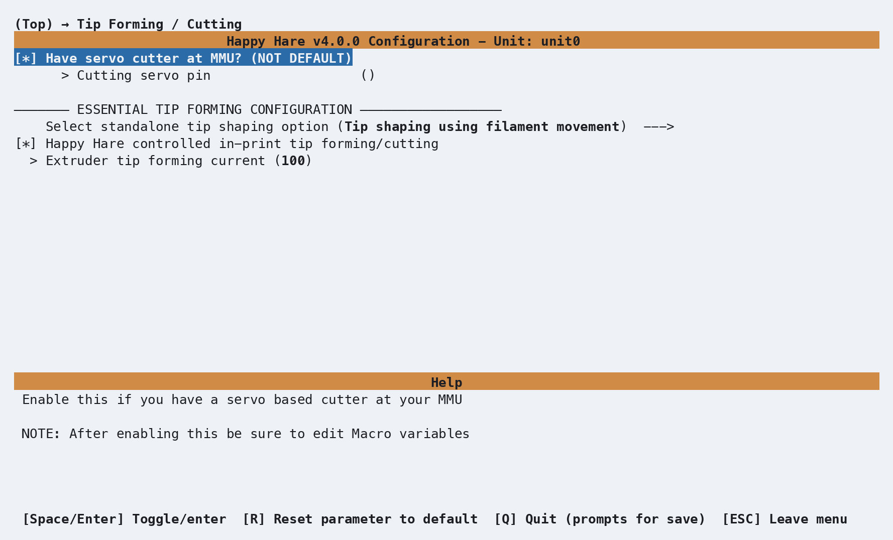
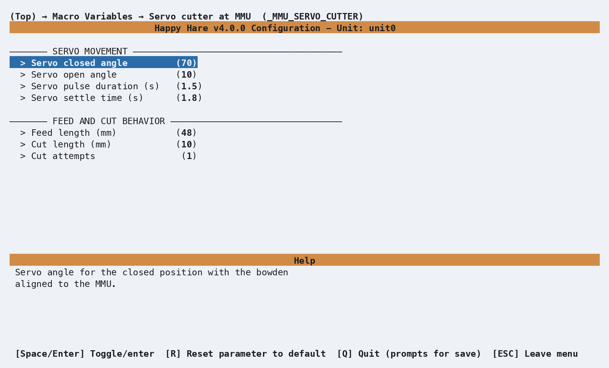

# Tip Shaping: MMU Cutting

## What it does

<p align="center">
  
</p>

Tunes a servo-actuated cutter mounted **at the MMU** end of the bowden -
originally the EREC design, but this covers any similar servo-actuated
cutter at the MMU end of the bowden. Additive to tip forming rather than a
replacement for it: a decent tip still needs to exist going into the cut.
Enable **Have servo cutter at MMU?** under menuconfig's **Tip Forming /
Cutting** screen, wire the servo pin, and tune it below. You'll still need
the physical build/wiring instructions from [EREC's own project
page](https://github.com/kevinakasam/ERCF_Filament_Cutter). See [Feature:
Tip Forming and Purging](Feature-Tip-Forming-Purging.md#servo-cutter-mmu-mounted)
for how it fits alongside whichever tip-forming method is active.

## Where it's applied

Defined in `mmu_servo_cutter.cfg` as `SERVO_CUTTER_ACTION` - after the
filament parks in the gate, it advances the filament, activates the cutter,
then parks again, firing a `filament_cut` event
([Feature: Statistics & Consumption Counters](Feature-Statistics-Counters.md#consumption-counters)
can count these). Unlike most of the macros on this site, enabling the
capability in menuconfig does **not** wire this one up automatically - the
Kconfig prompt's own help text says as much ("after enabling this be sure to
edit Macro variables"). Add it as a
[post-unload extension hook](Macro-Sequence.md) yourself:

```ini
variable_user_post_unload_extension : 'SERVO_CUTTER_ACTION'
```

!!! note
    `mmu_macro_vars.cfg`'s own section banner for this block describes it as
    a "post_load_extension" - that's stale relative to the macro file's own
    header comment and the hook it's actually written to receive
    (`user_post_unload_extension`); wire it up per the macro file's own
    instruction above, not the banner text.

## Enabling the MMU cutter

Open menuconfig's **Tip Forming / Cutting --->** screen and enable **Have
servo cutter at MMU?**, then enter the fully qualified **Cutting servo
pin**. This enables the MMU cutter's configuration and generates its servo
hardware section.

<p align="center">
  
</p>

This switch does not change **Select standalone tip shaping option**. The
MMU cutter runs after unload, so keep whichever method prepares the tip
before unloading - normally **Tip shaping using filament movement**, or
**Tip cutting using toolhead cutter** when that separate capability is
fitted. The screenshot shows filament-movement forming selected.

The **Happy Hare controlled in-print tip forming/cutting** and **Extruder
tip forming current** fields apply to that selected preparation method, not
to the MMU cutter's post-unload action. Enabling the hardware also does not
attach the action hook automatically; configure
`variable_user_post_unload_extension` as described above.

## Configuration

<p align="center">
  
</p>

`_MMU_SERVO_CUTTER_VARS` in `mmu_macro_vars.cfg`, reachable from
menuconfig's **Macro Variables → Servo cutter at MMU
(\_MMU_SERVO_CUTTER)** screen shown above, once **Have servo cutter at
MMU?** is enabled under **Tip Forming / Cutting**. Full variable table:
[Macro Variables: Servo cutter,
MMU-mounted](Reference-Macro-Vars.md#servo-cutter-mmu-mounted-_mmu_servo_cutter_vars).

`feed_length` - the distance from the gate parking position to the blade -
is the one setting worth calibrating carefully rather than guessing: `48`mm
covers ERCF v2 and most other designs, `58`mm is the ERCF v1.1 value.

## See also

- [Feature: Tip Forming and Purging](Feature-Tip-Forming-Purging.md#servo-cutter-mmu-mounted) -
  how this fits alongside tip forming/cutting
- [Macro Variables: Servo cutter, MMU-mounted](Reference-Macro-Vars.md#servo-cutter-mmu-mounted-_mmu_servo_cutter_vars) -
  every `_MMU_SERVO_CUTTER_VARS` setting in full
- [Macro: Sequence](Macro-Sequence.md) - the `post_unload_extension` mechanism
  this macro runs through

---
