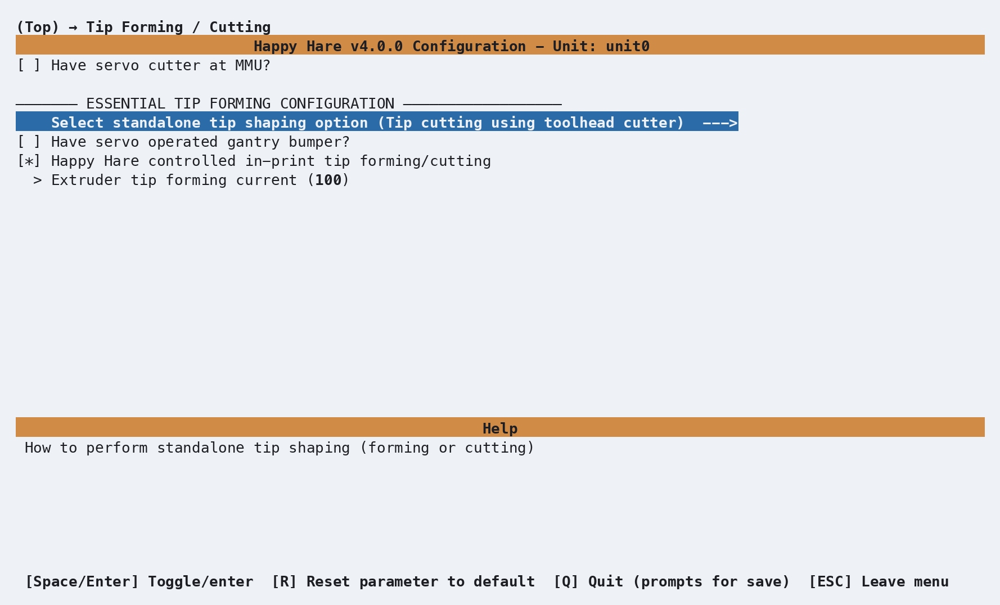
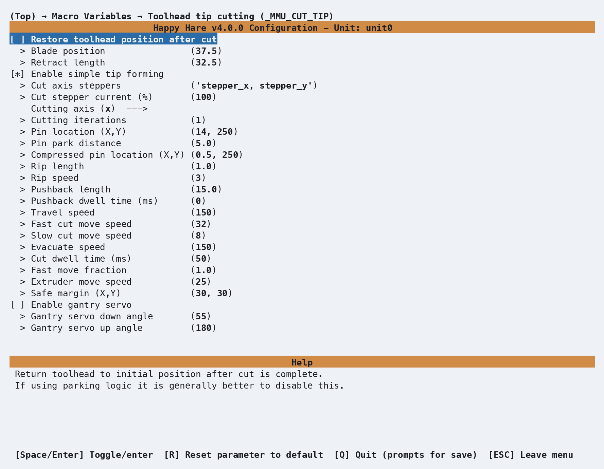

# Tip Shaping: Toolhead Cutting

## What it does

An alternative to filament-movement tip forming: a toolhead-mounted cutter
trims the tip cleanly instead, skipping the forming step (and its
per-filament tuning) entirely. See [Feature: Tip Forming and
Purging](Feature-Tip-Forming-Purging.md#toolhead-cutter-_mmu_cut_tip) for
the concept, trade-offs, and the cut routine itself - this page covers the
variables behind it. For worked toolhead-parking examples around a cutter
specifically, see [Toolchange Movement: Tip Cutting
Options](Toolchange-Movement.md#tip-cutting-options).

## Where it's applied

`_MMU_CUT_TIP`, defined in `mmu_cut_tip.cfg`. Active once
`form_tip_macro: _MMU_CUT_TIP` in `mmu.cfg`, which itself only becomes an
available choice once a toolhead cutter is enabled (**Toolhead
sensors/settings → Has toolhead cutter?** in menuconfig) - that's a
separate capability from the choice of tip-forming method itself.

## Selecting toolhead cutting

First enable **Has toolhead cutter?** under menuconfig's **Toolhead
sensors/settings --->** screen. Then open **Tip Forming / Cutting --->**,
open **Select standalone tip shaping option**, and choose **Tip cutting
using toolhead cutter**. This writes `form_tip_macro: _MMU_CUT_TIP` to
`mmu.cfg`.

  

Leave **Happy Hare controlled in-print tip forming/cutting** enabled when
using the cutter, and disable the slicer's own tip forming. The optional
**Have servo operated gantry bumper?** setting appears with this method;
enable it and enter the servo pin only when the cutter is pressed against a
deployable gantry-mounted bumper. **Extruder tip forming current** can
temporarily boost the extruder from `100` to `150` percent during the cut
sequence; `100` disables the boost.

**Have servo cutter at MMU?** is a different, additive cutter at the MMU
end of the bowden. It is covered under [Tip Shaping: MMU
Cutting](Macro-Servo-Cutter.md).

## Configuration

  

`_MMU_CUT_TIP_VARS` in `mmu_macro_vars.cfg`, reachable from menuconfig's
**Macro Variables → Toolhead tip cutting (\_MMU_CUT_TIP)** screen shown
above, once the capability flag above is on. Full variable table: [Macro
Variables: Toolhead tip cutting](Reference-Macro-Vars.md#toolhead-tip-cutting-_mmu_cut_tip_vars).
Tune the same one-variable-at-a-time way as tip forming (see [Feature: Tip
Forming and Purging](Feature-Tip-Forming-Purging.md#tuning-tip-forming)) -
the variables themselves just live in this different section.

A few settings are worth knowing about specifically:

- **`pin_loc_xy`**/**`pin_loc_compressed_xy`** are the depressor pin's real
  and fully-compressed X,Y coordinates - both toolhead-specific and not
  something to copy from another build.
- **`cutting_axis`** (`x` or `y`) and **`cut_axis_steppers`**/
  **`cut_stepper_current`** choose which axis the cut
  motion happens on, and an optional temporary current boost (up to ~150%)
  on the steppers doing the cutting move.
- **`cut_iterations`** repeats the cut - raise it if your cutter
  struggles with a particular filament.
- **`pushback_length`** pushes the cut fragment back into the hotend so it
  can't cause a future clog - a PTFE-tube-length-plus-a-few-mm starting
  point, not the couple of millimeters that might look sufficient at first
  glance.

## See also

- [Feature: Tip Forming and Purging](Feature-Tip-Forming-Purging.md#toolhead-cutter-_mmu_cut_tip) -
  concept, trade-offs, and the cut routine
- [Toolchange Movement: Tip Cutting Options](Toolchange-Movement.md#tip-cutting-options) -
  worked parking examples for a toolhead cutter
- [Macro Variables: Toolhead tip cutting](Reference-Macro-Vars.md#toolhead-tip-cutting-_mmu_cut_tip_vars) -
  every `_MMU_CUT_TIP_VARS` setting in full
- [Tip Shaping: Forming](Macro-Tip-Forming.md) - the default alternative this
  macro replaces
- [Tip Shaping: MMU Cutting](Macro-Servo-Cutter.md) - a different, MMU-mounted
  cutter that trims *after* unload instead, additive rather than a
  replacement for either of the above

---
