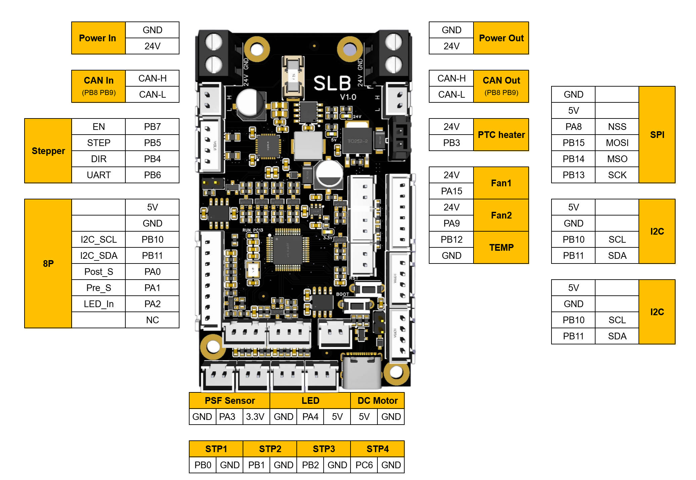
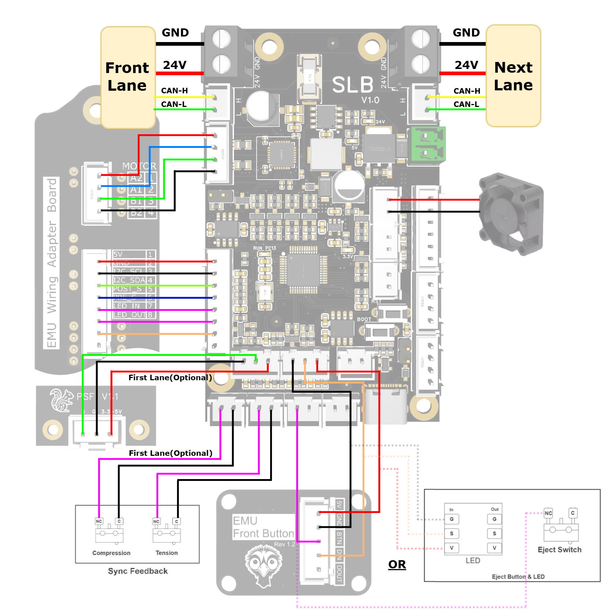
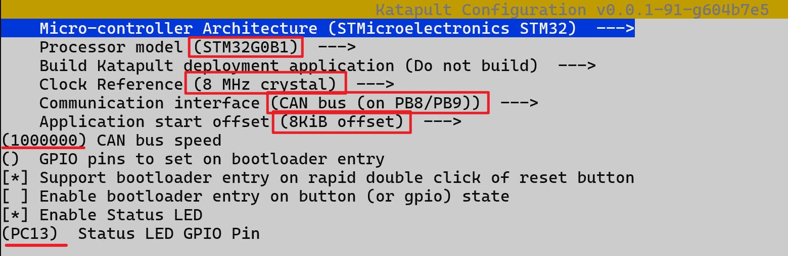
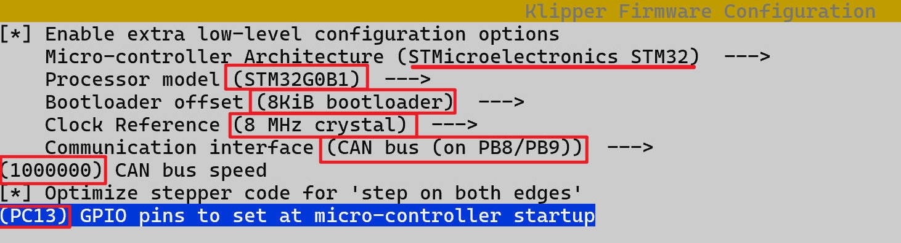

# MCU Reference

Reference material for some of the MCU/control boards Happy Hare's installer
knows about - pinouts, connection diagrams, and firmware-flashing notes for the
ones with images available, plus the complete current list of every board
`menuconfig`'s **Board type** screen offers. Picking one there sets up the
default pin layout for your setup automatically; pins can still be
customized afterward in Advanced Settings if needed. See
[Getting Started with Box Turtle](GettingStarted-BoxTurtle.md#board-type)
for what that screen actually looks like.

## Popular MCUs

### Standard EASY-BRD (SAMD21)

<p align="center">
  
</p>

??? Firmware 
    Klipper make menuconfig settings for Easy Brd  

    <p align="center">
      
    </p>

    See [Flashing Firmware](#flashing-firmware) below for the full procedure. 

### Fysetc Burrows ERB v2

<p align="center">
  
</p>

??? Wiring
    Fysetc Burrows ERB v2 wiring diagram:
    <p align="center">
     
    </p>

??? Firmware 
    Klipper make menuconfig settings for Fysetc Burrows ERB v2
    <p align="center">
      
    </p>

    See [Flashing Firmware](#flashing-firmware) below for the full procedure.

### BTT MMB CAN v1.0

<p align="center">
  
</p>

??? Firmware
    CANbus firmware flashing is different enough from a plain USB/serial
    MCU that it's worth its own guide rather than the generic steps below -
    [Esoterical's BTT MMB CAN V1.0 flashing guide](https://canbus.esoterical.online/toolhead_flashing/common_hardware/BigTreeTech%20MMB%20CAN%20V1.0/README.html)
    is a solid one.

### BTT MMB CAN v2.0

<p align="center">
  
</p>

??? Firmware
    See [Esoterical's BTT MMB CAN V2.0 flashing guide](https://canbus.esoterical.online/toolhead_flashing/common_hardware/BigTreeTech%20MMB%20CAN%20V2.0/README.html)
    for CANbus-specific flashing steps.

### BTT EBB CAN (EBB42 / EBB36)

The BTT EBB CAN board has gone through three hardware revisions, each with a
different pinout, offered in both an EBB42 and EBB36 size. The installer's
**BTT EBB 42 CANbus V1.2** board choice (and the per-gate **EBB MCU** choice
used by EMU designs) targets the v1.1/v1.2 revision below - its default pin
layout matches that hardware directly.

#### v1.0

BTT EBB42:
<p align="center">
  
</p>

BTT EBB36:
<p align="center">
  
</p>

!!! note
    The installer's default pin layout doesn't match this revision - pins
    will need to be set manually in Advanced Settings.

??? Firmware 
    Klipper make menuconfig settings for BTT EBB CAN v1.0
    <p align="center">
      
    </p>

    See [Esoterical's CANbus flashing guide](https://canbus.esoterical.online/toolhead_flashing.html)
    for CANbus-specific flashing steps.

#### v1.1 / v1.2

BTT EBB42:
<p align="center">
  
</p>

BTT EBB36:
<p align="center">
  
</p>

??? Firmware 
    Klipper make menuconfig settings for BTT EBB CAN v1.1/v1.2
    <p align="center">
     
    </p>

    See [Esoterical's CANbus flashing guide](https://canbus.esoterical.online/toolhead_flashing.html)
    for CANbus-specific flashing steps. 

#### Gen2

BTT EBB42:
<p align="center">
  
</p>

BTT EBB36:
<p align="center">
  
</p>

!!! note
    The installer's default pin layout doesn't match this revision - pins
    will need to be set manually in Advanced Settings.

??? Firmware 
    Klipper make menuconfig settings for BTT EBB CAN Gen2
    <p align="center">
      
    </p>

    See [Esoterical's CANbus flashing guide](https://canbus.esoterical.online/toolhead_flashing.html)
    for CANbus-specific flashing steps.

### Mellow EASY-BRD CAN v1

<p align="center">
  
</p>

??? Firmware 
    See [Esoterical's Mellow Fly ERCF flashing guide](https://canbus.esoterical.online/toolhead_flashing/common_hardware/Mellow%20Fly%20ERCF/README.html)
    for CANbus-specific flashing steps.

### Mellow EASY-BRD CAN v2

<p align="center">
  
</p>

??? Firmware
    See [Esoterical's Mellow Fly SB2040 flashing guide](https://canbus.esoterical.online/toolhead_flashing/common_hardware/Mellow%20Fly%20SB2040/README.html)
    for CANbus-specific flashing steps.

### Solo Lane Board v1

<p align="center">
  
</p>
??? Wiring
    Solo Lane Board v1.0 wiring diagram for EMU MMU
    <p align="center">
     
    </p>

??? Firmware 
    Katapult make menuconfig settings for SLB v1.0  
    <p align="center">
      
    </p>
    <br>
    Klipper make menuconfig settings for SLB v1.0  
    <p align="center">
     
    </p>

    See [SLB v1.0 Flashing guide](https://github.com/kashine6/SLB-Board-For-EMU#5-flashing-guide-optional) for CANbus-specific flashing steps.

### AFC Pro v1.0

<p align="center">
  
</p>

??? Firmware 
    Klipper make menuconfig settings for AFC Pro v1.0  
    <p align="center">
      
    </p>

    See [Flashing Firmware](#flashing-firmware) below for the full procedure.

### AFC Lite v1.0

<p align="center">
  
</p>

??? Firmware 
    Klipper make menuconfig settings for AFC Lite v1.0
    <p align="center">
      
    </p>

    See [Flashing Firmware](#flashing-firmware) below for the full procedure.

## All Supported Boards

Every board `menuconfig`'s **Board type** screen offers, direct from the
installer's own Kconfig source - not just the ones with a pinout image
above. Most MMU types choose from the general list; per-gate MCU designs
(EMU) get their own list instead, and two MMU types (Box Turtle/KMS and BTT
ViViD) have a single fixed board rather than a choice at all.

### General boards

Offered for any MMU type except a per-gate MCU design, Box Turtle/KMS, or
BTT ViViD:

| Board | Pinout above? |
|---|---|
| Standard EASY-BRD with SAMD21 | ✅ |
| EASY-BRD with RP2040 | |
| Fysetc Burrows ERB v1 | |
| Fysetc Burrows ERB v2 | ✅ |
| BTT MMB v1.0 with CANbus | ✅ |
| BTT MMB v1.1 with CANbus | |
| BTT MMB v2.0 with CANbus | ✅ |
| BTT EBB 42 CANbus V1.2 | ✅ |
| BTT SKR Pico v1.0 | |
| Mellow EASY-BRD v1.x with CANbus | ✅ |
| Mellow EASY-BRD v2.x with CANbus | ✅ |
| Solo Lane Board v1.0 | ✅ |
| AFC Pro v1.0 / designed for Box Turtle | ✅ |
| AFC Lite v1.0 / designed for Box Turtle | ✅ |
| WGB v3.0 / designed for Box Turtle | |
| TZB v1.0 / designed for ERCF | |
| Chameleon X5 v1 / designed for Quatrobox v2 | |
| *Not listed / Other* | — (generic fallback, no fixed pinout) |

### Per-gate boards (EMU multi-MCU designs)

A per-gate MCU setup (`--emu`/`-e` on the installer, see
[Installation](Installation.md#running-the-installer)) picks one of these
per gate instead of a single board for the whole unit:

| Board | Pinout above? |
|---|---|
| EBB MCU | ✅ |
| Solo Lane Board (SLB) |  ✅ |

### Fixed boards

These two MMU types skip the board-choice screen entirely - the board is
part of the design:

| MMU type | Fixed board | Pinout above? |
|---|---|---|
| Box Turtle/KMS | BIQU KMS MCU | |
| BTT ViViD | BTT ViViD MCU | |

See [Getting Started with BTT ViViD](GettingStarted-ViViD.md) for that
design's own MCU connection walkthrough.

## Flashing Firmware

Klipper firmware needs flashing to the MCU before it'll talk to Klipper at
all:

1. SSH into your Raspberry Pi.
2. Open a shell there and run:

    ```bash
    cd ~/klipper
    make menuconfig
    ```

3. Configure your board's firmware settings (chip, bootloader, communication
   interface) - specific to the MCU chip on your board, not something this
   page can give one universal answer for.
4. Save and exit (`Q`).
5. You will need the correct device name. You can use `lsusb` to
   list all USB devices. E.g

    ```text
    Bus 002 Device 001: ID 1d6b:0003 Linux Foundation 3.0 root hub
    Bus 001 Device 007: ID 2e8a:0003 Raspberry Pi RP2 Boot
    Bus 001 Device 004: ID 1d50:614e OpenMoko, Inc. stm32f446xx
    ```
   ID `2e8a:0003` should match you new device. Then flash it:

    ```bash
    make flash FLASH_DEVICE=2e8a:0003
    ```
   Alternatively you can find you device with `ls -l /dev/serial/by-id` and flash:

    ```bash
    make flash FLASH_DEVICE=/dev/serial/by-id/<your-mcu-id>
    ```

!!! warning "Important"
    CANbus boards flash differently - follow
    [Esoterical's CANbus flashing guide](https://canbus.esoterical.online/toolhead_flashing.html)
    instead of the steps above.

!!! tip
    Not sure of your serial device path? Open a second SSH session, run `ls
    /dev/serial/by-id`, unplug the board, run it again, and see which line
    disappeared - that's the one that was yours.

## See also

---
